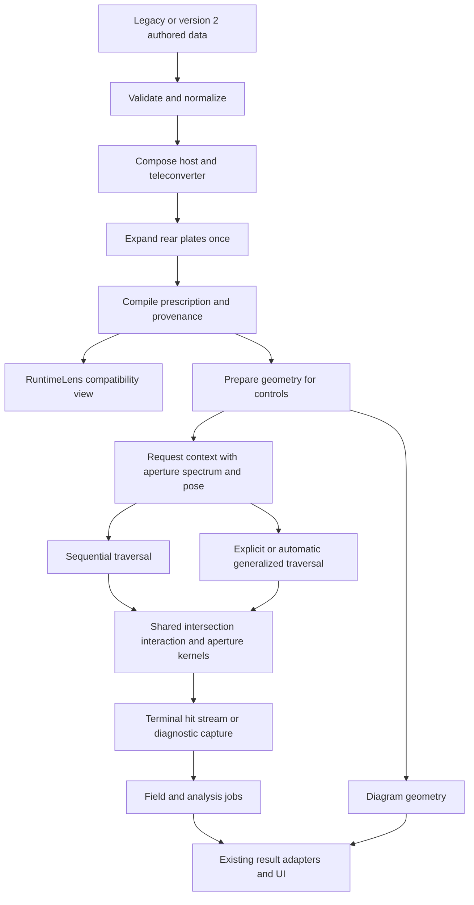

# Optics Engine Rewrite Specification

Replace the lens optics engine with a compiled, exact-trace pipeline that performs less preparation, allocation, and
adapter work per request. Preserve the existing lens-data features, numerical accuracy, UI data contracts, supported
analyses, and explicit unsupported states. This is an implementation specification; the stages below are future work.

The implementation must proceed in order: **stage → phase → step**. Every step delivers a complete behavior with code
and tests. Every step, phase, and stage ends with its own passing verification gate and commit. No production caller
switches to an incomplete engine.

## Baseline and scope

The correctness baseline is `fix/771-intersection-tolerance` at
`4ad7fe8cbe87e37285b11c8396d627123f04ab4f`, including its latest Vivitar stop-clearance correction. The checkout used
for this specification is `33ebdb30b619a02edcf03f6d930bc1ef5e4e6905`, which includes newer catalog additions. Start
implementation from current main and integrate the tolerance branch without removing newer lenses. Pin the resulting
baseline SHA and corpus fingerprint before comparing engines. Refresh these pins deliberately if main advances;
different prescriptions must never be mistaken for an engine regression or improvement.

The tolerance branch contributes more than a constant change:

- Shared `INTERSECTION_TOLERANCE = 1e-12` mm and `INTERSECTION_MAX_ITERATIONS = 48`.
- Strict residual acceptance, safeguarded Newton/bisection stagnation detection, operand-based roundoff envelopes,
  returned `effectiveTolerance`, validated analytic plane hits, and stable normal-distance tilted-plane residuals.
- Shared analytic regressions across production and legacy intersection paths, including exhausted budgets,
  cancellation, steep aspheres, authored cap boundaries, and vertical mirrors.
- Raw MTF timing samples and retained before/after optics benchmark records.
- The inferred Vivitar stop plane moved behind the preceding clear cap while preserving the published vertex gap.
  This is part of the prescription baseline; routing changes must not compensate for invalid geometry.

The rewrite covers prescription ingestion and validation, runtime construction, state preparation, geometry math,
sequential and generalized tracing, fields and chief rays, dispersion, aperture and pupil calculations, diagram
geometry, all existing analyses, worker integration, and public compatibility facades. `src/optics/mount/` is a
separate mount-diagram renderer and stays outside this lens-engine rewrite.

The validated MTF formulas and glass catalog remain authoritative. Port their implementation and dependencies into
the new routing without changing their physical models. A faster organization does not justify a new MTF estimator,
new dispersion assumptions, empirical optical corrections, or new support for currently guarded paths. Preserve
source-prescription limitations and warnings. Any later feature expansion needs a separate specification.

Repository references:

- [Engine architecture](agent_docs/architecture/optics-engine.md) and
  [public import contracts](agent_docs/architecture/public-functions.md).
- [Lens data contract](src/lens-data/LENS_DATA_SPEC.md),
  [teleconverter contract](src/lens-data/TELECONVERTER_DATA_SPEC.md), and
  [asphere schema](src/types/asphericSchema.ts).
- [Testing architecture](agent_docs/architecture/testing.md), [workflow](agent_docs/workflow.md),
  [standing decisions](agent_docs/decisions.md), and [benchmark protocol](agent_docs/benchmarks/README.md).

This plan owns the rewrite backlog. Existing efficiency and trace plans continue to own unrelated work. When the
rewrite closes, replace stale architecture and authoring guidance, preserve applicable decisions, and remove this
plan and its index entry according to the documentation policy.

## Required compatibility

| Boundary | Required behavior |
| --- | --- |
| Authored inputs | Accept every current `LensDataInput` and `TeleconverterDataInput`. Existing `.data.ts` and `.teleconverter.ts` modules continue to work unchanged. |
| Public functions | Keep import paths, exported names, signatures, defaults, error behavior, and result shapes used by UI, tests, scripts, reports, and SSR. Add ordinary internal names; retain historical `*2` exports as thin aliases where callers still need them. |
| Runtime lens | Preserve all `RuntimeLens` fields, `data`, resolved maps, frozen-object behavior, surface indices, label identity, synthetic markers, and null versus absent fields. The compatibility object is derived from the compiled model. |
| Rays | Preserve meridional, skew, vector, and chromatic outputs; vertex-plane versus exact-hit coordinates; point order; clipping, ghost, failure, diagnostic, and image-plane termination semantics. |
| Controls and layout | Preserve focus, zoom, centered/two-position aberration controls, stop-down, physical stop rules, published-station snapping, converter composition, camera anchoring, shift, tilt, and fixed-sensor conventions. |
| Analysis | Preserve sample positions/order, chart units and axes, quality policy, statuses/reasons, availability guards, partial results, warnings, CSV data, and finite-conjugate eligibility. |
| Display | Preserve SVG shapes, trim diagnostics, mirrors/coatings, annular holes, labels, groups/doublets, inspector glass/element data, synthetic-plate hiding, and readouts. Keep React and display scaling outside the pure engine. |
| Catalog and tooling | Preserve keys, canonical mount/format IDs, visibility, metadata, relationships, source errata, publication freshness, analysis/audit sidecars, autodiscovery, generated summaries, build output semantics, and report behavior. |

Do not discard metadata because tracing does not consume it. Preserve explicit omissions, zeros, `false`, `null`,
source reference lines, estimates, and overrides where those distinctions affect validation or presentation.

### Numerical contract

1. Use JavaScript Float64 arithmetic throughout optical calculations. Units are mm, nm for wavelengths, degrees at
   existing field APIs, and lp/mm for MTF. Engine coordinates remain X sagittal, Y meridional, Z axial.
2. Keep the branch's default raw intersection residual target at `1e-12` mm and its default 48-iteration cap. Explicit
   caller budgets and tolerance overrides retain their meanings. A bounded solve can fail; iteration exhaustion
   must not silently allow `10 × tolerance`.
3. Sag residual is `z_ray - (vertexZ + sag)`. A tilted plane uses signed distance against its normalized normal;
   never divide by `normal.z`. Validate analytic results after any bound clamping.
4. Curved intersections attempt the raw target first. Only an unrepresentable Newton correction or a safeguarded
   bracket that cannot advance permits a finite, conservative operand-based roundoff envelope. Include cancelling
   `origin` and `direction * t` operands, vertex/sag magnitudes, transverse uncertainty, and the absolute-term asphere
   slope bound. A missing/nonfinite bound cannot authorize success. Every successful intersection reports its actual
   accepted bound through `effectiveTolerance`; floor-assisted success is not raw `1e-12` accuracy. Port the pinned
   branch's `sagResidualRoundoff` and `planeResidualRoundoff` formulas, including their 16-epsilon operand allowance.
5. Keep physical cap selection, conic-domain checks, requested parametric bounds, and ordered first-hit behavior.
   Aperture clipping independently retains `max(1e-9, abs(sd) * 1e-12)` mm semantic tolerance. Proof margins are not
   residual acceptance limits. Legacy exterior clipped diagnostics must not become physical in-cap intersections.
   Asphere uniqueness certificates must bound coordinate error by the requested tolerance; a certificate cannot
   widen the forward search.
6. Preserve coefficient accumulation order, sign conventions, medium transitions, wavelength-dependent diffraction,
   flux weighting, and optical-path accounting. Algebraic reordering requires the same analytic and differential
   gates as a numerical change; it is not assumed equivalent in floating point.
7. Existing golden and analytic test tolerances are ceilings, not quantities to relax during the rewrite. Stage 1
   defines explicit per-result absolute/relative/ULP budgets for additional differential checks. No single global
   epsilon covers millimeter positions, unit directions, flux, percentages, and MTF. Discrete results are exact.

### Feature acceptance matrix

Each row requires baseline/new-engine differential checks and an independent analytic or existing regression anchor.
The stage named is the first complete implementation; every later stage reruns the applicable checks.

| Feature family | Coverage required | Implementation stage |
| --- | --- | --- |
| Prescriptions | Prime/zoom, defaults, labels and physical spans, groups/doublets, hidden fixtures, configurations, source metadata and errors | 2 |
| Geometry | Flat, spherical, conic; even A4–A20 and odd A3–A19 radial terms; finite domains, multiple roots, trim/gap limits, large translations | 3 |
| Sequential optics | Meridional/skew/vector, TIR, embedded stops and same-index surfaces, clips/ghosts, partial traces, heights, terminal projection, OPL | 4 |
| Generalized optics | Explicit repeated surface orders and auto nearest-hit paths, first/second-surface mirrors, incident-side rules, block/ignore, annular holes, loop limits, arbitrary image planes | 4 |
| Auxiliary optics | Rear plates expanded once and hidden; drawn drop-in filters; detachable converters with host stop and source geometry; radial diffractive phase; Beer–Lambert/APD flux | 2, 4 |
| State and first order | All authored stations plus interpolation, finite conjugates, fixed/variable/published irises, EFL, pupil geometry, cardinal points, Petzval, breathing and group readouts | 5 |
| Projection and movement | Rectilinear, equidistant/equisolid fisheye, extreme/grazing/backward launches, solved chiefs, declared versus traced versus analysis field, shifted/tilted fixed-sensor results | 5 |
| Dispersion | Authored d/e references, reference uncertainty, line indices, catalog Sellmeier/proxies, Abbe estimates, dPgF, anchoring and spectral-quality gates | 2, 6 |
| Analyses | Summary, SA/profile/blur, field curvature/astigmatism, coma, distortion/grid, vignetting, entrance/exit pupils, bokeh, chromatic focus/lateral color/fans and aspheric comparison | 6 |
| MTF | Geometric and diffraction-corrected methods, spectra, aperture tracing, footprint scans, best/design/auto focus, grid convergence, finite sources, unresolved flux, limitations and unsupported paths | 6 |
| Consumers | Diagram hooks, all analysis tabs, comparison slots, worker progress/cancellation/cache, URL/history/stations, SSR/catalog/report consumers | 7 |

## Target architecture

Compile source semantics once, prepare only state-dependent values, and let each request choose its traversal and
capture requirements once. The public facades convert at the edge; engine-native work never reconstructs a
`RuntimeLens` or re-enters an old analysis adapter to calculate a result.



The boxes describe ownership, not mandatory new abstractions or one universal sampling grid. Reuse the existing
`prescription/`, `state/`, `math/`, `trace/`, `field/`, `perspective/`, `diagram/`, and `analysis/` boundaries. A temporary
isolated candidate package under `src/optics/rewrite/` may be used until promotion; public production imports keep
selecting the baseline until Stage 8. Test/benchmark dependency injection selects candidate implementations. Do not
add a per-lens `traceMode` or a user-visible engine selector.

During Stages 3–4, an isolated test adapter may supply baseline-prepared geometry to exercise the candidate kernels
and traversals at every control state. This bridge supplies inputs only; candidate trajectories must use the new
kernels. Stage 5 removes the bridge and proves independent runtime construction and state preparation.

### Ownership and efficient execution

- A `CompiledPrescription` owns immutable source semantics, indexed surfaces/materials, labels/spans, sparse
  polynomial terms and conservative bounds, path metadata, dispersion descriptors, and display/provenance data.
  It has no dependency on `RuntimeLens`. Runtime construction and validation bootstrap from compiled data and the
  new kernels, removing the current runtime-builder/normalizer dependency cycle.
- A `PreparedGeometry` owns current thicknesses, vertices, iris geometry, image plane, and derived path bounds for
  focus/zoom/aberration state. Share immutable surface records instead of spreading every surface per state.
- A request context binds geometry, actual physical aperture, wavelength/index table, finite source, pose, field
  inputs, sampling policy, and explicit capture needs. Keep analysis-specific grids and launch policies; share the
  projection/chief/stop primitives and reusable results only when their inputs are identical.
- Dispatch once to sequential, explicit-order generalized, or automatic generalized traversal. All use the same
  exact kernels. Preserve separate fast sequential and generalized loops where their semantics differ. Optional
  conservative broad-phase rejection must prove it cannot remove a valid nearest hit; otherwise use full search.
- Internal trace capture is explicit: terminal-only, full hit stream, or diagnostics, with optional OPL/flux/height
  outputs. Terminal-only traces retain enough failure information for physical versus numerical classification.
  Public trace APIs still produce their complete old result shapes. Capture choices cannot alter the trajectory.
- Prefer indexed Float64 storage and reusable request-local scratch space where measurements support it. Encapsulate
  typed arrays so consumers cannot mutate compiled state; `Object.freeze` alone does not protect their contents.
  Returned arrays/results cannot alias scratch buffers reused by another request or comparison slot.
- Consolidate equivalent preparation caches instead of adding another layer. Use prescription identity/revision and
  complete optical inputs, with bounded caller/session lifetime. Hash a prescription once at ingestion if needed;
  never hash/serialize it per ray. Preserve exact control identity without rounding distinct slider states together.
  Aperture, wavelength, pose, converter, image plane, source, quality, capture and request options belong in the
  appropriate result keys. Cancellation and incomplete results must not poison completed-result caches.

### Optional streamlined authoring format

Introduce an explicitly versioned `LensDataV2Input` only with a working converter. Keep `.data.ts` autodiscovery and
top-level catalog identity fields (`key`, `name`, `maker`, `visible`, publication metadata) stable. The proposed format
uses a material table, labeled surfaces referencing the medium after each surface, and surface-local profile data.
Controls may be grouped into named station tables instead of parallel label maps. Display and source metadata stay
available without becoming part of the trace hot path.

The schema must represent every old field. Derive duplicated material values only when they agree. Preserve a
surface-specific authored refractive-index override when `SurfaceData.nd` differs from its element material value;
never choose one silently. Preserve asphere terms, variable-gap values, annotations, reference-line meaning, plate
gaps, optical orders, and source uncertainty exactly. The optical canonical form is version-independent.

The proposed tool is `scripts/convert-lens-data.mjs`, with tested importable conversion helpers. Its CLI must support:

```text
--input <file-or-directory> --output <directory> --to-version 2 --dry-run
--input <file-or-directory> --output <directory> --to-version 2 --check
--input <file-or-directory> --output <directory> --to-version 2 --write
--input <file-or-directory> --output <directory> --to-version 1 --write
```

Default behavior is read-only. `--check` fails for unsupported syntax, schema errors, missing fields, or semantic
differences. Writes require explicit `--write`, deterministic formatting, collision checks, and atomic replacement
only after that file validates. Use the TypeScript AST and resolved supported literal/constants forms; do not parse
prescriptions with regex or execute arbitrary input code. Unsupported expressions produce filename/line diagnostics
and leave inputs unchanged. Add parser support for any forms used by the full current corpus before migration.

Preserve comments, citations, numeric literals where possible, sidecar paths, and publication freshness. If a
transformation cannot keep a source comment next to its value, retain it in a named source-note field and identify the
mapping in the conversion report. Numeric values must be round-trip exact in Float64; no rounding or inferred data
correction. V1 → V2 → V1 must preserve canonical semantics and normalized presentation metadata. Already-converted
inputs are idempotent. Runtime-generated synthetic surfaces and `attachedTeleconverter` are never authored back.
Support converter prescriptions as a distinct entity type without giving them lens-only controls or stops.

Legacy ingestion remains supported after catalog conversion. Format compaction is optional; compiler and routing
efficiency are mandatory. Do not migrate a file when the converter cannot demonstrate equivalence.

## Verification and commit protocol

The normal repository gate is required before **every** commit:

```bash
npm run typecheck
npm run format:check
npm run lint
npm run test
```

Run `npm run test:tooling` when a step changes manual tooling, audits, converters, or benchmark code. Run
`npm run build` when ingestion, metadata, worker packaging, public exports, SSR, or catalog conversion changes.
Regenerate source readmes when module changes require them; never hand-edit generated files. Numerical changes also
require unchanged golden tests, generated glass/mirror report comparison under identical input inventories, and
before/after benchmarks, following the existing decisions. A report that requires unavailable patent PDFs is an
explicit outstanding check, not a passing result.

| Commit boundary | Required evidence | Commit |
| --- | --- | --- |
| Step | Complete code and behavior tests named by the step, dependent regressions, normal repository gate, and applicable tooling/build/numerical checks all pass on the exact content to commit. | `feat(optics): S<N>.P<N>.T<N> <complete behavior>` or an appropriate `test`/`refactor`/`perf` prefix. |
| Phase | After the last step commit, run every test assigned to the phase together, its integration scenario, the normal gate, and applicable extra checks. No unimplemented phase acceptance item remains. | Separate `chore(optics): verify S<N>.P<N> <phase>` checkpoint commit. |
| Stage | After all phase commits, run every test from all phases of this stage and every prior completed stage against the current tree, the full product/tooling suites, typecheck/format/lint, and the production build. Include cumulative parity and the stage's performance/consumer gates. | Separate `chore(optics): verify S<N> <stage>` checkpoint commit. |

Phase and stage commits may use `git commit --allow-empty` when only verification changed. Do not invent code changes
or duplicate reports to manufacture a checkpoint. The last step, phase, and stage commits remain distinct even when
their final gates use the same suites. Record revision, commands, result, corpus/schema/option fingerprints, and
artifact references in commit bodies or CI/PR artifacts; do not add per-branch verification transcripts to the docs.

Implement a gate runner in Stage 1 that resolves stage/phase/step suite membership and refuses a checkpoint if a
required check failed, was skipped, or ran on different content. It should not auto-stage unrelated files, change
lens data, or commit on failure. A gate receipt may identify a content-tree fingerprint because the checkpoint SHA
does not exist yet. Any subsequent edit invalidates the receipt and requires rerunning affected checks plus the
normal gate before committing. Pin suite definitions; changing them to omit a failing test is not completion.

No failing or unexplained baseline discrepancy is waived by re-pinning a golden, weakening a tolerance, reducing
samples, dropping failed points, loosening a support gate, or silently falling back to the old engine. Fix the step
before its commit. Earlier independently passing steps can remain committed; do not mark their phase/stage complete.

### Test layers and comparison rules

- **Analytic kernels:** sag/slope/normal, planes/spheres, physical first roots, Snell/reflection, diffraction, aperture,
  flux, paraxial matrices, dispersion anchors, and the branch's strict/roundoff intersection cases.
- **Differential contracts:** baseline versus candidate on identical canonical inputs; compare runtime fields,
  state, hits/termination, analysis arrays, status/reasons, and serialized worker/UI payloads. Keep legacy exterior
  diagnostics separate from production physics where the baseline intentionally differs.
- **Corpus sweeps:** every visible and hidden lens, every authored zoom/focus station, representative interpolation,
  aberration endpoints/center, wide-open and stopped-down apertures, and all permitted converter/host pairs.
  Expensive matrix expansion may run as a named cumulative suite, but it is mandatory at stage boundaries.
- **Integration:** UI hooks and tabs, comparison isolation, rapid lens/control changes, SSR, metadata, CLI conversion,
  progress/cancellation, and worker/main-thread numerical equivalence.
- **Properties:** symmetry and reversibility where valid, vector normalization, stable label/medium identity,
  capture/cache equivalence, no mutation, finite bounded failure, and deterministic fixed-input results.

Use shared synthetic fixtures and existing catalog-wide suites. Keep new tests about shared engine/data/UI behavior;
do not create permanent per-lens transcription or batch test files. The old engine is an oracle for compatibility,
not proof of physical correctness; independent analytic tests remain required after it is removed.

### Efficiency acceptance

Freeze benchmark inputs and budgets in Stage 1. Use the rendering benchmark's representative lens/scenario matrix
plus sequential/skew/chromatic bundles, generalized paths, all major analyses, converter/plate systems, and MTF
geometric/diffraction, reference/C-d-F/photopic, finite/infinite, and open/stopped-down cases. Measure completed work,
including successful/clipped/failed counts, field statuses, actual samples, grid caps, and convergence.

Run baseline and candidate on the same machine, Node/browser version, corpus, quality, and options, alternating run
order with at least two warmups and seven measured samples for release comparisons. Retain raw timings, median and
p95, build/preparation/trace/analysis/serialization/render categories, retained memory, and worker startup/cancel
latency. Existing historical branch timings provide context, not a cross-machine release threshold.

The proposed release budgets are:

- At least 20% lower geometric-mean warm optical computation time across the frozen completed-work matrix. Report
  MTF separately; both MTF methods must preserve results and show no material regression.
- No individual case regression exceeding both 5% and 1 ms in median time; p95 must meet the same bound. Repeat a
  noisy case with more samples before concluding. Cold end-to-end median must meet this no-regression bound too.
- Retained memory after a fixed long control-drag/lens-switch sequence must not exceed baseline by more than 5%.
  Keep prepared-state cache capacity at or below the existing 96 entries per runtime/session and completed MTF
  client results at or below the existing 64 MiB budget; evictions cannot change results.
- No duplicate normalization/material resolution for the same immutable prescription, no state preparation inside
  a per-ray loop, and no hit-array/diagnostic allocation in terminal-only traces. Test counters and allocation profiles
  must demonstrate these structural improvements.
- Browser drag/tab-switch responsiveness and worker progress/cancellation must meet the baseline p95 bound at the
  same interactive/settled quality. Faster Node traces alone do not satisfy this gate.

These are rewrite acceptance targets, not measurements already achieved. Failure to meet them leaves Stage 8 open.
Sampling reductions, fast unsupported results, lower grid caps, or changed physical models cannot count as speedups.

## Stage 1 Establish the baseline and executable gates

### Phase 1.1 Support a reproducible correctness oracle

**S1.P1.T1 — Integrate the requested fixes and pin the implementation base.** Code: integrate the complete tolerance
branch into the selected main base, preserving newer catalog work and the corrected Vivitar prescription; add a
baseline manifest containing SHA, schema/catalog/glass fingerprints, and normalized request cases. Tests: run both
branch intersection paths, tilted mirrors, the corpus validation/trace suites, and golden values; assert the manifest
cannot compare mismatched prescriptions. Commit after the step gate.

**S1.P1.T2 — Add contract inventory and a dual-engine harness.** Code: enumerate public functions, `RuntimeLens`
fields, UI/analysis result schemas, units, optional-value semantics, and support gates; implement dependency-injected
baseline/candidate entry points and result comparators with explicit quantity budgets. Tests: exercise every inventoried
boundary on shared fixtures; deliberately alter a status, index, unit, coordinate, metadata field, and result order
and verify comparison fails. Wire the existing goldens and independent analytic anchors into the harness. Commit.

**Phase gate:** the baseline alone passes every contract case; the harness detects both discrete and numeric drift,
and distinguishes legacy clipped diagnostic behavior from physical production hits. Run the phase gate and commit.

### Phase 1.2 Support measurable efficiency and hierarchical verification

**S1.P2.T1 — Extend benchmark measurements.** Code: add baseline/candidate execution, raw samples, percentile summaries,
work/status counts, memory probes, and compilation/preparation/capture counters to the existing harnesses; include the
branch's raw MTF samples. Tests: benchmark schema/dry-run/report tooling, percentile calculations, and detection of
unequal work or quick rejection being compared with a completed calculation. Capture the pinned baseline. Commit.

**S1.P2.T2 — Implement step, phase, and cumulative stage gates.** Code: add a suite manifest and gate runner with the
commit protocol above, normal checks, conditional tooling/build checks, content fingerprints and artifact receipts.
Tests: failed/skipped/stale checks prevent a checkpoint; phase membership includes all steps; stage membership includes
all prior stages; unrelated dirty files are not staged. Tests use injected command/git adapters. Commit.

**Phase gate:** run an end-to-end sample gate with a deliberate failing check, then with passing checks; only the
passing content can receive a checkpoint. Commit the phase checkpoint.

**Stage gate:** all Stage 1 phases, full repository/tooling/build checks, pinned oracle and benchmark matrix pass.
Commit the Stage 1 checkpoint. Later stages depend on this harness.

## Stage 2 Compile prescriptions and support automatic data conversion

### Phase 2.1 Support complete legacy ingestion and one compiled source of truth

**S2.P1.T1 — Normalize and validate into a canonical prescription.** Code: implement legacy ingestion and a
version-independent canonical schema with defaults, stable label/index maps, materials, element spans, annotations,
profiles, controls, provenance and display metadata. Move validation onto this representation while adapting existing
validation errors. Tests: all corpus inputs, malformed labels/spans/coefficients/controls, explicit null/zero/false,
hidden models, conflicting material/surface indices, and no source mutation. Commit.

**S2.P1.T2 — Compose auxiliary optics and compile dispersion once.** Code: port teleconverter composition, rear-plate
expansion, embedded-stop spans, diffractive terms, absorption and all material tiers into the canonical pipeline;
preserve composition provenance and host stop identity. Tests: `prescription/teleconverter`, converter compatibility
sweep, build/rear-plate and bulk-absorption suites, glass-resolution parity, d/e/line/dPgF anchors; compiling or crossing
a worker boundary cannot duplicate plates. Commit.

**S2.P1.T3 — Produce a compatible runtime view without cyclic construction.** Code: derive the unchanged `RuntimeLens`
and engine lookup views from the compiled prescription. Until the new tracing builder is ready, use an explicit
baseline bootstrap dependency in candidate construction; remove it in Stage 5. Tests: field-by-field runtime parity,
frozen ownership, same-key/different-prescription isolation, one normalization/material compilation per identity,
synthetic hiding, and existing catalog-summary invariants. Commit.

**Phase gate:** every existing lens/converter compiles without unsupported features or changed runtime semantics;
the canonical model never depends on its compatibility view. Run and commit the phase checkpoint.

### Phase 2.2 Support an optional compact format and reversible conversion

**S2.P2.T1 — Define and ingest the version 2 schema.** Code: add `LensDataV2Input` and converter entity schema,
material references with per-surface overrides, local profile descriptors, and station/control mapping; accept both
versions through one canonical ingress. Update types, validation, specifications and templates together. Tests:
legacy/V2 canonical equality for each acceptance-matrix feature, material exceptions, station mapping and invalid
version/reference diagnostics. Exercise metadata identity readers before allowing catalog use. Commit.

**S2.P2.T2 — Build the automatic conversion CLI.** Code: implement the AST-based reader/writer and the dry-run,
check, explicit write, reverse conversion, diagnostics and collision behavior specified above. Tests: every AST form
present in the catalog, forward/back round trips, idempotence, comments/citations, numeric precision, unknown fields,
malformed files, output collisions, write interruption and unchanged inputs on failure. Commit.

**S2.P2.T3 — Validate conversion across the entire corpus without switching it.** Code: integrate both versions with
catalog/build-metadata readers, summary generation and report/audit input helpers; add an offender-collecting conversion
sweep that stages outputs in a temporary directory. Tests: every lens and converter round-trips; keys/metadata and
publication freshness agree; normalized legacy presentation data and canonical optical fingerprints match. Run build,
metadata, tooling and relevant report comparisons. Keep authored catalog files on their original format. Commit.

**Phase gate:** full-corpus conversion and reverse conversion pass automatically; the tool leaves a reviewable diff
and diagnostic report without a handwritten migration. Run and commit the phase checkpoint.

**Stage gate:** cumulative Stages 1–2, corpus contracts, composition/material parity, converter CLI/tooling, reports
and build pass. Commit the Stage 2 checkpoint.

## Stage 3 Implement shared exact numerical kernels

### Phase 3.1 Support complete surface geometry and strict intersections

**S3.P1.T1 — Compile geometry evaluators and conservative bounds.** Code: implement flat/spherical/conic/aspheric
sag, slope and normals from canonical records; precompute immutable sparse terms and absolute-term slope bounds while
preserving evaluation order and domain behavior. Tests: existing aspheric-schema/math/profile suites, isolated odd
and even terms, derivatives/normals, finite-radius domains, mutability boundaries and cancellation cases. Commit.

**S3.P1.T2 — Implement the branch's exact intersection contract.** Code: share one physical intersection kernel across
traversals, with analytic planes, ordered cap selection, safeguarded Newton/bisection, raw-target acceptance, stalled
roundoff handling, explicit effective tolerance and bounded failure. Tests: port every branch analytic case unchanged,
including the 43-iteration exterior diagnostic, zero/exhausted budgets, huge axial/transverse cancellation, steep
quartics, multiple roots, tighter plane bounds, near-vertical/vertical mirrors and nonfinite bounds. Compare physical
hits to analytic geometry, rather than only to the old engine. Commit.

**Phase gate:** all physical geometry and intersection anchors pass at their existing tolerances; any compatibility
support for exterior ghost diagnostics remains explicitly separate from physical cap acceptance. Commit checkpoint.

### Phase 3.2 Support interactions, apertures and transported quantities

**S3.P2.T1 — Implement medium and phase interactions.** Code: vector Snell/reflection, incident-side selection,
second-surface mirror medium bookkeeping, blocking/ignore, same-index pass-through, radial phase-gradient diffraction
and non-propagating-order statuses. Tests: analytic refract/reflect/TIR cases, wavelength-dependent diffractive anchors,
both incident directions, embedded stops and folded diffractive fixtures. Commit.

**S3.P2.T2 — Implement aperture, intensity and optical path primitives.** Code: outer/inner aperture and physical
stop tests with independent semantic tolerance, per-medium OPL, Beer–Lambert absorption and obstruction-aware flux
hooks. Tests: exact rim/inner-hole cases on either side of tolerance, segment-length/OPL analytic anchors, absorption
versus length, same-index internal stops, and zero-loss equivalence. Preserve existing generalized OPL support limits.
Commit.

**Phase gate:** interaction/aperture/flux invariants and differential kernel results pass; no wavelength or medium
information is lost. Run and commit the phase checkpoint.

**Stage gate:** cumulative Stages 1–3, all branch regressions, independent math anchors, normal/tooling/build checks
and required numerical report/benchmark comparisons pass. Commit the Stage 3 checkpoint.

## Stage 4 Route all exact traces efficiently

### Phase 4.1 Support sequential tracing and allocation choices

**S4.P1.T1 — Implement the sequential traversal.** Code: operate on indexed compiled geometry with precomputed path
bounds, explicit physical stop/wavelength, first-surface bounds, terminal/image-plane handling, partial tracing,
ghost and failure semantics. Tests: sequential/exact/vector/skew/golden suites, clips, TIR, misses that retain prior
hits without fabrication, partial traces, same-index/embedded stops, OPL and rear-plate/converter systems. Commit.

**S4.P1.T2 — Add terminal and full capture with scalar/batch equivalence.** Code: select capture policy before the
loop; add request-local scratch and batch execution with the same scalar kernels. Materialize hits/diagnostics only
when requested, retaining numerical-failure classification in terminal output. Tests: identical trajectories,
failure/clipping/flux/OPL across capture modes and scalar/batch, no scratch aliasing, no input mutation, allocation
counters and cancellation between batch chunks. Commit.

**Phase gate:** complete sequential behavior passes the corpus sweep and oracle; terminal-only measurement shows
eliminated hit-array allocation without reduced accuracy or changed sample outcomes. Commit checkpoint.

### Phase 4.2 Support complete generalized and folded paths

**S4.P2.T1 — Implement explicit generalized traversal.** Code: repeated authored surface order, incident/rear-medium
rules, annular clipping, generalized stop-hit lookup, arbitrary image-plane termination, loop/max-interaction guards
and full diagnostics. Tests: mirror and folded diffractive fixtures, first/second-surface mirrors, repeated stop
encounters, side/front/back planes, reverse directions, chief stop targeting and symmetry. Commit.

**S4.P2.T2 — Implement automatic nearest-hit traversal and public ray adapters.** Code: automatic candidate selection
and skip reasons, exact nearest valid hit and self-hit rules; convert new traces into every old ray result shape.
Only add broad-phase bounds if conservative rejection is independently verified. Tests: Newtonian auto path, competing
nearby candidates, grazing rays, equal-distance ordering, skip/loop diagnostics, explicit/auto equivalent paths,
ray adapter signatures and non-folded golden parity. If bounds are used, compare bounded/unbounded searches. Commit.

**Phase gate:** generalized and sequential routes both pass; automatic optimization never changes ordered hits,
termination, physical blockers, or diagnostics. Run and commit the phase checkpoint.

**Stage gate:** cumulative Stages 1–4, complete all-catalog trace/state matrix and converter pairs, full tests/build,
and trace-count/accuracy/performance comparisons pass. Commit the Stage 4 checkpoint.

## Stage 5 Prepare state and solve fields without adapter round trips

### Phase 5.1 Support all controls, first-order values and bounded state reuse

**S5.P1.T1 — Prepare geometry and consolidate caches.** Code: preserve variable-gap interpolation, authored focus/zoom
stations, centered aberration offsets, negative folded deltas, fixed/variable/published zoom irises and image-plane
placement using shared surface records. Replace duplicate state caches with one bounded owner-scoped cache. Tests:
model-state/layout/group/zoom/aperture suites, authored keyframe reproduction, off-station interpolation, distinct
nearby controls, same-key revisions, converter isolation, eviction and exact cached/uncached equality. Commit.

**S5.P1.T2 — Build runtime constants from new trace and paraxial primitives.** Code: EFL/BFL, pupils, Petzval/cardinal
data, zoom arrays, physical stop sizing and display constants; remove the Stage 2 baseline bootstrap. Keep dynamic
analysis outside construction. Tests: analytic first-order anchors, runtime/golden/corpus parity, focus/zoom breathing,
converter stop preservation, plate physical gaps and folded geometric fallbacks. Commit.

**Phase gate:** candidate compilation/runtime construction/state preparation are independent of the baseline
implementation and have no runtime↔compiled-model cycle. Run and commit the phase checkpoint.

### Phase 5.2 Support projection, chief solving and fixed-sensor movement

**S5.P2.T1 — Implement shared launch, chief and field primitives.** Code: projection forward/inverse laws, existing
rectilinear slope routing below its cap, always-vector fisheye launch, bounding-sphere finite bounds, generalized stop
aiming, and separate declared/diagram/analysis/MTF field meanings. Tests: projection/chief/bounding-sphere suites,
near/above 90° and backward rays, format-corner inversion, fallback statuses and positive/negative fields. Preserve
raw diagram fan behavior and the fisheye-only safety factor. Commit.

**S5.P2.T2 — Prepare movement contexts and adapters.** Code: lens pose/pivot, camera anchoring, fixed sensor basis,
perspective chief/bundle/field sampling and viewport adapters; key results by complete pose and geometry. Tests:
perspective acceptance matrix, zero-movement equivalence, shifts/tilts/pivots, sensor landings, retained failed samples,
camera versus lens frames, and current intrinsic/perspective/unavailable section guards. Commit.

**Phase gate:** every launch and moved-state request reaches the intended frame/stop/sensor or retains its explicit
failure; no active movement silently receives centered results. Run and commit phase checkpoint.

**Stage gate:** cumulative Stages 1–5, runtime and every authored/interpolated state contract, projection/movement
acceptance matrix, full tests/tooling/build and updated timing/memory comparisons pass. Commit Stage 5 checkpoint.

## Stage 6 Port every analysis onto shared request contexts

### Phase 6.1 Support complete centered, spectral and moved analyses

**S6.P1.T1 — Port summary, aberration and bokeh jobs.** Code: summary/cardinal/breathing/group readouts, SA/profile/blur,
best focus, field curvature/astigmatism, coma, bokeh and aspheric comparison consume native prepared geometry and
terminal/batch traces. Preserve actual sampling/quality policies and analysis result shapes. Tests: existing analysis,
aberration/bokeh/aspheric/quality suites plus differential arrays, labels, units, unavailable cases and capture parity.
Commit.

**S6.P1.T2 — Port field, pupil and chromatic jobs.** Code: distortion/grid, vignetting and illumination, entrance/exit
pupils, chromatic focus/lateral color/fans and ray-fan scaling; reuse identical chief/field/material requests. Retain
distinct channel and arbitrary-spectrum index policies, including the current d/e anchoring differences. Tests:
distortion/vignette/pupil/chromatic/dispersion suites, projection-relative distortion, spectral flux, obstruction/APD,
missing spectral data, mixed references and source-line uncertainty. Commit.

**S6.P1.T3 — Port perspective analysis and centralized availability.** Code: native moved focus/image-space, field
aberrations, coma, bokeh, distortion, vignetting, pupils and chromatic jobs; intrinsic sections stay intrinsic and
unsupported folded/moved sections stay unavailable. Tests: all `perspective/analysis` suites, explicit per-section
guard matrix, zero-pose parity, sparse/status-preserving field output and comparison context isolation. Commit.

**Phase gate:** every existing analysis section is covered by a native candidate job or its unchanged documented
availability guard; no analysis delegates back through old math adapters. Commit phase checkpoint.

### Phase 6.2 Support the complete validated MTF workflow

**S6.P2.T1 — Port MTF tracing, field, aperture and focus orchestration.** Code: native field inversion, expanded
full-beam footprint/guard band, symmetry, equal-flux or finite solid-angle lattice, stop tracing, best/design/auto
focus, terminal reprojection, miss proof/classification and unresolved-flux bounds. Preserve finite-source eligibility,
sample refinement, focus limits and unsupported optical paths. Tests: `mtf`, `mtfConjugates`, footprint/focus/aperture
cases, field statuses, narrow vignetted beams, physical versus unresolved misses, flux accounting and data limitations.
Commit.

**S6.P2.T2 — Integrate the verified OTF kernels and spectral policies.** Code: reuse behavior-preserving geometric,
sheared diffraction and optical-path reference kernels with candidate traces; complex spectral sum precedes magnitude,
and retain spectral gates, index anchoring, diffraction limits, grid ladder and convergence reporting. Tests: unchanged
`mtfDiffraction`, `mtfSpectral`, `mtfWavefront` analytic anchors plus all reference/C-d-F/photopic and finite/infinite
oracle cases at multiple grids. Manufacturer chart comparisons remain reports, not acceptance thresholds. Commit.

**S6.P2.T3 — Reuse completed MTF fields and focus searches safely.** Code: preserve per-request-minus-field-list
cache reuse, completed-result byte accounting and staged computation interfaces with native contexts. Tests: cached
versus uncached results, coarser/finer field requests, canceled and partially failed runs, changed aperture/spectrum/
focus/pose/converter/source, memory eviction and stale request isolation. Commit.

**Phase gate:** MTF numerical/availability/warning results and analytic accuracy match, and equal-work timing
comparisons contain every completed/status outcome. Run and commit phase checkpoint.

**Stage gate:** cumulative Stages 1–6, every analysis acceptance case, complete MTF matrices, analytic references,
normal/tooling/build checks and required reports/benchmarks pass. Commit Stage 6 checkpoint.

## Stage 7 Connect consumers and validate catalog migration

### Phase 7.1 Support identical UI payloads and worker lifecycle

**S7.P1.T1 — Connect public facades and diagram computation.** Code: behind the test-injected candidate boundary,
connect stable barrels, diagram geometry, camera layouts, on/off-axis/chromatic hooks and analysis contexts to native
candidate outputs. Preserve current consumer parameter/result contracts, source-station resolution in the same render,
and frozen/deferred settled snapshots. Tests: layout/diagram/trim diagnostics, computation/ray hooks, SVG/inspector,
analysis drawer and comparison suites; changed lens plus old sliders cannot render a mismatched frame. Commit.

**S7.P1.T2 — Connect MTF workers and analysis consumers.** Code: retain serializable authored init data, rebuild
plates once, typed init/compute/cancel → progress/result/error protocol, request IDs, roughly 30 ms cooperative slices,
at-most-100 ms partial publication cadence, and existing charts/tables/CSV/warnings. Tests: worker/client/tab suites,
candidate worker/main-thread equality, rapid cancellation/restart, stale replies, cross-lens initialization, malformed
messages, plate duplication and retained-cache lifetimes. Other jobs move to workers only if profiling requires it
and their synchronous public APIs stay available. Commit.

**Phase gate:** all UI consumers receive the same shapes and support states; browser drag, comparison, lens/configuration/
converter switch, URL history and worker lifecycle acceptance scenarios pass. Commit phase checkpoint.

### Phase 7.2 Support automated catalog migration and external engine consumers

**S7.P2.T1 — Enable converter-driven catalog migration.** Code: run the verified tool on the complete corpus if V2
reduces maintenance/duplication meaningfully; retain legacy loader support. Commit migration separately from physics
changes. Tests: full round-trip/canonical/runtime/result parity and catalog/data/metadata/sidecar freshness sweeps,
permitted converter pairs, build, prerender and SEO audit. If compact authoring is not adopted, ship the tool and dual
ingress with the same coverage; the step is complete only when both versions work through production consumers.
Commit.

**S7.P2.T2 — Connect scripts, reports, metadata and SSR.** Code: replace remaining deep implementation imports with
the stable public facade or canonical compiler as appropriate; update metadata readers, audits, generated summaries
and report helpers for both input versions. Tests: scripts and report-helper suites, tooling checks, deterministic
glass/mirror report comparisons, summary parity, all existing prerender routes and no full-prescription leakage into
summary-only pages. Regenerate source documentation. Commit.

**Phase gate:** no caller depends on an old private schema or silently loses a new feature; both formats produce
equivalent catalog, viewer, comparison, SSR and audit/report behavior. Commit phase checkpoint.

**Stage gate:** cumulative Stages 1–7, full UI/worker/data/script suites, build/prerender/SEO, corpus/report equality
and browser performance checks pass. Commit Stage 7 checkpoint. Production still uses the baseline entry point.

## Stage 8 Meet efficiency budgets and replace the production engine

### Phase 8.1 Support measured optimization without behavior drift

**S8.P1.T1 — Remove measured hot-path overhead.** Code: profile the equal-work matrix, then remove remaining redundant
clones/preparations/index callbacks, conversion loops and capture allocations; precompute proved bounds and index
tables once. Reuse request-local work only where all physical inputs match. Tests: structural counters, cache/capture/
batch equality, every affected numerical and analysis suite, long-session memory and before/after timing records.
Split each independently shippable optimization into its own additional numbered code-and-tests step/commit rather
than one unreviewable performance patch. Commit.

**S8.P1.T2 — Enforce release performance budgets.** Code: add the frozen budget comparison to the controlled release
gate and lifecycle/allocation checks to stable automated suites. Tests: synthetic pass/fail benchmark comparisons,
unequal-work rejection, p95/median/retained-memory failures and actual baseline/candidate release runs. Timing gates
run on a controlled host, not noisy arbitrary CI workers. Commit only after the candidate meets every budget above.

**Phase gate:** the candidate meets accuracy, status/work equality, runtime independence and all efficiency budgets
on the frozen matrix. Run and commit phase checkpoint.

### Phase 8.2 Support production promotion and permanent regression coverage

**S8.P2.T1 — Promote the complete candidate through the existing public facade.** Code: atomically point stable
production entry points and worker builds at the new implementation, preserving all public contracts. Retain an
immutable baseline in test/tooling-only form for the bounded verification window; production never retries it on a
failed candidate trace. Tests: full cumulative/corpus/UI/worker/SSR/tooling/report suites and production-preview
interaction matrix; prove bundles contain only one production engine and results still meet the release budgets.
Commit.

**S8.P2.T2 — Remove obsolete production code and finalize documentation.** Code: after one complete production-build
verification cycle, remove old production implementations and temporary candidate wiring. Keep the pinned oracle
strictly in test/tooling dependencies, or replace its execution with immutable baseline payloads captured before
removal and guarded by input fingerprints. Preserve every prior step's test case; do not regenerate expected outputs
from the candidate. Keep independent analytic, golden, data-contract, cache/capture/lifecycle and budget tests.
Update architecture, public-functions, schema/templates and authoring recipes; retain needed `*2` names as aliases,
not duplicate production engines. Tests: production imports resolve without old code, every previously completed
suite still runs without removed/skipped cases, conversion round-trips pass, production bundles/build/SSR work and
final performance/memory checks meet budgets. Commit.

**Phase gate:** no production math or analysis adapter routes through the retired engine; no production import or
temporary selector reaches it. The converter, legacy data loader and cumulative test oracle still work. Run and
commit phase checkpoint.

**Stage gate:** rerun all phases in Stage 8 and all prior-stage acceptance coverage using the final implementation;
full tests/tooling, typecheck/format/lint, build/prerender/SEO, corpus and report checks, browser lifecycle, and controlled
performance/memory budgets pass. Commit the final Stage 8 checkpoint before declaring the rewrite complete.

## Rollback and completion

Every step must leave the baseline production path usable until promotion. Revert a failing candidate step without
discarding earlier passing steps. After promotion, rollback selects the pinned baseline source through a commit
revert/rebuild, with the V2-to-V1 tool available if authored inputs were migrated. Keep the conversion command and
baseline revision in the release PR so rollback does not require reconstructing source tables by hand. Do not
rewrite published history or silently run both engines in production.

The rewrite is complete only when every feature-matrix row and public contract has permanent tests, both input
versions remain supported, conversion is automatic and verified, all numeric guarantees of the tolerance branch
remain intact, the new engine independently owns all production computation, and the Stage 8 cumulative accuracy,
integration, efficiency and commit gates pass. Completed work is recorded in commits and the release PR; remove this
open-work plan once its lasting rules have moved to the appropriate repository documents.
