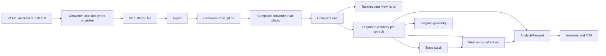
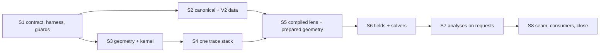

# Optics Engine Rewrite Specification

Restructure the lens optics engine and the authored lens-data format so the engine is easier to understand, change and
verify. Adopt the tighter intersection-accuracy contract from
[PR #774](https://github.com/ronbuening/LensVisualizer/pull/774) everywhere, and take the speed gains the restructure
makes available. This is a plan for future work; nothing below has shipped.

Priorities, in order: **maintainability**, then **accuracy** (the contract below), then **speed**. When they conflict,
the higher priority wins and the PR description records the trade-off.

## Outcomes

The program is complete when every outcome below holds on `main`. Each outcome is checked by a guard test or script
wherever one can be written, and by review otherwise.

| # | Outcome | Checked by |
| --- | --- | --- |
| M1 | One authored lens-data format (V2), with one spec and one template. The app reads only V2. V1 files are read only by the permanent converter, which the organizer runs on any V1 file it finds and which also runs on demand. | Corpus guard: every catalog file is V2; converter and organizer suites; seam guard keeps the V1 mapping out of the app |
| M2 | Lens data is ingested once into a canonical prescription, then compiled once into the engine's lens model. Materials are resolved once, and nothing in the engine clones lens data or points back to the UI view. | Structural counters (S1.P3.T1); architecture guards (S1.P4.T1) |
| M3 | One surface-geometry module and one intersection/trace stack. `src/optics/internal/` and the legacy tracers in `rayTrace.ts` are deleted. | Architecture guards |
| M4 | No runtime import cycles inside `src/optics/`. | Import-cycle guard (S1.P4.T1) |
| M5 | One owner for prepared geometry, with one bounded cache. Every other cache has a named owner, key and capacity. | Cache guard (S1.P4.T1) |
| M6 | Analyses take one explicit request object. There are no `(L, zPos, focusT, zoomT, aberrationT, geometry?)` parameter lists and no `*ForState2` adapters. | Seam guard; review |
| M7 | No `*2` names and no `compat.ts`. Code outside `src/optics/` imports only the public seam (top-level `src/optics/*.ts`). | Seam guard (S1.P4.T1) |
| M8 | The accuracy contract holds on every intersection path. | Analytic suite; differential gates |
| M9 | The architecture docs, `public-functions.md`, lens-data spec and recipes describe the new structure, and this plan is deleted. | `docDrift.test.ts`; review |

Speed is a secondary goal. Its gates and targets are under [Efficiency](#efficiency-secondary).

## Evidence

This plan is grounded in the engine and catalog at `main` 33ebdb3, plus the fixes that merged with the plan: three
duplicate-value corrections in lens data and the generated rear-plate rim fix.

### Engine

Scope: 161 files and 36,774 lines in `src/optics/`, excluding `mount/` and the glass catalog data.

- **Two exact tracers.**
  - The prepared-state tracer lives in `trace/` and `math/intersection.ts`.
  - The legacy tracer is `internal/exactSurfaceTrace.ts` plus `internal/surfaceIntersection.ts`; with `rayTrace.ts` and
    `internal/traceSurfaces.ts`, the legacy layer is 2,652 lines.
  - The legacy tracer still runs in production: in `buildLens` constants (`runtimeLens.ts`), in the chief-relative skew
    rays used by off-axis bundles, coma, spherical aberration, bokeh, field curvature and scalar chromatic fans, in
    off-infinity pupil baselines, and in folded validation.
- **The engine lens is built from the UI view.**
  - `normalizeLensData.ts` builds the engine lens from a finished `RuntimeLens` and keeps a `runtime` back-pointer.
  - `prepareState.ts` reads that back-pointer.
  - Twenty-two prepared-state modules read `state.lens.runtime`.
  - Materials are resolved twice, and lens data is `structuredClone`d twice.
- **One 13-module runtime import cycle**, around `compat.ts`: `optics.ts`, `projection.ts`, `distortionAnalysis.ts`,
  `vignetteAnalysis.ts`, `pupilAberration.ts`, `groupMovement.ts` and six `analysis/` modules.
- **Duplicated concepts.** About twenty concepts are implemented twice or more:
  - layout and thickness;
  - zoom-table interpolation (five copies);
  - focus breathing, with two different infinity thresholds (0.003 and 0.0001);
  - lens compilation;
  - dispersion tables;
  - channel wavelengths;
  - aspheric comparison;
  - chromatic bar scaling;
  - display sag;
  - paraxial tracing;
  - pupil geometry;
  - prepared-state caching (an LRU of 96, an unbounded store, and eight uncached call sites in `field/chiefRay.ts`);
  - z-position overrides;
  - field barrels.
- **Adapters and names.**
  - Analyses that take a prepared state unwrap it back into `(L, zPos, focusT, zoomT, aberrationT)` and call the
    `RuntimeLens` implementation.
  - There are 176 `*2` exports, and only two of them are imported outside `src/optics/`.
- **The de-facto public surface.**
  - Outside code imports 49 `src/optics/` modules: 32 in the app and 17 in tooling.
  - The official barrel `index.ts` has no importers.
  - `RuntimeLens` is used by 52 non-optics source files.
  - 57 test files import engine internals or `*2` names, and six test files mock seven engine modules by path.

### Cost

Measured with CPU profiles and evaluation counters on the slowest benchmark lens, PC-Nikkor 19mm. Wall time goes to
the number of kernel evaluations, not to preparation or adapters:

| Measurement | Default analysis | Stopped-close (shift + tilt) |
| --- | --- | --- |
| Sag + slope self time | 42% | 32% |
| Bracket scan (inclusive) | 23% | 26% |
| Garbage collection | 4% | 15% |
| `prepareState` and every adapter function | ≤ 0.6% | ≤ 0.6% |
| Surface-profile evaluations per intersection | 5.8 | 7.8 |
| Dominant nested solve | Distortion's image-height inversion, 58%: bisection over chief solves of ~64 stop traces each | Sensor-locked field sampling, 78%: `solveScalarRoot`, ~86 evaluations per solve |

Spheres and conics have no closed-form path. Every curved surface is bracketed (an endpoint test, then up to 24 samples)
and solved by safeguarded Newton, and each evaluation computes both sag and slope. The Sony FE 24-70mm GM II and Canon
Serenar 50mm f/1.8 show 5.3 and 5.0 evaluations per intersection, so the pattern is general.

### Lens data

907 files: 18,991 surfaces and 10,265 elements.

- **Per surface.**
  - Every surface repeats `nd` and `elemId`. The 8,719 air surfaces (46%) carry `elemId: 0, nd: 1`.
  - Surface and element indices agree in every lens, so one `medium` reference can carry the index.
  - `elemId` means three things: the drawn span, the dispersion medium and the absorbing medium. These diverge on the 14
    mirror and blocker surfaces.
  - Four surfaces in two lenses are non-air media with no element: water in front of the Nikon RUW 20-35, and three
    cement layers in the Hasselblad XCD 90 that are traced but not drawn as elements.
- **Variable gaps.**
  - `var` is `[focusKeyframe]` on primes and `[zoomStation][focusKeyframe]` on zooms; the shape is decided by
    `zoomPositions`.
  - Its first value duplicates `surface.d`; the two are exactly equal in all 2,195 gaps.
- **Per-station facts are spread across parallel structures.**
  - Six parallel per-station structures: `zoomPositions`, `nominalFno`, `zoomStopSemiDiameters`, `zoomCloseFocusM`, the
    `var` rows and the `publishedStations` indices.
  - `finiteConjugates` uses a second addressing scheme, normalized `focusT`/`zoomT`.
  - On zooms, `focalLengthDesign` and `zoomLabels` are `[wide, tele]` endpoints in 270 and 243 files, and per-station in
    27 and 48, with no marker saying which form a file uses.
- **Magic values and padding.**
  - All 1,288 flat surfaces are written `R: 1e15`.
  - The V1 schema requires K and A4–A14 on every asphere, so all 1,456 entries list them, zero when unused.
  - 499 files author an empty `asph`.
  - The stop `sd` is required, but the engine overwrites it in 891 of 907 lenses: from `nominalFno` in 889 and from a
    published radius schedule in 2.
    - Shrinking all 889 authored values to 10% changes no computed value.
    - The only path that can read them is generated rear-plate rims, and no current lens triggers it.
    - The spec says the authored value sets the entrance pupil.
- **Fields in the wrong place, or unread.**
  - Display, ray-sampling and validation knobs sit beside optical fields.
  - Three authored fields have no reader: `zoomLabels`, `apertureBlades` and `apertureBladeRoundedness`.
  - Defaults are merged invisibly in several places, and `src/lens-data/defaults.ts` imports an engine internal.
- **The spec contradicts the code in nine places.**

## Baseline and accuracy contract

- **#774 merges on its own, ahead of the program,** as soon as its CI is green on current `main`, so it does not go
  stale against the daily lens PRs.
- **R0** is the parent of #774's merge commit. **A0** is S1.P1.T1's merge commit, which contains #774.
- Every differential comparison and speed measurement uses A0 or a later anchor (see
  [Anchors and comparison coverage](#anchors-and-comparison-coverage)). R0 is measured once, in S1.P1.T1, only to
  size the contract's own cost.
- #774 documents the contract in `agent_docs/architecture/optics-engine.md` (Exact Surface Trace) and
  `agent_docs/decisions.md` (2026-10-08). Until it merges, this section owns the contract; S1.P1.T1 shrinks it to a
  pointer.

The intersection contract, from #774:

1. **Residual target and iteration cap.** Every curved solve targets a raw residual of
   `INTERSECTION_TOLERANCE = 1e-12` mm within `INTERSECTION_MAX_ITERATIONS = 72`.
   - An explicit caller tolerance or iteration budget keeps its meaning.
   - Running out of iterations is a failure. The old tenfold acceptance fallback does not return.
2. **Residual definitions.**
   - Sag profiles: `z_ray − (vertexZ + sag(r))`.
   - Planes, including tilted ones: the signed normal distance `n · (p − p0)`, never divided by `n_z`.
   - Analytic hits validate their residual after any bound clamping. This covers planes today, and the spheres and
     conics added in Stage 3.
3. **Raw target first.** The operand-based roundoff envelope (`sagResidualRoundoff`, `planeResidualRoundoff`:
   `16·ε·max(1, Σ|operands|)`) may relax acceptance in only two cases:
   - a Newton correction cannot change the floating-point ray parameter;
   - a safeguarded bracket midpoint rounds onto an endpoint.

   For aspheres, the envelope uses the absolute-term slope bound. A missing or non-finite bound never authorizes
   success. Every success reports the bound it met in `effectiveTolerance`.
4. **Cap selection.**
   - The first root inside `r ≤ sd`, in ray order, wins over an exterior continuation root.
   - A ray with no cap root keeps its exterior hit, so clipping still reports the first clip.
   - The search keeps the conic-domain checks, stays forward-only, and respects the requested parametric bounds.
   - Clear-aperture clipping keeps its own semantic tolerance, `max(1e-9, |sd|·1e-12)` mm.
   - Slope-certificate margins are proofs, not acceptance limits, and never widen the search.
5. **Closed form gets no exemption.** A closed-form root is accepted under the same residual definition and rule as an
   iterative one.

#774 reported these costs, which this program carries as known debt:

- PC-Nikkor 19mm default analysis +91.88%, cause unresolved;
- the analysis category +8.31%;
- +0.291 Newton steps per curved hit;
- eight accepted Mirotar success→clipped transitions.

Stage 3 must bring PC-Nikkor 19mm default analysis back to at or below its R0 median.

## Integration model

All work merges to `main` through ordinary squash-merged PRs. This is trunk-based development with
[branch by abstraction](https://martinfowler.com/bliki/BranchByAbstraction.html): there is one engine at every commit.

- **Replacing something too large for one step.** Put the new implementation behind the existing function, move the
  callers over in later steps, then delete the old implementation in the phase's last step.
  - There is no parallel candidate package, no engine selector and no `traceMode`.
  - A step leaves `main` releasable. Production uses the restructured code as soon as the step merges, and each step
    can be reverted on its own.
- **Why not a long-lived branch.**
  - `main` takes lens and audit PRs almost daily, and engine features every few days.
  - An alternative-main branch would need continuous merges into a moving `src/optics/`.
  - It would defer review to one promotion PR. The optics-2 migration ended as
    [#518](https://github.com/ronbuening/LensVisualizer/pull/518), a 193-file PR.
  - It would need two engines in order to compare them. Trunk development compares every PR against its true
    merge-base instead.
- **Other engine work during the program** lands in the one engine and passes the same gates. An intentional engine
  behavior change moves the anchor only under the rule in
  [Anchors and comparison coverage](#anchors-and-comparison-coverage).
- **One step per PR.**
  - Title: `S<stage>.P<phase>.T<step> <behavior>`.
  - The body states the change class (C0–C3), the gate tier and anchor used, payload and status counts, every
    declared expected difference, and any declared comparison exceptions.
  - **No mixed PRs.** A PR changes engine code or prescription semantics, never both. Format-only data changes
    (unchanged semantic fingerprint), such as the S2.P5 conversion batches, carry no engine code.
  - Steps within a phase merge in order. Phases run in parallel only where [Stage dependencies](#stage-dependencies)
    allow.
- **Checkpoints.**
  - The PR that ends a phase or stage carries that gate's results in its description.
  - When a stage gate passes, the stage's last merge commit is tagged `optics-rewrite/s<N>`.
  - No empty commits and no custom gate runner: CI on the PR's head commit is the per-step gate.
- **Docs move with the code.** Each step rewrites, in the same PR, the architecture text it makes stale, and
  supersedes any decision it overturns. For example, S4.P2.T4 rewrites the two-tracer description in "Exact Surface
  Trace" in `agent_docs/architecture/optics-engine.md`. S8.P2.T3 is a final consistency pass, not the first update.
- **Tests move with the code they test.**
  - Behavioral assertions keep their expected values.
  - Before an internal is deleted, its tests are rewritten against the replacement at equal or greater strength.
  - Tests that `vi.mock` a module by path are updated in the step that moves that module.

### Anchors and comparison coverage

An anchor is a `main` commit whose **engine** the stage gates compare against. Anchors track engine revisions only;
lens data never moves one.

**Semantic fingerprint.** Each prescription has a semantic fingerprint: a hash of every canonical value the engine or
UI reads, taken after the engine's own authority rules.

- Zero asphere terms count as absent.
- `R` beyond `FLAT_R_THRESHOLD` counts as flat.
- A stop radius the engine derives counts as derived, whatever number was authored.
- Numbers compare bit for bit, with `-0` normalized to `0`.
- Provenance is excluded: source paths, comments, formatting, authored-versus-default flags, and authored values the
  engine ignores.

A V1 file and its V2 conversion therefore share a fingerprint, while any change the engine or UI could observe changes
it. Before S2.P1.T1, the fingerprint hashes the normalized authored data.

**What a differential run compares.** Nothing is skipped silently.

1. **Engine drift.** Every head prescription is evaluated by both the base engine and the head engine. Data changes
   therefore cannot hide engine drift, and no lens is skipped because its data changed.
2. **Format-only data changes.** For each lens whose authored file changed but whose semantic fingerprint did not, the
   base and head prescriptions are evaluated on the head engine and must be bit-identical.
3. **Semantic data changes.** For each lens whose fingerprint changed, and each new lens, the run reports the impact:
   base data against head data, both on the head engine.
   - These block the PR: a new failed status, a non-finite value, or a lens that no longer builds.
   - Everything else in the impact report is reviewed rather than gated.
4. **Exceptions.** Some prescriptions cannot be evaluated by the base engine, for example a V2 file before V2 ingest
   (S2.P2.T1) exists in the base. The PR lists each such lens in an "engine-diff exceptions" section of its
   description. The run fails when the lenses it could not compare differ from that list in either direction.

**Baselines and anchor moves.**

- Per-PR gates compare against the PR's merge-base.
- Stage gates compare against the current anchor, catching drift that accumulates across steps that each passed
  alone. Each quantity uses the loosest budget among the change classes merged since the anchor.
- A data correction (a C3 on lens data) never moves the anchor. Cross-evaluation keeps comparing its new prescription
  on the anchor's engine.
- An engine C3 moves the anchor only after a cumulative comparison against the previous anchor passes: Tier S, every
  head prescription on both engines. That comparison may show nothing outside the cumulative budgets except the
  differences declared and approved for that change. The PR records the declared differences and the result, and its
  merge commit becomes the new anchor.

## Numerical contract

Arithmetic is Float64 throughout. Units are mm, nm for wavelengths, degrees at field APIs and lp/mm for MTF.
Coordinates are X sagittal, Y meridional and Z axial.

Every PR declares exactly one change class:

| Class | Meaning | Gate |
| --- | --- | --- |
| **C0** refactor | No numeric change intended | Every payload number is bit-identical to the merge-base (`Object.is`); discrete fields are equal |
| **C1** equivalent numerics | Same mathematics evaluated differently: reassociation, fused evaluation, a closed-form root under the same residual rule | Quantity budgets below; discrete outcomes identical, or each boundary transition listed and explained |
| **C2** algorithm replacement | A different solver or search with the same or a tighter convergence criterion | Every sample meets its criterion; differences within the C2 budgets; an independent reference shows the error is no worse; discrete transitions explained individually |
| **C3** intentional behavior change | A bug fix, a data correction or a new capability | Maintainer approval; independent evidence (analytic case, comparator or source); for an engine change, the cumulative comparison before the anchor moves; a changelog entry if users can see it |

- **Default class and labels.** The default class is C0. The CI job reads the class from a PR label, and only the
  maintainer applies a label above C0.
- **Golden values.** Golden and analytic test tolerances are ceilings. Only a C3 PR may change a golden value or loosen
  a tolerance, and it must say why.

### Quantity budgets

These values are proposed. S1.P2.T2 confirms them against the payload differences that a known C1 perturbation
produces (reassociating one sum in sag evaluation). Loosening a budget later is itself a C3 change.

| Quantity | C1 budget | C2 budget |
| --- | --- | --- |
| Unclipped surface hit, image-plane landing | 1e-9 mm | — (traces are not C2) |
| Clipped, exterior or diagnostic hit | 1e-7 mm | — |
| Direction cosines | 1e-10 | — |
| First-order scalars (EFL, BFD, pupil positions and sizes, stop SD) | 1e-12 relative | — |
| Chief-ray launch height | 1e-9 mm | Twice the solver's stop-residual tolerance (1e-7 mm today), mapped through ∂y_stop/∂y_launch |
| Field angle from image height | 1e-10° | Both solutions' image heights within twice the inversion tolerance (1e-4 mm today) |
| Analysis lengths (focus shifts, blur, field curves, pupil shifts) | 1e-8 mm | The governing solver criterion, propagated by a finite-difference derivative the harness computes |
| Percentages (distortion, illumination) | 1e-8 points | As above |
| MTF modulation | 1e-7 | As above, and never looser than 1e-4 |
| Statuses, counts, sample positions and order, labels, warnings | exact | exact unless listed one by one |

## Verification

### Gates by level

| Level | Where | Required |
| --- | --- | --- |
| Every PR | CI (`.github/workflows/quality.yml`) | lint, format, typecheck, `npm run test`, the tooling suite, build and `seo:audit` (all existing) |
| Engine or lens-data PR: touches `src/optics/**`, `src/types/**`, `src/lens-data/**` or `src/utils/catalog/**` | CI job `engine-diff` (S1.P2.T2) | Tier P against the merge-base under the PR's change class, plus every changed or new lens through every Tier P request |
| Phase end | The PR that ends the phase | Every test the phase's steps added, run together; the phase exit criteria |
| Stage end | GitHub Actions: `engine-diff-stage.yml` by `workflow_dispatch`, sharded as a matrix (S1.P2.T3). Timing runs on the maintainer's machine. | Tier S against the current anchor; the full suites; build; the stage's efficiency report; then the tag |
| Before S8.P2 deletes code | `engine-diff-stage.yml`, sharded | Tier F against the current anchor |

### Differential harness

The harness lives in `src/benchmarks/engineDiff/` and is driven by `scripts/engine-diff.mjs`. Nothing it produces is
committed. Its own tests (fixtures, budget table and deliberate-drift detection) run in the tooling suite.

| File | Role |
| --- | --- |
| `captureEntry.ts` | Vite SSR entry, built like the rendering benchmark. It calls only the public seam, and evaluates prescriptions supplied as serialized input rather than reading its own catalog. |
| `seamAdapter.ts` | Detects renamed exports so the same entry runs at both refs. A PR that changes the seam updates this adapter in the same PR. |
| `requests.ts` | Defines the tiers as deterministic lens × state × request lists. |
| `payload.ts` | Normalizes payloads: numbers unrounded, arrays in authored order, statuses, counts and labels as discrete fields. It also computes each prescription's semantic fingerprint. |
| `budgets.ts` | Holds the quantity table above, keyed by payload path. |
| `compare.ts` | Reports violations, discrete transitions and the largest difference per quantity. |

`scripts/engine-diff.mjs --base <ref> --tier p|s|f --class c0|c1|c2|c3 [--shard i/n] [--lens <key>]
[--exceptions <file>]` runs in six steps:

1. Add a git worktree at the base ref, symlinking `node_modules` when `package-lock.json` is unchanged.
2. Copy the head's `engineDiff/` into the worktree.
3. Serialize the head's prescriptions, plus the base's for every changed lens, and compute their semantic
   fingerprints.
4. Build both captures and run the comparisons in
   [Anchors and comparison coverage](#anchors-and-comparison-coverage).
5. Write NDJSON payloads, the data-impact report and the list of uncompared lenses to a temporary directory.
6. Exit non-zero on any violation, or when the uncompared lenses differ from the declared exceptions.

### Corpus tiers

Today's sweep, `exactTraceCatalog.test.ts`, traces one on-axis meridional ray and one skew ray per lens at zoom 0 and 1,
focused at infinity. The tiers below are the program's evidence; they do not replace that sweep.

S1.P2.T3 measures each tier's runtime and records it in that PR. If Tier P exceeds 15 minutes in CI, its lens subset
shrinks by documented stratification; its assertions never do.

| Tier | Lenses | States | Requests |
| --- | --- | --- | --- |
| **P** | All 907, visible and hidden | First and last zoom station, infinity focus, wide open | Build constants; layout; meridional fans on- and off-axis, a skew fan and a chromatic fan, each with terminal points and full hits; field geometry; chief solves at fields 0, 0.5 and 1 |
| | The 15 benchmark lenses plus 10 feature representatives: fisheye; folded auto and explicit-order paths; diffractive; bulk absorption; rear plates; a converter pair; PC shift + tilt; finite conjugate; fixed-iris zoom; aberration control | Their reference state | Every analysis job, perspective jobs included; geometric MTF at a 32-cell grid |
| **S** | All | Every authored zoom × focus station (about 3,400 states) × {wide open, one stop-down ratio}; aberration endpoints and center for every `aberrationControl` lens; every permitted converter pair at every host station | Everything in Tier P's first row |
| | A stratified set of about 60 lenses: every projection kind, every folded fixture, every PC lens, every diffractive and absorbing lens, every rear-plate maker, every converter pair, the 10 heaviest benchmark lenses and 10 drawn by a fixed seed | Their authored stations | Every analysis job; MTF at both methods and three spectra on the MTF benchmark cases |
| **F** | All | Every authored station × {wide open, stopped down} | Every analysis job |

### Independent references

The old engine demonstrates compatibility, not physical correctness. These references stand outside it.

- **Analytic suite.** Keep every existing analytic and golden test, and add:
  - closed-form sphere and conic intersections, checked against roots computed offline to at least 50 significant
    digits;
  - asphere roots, checked against the same kind of reference;
  - root-solver convergence on functions whose roots are known.

  Each fixture is committed beside the script that generated it.
- **Comparator report.**
  - `scripts/export-comparator-cases.mjs` exports a fixed lens set (canonical prescriptions, launch rays and per-surface
    hits) in the format LensVisualizerRayTraceComparator defines
    ([issue #771](https://github.com/ronbuening/LensVisualizer/issues/771)).
  - From Stage 3, each stage PR reports the comparison.
  - Like MTF chart agreement, it is a report and never a test threshold.
- **When a reference shows the old engine was wrong.** Either fix it in a separate C3 PR with an analytic test, which
  moves the anchor under the anchor rule, or record an approved divergence with its evidence. Never reproduce a known
  bug for parity.

### Architecture guards

`__tests__/src/optics/opticsArchitecture.test.ts` scans source the way `docDrift.test.ts` does. It holds three guards,
each with up to two lists:

- **Legacy exceptions** are today's violations. This list is a one-way ratchet: an entry can only be removed, and the
  test fails when a listed entry no longer violates, so the list cannot go stale. It is empty by S8.
- **The approved registry** holds modules that meet the rule by design. A reviewed PR may add an entry only if it meets
  that guard's admission rule. New barrels and relocated caches enter here, never through the legacy list.

The guards:

- **Import cycles.**
  - The test builds the runtime import graph of `src/optics/`, excluding `import type`, and computes strongly
    connected components.
  - Legacy exceptions start as today's 13 cycle modules.
  - There is no registry: no cycle is ever approved.
- **Seam.**
  - Imports into `src/optics/` from anywhere else must target a registered or legacy-listed module.
  - Registry admission: a top-level `src/optics/*.ts` file reviewed as a barrel or thin facade. Alias barrels due for
    deletion in S8 leave the registry when they are deleted.
  - Legacy exceptions are today's outside-imported modules that fail admission: deep modules and top-level
    implementation files.
  - `prescription/teleconverterCompatibility.ts` is a permanent registry entry, because plain-Node build metadata
    imports it directly.
- **Caches.**
  - Every module-level `Map`, `WeakMap` or `Set` in `src/optics/` must be registered or legacy-listed.
  - Legacy exceptions are today's unbounded caches.
  - Registry admission: a record of owner, key and capacity, and either a bounded capacity or a `WeakMap` keyed by its
    owner object.

## Efficiency (secondary)

### Gates

These apply at every stage end, and failing one blocks the stage.

1. **No case regresses.** A benchmark case regresses when, against the anchor, both of these hold:
   - the lower bound of the 95% bootstrap confidence interval of its paired median ratio exceeds 1.05;
   - its median grows by more than 1 ms.
2. **Counters never rise.** Structural counters (S1.P3.T1) never increase for an identical request.
3. **Memory.** Retained heap after the scripted session (Node, `--expose-gc`; S1.P3.T2) stays within 5% of the anchor.
4. **#774 debt.** From Stage 3 on, PC-Nikkor 19mm default analysis is at or below its R0 median.

### Targets

Targets are reported at stage ends and never block. A miss becomes an item in `EFFICIENCY_IMPROVEMENT_PLAN.md`. Any
requirement that must block is written as a test in its step, or as one of the gates above.

| Stage | Target | Basis |
| --- | --- | --- |
| 3 | Mean surface-profile evaluations per sphere or conic intersection, closed-form and fallback combined, close to 2 (5.0–7.8 today); the fallback rate is reported with its reasons | Sag and slope evaluation took 32–42% of self time. The per-success limit is a test in S3.P2.T1, not a target. |
| 3 | Analysis category median ≥ 25% lower than A0 across the benchmark matrix | Same profiles |
| 6 | Median stop traces per centered chief solve ≤ 8, against ~64 today | `computeChiefRaySolve2` scans up to 96 samples per expansion, then bisects to a 1e-7 mm stop residual, on a function that is nearly linear in launch height |
| 6 | Median evaluations per `solveScalarRoot` call ≤ 12, against ~86 today | It scans from the low end of each interval, not outward from the seed, then bisects up to 30 times |
| 6 | Image-height inversion uses ≤ 6 chief solves per target, against up to 40 bisection steps today | `solveFieldAngleForImageHeightLookup2` bisects a smooth monotone function it has already tabulated |
| 6 | Each unique sensor point is solved at most once per perspective context | Five perspective analyses solve the same sensor points independently, and vignetting does so twice |
| 8 | PC-Nikkor 19mm stopped-close analysis ≥ 2× faster than A0 | Sensor-locked sampling was 78% of that profile |

### Method

- Same machine and Node version on both sides, alternating AB/BA order.
- At least 2 warmups and 9 measured samples per case, or 15 samples for cases above 100 ms.
- Raw samples are kept in the run JSON. Bootstrap uses 10,000 resamples with a fixed seed.
- Timing gates run on the maintainer's machine. CI checks counters only.
- Results report completed work (successful, clipped and failed counts; field statuses; grid sizes; convergence), so a
  quick rejection is never mistaken for a speedup.
- These never count as speedups: reducing samples, lowering grid caps, returning unsupported results fast, or changing
  a physical model.
- A browser interaction harness (drag and settle times) is deferred: it would only report, and the Node benchmarks and
  counters cover every gate. Add it if interactive feel regresses.

## Target architecture

### Model



| Type | Owns | Lifetime |
| --- | --- | --- |
| `CanonicalPrescription` | The version-independent semantic content, with schema defaults and the engine's authority rules applied. Beside it, kept apart, is provenance: source paths for diagnostics, authored-or-default flags, and authored values the engine ignores. The semantic fingerprint covers only the semantic content. | One per authored file; plain data that can be sent to a worker |
| `CompiledLens` (replaces `EngineLens`) | Indexed surfaces with compiled geometry profiles, media and dispersion resolvers, the stop, path plan, station tables, aperture model, annotations and display constants. It has no reference to `RuntimeLens`. | One per canonical identity, immutable |
| `RuntimeLens` (unchanged name) | The frozen read model the UI consumes, derived from `CompiledLens` plus the first-order constants. The engine never takes it as input. | One per compiled lens |
| `PreparedGeometry` (replaces `PreparedOpticalState`) | Vertex positions, current thicknesses, the image plane and iris for one exact `(focusT, zoomT, aberrationT)`. It shares the immutable surface records. | Bounded LRU per compiled lens |
| `TraceGeometry` | The minimal indexed input the tracer needs: surfaces, vertex z, media, stop index, image plane and path plan. | A view of `PreparedGeometry`, or one built during lens construction |
| `AnalysisRequest` | Prepared geometry, physical aperture, spectrum, field geometry, optional pose, sampling and capture choice. | One per analysis context |

### Directory layout

- **Top-level files** in `src/optics/` are the public seam: barrels and thin facades only. Everything else lives in
  subdirectories that outside code may not import.
- **Final barrels.** They are settled in S8.P1.T1 and enforced by the seam guard. The proposal: `buildLens.ts`,
  `teleconverter.ts`, `optics.ts`, `fieldGeometry.ts`, `projection.ts`, `analysis.ts`, `mtf.ts`, `perspective.ts`,
  `diagramGeometry.ts`, `chromatic.ts`, `glassCatalog.ts`, `publishedStations.ts`, `validation.ts`, `geometry.ts`,
  `types.ts` and `lensDataConversion.ts`. The last exposes the V1 mapping and the canonical printers to the converter;
  the seam guard admits only `scripts/lens-data-convert/`, the organizer and their tests as its importers.

| Directory | Contents |
| --- | --- |
| `prescription/` | Canonical types; V2 ingest; schema defaults; composition (rear plates, teleconverter); the compiler; `validate/`; `v1/`, the V1 mapping that only the converter imports |
| `geometry/` | Surface profiles; fused sag and slope; bounds; the intersection kernel; tolerance envelopes; planes; vector math; diffractive phase |
| `trace/` | Interactions; sequential and generalized traversal; path planning; apertures; capture; absorption; ray adapters |
| `state/` | Control interpolation (focus, zoom, aberration); `PreparedGeometry` and its cache; stop and iris; layout; camera anchoring |
| `first-order/` | Paraxial tracing; lens constants (EFL, BFD, pupils, half-field); cardinals; breathing; f-numbers |
| `field/` | Projection; launch; chief-ray solve; field geometry; image-height inversion |
| `math/` | Numerics and root solving |
| `chromatic/` | Channels; index resolution; dispersion tables and quality; the glass catalog and its entries |
| `perspective/` | Pose; frames; sensor targeting; trace context; field sampling; diagram fans; `analysis/` |
| `analysis/` | Request and context; jobs; sampling policy; `aberration/`; distortion; vignetting; pupils; bokeh; chromatic; aspheric comparison; group movement; summary; `mtf/` |
| `diagram/` | Coordinate transforms; element shapes; outlines; render diagnostics; folded-path labels |
| `diagnostics/` | Work counters; chief-ray status counts |
| `mount/` | Unchanged; outside this program |

### Module fates

| Today | Fate | Step |
| --- | --- | --- |
| `index.ts`, root `analysisJobs.ts`, `analysis/fieldCurvature.ts` (no importers) | Deleted | S1.P4.T1 |
| `internal/surfaceMath.ts`, `math/surfaceProfile.ts`, `layout.ts` `renderSag`/`sagSlope`, `diagram/surfaceOutline.ts` `surfaceSag2` | `geometry/surfaceProfile.ts`, one implementation | S3.P1.T1 |
| `math/intersection.ts`, `math/intersectionTolerance.ts`, `math/plane.ts` | `geometry/intersect*.ts` | S3.P2 |
| `internal/surfaceIntersection.ts` | Delegates to the kernel in S3.P2.T3, then deleted | S4.P2.T4 |
| `internal/exactSurfaceTrace.ts`; `rayTrace.ts` tracers and `traceToImage`; `internal/traceSurfaces.ts` | Deleted. The pupil samplers from `rayTrace.ts` move to `analysis/sampling.ts`. | S4.P2.T4 |
| `internal/lensState.ts`; `prescription/{labels, aspheres, variables, groups, dispersion}.ts`; `prescription/normalizeLensData.ts` | One compiler, `prescription/compile*.ts` | S5.P1.T1 |
| `runtimeLens.ts` (1,111 lines) | `first-order/lensConstants.ts` plus `prescription/runtimeView.ts` | S5.P1.T2 |
| `validateLensData.ts` (1,838 lines), `validateTeleconverterData.ts`, `internal/apertureBands.ts` | `prescription/validate/`, split by concern | S5.P1.T3 |
| `compat.ts` LRU; `trace/rayAdapters.ts` state store; uncached `prepareState` calls; `stateWithRuntimeZ` and `stateWithDiagramZ2` | `state/preparedGeometry.ts`: one owner, one cache, one z-override | S5.P2.T1 |
| `layout.ts` `thick`/`doLayout`/`*AtZoom`/`eflAtFocus`/`effectiveFNumber`; compat `doLayout2`/`thick2`/`*AtZoom2`; `first-order/{focusBreathing, fNumber}.ts`; `apertureStop.ts`; `focusDistance.ts` | `state/layout.ts`, `state/stationTables.ts` and `first-order/`, one of each | S5.P2.T2 |
| `dispersion.ts`; `chromatic/{dispersionAdapter, dispersionQuality, indexResolver}.ts`; `prescription/dispersion.ts`; channel wavelengths in `constants.ts` | `chromatic/`: one table builder, one quality summary, one channel table | S5.P2.T3 |
| `field/chiefRay.ts` (1,384 lines); `field/chiefRayCache.ts` | `field/{fieldGeometry, chiefRaySolve, imageHeight}.ts`; per-geometry cache; `diagnostics/` | S6.P1.T1 |
| `perspective/analysis/shared.ts` sensor helpers duplicating `perspective/fieldGeometry.ts` | One implementation | S6.P3.T3 |
| `analysis/{aberrations, bokeh, distortion, vignetting, pupilAberration, groupMovement, chromatic}.ts` adapters; `analysis/preparedStateAdapters.ts` | Deleted as each family takes `AnalysisRequest` | S7.P2 |
| `aberration/*`, `distortionAnalysis.ts`, `vignetteAnalysis.ts`, `pupilAberration.ts`, `groupMovement.ts`, `chromatic/analysis.ts`, `asphericComparison.ts` (two copies), `chromaticRayFanScaling.ts` (two copies) | `analysis/<family>/`, one copy each | S7.P2 |
| `analysis/mtf*.ts` | `analysis/mtf/`. Inputs change; kernels and orchestration do not. | S7.P4 |
| `compat.ts`; alias barrels (`cardinalElements.ts`, `chiefRayDiagnostics.ts`, `aberrationAnalysis.ts`, `field/fieldGeometry.ts`, the field aliases in `optics.ts`); the 176 `*2` names | Deleted or folded into the final barrels | S8.P1.T1 |

## Lens data V2

### Principles

1. **One fact, one place.** A value the engine reads is authored once. Where V1 holds two copies, the converter checks
   that they agree exactly. Every catalog file agrees today. A file that does not (a new, archived or external V1
   file) is refused with the pair named, and waits for a C3 data correction under `agent_docs/lens-patent-audit.md`.
2. **Records, not parallel arrays.** Every per-station fact lives on its station record.
3. **Explicit over magic.** `R: "flat"` replaces `1e15`; `medium` replaces `elemId` + `nd`; the stop declares whether
   its radius is authored or derived.
4. **Grouped by consumer.** Identity, catalog, source, prescription, states, aperture, annotations, layout, rays,
   checks.
5. **Lossless, mechanical conversion.** The converter never changes a value the engine or UI reads.
   - The semantic fingerprint of a converted file equals that of its V1 source. Provenance (source paths, comments,
     ignored authored values) may differ.
   - Deriving information that can legitimately differ is a later, separately reviewed C3 data PR, never a converter
     side effect. Examples: design focal length versus station focal lengths, `specs`, element `fl`.
6. **Defaults belong to the schema.** They are documented in the spec and applied by ingest with provenance, never by
   spreading an object of defaults.
7. **Naming.** The names in this section are approved as written (2026-10-09). Renaming after S2.P5 would convert the
   catalog a second time, so a later rename is a new format change, not an edit.
   - The prescription columns `R`, `d`, `sd` and `innerSd` keep optical notation, in mm.
   - Every other dimensional field carries a unit suffix.
   - f-numbers are spelled `fNumber`.
   - Field names that are already clear are kept, so the folded-path, projection and plate vocabulary in `CLAUDE.md`
     and the audits stays valid: `opticalPath`, `interaction`, `innerSd`, `projection`, `perspectiveControl`,
     `rearPlates`, `aberrationControl`, `diffractive`, `stopPlacement`, `groups`, `doublets`.

### Shape

Excerpt of `NikonNikkorZ2450mmf463.data.ts` after conversion; the header comment block is unchanged:

```ts
const LENS_DATA = {
  schema: 2,
  key: "nikkor-z-24-50-f4-63",
  maker: "Nikon",
  name: "NIKON NIKKOR Z 24-50mm f/4-6.3",
  subtitle: "JP 2021-189377 A EXAMPLE 1 — KONICA MINOLTA / NIKON",

  catalog: {
    lensMounts: ["nikon-z"],
    imageFormat: "135-full-frame",
    specs: ["11 ELEMENTS / 10 GROUPS", "f = 24.7–48.5 mm", "F/4.08–6.34", "2ω = 82.5°–48.2°", "6 ASPHERICAL SURFACES"],
    elementCount: 11,
    groupCount: 10,
    focalLengthMm: { marketing: [24, 50], design: [24.73, 48.5] },
    fNumber: { marketing: 4, design: 4.08 },
  },

  source: {
    patentNumber: "JP 2021-189377 A",
    patentYear: 2021,
    authors: ["Takakazu Hirose", "Keiko Yamada", "Yasushi Yamamoto", "Hiroshi Yamamoto"],
    assignees: ["Konica Minolta, Inc.", "Nikon Corporation"],
  },

  elements: [
    { id: 1, name: "L1a", label: "Element 1", type: "Negative Meniscus", nd: 1.6968, vd: 55.46,
      focalLengthMm: -28.2, glass: "LAC14 (HOYA)", apd: false, role: "Primary G1 diverging element; convex toward object" },
    // …
  ],

  surfaces: [
    // ── G1: Negative front group (f₁ = −32.86 mm) ──
    { label: "1", R: 71.885, d: 1.2, sd: 15.5, medium: 1 }, // L1a front
    { label: "2", R: 15.312, d: 7.8, sd: 13.5 }, // L1a rear → air
    { label: "3A", R: -298.152, d: 1.57, sd: 12.7, medium: 2,
      asphere: { A4: 1.99678e-5, A6: -8.24417e-8, A8: -2.122e-11 } }, // L1b front (asph)
    // …
    { label: "6", R: 37.81, sd: 12.0 }, // L1c rear → air [VARIABLE: zoom only]; d comes from gaps
    // …
    { label: "STO", R: "flat", d: 3.41 }, // radius derived from the nominal f-number
    // …
  ],

  zoom: {
    stations: [
      { focalLengthMm: 24.726, nominalFNumber: 4.08, label: "Wide" },
      { focalLengthMm: 34.711, nominalFNumber: 5.115 },
      { focalLengthMm: 48.503, nominalFNumber: 6.337, label: "Tele" },
    ],
    apertureModel: "from-nominal-fno",
    step: 0.004,
  },

  focus: {
    closeFocusM: 0.35,
    description: "Internal focus via G3 (2 elements, stepping motor). …",
  },

  gaps: {
    // d6: G1–G2 gap (zoom only — identical inf/close at each position)
    "6": { label: "D6", values: [[19.973, 19.973], [10.326, 10.326], [3.17, 3.17]] },
    // …
  },

  aperture: { blades: 7, bladeRoundedness: 0.7, fStops: [4.08, 4.5, 5.6, 6.3, 8, 11, 16, 22, 32, 36], maxFNumber: 36 },
  groups: [/* unchanged */],
  doublets: [/* unchanged */],
  layout: { scFill: 0.48, yScFill: 0.38 },
} satisfies LensDataV2Input;
```

The canonical field order is the order shown. The converter prints it, so diffs between files stay comparable.

### Field mapping

Every V1 field maps to one V2 location, or is dropped by a rule stated in this table. Fields not listed keep their name
and position.

| V1 | V2 | Rule |
| --- | --- | --- |
| *(none)* | `schema: 2` | Discriminator; ingest dispatches on it |
| `key`, `maker`, `name`, `subtitle`, `visible`, `publishedAt` | unchanged, first in the file | Identity readers move from regex to the AST (S2.P2.T2) |
| `lensMounts`, `imageFormat`, `imageCircleMm`, `specs`, `elementCount`, `groupCount`, `acceptsTeleconverters`, `opticalConfiguration` | `catalog.*` | Same names |
| `focalLengthMarketing`, `focalLengthDesign` | `catalog.focalLengthMm.{marketing, design}` | Value kept as authored, scalar or `[wide, tele]`. The design value stays authored: it is the source's stated range, and it feeds the EFL sanity check and the MTF scale check. S2.P6.T3 adds its consistency check. |
| `apertureMarketing`, `apertureDesign` | `catalog.fNumber.{marketing, design}` | Value kept |
| `patentNumber`, `patentYear`, `patentAuthors`, `patentAssignees`, `sourceErrata` | `source.{patentNumber, patentYear, authors, assignees, errata}` | `errata[].surface` keeps the surface label |
| `surfaces[].nd`, `surfaces[].elemId` | `surfaces[].medium` | An element id, an id in `media`, or omitted for air. Indices come from the medium only. |
| *(air surface with `nd ≠ 1`)* | `media: [{ id, name, nd, vd?, … }]` | Undrawn media; 4 surfaces today |
| `elements[].fromSurface`/`toSurface` | `elements[].span: [from, to]` | Required where the drawn span is not the medium run. Today that means 21 explicit spans and the 14 mirror and blocker surfaces. |
| `elements[].fl` | `elements[].focalLengthMm` | Display; authored until S2.P6.T5 derives it |
| `R: 1e15` | `R: "flat"` | Converted only when `R === 1e15` |
| `asph[label]` | `surfaces[i].asphere` | Sparse. Zero terms are omitted, because V1 required K and A4–A14 on every entry, so a printed zero cannot be told from padding; `K` is omitted when 0. Adding a zero term changes no sum, and schema order stays the accumulation order. A zero an audit relies on is restored by hand as an explicit `0`, which V2 allows (S2.P5). |
| `asph: {}` | omitted | |
| `var`, `varLabels` | `gaps[label] = { label?, values }` | `values` is always `[zoomStation][focusKeyframe]`; a prime has one row |
| `surfaces[i].d` for a gap in `gaps` | omitted | `values[0][0]` supplies it. The converter requires `d === values[0][0]`. |
| `zoomPositions`, `nominalFno[]`, `zoomStopSemiDiameters`, `zoomCloseFocusM`, `zoomLabels` | `zoom.stations[i].{focalLengthMm, nominalFNumber, stopSemiDiameter, closeFocusM, label}` | `[wide, tele]` labels go to the first and last stations |
| `zoomApertureModel`, `zoomStep` | `zoom.apertureModel`, `zoom.step` | |
| `nominalFno` (scalar) | `aperture.nominalFNumber` | Primes and constant-aperture zooms. Scalar versus per-station stays distinct, because the UI treats an array differently (`marketedApertureNote`). |
| `closeFocusM`, `focusPositions`, `focusStep`, `focusDescription` | `focus.{closeFocusM, keyframes, step, description}` | `keyframes` defaults to `[0, 1]`; a station `closeFocusM` overrides the lens value |
| `publishedStations.zoom` / `.focus` | `zoom.stations[i].published` and `.publishedFocus`; on a prime, `focus.published` | Presence still marks provenance. Focus lists hold keyframe indices ≥ 1, and infinity is implied. V1's "zoom omitted means every station" becomes an explicit flag on every station. |
| `finiteConjugates[]` (`focusT`, `zoomT`) | `focus.conjugates[]` (`zoomStation`, `keyframe`) | Index-addressed. The converter maps each `focusT` to the keyframe it matches within the validator's 1e-8 and refuses otherwise. |
| `fstopSeries`, `maxFstop`, `apertureStep`, `apertureBlades`, `apertureBladeRoundedness` | `aperture.{fStops, maxFNumber, step, blades, bladeRoundedness}` | |
| STO `sd` | Kept as `sd` only where the engine uses it: folded and embedded stops, 16 lenses. Otherwise omitted, and the radius is derived. | The engine overwrites the authored value in two ways: with the radius traced from the nominal f-number (889 lenses), or with a published schedule (2 lenses), which V2 keeps as `zoom.stations[i].stopSemiDiameter`. The converter lists each dropped value in its conversion report, as provenance rather than semantics. |
| `aberrationControl.var` / `.varLabels` | `aberrationControl.gaps` | Same tuple forms as V1 |
| `svgW`, `svgH`, `scFill`, `yScFill`, `maxAspectRatio`, `lensShiftFrac` | `layout.*` | |
| `rayFractions`, `rayLeadFrac`, `offAxisFieldFrac`, `offAxisFractions` | `rays.*` | These feed analyses as well as the diagram |
| `gapSagFrac`, `maxRimAngleDeg` | `checks.*` | Validation relaxations |
| explicit defaults (`apd: false` ×3,685, `indexReference: "d"` ×1,891, `zoomApertureModel: "from-nominal-fno"` ×49) | `apd: false` and `indexReference: "d"` kept as authored; the 49 aperture models dropped in S2.P6.T1 | Each behaves the same as an omission (every `apd` reader tests truthiness). `apd: false` and `indexReference: "d"` stay because they record that an author checked; the d/e mix-up is real, and #772 moved seven lenses to e-line data. New files may omit them. The no-op aperture model records nothing. |

**Conventions that do not change:**

- R sign;
- `d` as the axial step to the next listed surface, including negative and zero values in folded paths;
- `sd` as a hard clip;
- `[innerSd, sd]` annuli;
- the asphere formula, including the K convention and odd terms in |h|;
- the diffractive phase convention;
- interaction defaults;
- d/e index-reference semantics;
- metre units for close focus;
- reserved labels (`STO`, `RP<n>a`/`RP<n>b`, the `TC` prefix, the `${label}B` backing pair, `IMG`);
- station indexing (zoom station i of n at `zoomT = i/(n−1)`; focus keyframes at their authored coordinates).

**Teleconverter V2** (`schema: 2` in a `*.teleconverter.ts` file):

- Uses the same `elements`, `media`, `surfaces`, `medium`, `asphere`, `catalog` and `source` model.
- Keeps `magnification`, `masterImageDistanceMm`, `minHostFNumber` (renamed from `minHostFno`), `incompatibleLensKeys`
  and `rearPlates` (air-equivalent, as today).
- Has no stations, aperture, layout, rays or checks.
- Its `groups` stay optional and are kept by the converter, even though composition currently ignores them.

**Validation diagnostics** name the authored path, for example `surfaces[5].medium: unknown element 13`, through the
canonical provenance map.

### Stop radius

The stop radius has exactly one authority per lens:

| Authority | When | V2 field |
| --- | --- | --- |
| Derived | Every lens not covered by the rows below. The radius is the height at the stop of a real marginal ray launched at the entrance-pupil radius the design f-number implies, traced per zoom station. | `aperture.nominalFNumber` or `zoom.stations[i].nominalFNumber` |
| Published schedule | Zooms whose source prints the stop diameter per station (today the Sony FE 12-24 GM and Canon RF 15-35) | `zoom.stations[i].stopSemiDiameter` |
| Authored | Folded systems and stops embedded inside an element (16 lenses) | `sd` on the `STO` surface |

- **A prime's stop radius is always derived from its design f-number.**
  - A published stop diameter that agrees with the f-number is recorded in a comment.
  - One that disagrees beyond rounding is a source-consistency question under the source-errata standard
    (`agent_docs/lens-patent-audit.md`). It is not settled by letting the diameter override the f-number.
  - When a source prints both, they agree. The Sony schedule traces to f/2.909, 2.908 and 2.906 against a printed
    f/2.91.
  - An authoritative prime radius (`aperture.stopSemiDiameter`) is deferred until a source needs one. It would be a
    new authority row in this table, not a format change.
- **The 891 authored stop values the engine overwrites are dropped.** They were never used and never audited: the
  semi-diameter audit procedure said not to touch `STO`. 61 are more than 20% from the derived radius.
- **Comments on dropped values are reviewed once, during migration.**
  - 121 single-line stop entries carry comments, and 20 more stop entries span several lines.
  - Most comments justify the stop's position, which stays valid because `d` is unchanged.
  - 26 discuss the radius: hand calibrations to an f-number, which the engine now performs, and a few figure readings.
  - The conversion report flags them (S2.P3.T1), and each batch PR resolves them (S2.P5).

### Ingest, conversion and comments

- **Shared mapping.** `src/optics/prescription/` holds the object-level mapping (V1 → canonical, V2 → canonical,
  canonical → V1 object, canonical → V2 object). The runtime and the converter use the same code until S8.P2.T2
  retires V1 ingest from the app; the V1 half then lives in `prescription/v1/` behind `lensDataConversion.ts`.
- **The converter.**
  - Lives in `scripts/lens-data-convert/`.
  - Reads source with the TypeScript compiler API (`typescript` is already a dev dependency) and never executes input.
  - Evaluates the literal forms the corpus uses: object and array literals, numbers, strings, booleans, `null`,
    `satisfies`, `as const`, and top-level `const` bindings within the same file.
  - Prints V2 or V1 deterministically, then formats with Prettier.
  - Keeps the source text of numeric literals, so `1.05587e-7` is not reprinted as `1.05587E-7`.
- **Comments.** Leading and trailing comments are attached to the authored path they annotate and re-emitted at the
  mapped V2 path. A comment whose node has no V2 counterpart is emitted at the nearest mapped ancestor, prefixed
  `// (moved from <V1 path>)`, and listed in the conversion report. Comments never become data fields.
- **Dropped stop radii.** For every dropped stop radius, the conversion report lists:
  - the authored radius and the derived radius;
  - every comment on that stop entry, with comments that discuss the radius (`sd`, iris, radius, calibration or an
    f-number) flagged for review.
- **The converter is permanent.** Lens files waiting in an archive for a later release, and files on external
  branches, may still be V1 long after migration. The converter, its V1 reader and its tests stay after the program,
  and V1 files enter the catalog only through it:
  - **On arrival.** The organizer (`scripts/organize-lens-data.mjs`, run by `npm run build`,
    `npm run generate:metadata` and `npm run organize:lens-data`) detects any `*.data.ts` or `*.teleconverter.ts`
    without `schema: 2` and converts it in place before filing it. A file the converter refuses stays unchanged, and
    the organizer exits non-zero with the converter's diagnostics.
  - **Elsewhere.** `scripts/generate-build-metadata.mjs` (run before `dev`, `test` and `typecheck`) writes no source
    files. On a V1 file it stops and names the command that converts it.
  - **On demand.** `npm run convert:lens-data -- --input <file|dir>` (dry run by default; `--write` to convert).
  - **Edits.** An archived V1 file is converted before it is edited; V1 has no spec of its own after S2.P4.
- **Sidecars stay as written.**
  - `*.audit.md` and `*.analysis.md` sidecars are historical records and are not rewritten.
  - `asph` appears in 345 audits, `rearPlates` in 205, `sd` in 203 and `var` in 99.
  - The V2 spec carries a "Reading V1 audits" vocabulary table instead.

## Stages

Each step names its change, files, tests and gate class. Rollback is reverting the step's PR, unless the step says
otherwise.

### Stage dependencies



Stage 2 and Stages 3–4 touch disjoint modules and can run in parallel. Stage 5 needs both S2.P1 and S4; it does not
need the S2.P5 catalog migration. Phase 2.6 needs S2.P5 and blocks nothing.

### Stage 1 — Contract, evidence and guards

**Phase 1.1 — Contract and anchors**

- **S1.P1.T1 Record the baseline.**
  - **Precondition:** #774 has merged on its own (see
    [Baseline and accuracy contract](#baseline-and-accuracy-contract)), with its separately reviewed Vivitar stop
    correction, its suites, and the five Planar expectations it updates with their high-precision evidence.
    `exactTraceGoldenValues.test.ts` is otherwise unchanged.
  - **Change:** shrink [Baseline and accuracy contract](#baseline-and-accuracy-contract) to a pointer at the documented
    contract, keeping the #774 debt list and the Stage 3 requirement.
  - **Records:** the R0 and A0 benchmark medians from one machine; the PC-Nikkor 19mm medians at both.
  - **Gate:** C0, documentation only; its merge commit is anchor A0.

**Phase 1.2 — Differential harness**

- **S1.P2.T1 Capture and payloads.**
  - **Change:** the capture entry, seam adapter, requests and payload normalizer described above.
  - **Payloads cover:**
    - build constants (every numeric `RuntimeLens` field);
    - layout;
    - traces: hits, terminal point and direction, status, clip reason, `effectiveTolerance`;
    - field geometry and chief solves;
    - every analysis job;
    - geometric MTF at a small grid.
  - **Files:** `src/benchmarks/engineDiff/{captureEntry, seamAdapter, requests, payload}.ts`.
  - **Tests:** `__tests__/src/benchmarks/engineDiff.test.ts` (tooling suite):
    - payload determinism across two runs;
    - semantic fingerprints change with any value the engine or UI reads, and not with whitespace, comments or other
      provenance.
  - **Gate:** C0, with no engine change.
- **S1.P2.T2 Budgets, comparison, driver and CI job.**
  - **Change:**
    - add the budget table and comparator;
    - add `scripts/engine-diff.mjs`;
    - add an `engine-diff` job to `.github/workflows/quality.yml`. It first checks the changed paths, then runs Tier P
      against `origin/main`'s merge-base, with the class taken from the PR label.
  - **Tests:**
    - Each of these must fail detection: a status, an index, a unit, a sample order, a coordinate perturbed by 1 ulp
      under C0, and a coordinate perturbed by twice the budget under C1.
    - Identical refs must pass.
    - Cross-evaluation: a data-only change yields no engine difference and a data-impact report.
    - A format-only change that alters a value fails.
    - An undeclared uncompared lens fails, and so does a declared exception that turns out to be comparable.
    - The C1 noise floor is measured by reassociating one sum in sag evaluation, and the budget table is finalized from
      it.
  - **Gate:** C0.
- **S1.P2.T3 Stage and full tiers.**
  - **Change:**
    - Tier S and Tier F request lists, with `--shard`;
    - a `workflow_dispatch` workflow `.github/workflows/engine-diff-stage.yml` that runs the shards as a matrix.
  - **Tests:** shard partitions are disjoint and complete.
  - **Where it runs:** GitHub Actions for every stage and pre-deletion comparison. Timing never runs there; it stays on
    the maintainer's machine (see [Method](#method)).
  - **Gate:** C0. Run A0 against A0 to prove determinism, and record each tier's runtime in the PR.

**Phase 1.3 — Measurement**

- **S1.P3.T1 Structural counters.**
  - **Change:** add `src/optics/diagnostics/workCounters.ts`, behind a compile-time `__OPTICS_COUNTERS__` define:
    `false` in the app build, and `true` in the benchmark, `engineDiff` and Vitest builds.
  - **What it counts:**
    - surface-profile evaluations;
    - intersections by kind;
    - traces by capture;
    - chief solves and their stop traces;
    - root-solve evaluations;
    - prepared-geometry constructions;
    - lens compilations;
    - material resolutions;
    - sensor-locked solves.
  - **Files:** the counters module; `vite.config.js` (`define`); call sites in `math/intersection.ts`,
    `internal/surfaceIntersection.ts`, `field/chiefRay.ts`, `math/rootSolve.ts`, `state/prepareState.ts`,
    `prescription/normalizeLensData.ts` and `perspective/sensorTarget.ts`.
  - **Tests:**
    - Counters read zero with the define off.
    - Counts are deterministic for a fixed request.
  - **Verification:** the PR confirms that the production bundle contains no counter code.
  - **Gate:** C0.
- **S1.P3.T2 Paired benchmarks and memory.**
  - **Change:**
    - `--base <ref>` paired mode, using a worktree as `engine-diff.mjs` does;
    - AB/BA alternation;
    - raw samples, bootstrap confidence intervals and counters in the run JSON;
    - the heavy-scenario set;
    - a `--memory` scripted session (lens switches and control sweeps) that reports retained heap.
  - **Files:**
    - `scripts/benchmark-optics-rendering.mjs`
    - `src/benchmarks/opticsRenderingBenchmark.tsx`
    - `src/benchmarks/benchmarkReport.ts`
    - `scripts/benchmark-mtf.mjs`
    - `agent_docs/benchmarks/README.md`
  - **Tests:** bootstrap with a fixed seed; unequal-work detection; schema of the run JSON.
  - **Gate:** C0.

**Phase 1.4 — Guards and references**

- **S1.P4.T1 Architecture guards and dead code.**
  - **Change:**
    - add `__tests__/src/optics/opticsArchitecture.test.ts` with the cycle, seam and cache guards, their initial
      legacy-exception lists and their registries (today's top-level barrels and bounded or owner-keyed caches);
    - delete the three unimported modules (`src/optics/index.ts`, the root `src/optics/analysisJobs.ts` and
      `src/optics/analysis/fieldCurvature.ts`).
  - **Gate:** C0.
- **S1.P4.T2 High-precision fixtures and comparator export.**
  - **Change:**
    - add fixtures of sphere, conic and asphere roots at 50 or more digits, with their generator script, under
      `__tests__/src/optics/fixtures/`;
    - add `scripts/export-comparator-cases.mjs`.
  - **Tests:** today's kernel meets the contract on every fixture. Any failure is filed as a C3 finding, not hidden.
  - **Gate:** C0.

**Stage 1 gate:** Tier S, A0 against A0, is identical; the benchmark baseline is recorded; the guards pass. Tag
`optics-rewrite/s1`.

### Stage 2 — Canonical prescription and lens data V2

**Phase 2.1 — Canonical prescription**

- **S2.P1.T1 Canonical types, V1 ingest and V1 view.**
  - **Change:** add:
    - the `CanonicalPrescription` types;
    - `ingestV1`;
    - schema defaults with provenance, which replace the spread of `src/lens-data/defaults.ts` and stop it importing
      an engine internal;
    - the canonical → V1 `LensData` view the current engine consumes.

    No caller changes yet.
  - **Files:** `src/optics/prescription/{canonical, ingestV1, defaults, toLensData}.ts`. `src/lens-data/defaults.ts` is
    deleted in S2.P1.T2, once its readers ingest through canonical.
  - **Tests:** `__tests__/src/optics/prescription/canonical.test.ts`:
    - every catalog file round-trips V1 → canonical → V1 view, deep-equal to the current
      `{...LENS_DEFAULTS, ...data}`;
    - no input mutation;
    - provenance flags are correct;
    - the semantic projection excludes provenance: an authored stop `sd` the engine overwrites appears only in
      provenance, and the V1 view still reproduces it while the old engine consumes that view.
  - **Gate:** C0.
- **S2.P1.T2 Route production through ingest.**
  - **Change:** the catalogs, `buildLens` and the scripts that spread defaults all ingest through canonical.
  - **Files:**
    - `src/utils/catalog/{lensCatalog, teleconverterCatalog}.ts`
    - `src/optics/buildLens.ts`
    - `src/optics/prescription/normalizeLensData.ts` (`withLensDefaults`)
    - `src/optics/validateTeleconverterData.ts`
    - `reports/glassScanLib.ts`
    - `scripts/audit-surface-probe.mjs`
    - `scripts/audit-field-coverage.mjs`
  - **Tests:** the existing suites.
  - **Gate:** C0, with Tier P bit-identical.

**Phase 2.2 — V2 schema**

- **S2.P2.T1 V2 types and ingest.**
  - **Change:**
    - add `LensDataV2Input` and `TeleconverterDataV2Input`, and `ingestV2`, which dispatches on `schema`;
    - V2-specific validation reports authored paths: unknown `medium`, gap labels, station counts, spans, and
      stop-radius authority.
  - **Derived stops carry no `sd`:**
    - the existing validator accepts an absent `sd` on a derived stop;
    - generated rear-plate rims take the largest authored `sd` among surfaces other than a derived stop. A generated
      rim never clips (`clips: false`), so its size only extends launch and intersection envelopes. This is C0 on
      today's catalog, which has no lens whose stop is the largest authored `sd` alongside generated rims.
  - **Files:**
    - `src/types/lensDataV2.ts`
    - `src/optics/prescription/ingestV2.ts`
    - `src/optics/validateLensData.ts`
    - `src/optics/prescription/rearPlates.ts`
  - **Tests:**
    - `__tests__/src/optics/prescription/ingestV2.test.ts`: one V1/V2 fixture pair per feature family, with equal
      semantic fingerprints. The families: prime, zoom, focus keyframes, published stations, conjugates, aberration
      control, folded (auto and explicit), mirrors with spans, diffractive, absorption, rear plates, media, perspective
      control, projection and teleconverter.
    - An offender-collecting sweep that rebuilds every derived-stop catalog lens with its authored stop `sd` removed,
      and requires every payload except the authored-data echo to be bit-identical.
    - The negative cases.
  - **Gate:** C0.
- **S2.P2.T2 Tooling reads both versions.**
  - **Change:** identity extraction moves from regexes to a shared AST reader, and every lens-data reader accepts V2.
  - **Files:**
    - `scripts/lens-data-lib.mjs`
    - `scripts/generate-build-metadata.mjs`
    - `scripts/organize-lens-data.mjs`
    - `scripts/audit-dpgf.mjs`
    - `scripts/extract-dpgf.mjs`
    - `scripts/audit-mtf-dispersion.mjs`
    - `reports/glassScanLib.ts`
  - **Tests:** `__tests__/scripts/`. A V2 fixture and its V1 twin produce byte-identical generated metadata and
    summaries.
  - **Gate:** C0.

**Phase 2.3 — Converter**

- **S2.P3.T1 AST reader, printer and comment mapping.**
  - **Files:** `scripts/lens-data-convert/{read, print, comments}.mjs`, which use the object-level mapping in
    `src/optics/prescription/`.
  - **Tests:** a fixture for every AST form in the corpus:
    - comment placement, including the moved-comment fallback;
    - numeric literal text preserved;
    - `R: 1e15` → `"flat"`;
    - zero-padding removal;
    - stop-radius authority, and the report entry and comment flag for each dropped stop radius;
    - `var` shapes;
    - station records;
    - media and spans.
  - **Gate:** C0.
- **S2.P3.T2 CLI and safety.**
  - **Change:** add `scripts/convert-lens-data.mjs` and its `npm run convert:lens-data` script.
  - **Flags:**
    - `--input <file|dir>`
    - `--to-version 1|2`
    - `--dry-run` (the default)
    - `--check`
    - `--write`
    - `--output <dir>` (optional; default in place)
  - **Writes:** go to a temp file and are renamed into place only after the output re-ingests to the same semantic
    fingerprint and type-checks.
  - **Behavior:** V2 input is idempotent, the tool refuses on collisions, and a failure leaves inputs unchanged.
  - **Tests:** the tooling suite covers each of those behaviors, plus an interrupted write and V2 → V1 → V2
    identity.
  - **Gate:** C0.
- **S2.P3.T3 Corpus conversion sweep.**
  - **Change:** add `__tests__/scripts/convertLensDataCorpus.test.ts`. For every lens and converter it:
    - converts the file to a temp directory;
    - re-ingests it and checks the semantic fingerprint;
    - converts it back to V1 and checks the semantic fingerprint again;
    - checks idempotence.

    It is offender-collecting, and its offender list must be empty. A new case is resolved by a C3 data correction
    before the sweep lands.
  - **Gate:** C0.

**Phase 2.4 — Authoring documents**

- **S2.P4.T1 V2 lens-data spec and templates.** Rewrite `src/lens-data/LENS_DATA_SPEC.md` in authoring order:
  1. quick start;
  2. file shape;
  3. identity and catalog;
  4. source and errata;
  5. elements and media;
  6. surfaces (geometry, aspheres, diffractive, interactions and annuli);
  7. stop and aperture, including the three stop-radius authorities and the prime rule from
     [Stop radius](#stop-radius);
  8. states (zoom stations, focus keyframes, gaps, conjugates, published stations, aberration control);
  9. projection;
  10. folded paths;
  11. perspective control;
  12. rear plates;
  13. annotations;
  14. layout, rays and checks;
  15. validation rules, each with its code pointer;
  16. glass identification;
  17. data-sourcing checklist;
  18. examples (prime, zoom, folded);
  19. "Reading V1 audits".

  Fix the nine spec–code contradictions while rewriting. They include the stop `sd`, `zoomCloseFocusM` listed as
  required, the `lensShiftFrac` default, the `zoomStep` default, stale `var` pair wording, and "groups are purely
  visual".
  - **Also update:**
    - `src/lens-data/TEMPLATE.data.ts.template`
    - `src/lens-data/TEMPLATE.teleconverter.ts.template`
    - `src/lens-data/TELECONVERTER_DATA_SPEC.md`
    - `src/lens-data/LENS_MOUNT_FORMAT_OPTIONS.md`
- **S2.P4.T2 Recipes and procedures.** Update these to V2 vocabulary:
  - `agent_docs/adding_a_lens.md`
  - `agent_docs/adding_a_teleconverter.md`
  - `agent_docs/lens-patent-audit.md`
  - `agent_docs/patent-figure-sd-audit-procedure.md` (also correct its stale stop-`sd` claim)
  - `agent_docs/lens-data-integration-handoff.md`
  - the `LensData` field names in `CLAUDE.md` and `AGENTS.md` (byte copies)

**Phase 2.5 — Catalog migration**

- **S2.P5.T1–T8 Convert by maker batches.**
  - **Batches:** eight PRs, one per alphabetical group of maker directories under `src/lens-data/`. Each runs
    `convert-lens-data --write` on its batch and attaches the batch's conversion report.
  - **Gate:** C0. Semantic fingerprints are unchanged, so the format-only comparison (base and head prescriptions on
    the head engine) must be bit-identical for every lens in the batch, and `npm run build` must produce byte-identical
    generated metadata.
  - **Flagged stop comments:** each batch PR resolves the flagged stop comments for its lenses.
    - A calibration note becomes "radius derived from the design f-number".
    - A figure reading stays as text, for example "Fig. 2 draws ≈ 8.4 mm".
    - An authored value found to come from a printed table becomes a station schedule on a zoom; on a prime it follows
      the prime rule in [Stop radius](#stop-radius).
  - **In-flight V1 PRs:** they keep working, because V1 is still ingested. Their authors run the converter before
    merge.
  - **Zero asphere terms:** the conversion report lists the zero terms it dropped, by surface. The batch PR restores, as
    an explicit `0`, any zero that the lens's audit log or analysis relies on.
  - **Rollback:** `--to-version 1` on the batch, or a revert.
- **S2.P5.T9 Close the migration and convert on arrival.**
  - **Change:**
    - add `__tests__/src/lens-data/schemaVersion.test.ts`, which requires every catalog file to be V2;
    - the organizer converts any V1 lens or converter file it finds, as described in
      [Ingest, conversion and comments](#ingest-conversion-and-comments), and `generate-build-metadata.mjs` stops on
      one with the command to run;
    - `agent_docs/adding_a_lens.md` and `agent_docs/workflow.md` describe adding an archived V1 file: drop it into
      `src/lens-data/`, run `npm run organize:lens-data`, review the conversion report, commit the V2 file.
  - **Files:** `scripts/organize-lens-data.mjs`, `scripts/lens-data-lib.mjs`, `scripts/generate-build-metadata.mjs`,
    the two docs.
  - **Tests:** `__tests__/scripts/lensDataScripts.test.ts`:
    - a V1 file at the `src/lens-data/` root is converted and filed under its maker;
    - a V1 file the converter refuses is left byte-identical, and the organizer exits non-zero naming the refusal;
    - a V2 catalog is left untouched;
    - the metadata generator stops on a V1 file without writing it.
  - **Policy:** V1 stays readable only through ingest and the converter, and enters the catalog only as converted V2.
  - **Gate:** C0.

**Phase 2.6 — Settled follow-ups**

Each step is its own PR after S2.P5 and blocks nothing else.

- **S2.P6.T1 Drop the no-op aperture models.**
  - **Change:** remove the 49 `zoom.apertureModel: "from-nominal-fno"` entries, which state the default. `apd: false`
    and `indexReference: "d"` stay (see [Field mapping](#field-mapping)).
  - **Gate:** C0, format-only. Authored-versus-default is provenance, so fingerprints are unchanged and base and head
    prescriptions must be bit-identical on the head engine.
- **S2.P6.T2 Single-lens corpus rules into the validator.**
  - **Promote now**, because every catalog lens passes: the per-lens parts of
    `__tests__/src/lens-data/patentMetadata.test.ts`. These are patent number, authors and assignees all present on a
    patent-backed lens; names trimmed, unique, explicit (no "et al."), romanized, NFKC-normalized, without honorifics
    or parentheses, conventionally capitalized; canonical corporate suffixes; no inventor repeated as an assignee.
  - **Promote once their exception lists are empty.** Each list is a ratchet that can only shrink, queued in
    `agent_docs/sd-audit-queue.md`:
    - nominal f-number no faster than the design f-number: 22 lenses, Section H;
    - fixed-iris consistency: 3 lenses, Sections H and I. This rule needs traced stations, so it runs where station
      constants are computed (`buildLens`; `first-order/lensConstants.ts` after S5.P1.T2) and fails like a validation
      error.
  - **Stay corpus tests:** rules that compare files or read paths. These are cross-lens author and assignee spelling and
    name order, reference fixtures carrying no patent metadata, and configuration parity
    (`opticalConfigurationParity.test.ts`).
  - **Tests:** a negative fixture per promoted rule in `__tests__/src/optics/validateLensData.test.ts`. Each promoted
    assertion leaves its corpus test, so every rule lives in one place.
  - **Gate:** C0; no catalog verdict changes.
- **S2.P6.T3 Design focal-length check.**
  - **Change:** the validator requires `catalog.focalLengthMm.design` to match the first and last stations'
    `focalLengthMm` within 1%, to catch transcription errors.
  - **Today 10 zooms miss it at 15 endpoints**, by 1.03% to 7.35%. Some pair a traced design value with nominal station
    labels; others may be slips:
    - `canon-fd-150-600mm-f56-l`
    - `konica-uc-zoom-hexanon-ar-80-200-f4`
    - `nikon-afs-zoom-nikkor-80-200mm-f28d-if-ed`
    - `nikon-ai-zoom-nikkor-35-105mm-f3-5-4-5s`
    - `nikon-ai-zoom-nikkor-35-200mm-f3-5-4-5s`
    - `nikon-series-e-zoom-36-72mm-f35`
    - `nikon-tv-nikkor-115-69-f12-s100`
    - `schneider-tv-variogon-20-600-f21-66`
    - `vivitar-s1-35-85-f28`
    - `vivitar-series-1-70-210-f35`

    Each is settled under `agent_docs/lens-patent-audit.md` before the check lands, which then lands with no exception
    list.
  - **Gate:** C0 for the check; the corrections before it are C3 data.
- **S2.P6.T4 Element focal-length report.**
  - **Change:** a generated report, `agent_docs/generated/element-focal-lengths.generated.md`, compares every authored
    element focal length with the thick-lens value computed from the element's surfaces and medium in air at the
    reference line, and lists the 83 elements that have none. No authored value has ever been checked.
  - **Gate:** C0; report only.
- **S2.P6.T5 Derived element focal lengths.**
  - **Change:** after the maintainer reviews the S2.P6.T4 report, the inspector shows the computed focal length and
    catalog files drop `focalLengthMm`. `specs`, element `type`, `cemented` tags and `subtitle` stay authored: they are
    curated text, or serve a different purpose from what they resemble.
  - **Gate:** C3 on what the UI shows, with the report as evidence and a changelog entry.

### Stage 3 — Geometry and intersection kernel

- **S3.P1.T1 One surface-geometry module.**
  - **Change:** merge `internal/surfaceMath.ts`, `math/surfaceProfile.ts`, the display sag in `layout.ts` and
    `diagram/surfaceOutline.ts` into `geometry/surfaceProfile.ts`. Profiles are flat, sphere, conic, asphere and
    tilted plane.
  - **The new module provides:**
    - sparse precomputed terms;
    - a fused `evaluate(r) → { sag, slope }` in Horner form, keeping the schema accumulation order within each parity;
    - the absolute-term slope bound;
    - the finite-domain radius.
  - **Callers:** the trace stack, validation, diagram, `AsphericComparisonOverlay.tsx` and the audit scripts, through
    the new `geometry.ts` barrel.
  - **Also change:** `scripts/generate-src-readmes.mjs`, which hard-codes the optics folder list. Every step that adds
    or removes an `src/optics/` directory updates it.
  - **Tests:** `__tests__/src/optics/geometry/surfaceProfile.test.ts`:
    - analytic sag and slope for each kind;
    - each odd and even term in isolation;
    - finite differences checked away from the conic-domain clamp (decision 2026-08-04).
  - **Gate:** C1.
- **S3.P2.T1 Closed-form plane, sphere and conic roots.**
  - **Change:** `geometry/intersect.ts` gains closed-form roots under the contract:
    - a numerically stable quadratic, in Spencer & Murty's general ray-tracing form (*J. Opt. Soc. Am.* 52(6), 672,
      1962, [doi:10.1364/JOSA.52.000672](https://doi.org/10.1364/JOSA.52.000672));
    - cap selection and domain checks;
    - the residual is validated after clamping;
    - the iterative path is the fallback when validation fails, for example near tangency.
  - **Tests:**
    - the 50-digit fixtures;
    - tangent, grazing, steep-rim and backward rays;
    - cap and exterior roots;
    - every closed-form success uses at most 2 profile evaluations;
    - every fallback is counted under its own counter, with its reason (failed validation, near tangency or domain
      edge), takes the unchanged iterative path with its normal budget, and meets the contract.
  - **Gate:** C1.
- **S3.P2.T2 Conic-seeded asphere solve.**
  - **Change:** Newton starts from the base-conic root. The bracket scan runs only when the seed fails certification,
    and the stall and roundoff rules are unchanged.
  - **Tests:** asphere fixtures; #774's 43-iteration exterior case; zero and exhausted budgets; steep quartics.
  - **Gate:** C1.
- **S3.P2.T3 Legacy intersection delegates.**
  - **Change:** `internal/surfaceIntersection.ts` calls the kernel, and its duplicate Newton, bracket and constants are
    deleted.
  - **Tests:** `__tests__/src/optics/internal/surfaceIntersection.test.ts` passes unchanged.
  - **Gate:** C1.

**Stage 3 gate:**

- the analytic suite;
- Tier S, C1 against the anchor;
- the Stage 3 targets are reported: mean evaluations per intersection and the fallback rate;
- PC-Nikkor 19mm default analysis is at or below R0;
- the comparator report.

### Stage 4 — One trace stack

- **S4.P1.T1 Traversal over `TraceGeometry`.**
  - **Change:** `trace/sequentialTrace.ts`, `trace/generalizedTrace.ts` and `trace/pathPlanner.ts` take `TraceGeometry`.
    `PreparedOpticalState` provides one. The sequential/generalized dispatch is decided once per geometry, not per ray.
  - **Gate:** C0.
- **S4.P2.T1 Chief-relative skew rays on the production stack.**
  - **Change:** `traceChiefRelativeSkewRay` and its chromatic variant move to `trace/`. That moves their callers onto
    the production stack: `aberration/offAxis.ts` (scalar path), `aberration/fieldCurvature.ts` (parabasal rays),
    `analysis/chromatic.ts` (scalar branch), and through them coma, spherical aberration, bokeh and chromatic field
    analysis.
  - **Gate:** C1. The legacy path recomputed z per ray and differs in its lead distance; list any discrete transition.
- **S4.P2.T2 Build-time traces on the production stack.**
  - **Change:** these traces in `runtimeLens.ts` run on a `TraceGeometry` built from the authored surfaces: stop SD,
    EP/XP basis rays, the half-field bisection, zoom stations, and the folded branch.
  - **Gate:** C1.
- **S4.P2.T3 Pupil baselines and folded validation probe.**
  - **Change:** the remaining legacy callers move to the production stack: `pupilAberration.ts` `traceStateSurfacesReal`
    and `validateLensData.ts` `validateFoldedImagePlaneReachability`.
  - **Gate:** C1.
- **S4.P2.T4 Delete the legacy stack.**
  - **Change:**
    - repoint the remaining importers of `internal/traceSurfaces.ts` (`validateTeleconverterData.ts` and
      `prescription/teleconverter.ts`) to `math/paraxial.ts`;
    - delete `internal/exactSurfaceTrace.ts`, `internal/surfaceIntersection.ts`, `internal/traceSurfaces.ts`, and the
      `rayTrace.ts` tracers and `traceToImage`;
    - move the pupil samplers to `analysis/sampling.ts`;
    - port `__tests__/src/optics/internal/*`, `mirrorOptics.test.ts` and `exactSurfaceTraceVector.test.ts` to the
      production stack;
    - supersede decision 2026-08-04 (the two tracer stacks) in `agent_docs/decisions.md`, and rewrite "Exact Surface
      Trace" in `agent_docs/architecture/optics-engine.md` to describe the one remaining tracer.
  - **Gate:** C0.
- **S4.P3.T1 Capture policy.**
  - **Change:** `trace/capture.ts` chooses terminal-only, hits, or diagnostics before the loop. A terminal-only trace
    allocates no hit array and no diagnostics, but keeps enough to classify a failure as physical or numerical.
  - **Tests:** identical trajectories and statuses across capture modes; allocation counters.
  - **Gate:** C0.
- **S4.P3.T2 Per-ray adapter overhead.**
  - **Change:** `trace/rayAdapters.ts` stops resolving state per call and stops spreading options per ray.
    `trace/bulkAbsorption.ts` reads compiled media instead of `RuntimeLens`.
  - **Gate:** C0.

**Stage 4 gate:**

- Tier S, C0/C1 against the anchor.
- The legacy tracer files are gone: `internal/exactSurfaceTrace.ts`, `internal/surfaceIntersection.ts`,
  `internal/traceSurfaces.ts`, and the `rayTrace.ts` tracers.
- `internal/lensState.ts` and `internal/apertureBands.ts` remain until Stage 5.
- The guards pass.

### Stage 5 — Compiled lens and prepared geometry

- **S5.P1.T1 One compiler from canonical.**
  - **Change:** `prescription/compile.ts` builds `CompiledLens` from `CanonicalPrescription`.
    - Materials are resolved once.
    - Rear plates are expanded once, by `prescription/rearPlates.ts`, now operating on canonical data and keeping the
      S2.P2.T1 rim rule.
    - It replaces `internal/lensState.ts`, the `prescription/` compilers and `normalizeLensData.ts`.
    - `EngineLens` is renamed `CompiledLens`.
  - **Tests:**
    - Counters show one compilation and one material resolution per identity.
    - The `vi.mock` of `internal/lensState.js` in `__tests__/src/optics/validateLensData.test.ts` moves to the
      compiler.
  - **Gate:** C0.
- **S5.P1.T2 Lens constants and the `RuntimeLens` view.**
  - **Change:** `first-order/lensConstants.ts` computes the constants from `CompiledLens`, using the trace stack and
    paraxial primitives:
    - EFL is traced paraxially for refractive lenses and is the reference focal length for folded ones;
    - pupils;
    - stop sizing, with the derived/authored authority from V2;
    - the half-field bisection;
    - per-station arrays.

    `prescription/runtimeView.ts` assembles the frozen `RuntimeLens`. The `runtime` back-pointer and the
    `prepareState.ts` reads of `lens.runtime` are deleted.
  - **Tests:** analytic first-order anchors; `exactTraceGoldenValues.test.ts` unchanged.
  - **Gate:** C0.
- **S5.P1.T3 Validation on canonical and compiled data.**
  - **Change:** `prescription/validate/{schema, references, geometry, aperture, folded, diffractive, controls}.ts`
    replace `validateLensData.ts`, `validateTeleconverterData.ts` and `internal/apertureBands.ts`. Messages keep their
    authored paths.
  - **Tests:** the same verdict on every catalog file and every negative fixture in
    `__tests__/src/optics/validateLensData.test.ts`.
  - **Gate:** C0.
- **S5.P1.T4 Composition on canonical data, and MTF worker init.**
  - **Change:**
    - `attachTeleconverter` composes canonical prescriptions, and the compatibility predicate stays import-free;
    - the MTF worker receives the canonical prescription and compiles it once, which deletes the strip-and-rebuild of
      synthetic plates in `src/components/hooks/mtf.worker.ts`.
  - **Tests:** the teleconverter suites and the converter-pair sweep; worker/main-thread equality.
  - **Gate:** C0.
- **S5.P2.T1 One owner for prepared geometry.**
  - **Change:** `state/preparedGeometry.ts` replaces every other prepared-state path with one bounded LRU (96 per
    compiled lens).
    - **Replaces:** the `compat.ts` LRU; the `trace/rayAdapters.ts` store; the uncached calls in `field/chiefRay.ts`,
      `first-order/{cardinals, focusBreathing}.ts` and `diagram/runtimeDiagramAdapter.ts`; and
      `scripts/audit-field-coverage.mjs`'s direct call.
    - **Key:** compiled identity plus the control numbers, after today's clamping and with `-0` normalized to `0`,
      compared exactly. No string formatting.
    - **One z-override helper** replaces `stateWithRuntimeZ` and `stateWithDiagramZ2`.
  - **Tests:** cached results equal uncached; eviction; distinct nearby controls stay distinct.
  - **Gate:** C0. Supersede decision 2026-07-06 (the `prepareState` cache).
- **S5.P2.T2 One layout and one interpolation.**
  - **Change:** `state/layout.ts` and `state/stationTables.ts` replace the duplicate thickness, layout and zoom-table
    implementations listed in [Module fates](#module-fates).
  - **The two focus-infinity thresholds** (0.003 in `focusDistance.ts`, 0.0001 in `field/chiefRay.ts`):
    - if they serve one purpose, unify them as a C3;
    - otherwise, give each a name that says why.
  - **Gate:** C0.
- **S5.P2.T3 One chromatic table.**
  - **Change:** one dispersion table builder, one quality summary and one channel table in `chromatic/`.
    `src/types/optics.ts` stops importing a type from `src/optics/dispersion.ts`; the shared type moves into
    `src/types/`.
  - **Gate:** C0.

**Stage 5 gate:** Tier S against the anchor; counters show one compile and one material resolution per identity;
`src/optics/internal/` is gone (its last files leave in S5.P1.T1 and S5.P1.T3); the cycle guard's legacy list has
shrunk.

### Stage 6 — Fields, chief rays and solvers

- **S6.P1.T1 Field module on prepared geometry.**
  - **Change:** `field/` functions take `PreparedGeometry` plus request options.
    - `field/chiefRay.ts` is split into `field/{fieldGeometry, chiefRaySolve, imageHeight}.ts`.
    - The chief cache is bounded per prepared geometry and keyed by field angle, launch surface and channel.
    - Status diagnostics move to `diagnostics/`, keyed by compiled identity rather than `L.data.key`.
  - **Gate:** C0. Supersede the caching half of decision 2026-05-20; its memoization rationale stands.
- **S6.P2.T1 `solveScalarRoot`.**
  - **Change:** scan outward from the seed, and once bracketed use Brent's method (Brent, *Algorithms for Minimization
    without Derivatives*, 1973, ch. 4). Residual and interval criteria and null-domain splitting are unchanged.
  - **Affected callers:** perspective chief solves, sensor targeting and MTF field solves. This is a solver change, not
    an MTF model change.
  - **Tests:** known-root fixtures; discontinuous domains.
  - **Gate:** C2, including MTF in Tier S at both methods.
- **S6.P2.T2 Object-plane and bounding-sphere chief solves.**
  - **Change:** a safeguarded secant from the paraxial seed. The scan runs only on failure, and the 1e-7 mm stop
    residual is unchanged.
  - **Gate:** C2.
- **S6.P2.T3 Image-height inversion.**
  - **Change:** seed by inverse interpolation on the table the solver already builds, then a bracketed secant with the
    1e-4 mm criterion unchanged.
  - **Gate:** C2.
- **S6.P3.T1 Shared sensor-locked solves.**
  - **Change:** the perspective context memoizes sensor-locked solves by sensor point, chief options and channel. Focus,
    vignetting (active and zero pose), field aberrations, chromatic, pupils and distortion all share them.
  - **Gate:** C0.
- **S6.P3.T2 Warm-started sensor solves.**
  - **Change:** the two-coordinate solve seeds from the neighboring converged sample.
  - **Gate:** C2.
- **S6.P3.T3 One set of sensor helpers.**
  - **Change:** merge `perspective/analysis/shared.ts` `sensorUvInsideFormat` and `sensorPointForUv` into
    `perspective/fieldGeometry.ts`.
  - **Gate:** C0.

**Stage 6 gate:** Tier S against the anchor under each step's class; the counter targets are reported.

### Stage 7 — Analyses on request objects

- **S7.P1.T1 `AnalysisRequest`.**
  - **Change:** `analysis/request.ts` builds the request. `analysis/analysisContext.ts` memoizes by object identity
    instead of a `JSON.stringify` key.
  - **Gate:** C0.
- **S7.P2.T1–T10 Centered families, one per step.** In order:
  1. summary, cardinals, breathing and group movement;
  2. spherical aberration, SA profile, blur character and best focus;
  3. field curvature and astigmatism, including chromatic field curvature;
  4. coma (meridional, sagittal, previews);
  5. distortion curve and grid;
  6. vignetting;
  7. pupil aberration;
  8. bokeh;
  9. chromatic (LoCA, lateral color, fans);
  10. aspheric comparison.

  Each step:
  - moves the module to `analysis/<family>/`, taking `AnalysisRequest`;
  - deletes its `*ForState2` adapter and its `RuntimeLens`-signature entry;
  - collapses the tab hook's three-way fallback (`analysisContext ?? analysisJobsForState2 ?? legacy`) into the request
    path;
  - ports that family's tests.

  **Gate:** C0.
- **S7.P3.T1–T3 Perspective families.**
  1. focus and field aberrations;
  2. chromatic and distortion;
  3. vignetting and pupils.

  **Gate:** C0.
- **S7.P4.T1 MTF on the request.**
  - **Change:** `analysis/mtf/` consumes `AnalysisRequest` and `PreparedGeometry` and no longer reads
    `state.lens.runtime`. Orchestration, OTF kernels, spectra, focus and field logic are unchanged, as decision
    2026-10-07 requires.
  - **Tests:** `mtf`, `mtfConjugates`, `mtfDiffraction`, `mtfSpectral` and `mtfWavefront` unchanged.
  - **Gate:** C0.
- **S7.P5.T1 One sampling policy where samplers are identical.**
  - **Change:** identical pupil and field samplers merge into `analysis/sampling.ts`. Samplers that differ on purpose
    stay separate, with a comment saying why. The MTF lattice is untouched.
  - **Gate:** C0.

**Stage 7 gate:** Tier S against the anchor; `analysis/preparedStateAdapters.ts` and every `*ForState2` adapter are
gone.

### Stage 8 — Public seam, consumers and close

- **S8.P1.T1 Final barrels.**
  - **Change:**
    - settle the top-level barrel list;
    - move the remaining implementations out of the top level;
    - codemod away the `*2` names;
    - delete `compat.ts` and the alias barrels;
    - update the 103 importing files, the 7 scripts that load by path, and the tests.

    The seam guard's legacy list is now empty, and its registry holds exactly the final barrels.
  - **Gate:** C0.
- **S8.P1.T2 Retire `RuntimeLens.data`.**
  - **Change:**
    - the nine non-optics files that read `L.data` use explicit view fields or `L.source` (the canonical
      prescription);
    - `LENS_CATALOG` exposes canonical prescriptions to its eight non-test readers;
    - the V1 view survives only for the converter and its tests.
  - **Gate:** C0.
- **S8.P1.T3 Scripts and reports through the seam.**
  - **Change:**
    - the audits, benchmarks and reports import only barrels;
    - `__tests__/scripts/scriptImports.test.ts` resolves every `load()`/`pathToFileURL` module path in `scripts/`,
      so a moved module fails CI instead of failing the next manual run.
  - **Gate:** C0.
- **S8.P2.T1 Final verification.**
  - **Checks:**
    - every guard's legacy-exception list is empty;
    - the seam and cache registries are final;
    - Tier F against the anchor;
    - the final benchmark and memory reports.
  - **Change:** delete any module the fate table marks deleted that still exists.
- **S8.P2.T2 Retire V1 ingest from the app.**
  - **Precondition:** S8.P2.T1's Tier F run has passed.
  - **Change:**
    - `ingest` accepts only `schema: 2`. A V1 file fails with its path and the `npm run convert:lens-data` command.
    - The V1 mapping moves to `prescription/v1/`, reachable only through `lensDataConversion.ts`.
    - Lens-data readers in `scripts/` and `reports/` drop V1, except the organizer's detection and the converter.
  - **Kept permanently:** the converter, its V1 reader and printer, the organizer's conversion on arrival, and the V1/V2
    fixture pairs from S2.P2.T1 as the converter's regression suite.
  - **Tests:** the seam guard admits only the converter, the organizer and their tests as importers of
    `lensDataConversion.ts`; a V1 file passed to `buildLens` fails with the convert command.
  - **Gate:** C0; every catalog file is already V2.
- **S8.P2.T3 Documentation and close.**
  - **Rewrite:**
    - `agent_docs/architecture/optics-engine.md` (structure and contracts)
    - `agent_docs/architecture/public-functions.md`
    - `agent_docs/architecture/testing.md`
    - `agent_docs/gotchas.md`
  - **Settle:** every row of [Decisions](#decisions-to-supersede-or-preserve).
  - **Record in `agent_docs/decisions.md`:**
    - the prime stop-radius rule from [Stop radius](#stop-radius), and that dropped authored stop radii are not to
      return;
    - that the converter and the organizer's conversion on arrival are permanent, while the app reads only V2.
  - **Regenerate:** `src/**/readme.md`.
  - **Update:** `CLAUDE.md` and `AGENTS.md` where names changed.
  - **Delete:** this plan and its `agent_docs/README.md` entry, as the documentation policy requires.

**Stage 8 gate:** every outcome M1–M9 holds. Tag `optics-rewrite/s8`.

## Decisions to supersede or preserve

| Decision (`agent_docs/decisions.md`) | Action | Where |
| --- | --- | --- |
| 2026-08-04: unifying the two tracer stacks is out of scope | Supersede | S4.P2.T4 |
| 2026-05-20: do not consolidate chief-ray solvers; per-`RuntimeLens` cache; no structural tracer rewrite | Supersede the cache and structure parts; keep the memoization rationale | S6.P1.T1 |
| 2026-07-06: `prepareState` cache adequate; no further layer | Supersede: one owner replaces three paths | S5.P2.T1 |
| 2026-08-04: single homes (`normalizeRuntimeLens` cache; `traceSurfaces` wraps `math/paraxial`) | Update the homes; keep `interactRefractiveSurface`, `normalLinePgF`, `abbeLineIndices`, `decodeCode6` | S5.P1.T1 |
| 2026-08-04: validation centralized in `validateLensData.ts` | Update to `prescription/validate/` | S5.P1.T3 |
| 2026-08-05: on folded systems `RuntimeLens.EFL` comes from metadata, not tracing | Preserve: `first-order/lensConstants.ts` keeps both branches | S5.P1.T2 |
| 2026-08-04: behavior-preserving refactor gate | Extend with the differential harness; golden, full-test and report byte-diff checks remain | S1.P2 |
| 2026-10-07: MTF core verified; do not rebuild | Preserve: only its inputs change | S7.P4.T1 |
| 2026-10-07: retired diffraction estimators; field targets on the authored plane | Preserve | — |
| 2026-10-05: `publishedStations` is the only station provenance; not normalized onto `RuntimeLens` | Preserve: the data moves onto V2 station records but is still read only by `publishedStations.ts` | S2, S8.P1.T2 |
| 2026-10-04: build and analyses converter-unaware; compatibility predicate import-free | Preserve: composition stays canonical → canonical before compile | S5.P1.T4 |
| 2026-09-23: one rear-plate expansion | Preserve: the expansion moves into compile, and generated rims keep `clips: false` | S5.P1.T1 |
| 2026-05-20/21: fisheye-only safety factor; fisheye dispatch; z-projected `maxT`; rectilinear diagram unchanged | Preserve | — |
| 2026-06-22: no post-miss ghost geometry | Preserve | — |
| 2026-07-06: three ray hooks stay separate. 2026-05-20: no interactive sampling multiplier | Preserve | — |
| 2026-08-04: aspheric coefficient set single-sourced; clamp kept separate from polynomial evaluation | Preserve | S3.P1.T1 |
| 2026-09-24: no real chief ray in `computeFieldGeometryAtState2` | Preserve | S6.P1.T1 |

## Settled decisions

The maintainer settled these on 2026-10-09. Each is recorded where it applies; this index only points there.

| # | Decision | Where |
| --- | --- | --- |
| 1 | #774 merges on its own, ahead of the program | [Baseline and accuracy contract](#baseline-and-accuracy-contract); S1.P1.T1 |
| 2 | Generated rear-plate rims never clip or limit the field (`clips: false`); fixed with this plan | `agent_docs/architecture/optics-engine.md` (Rear Plates); S2.P2.T1 |
| 3 | The browser interaction harness is deferred | [Method](#method) |
| 4 | Tier S and F run on GitHub Actions; timing stays on the maintainer's machine | [Gates by level](#gates-by-level); S1.P2.T3 |
| 5 | The V2 names are approved as written | [Principles](#principles), item 7 |
| 6 | Zero asphere terms are dropped; zeros an audit relies on are restored by hand | [Field mapping](#field-mapping); S2.P5 |
| 7–9 | The XF18mm f/2 element indices, the Minolta AF 35mm f/1.4 stop gap and the Nikon Ai 35mm f/1.4 S back-focus gap take their surface or focus-row values; fixed with this plan | Each lens's `*.audit.md` |
| 10 | `apd: false` and `indexReference: "d"` stay; the 49 no-op aperture models go | [Field mapping](#field-mapping); S2.P6.T1 |
| 11 | Element focal lengths are derived after a comparison report; other display text stays authored | S2.P6.T4–T5 |
| 12 | The design focal length stays authored, with a 1% station-endpoint check once 10 zooms that miss it are settled | [Field mapping](#field-mapping); S2.P6.T3 |
| 13 | Single-lens corpus rules move into the validator, two of them once their exception lists are empty; rules that compare files stay tests | S2.P6.T2 |
| 14 | The app reads only V2 after S8; the converter is permanent and runs on arrival and on demand | [Ingest, conversion and comments](#ingest-conversion-and-comments); S2.P5.T9; S8.P2.T2 |

Left to evidence gathered during the program: the final barrel list (S8.P1.T1), the two focus-infinity thresholds
(S5.P2.T2), the quantity budgets (S1.P2.T2) and Tier P's lens coverage (S1.P2.T3).

## Rollback

- Every step reverts on its own, and anchors show which outputs a revert changes.
- Until S8.P2.T2, catalog batches also revert with `convert-lens-data --to-version 1`. After it, the app reads only
  V2, and a revert of S8.P2.T2 restores V1 ingest.
- There is no in-tree old engine to fall back to. A failing step is fixed or reverted, never routed around.
