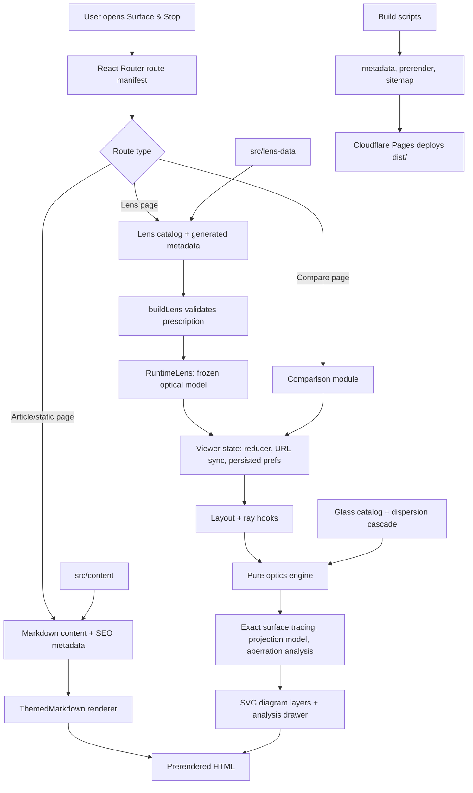

# LensVisualizer

LensVisualizer is a React + TypeScript optical design viewer for real camera lenses reconstructed from patent prescriptions. It renders 2D cross-sections, traces rays in real time, and exposes analysis tools for spherical aberration, a real 2D coma point cloud, meridional and sagittal coma, distortion, focus breathing, vignetting, lens-group movement, chromatic spread, chromatic field curvature, glass selection, and field curvature.

**Live app:** [surfaceandstop.com](https://surfaceandstop.com/)

Created by **Ron Buening**. For project background and methodology, see [About This Site](src/content/AboutSite.md).

## What The App Does

- Renders patent-derived lens cross-sections as inline SVG with real surface sag, aspheric overlays, and diagnostics that prevent hidden semi-diameter clipping artifacts
- Traces density-controlled on-axis, off-axis, and chromatic rays through the current focus, aperture, and zoom state
- Adds opt-in, URL-shareable tilt/shift visualization controls for supported perspective-control lenses
- Supports hidden/reference mirror fixtures with folded paths, annular apertures, tilted fold planes, side image planes,
  second-surface coating accents, and real-ray folded off-axis pupil/chief-ray geometry
- Shows analysis views for spherical aberration, a real 2D coma point cloud, meridional and sagittal coma, distortion, focus breathing, lens-group movement, vignetting, pupil aberration, chromatic field curvature, and aspheric surface deviation
- Includes Abbe-diagram and Petzval overlays, plus enlarged LCA visualization
- Provides infinite-resolution zoom and pan for inspecting fine lens details, with mouse wheel, drag, pinch-to-zoom, and keyboard shortcuts
- Supports shared-control side-by-side comparison between two lenses
- Offers lens-library filters and groupings by maker, focal length, patent year, mount, and image format
- Renders programmatic camera/lens mount interface diagrams (camera-side front and lens-side rear) on the mount pages, with a maker-page sidebar linking each maker's mounts
- Ships crawlable lens, maker, comparison, and article pages with SSR prerendering

## How It Works



## Current Scope

- `306` visible lens pages are currently published from [`src/lens-data/`](src/lens-data/)
- The catalog spans classic and modern designs from Canon, Carl Zeiss Jena, Carl Zeiss Oberkochen, Fujifilm,
  Hasselblad, Laowa, Leica, Minolta, Nikon, Olympus, Panasonic, Pentax, Ricoh, Schneider-Kreuznach, Sigma, Sony,
  Vivitar, and Voigtländer
- Lens pages pair interactive diagrams with long-form optical analysis markdown

The catalog is auto-registered from `src/lens-data/**/*.data.ts`, so the README no longer tries to maintain a hand-written per-lens table.

## Key Features

- **Interactive optical state**: focus, aperture, zoom, ray mode, ray density, chromatic channels, and comparison scale mode all update live
- **Exact surface tracing**: the tracer intersects spherical/aspheric sag surfaces directly
- **Projection-aware fisheyes**: equidistant and equisolid fisheye metadata use projection-native distortion references, vector/bounding-sphere chief-ray launches, and safe diagram bundle fields for lenses with extreme declared coverage
- **Perspective-control movement**: supported PC lenses expose signed SHIFT and TILT sliders that move the 2D lens/ray trace relative to a fixed image plane and round-trip through shared URLs
- **Mirror and folded-path fixtures**: hidden reference prescriptions exercise first-surface mirrors, Mangin-style second-surface mirrors, annular obstructions, tilted fold mirrors, automatic folded path selection, and non-default image planes; off-axis ray bundles solve against the generalized folded stop and image plane instead of using sequential refractive approximations, and the lens library can expose the fixtures with `?view=debug`
- **Lens-group movement**: focus and zoom sliders can open a URL-shareable overlay that stacks inferred lens groups vertically and charts each group center against the fixed focus plane
- **Analysis drawer**: dedicated tabs for summary, aberrations, coma, bokeh, distortion, breathing, vignetting, and pupils, including prepared-state first-order/current-aperture readouts, spherical aberration, a real 2D coma point cloud, meridional and sagittal coma fan plots, projection-aware bokeh footprints, separate parabasal and real-ray field curvature charts, isolated astigmatism split, optional chromatic (R/G/B) focus shifts inside the Aberrations tab, and entrance/exit pupil position shift vs field in the Pupils tab
- **Aspheric deviation inspector**: click any aspheric element to compare its surface profile against the base sphere or a least-squares best-fit sphere, with adjustable exaggeration and click-to-measure Δsag (mm or μm)
- **Spherical aberration model**: combines a dense real-ray transverse fan (22 pupil zones with finer sampling near the edge) at the solved best-focus plane with a true near-axis reference for the headline longitudinal SA diagnostic; symmetric +/- ray pairing prevents asymmetric clipping from biasing metrics
- **Distortion model**: iteratively solved chief rays correct for pupil aberration at wide field angles; 21-point sampling resolves moustache distortion transitions; 2D field grid uses a pre-computed pupil correction table; multi-bracket search handles non-monotonic image-height curves
- **Coma point-cloud preview**: traces a fixed circular pupil pattern with the skew-ray core and plots chief-ray-centered tangential and sagittal image heights directly in millimeters
- **Meridional coma model**: samples a dense off-axis ray fan across the current entrance pupil and reports the asymmetric image-plane span for the current focus, aperture, and zoom state; this detailed diagnostic is retained below the point-cloud preview
- **Sagittal coma model**: traces a sagittal pupil fan orthogonal to the meridional plane and reports the x-intercept spread, displayed in its own collapsible section below the meridional coma view
- **Chromatic field curvature**: per-wavelength (R/G/B) tangential and sagittal best-focus traces across the field, with a chromatic focus spread metric; displayed as a third chart inside the field curvature section
- **Chromatic analysis**: RGB axial/off-axis ray tracing, longitudinal chromatic spread, and enlarged LCA overlay
- **Glass inspection**: element metadata, Abbe-number plotting, APD tagging, and lens role annotations
- **Geometry validation**: shared rim-slope and cross-gap diagnostics keep lens element outlines clean and catch semi-diameter issues before they render as artifacts
- **SEO-friendly multipage app**: prerendered routes for lenses, makers, articles, comparison pages, and static content
- **Structured metadata**: WebSite, CollectionPage, ItemList, Article, TechArticle, and BreadcrumbList JSON-LD across the crawlable pages
- **Share previews**: reusable Open Graph/Twitter social card with `summary_large_image` metadata defaults
- **Freshness-aware sitemap**: build metadata tracks published and last-modified dates, and `sitemap.xml` emits per-route `lastmod` values
- **Zoom and pan**: infinite-resolution SVG zoom via viewBox manipulation, with mouse wheel, pointer drag, touch pinch-to-zoom, and keyboard shortcuts (+/- zoom, arrows pan, Escape cancel)
- **Responsive UI**: desktop side-by-side layouts, mobile view toggles, persistent preferences, and shareable deep links — URLs encode the selected element, glass map, LCA and Petzval overlays, lens-group movement overlay, analysis drawer + tab, and slider state including PC lens movement
- **Catalog metadata**: lens data can declare canonical mount ids and image-format ids for library filtering and future field-aware analysis
- **Mount interface diagrams**: programmatic camera-side and lens-side SVG diagrams of each camera mount (throat, bayonet lugs, lock pin, electrical contacts, mechanical couplings) on the `/mounts/:id` pages, with a feature-category legend, base/variant profiles, and a committed static reference set

## Tech Stack

- React 18
- TypeScript
- Vite 6
- React Router 7
- `react-helmet-async`
- `react-markdown` + `remark-gfm`
- Vitest + Testing Library
- ESLint + Prettier
- GitHub Actions for quality checks; Cloudflare Pages for production hosting

## Getting Started

```bash
npm install
npm run dev
```

The dev server runs at `http://localhost:5173`.

## Scripts

```bash
npm run dev           # Vite dev server with build metadata generation
npm run generate:metadata # Organize lens data and refresh generated route metadata
npm run organize:lens-data # Move stray root-level lens files into maker folders
npm run build         # Production build + prerender + sitemap
npm run preview       # Preview built output
npm run test          # Full Vitest suite
npm run test:coverage # Coverage run
npm run generate:glass-reports # Generated glass catalog reports
npm run generate:mirror-reports # Hidden mirror fixture authoring report
npm run generate:mount-svgs # Mount SVG specifications + per-view SVGs
npm run typecheck     # TypeScript checks
npm run lint          # ESLint
npm run lint:fix      # ESLint autofix
npm run format        # Prettier write
npm run format:check  # Prettier check
npm run seo:audit     # SEO audit over built output
```

Requires Node.js 24.15.0 or newer within the Node 24 LTS line.

## SEO Pipeline

- Route-level metadata is managed through [`src/components/SEOHead.tsx`](src/components/SEOHead.tsx), including canonical URLs, robots directives, social image tags, and JSON-LD payloads.
- Build metadata is generated before dev/build runs and tracks lens/article freshness for sitemap and structured-data use.
- Production builds prerender the crawlable routes, write a freshness-aware sitemap, and generate a real `404.html` with `noindex,follow`.
- [`public/branding/social-dark.png`](public/branding/social-dark.png) is the shared social preview asset used across public routes.
- `npm run seo:audit` validates the built output for metadata presence, sitemap coverage, route freshness, internal links, and 404 behavior.

## Project Structure

```text
src/
  comparison/  # Comparison mode state, shared sliders, layout, and URLs
  components/
    content/    # Article, archive, changelog, and TOC UI
    controls/   # Headers, toggles, sliders, shared control widgets
    diagram/    # SVG rendering, overlays, badges, annotations
    display/    # Analysis tabs, overlays, charts, inspectors, legends
    errors/     # Error boundaries and shared error display
    homepage/   # Hero section, recent lenses, nav cards, reusable home sections
    hooks/      # Computation and UI orchestration hooks
    layout/     # LensViewer, LensDiagramPanel, drawer, viewport, page chrome
    markdown/   # Shared article/description Markdown renderer
    mount/      # Mount interface diagram components (MountDiagram, panel)
  content/      # About pages and optics primers
  generated/    # Build-generated metadata and maker-prefix JSON
  lens-data/    # Lens prescriptions and accompanying analysis markdown
  mounts/       # Mount diagram *.mount.ts specs, schema, and authoring guide
  optics/       # Pure ray tracing, lens construction, projection, and analysis math
  pages/        # Route-level page components
  routes/       # Shared React Router manifest
  types/        # Shared optics, state, and theme types
  utils/        # Themes, URL sync, reducer state, catalog helpers
__tests__/      # Vitest coverage for optics, UI, routing, and state
scripts/        # Build metadata, prerender, sitemap, SEO audit
agent_docs/     # Developer-facing architecture and workflow notes
```

## Adding A Lens

1. Copy [`src/lens-data/TEMPLATE.data.ts.template`](src/lens-data/TEMPLATE.data.ts.template) to `src/lens-data/YourLens.data.ts`.
2. Fill in the prescription and metadata fields.
   Add `lensMounts` and `imageFormat` when the production mount/format is unambiguous. Only real perspective-control
   lenses should declare `perspectiveControl`; ordinary lenses omit it and get no SHIFT/TILT controls.
3. Optionally add `src/lens-data/YourLens.analysis.md` beside the data file for the description panel.
4. Run:

```bash
npm run typecheck && npm run format:check && npm run lint && npm run test
```

5. The catalog will pick the new lens up automatically through `import.meta.glob`.
6. `npm run generate:metadata` or `npm run build` will move the lens into its maker folder and rewrite the type import to match the nested path.

See [`src/lens-data/LENS_DATA_SPEC.md`](src/lens-data/LENS_DATA_SPEC.md) for the full data-file format, including glass identification conventions, canonical mount/format metadata, and hidden mirror fixture guidance. Run `npm run generate:mirror-reports` after changing hidden mirror/telescope fixtures. See [`src/lens-data/LENS_MOUNT_FORMAT_OPTIONS.md`](src/lens-data/LENS_MOUNT_FORMAT_OPTIONS.md) for the allowed mount and image-format ids. See [`src/lens-data/LENS_ANALYSIS_SPEC.md`](src/lens-data/LENS_ANALYSIS_SPEC.md) for the companion analysis-file standard (required sections, voice, conditional sections).


## Agent Reference Docs

- [`CLAUDE.md`](CLAUDE.md) is the canonical assistant-facing project guide.
- [`agents.md`](agents.md) mirrors `CLAUDE.md` so tools that prefer lowercase agent files read the same instructions.

## Documentation

- [Agent docs index](agent_docs/README.md)
- [Architecture notes](agent_docs/architecture.md)
- [Program flow diagram](agent_docs/architecture/program-flow.md)
- [Public functions](agent_docs/architecture/public-functions.md)
- [Routing/content architecture](agent_docs/architecture/routing-and-content.md)
- [Viewer/diagram architecture](agent_docs/architecture/viewer-and-diagram.md)
- [UI components architecture](agent_docs/architecture/ui-components.md)
- [Optics engine architecture](agent_docs/architecture/optics-engine.md)
- [Mount diagrams architecture](agent_docs/architecture/mount-diagrams.md)
- [State/utilities architecture](agent_docs/architecture/state-and-utilities.md)
- [Comparison architecture](agent_docs/architecture/comparison.md)
- [Testing architecture](agent_docs/architecture/testing.md)
- [Workflow guide](agent_docs/workflow.md)
- [Adding a lens](agent_docs/adding_a_lens.md)
- [Adding an article](agent_docs/adding_an_article.md)
- [Mount/format backfill](agent_docs/lens-mount-format-backfill.md)
- [Trace model and fisheye launch status](TRACE_MODEL_IMPROVEMENT_PLAN.md)
- [Mirror/folded optics accuracy status](MIRROR_OPTICS_ACCURACY_PLAN.md)
- [Mirror-lens follow-up backlog](MIRROR_LENS_FUTURE_ENHANCEMENTS.md)
- [Glass catalog buildout](agent_docs/glass-catalog-buildout.md)
- [Chromatic dispersion notes](CHROMATIC_DISPERSION_NOTES.md)
- [Commenting guide](agent_docs/commenting_guide.md)
- [Gotchas](agent_docs/gotchas.md)
- [Lens data format](src/lens-data/LENS_DATA_SPEC.md)
- [Lens mount/format options](src/lens-data/LENS_MOUNT_FORMAT_OPTIONS.md)
- [Mount SVG spec](src/mounts/MOUNT_SVG_SPEC.md)
- [Lens analysis format](src/lens-data/LENS_ANALYSIS_SPEC.md)
- [Optics primer](src/content/OpticsPrimerSimple.md)
- [Aberrations primer](src/content/AberrationsPrimerSimple.md)

## Contributing

Before opening a PR, run:

```bash
npm run build
npm run seo:audit
npm run typecheck
npm run format:check
npm run lint
npm run test
```

If you want to request a new lens, open a GitHub issue with the lens name and, ideally, a patent or prescription source.
