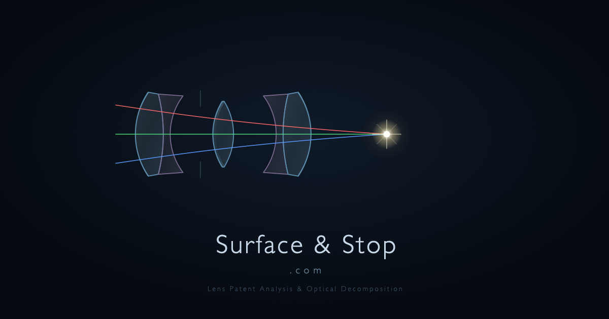

# Surface & Stop

[](https://github.com/ronbuening/LensVisualizer/actions/workflows/quality.yml)

Surface & Stop is an interactive reference for exploring the optical designs behind real camera lenses. It turns
patent-derived prescriptions into responsive SVG cross-sections, traces rays through the current optical state, and
provides analysis tools that make complex designs easier to inspect and compare.

LensVisualizer is the source repository for the site.

<p align="center">
  <a href="https://surfaceandstop.com/">
    
  </a>
</p>

<p align="center">
  <a href="https://surfaceandstop.com/"><strong>Open the live app</strong></a>
  ·
  <a href="https://surfaceandstop.com/lenses">Browse the lens library</a>
  ·
  <a href="https://surfaceandstop.com/articles/start-here">Read the beginner's guide</a>
</p>

## Start exploring

No installation is needed to use the site:

1. Open the [lens library](https://surfaceandstop.com/lenses) and choose a design.
2. Move the focus, aperture, and—when available—zoom controls to see the prescription update.
3. Select a glass element to inspect its surfaces, material data, and role.
4. Open **Aberrations & Distortions** for summary, chromatic, coma, bokeh, distortion, breathing, vignetting, and
   pupil views.
5. Copy the page URL to share the current lens and view state.

New to lens design? [Start Here](https://surfaceandstop.com/articles/start-here) introduces the viewer and links to
plain-language optics primers.

## Highlights

| Area | What Surface & Stop provides |
| --- | --- |
| Interactive diagrams | Inline SVG lens sections with real surface sag, element selection, zoom and pan, and responsive focus, aperture, and zoom state |
| Ray tracing | Exact spherical and aspheric surface intersections for on-axis, off-axis, and chromatic ray bundles |
| Optical analysis | First-order summaries plus spherical aberration, field curvature, coma, bokeh, distortion, focus breathing, vignetting, pupil, and chromatic diagnostics |
| Design comparison | Side-by-side lenses with shared controls and shareable comparison URLs |
| Catalog research | Browsing and filtering by maker, focal length, patent year, inventor, assignee, mount, and image format |
| Specialized systems | Projection-aware fisheyes, perspective-control movement, aspheric comparison, and reference models for folded or obstructed optical paths |
| Supporting references | Articles, optical primers, patent relationships, glass data, and programmatic camera/lens mount diagrams |

## Catalog and model scope

- `639` visible lens pages are currently published from [`src/lens-data/`](src/lens-data/).
- Lens and article content is auto-discovered; generated metadata keeps routes, search data, sitemap entries, and the
  catalog count in sync.
- The site is prerendered so lens, maker, inventor, patent, mount, format, comparison, and article pages remain
  crawlable and directly linkable.

The models are reconstructions of published patent embodiments. A patent may describe multiple examples, an
experimental design, or a prescription that differs from the final production lens. Analysis in the viewer is computed
from the published data and selected state; it is not a measurement of a physical sample or a substitute for laboratory
testing. Source metadata on each lens page is the best place to judge a model's provenance.

## Run it locally

### Prerequisites

- Node.js 24.15.0 or newer within the Node 24 release line
- npm

The repository includes [`.nvmrc`](.nvmrc) and [`.node-version`](.node-version) files for compatible version managers.

```bash
git clone https://github.com/ronbuening/LensVisualizer.git
cd LensVisualizer
nvm use # Optional: if you use nvm
npm ci
npm run dev
```

Open `http://localhost:5173`.

### Common commands

| Command | Purpose |
| --- | --- |
| `npm run dev` | Generate metadata and start the Vite development server |
| `npm run build` | Organize lens data, generate metadata, build, prerender, and create the sitemap |
| `npm run preview` | Preview the production build locally |
| `npm run typecheck` | Run strict TypeScript checks |
| `npm run lint` | Run ESLint |
| `npm run format:check` | Check formatting with Prettier |
| `npm run test` | Run the Vitest suite |
| `npm run seo:audit` | Audit the built site for metadata, links, sitemap coverage, and 404 behavior |

See [`package.json`](package.json) for specialized audit, report-generation, and benchmark commands.

## Architecture at a glance

The application uses React and TypeScript with a Vite build. A pure optics layer validates patent prescriptions,
prepares the current focus/zoom/aperture state, traces rays, and computes analysis data. React components render that
data as inline SVG and synchronize shareable state with the URL. The production build prerenders public routes and
generates the sitemap for deployment to Cloudflare Pages.

```text
src/
  components/  Viewer controls, SVG layers, charts, overlays, and page chrome
  content/     Public articles and optics primers
  lens-data/   Patent-derived prescriptions and lens analysis notes
  mounts/      Camera/lens mount diagram specifications
  optics/      Pure tracing, prescription, projection, and analysis code
  pages/       Route-level pages
  routes/      Shared client and prerender route manifest
  utils/       Catalog, metadata, SEO, state, URL, and theme helpers
scripts/       Metadata, build, prerender, sitemap, audit, and report tools
__tests__/     Optics, UI, routing, catalog, and build regression tests
```

For subsystem boundaries and program flow, see the [architecture index](agent_docs/architecture.md).

## Contributing

Bug reports, documentation fixes, lens corrections, and new prescriptions are welcome. Read
[`CONTRIBUTING.md`](CONTRIBUTING.md) for setup, quality checks, and the pull-request checklist.

- [Request a lens](https://github.com/ronbuening/LensVisualizer/issues/new?labels=new+lens&title=New%20Lens%3A%20&body=Patent%20%23%3A%20)
- [Report a bug or propose an improvement](https://github.com/ronbuening/LensVisualizer/issues/new)
- [Add a lens](agent_docs/adding_a_lens.md)

## Documentation

### For site visitors

- [Getting Started](https://surfaceandstop.com/articles/start-here)
- [About Surface & Stop](https://surfaceandstop.com/articles/about-site)
- [How Camera Lenses Work](https://surfaceandstop.com/articles/optics-primer)
- [Understanding Aberrations](https://surfaceandstop.com/articles/aberrations-primer)

### For contributors and maintainers

- [Contributor guide](CONTRIBUTING.md)
- [Security policy and vulnerability reporting](SECURITY.md)
- [Agent/developer docs index](agent_docs/README.md)
- [Lens data format](src/lens-data/LENS_DATA_SPEC.md)
- [Lens analysis format](src/lens-data/LENS_ANALYSIS_SPEC.md)
- [Mount diagram format](src/mounts/MOUNT_SVG_SPEC.md)
- [Project workflow](agent_docs/workflow.md)

Surface & Stop was created by [Ron Buening](https://ronbuening.com/).
