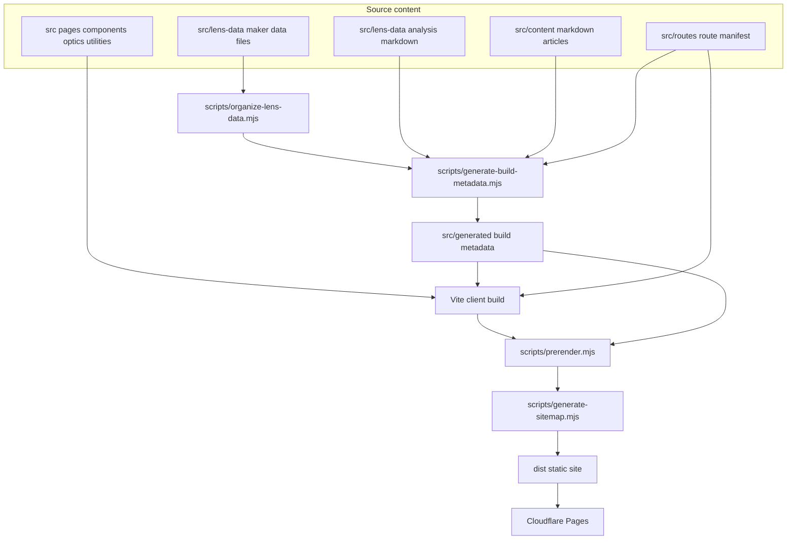
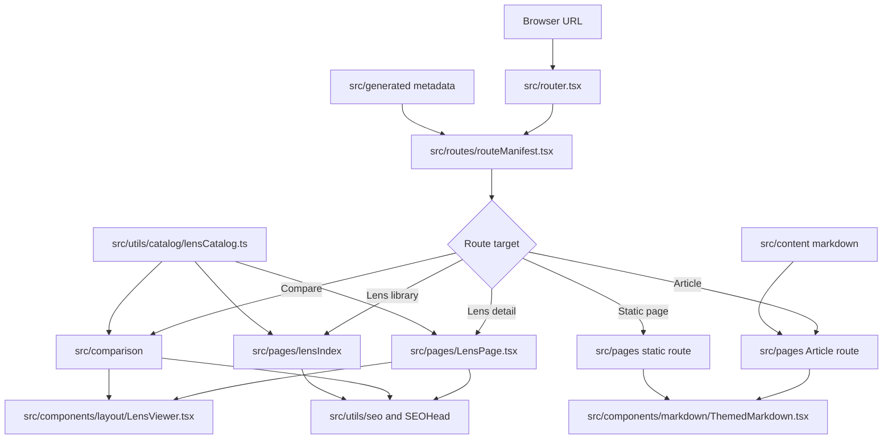
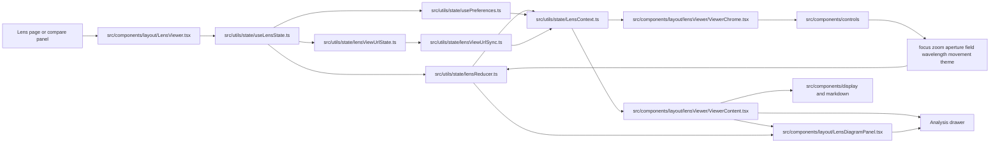
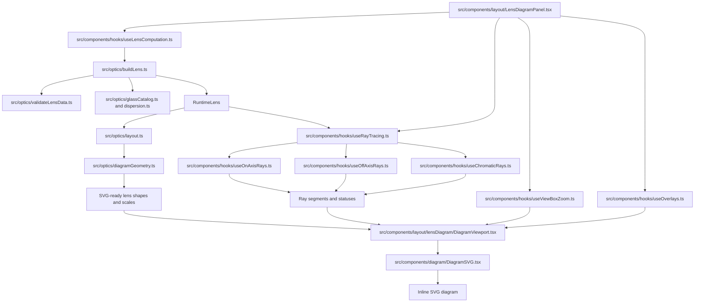
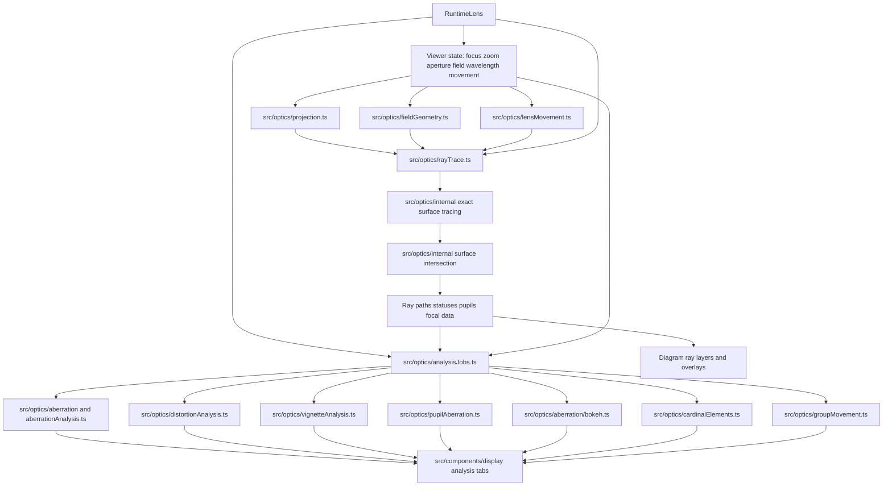
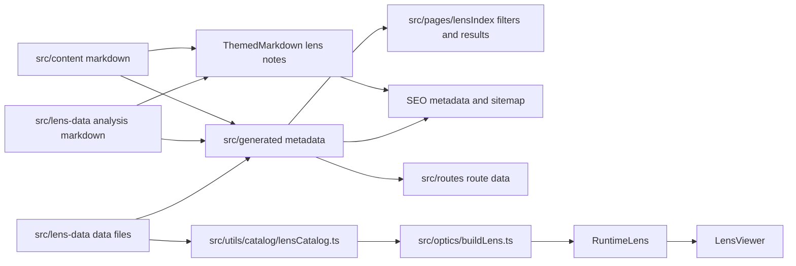

# Program Flow

High-level data and control flow for LensVisualizer. Use this as a map before jumping into the focused architecture docs.

## Build And Deploy Pipeline

The production site is static output from Vite plus prerendered route HTML. Cloudflare Pages serves the generated
`dist/` directory.

## Route And Page Shell

All user-facing pages pass through the shared route manifest. The route target decides whether the page renders a lens
viewer, comparison view, index page, article, or static content page.

## Lens Viewer Runtime

`LensViewer` owns the interactive session around one runtime lens. Controls dispatch state updates, URL sync preserves
shareable view state, and the diagram panel recomputes derived optical output from the current state.

## Diagram Computation

The diagram is still SVG-only. Hook output is assembled into layers, then `DiagramSVG` renders lens geometry, stops,
rays, overlays, labels, error tiers, and analysis affordances.

## Optics And Analysis Engine

Most optical code is pure and receives the runtime lens object plus current viewer state. Analysis tabs should compute
from slider state at render time instead of caching slider-dependent results in `buildLens()`.

## Catalog And Content Feedback Loops

Lens data and markdown content are auto-discovered. Generated metadata feeds route listings and SEO, while runtime lens
construction validates prescription details and glass identifiers when a viewer needs the lens.

