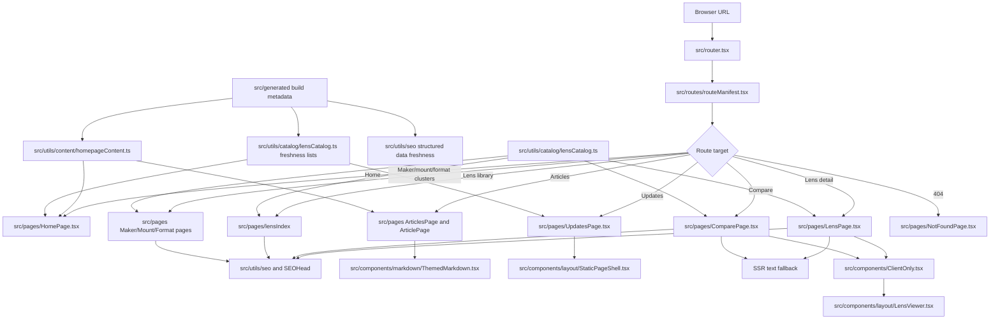
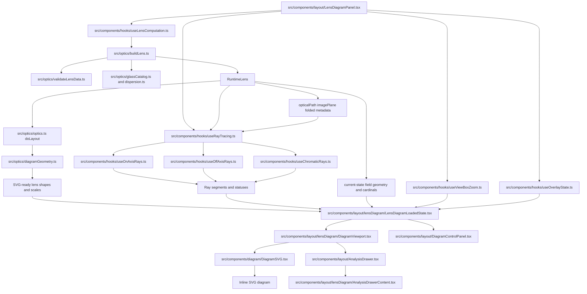
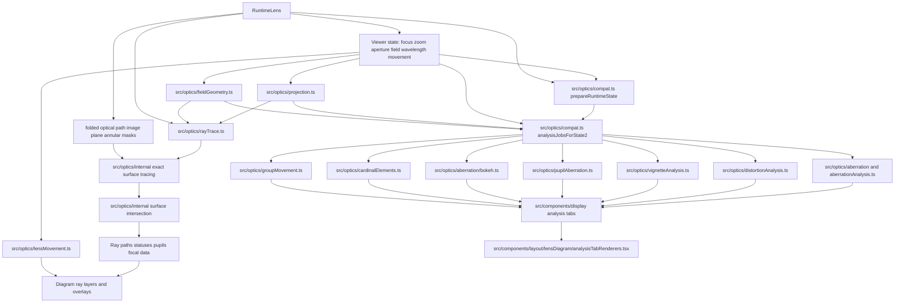

# Program Flow

High-level data and control flow for LensVisualizer. Use this as a map before jumping into the focused architecture
docs: the build/deploy pipeline and content registries are described in `routing-and-content.md`, viewer wiring in
`viewer-and-diagram.md`, and the engine in `optics-engine.md`.

## Route And Page Shell

All user-facing pages pass through the shared route manifest. Lens and compare routes render SEO-friendly fallback
content during SSR, then `ClientOnly` mounts the interactive viewer after hydration.

```mermaid
flowchart TD
  Browser[Browser URL] --> Router[src/router.tsx]
  Router --> Manifest[src/routes/routeManifest.tsx]
  Manifest --> Target{Route target}

  Target -->|Home| HomePage[src/pages/HomePage.tsx]
  Target -->|Lens detail| LensPage[src/pages/LensPage.tsx]
  Target -->|Compare| ComparePage[src/pages/ComparePage.tsx]
  Target -->|Lens library| IndexPage[src/pages/lensIndex]
  Target -->|Maker/mount/format clusters| ClusterPages[src/pages Maker/Mount/Format pages]
  Target -->|Articles| ArticleRoutes[src/pages ArticlesPage and ArticlePage]
  Target -->|Updates| UpdatesPage[src/pages/UpdatesPage.tsx]
  Target -->|404| NotFound[src/pages/NotFoundPage.tsx]

  Generated[src/generated build metadata] --> ContentRegistry[src/utils/content/homepageContent.ts]
  Generated --> Freshness[src/utils/seo structured data freshness]
  Generated --> RecentLensData[src/utils/catalog/lensCatalog.ts freshness lists]
  Catalog[src/utils/catalog/lensCatalog.ts] --> LensPage
  Catalog --> ComparePage
  Catalog --> IndexPage
  Catalog --> ClusterPages
  ContentRegistry --> HomePage
  ContentRegistry --> ArticleRoutes
  RecentLensData --> HomePage
  RecentLensData --> UpdatesPage

  LensPage --> SEO[src/utils/seo and SEOHead]
  ComparePage --> SEO
  IndexPage --> SEO
  ClusterPages --> SEO
  ArticleRoutes --> Markdown[src/components/markdown/ThemedMarkdown.tsx]
  UpdatesPage --> StaticShell[src/components/layout/StaticPageShell.tsx]

  LensPage --> Fallback[SSR text fallback]
  ComparePage --> Fallback
  LensPage --> ClientOnly[src/components/ClientOnly.tsx]
  ComparePage --> ClientOnly
  ClientOnly --> Viewer[src/components/layout/LensViewer.tsx]
```

## Diagram Computation

The diagram is SVG-only. Hook output is assembled into layers, then `DiagramSVG` renders lens geometry, stops, rays,
overlays, labels, error tiers, and analysis affordances.

```mermaid
flowchart TD
  Panel[src/components/layout/LensDiagramPanel.tsx] --> Compute[src/components/hooks/useLensComputation.ts]
  Panel --> Trace[src/components/hooks/useRayTracing.ts]
  Panel --> Zoom[src/components/hooks/useViewBoxZoom.ts]
  Panel --> PanelOverlays[src/components/hooks/useOverlayState.ts]

  Compute --> BuildLens[src/optics/buildLens.ts]
  BuildLens --> Validate[src/optics/validateLensData.ts]
  BuildLens --> Glass[src/optics/glassCatalog.ts and dispersion.ts]
  BuildLens --> Runtime[RuntimeLens]
  Runtime --> Path[opticalPath imagePlane folded metadata]
  Runtime --> Layout[src/optics/optics.ts doLayout]
  Layout --> Geometry[src/optics/diagramGeometry.ts]
  Geometry --> Shapes[SVG-ready lens shapes and scales]
  Runtime --> FieldGeometry[current-state field geometry and cardinals]

  Runtime --> Trace
  Path --> Trace
  Trace --> OnAxis[src/components/hooks/useOnAxisRays.ts]
  Trace --> OffAxis[src/components/hooks/useOffAxisRays.ts]
  Trace --> Chromatic[src/components/hooks/useChromaticRays.ts]
  OnAxis --> Segments[Ray segments and statuses]
  OffAxis --> Segments
  Chromatic --> Segments

  Shapes --> Loaded[src/components/layout/lensDiagram/LensDiagramLoadedState.tsx]
  Segments --> Loaded
  FieldGeometry --> Loaded
  Zoom --> Loaded
  PanelOverlays --> Loaded
  Loaded --> Viewport[src/components/layout/lensDiagram/DiagramViewport.tsx]
  Loaded --> ControlPanel[src/components/layout/DiagramControlPanel.tsx]
  Viewport --> DiagramSVG[src/components/diagram/DiagramSVG.tsx]
  Viewport --> AnalysisDrawer[src/components/layout/AnalysisDrawer.tsx]
  AnalysisDrawer --> AnalysisContent[src/components/layout/lensDiagram/AnalysisDrawerContent.tsx]
  DiagramSVG --> Output[Inline SVG diagram]
```

## Optics And Analysis Engine

Most optical code is pure and receives the runtime lens object plus current viewer state. Analysis tabs compute from
slider state at render time instead of caching slider-dependent results in `buildLens()`.

```mermaid
flowchart TD
  Runtime[RuntimeLens] --> Inputs[Viewer state: focus zoom aperture field wavelength movement]
  Inputs --> Projection[src/optics/projection.ts]
  Inputs --> Field[src/optics/fieldGeometry.ts]
  Inputs --> Movement[src/optics/lensMovement.ts]
  Inputs --> Prepared[src/optics/compat.ts prepareRuntimeState]
  Runtime --> Prepared

  Projection --> TraceCore[src/optics/rayTrace.ts]
  Field --> TraceCore
  Runtime --> TraceCore
  TraceCore --> Exact[src/optics/internal exact surface tracing]
  Exact --> Intersections[src/optics/internal surface intersection]
  Runtime --> Folded[folded optical path image plane annular masks]
  Folded --> Exact
  Intersections --> RayResults[Ray paths statuses pupils focal data]

  Prepared --> AnalysisJobs[src/optics/compat.ts analysisJobsForState2]
  Inputs --> AnalysisJobs
  Projection --> AnalysisJobs
  Field --> AnalysisJobs
  AnalysisJobs --> Aberrations[src/optics/aberration and aberrationAnalysis.ts]
  AnalysisJobs --> Distortion[src/optics/distortionAnalysis.ts]
  AnalysisJobs --> Vignetting[src/optics/vignetteAnalysis.ts]
  AnalysisJobs --> Pupils[src/optics/pupilAberration.ts]
  AnalysisJobs --> Bokeh[src/optics/aberration/bokeh.ts]
  AnalysisJobs --> Cardinal[src/optics/cardinalElements.ts]
  AnalysisJobs --> Groups[src/optics/groupMovement.ts]

  Aberrations & Distortion & Vignetting & Pupils & Bokeh & Cardinal & Groups --> DrawerTabs[src/components/display analysis tabs]
  RayResults --> DiagramLayers[Diagram ray layers and overlays]
  Movement --> DiagramLayers
  DrawerTabs --> Renderers[src/components/layout/lensDiagram/analysisTabRenderers.tsx]
```
