# src/benchmarks

This folder optics/rendering benchmark helpers that exercise runtime viewer paths outside normal app rendering.

Generated `readme.md` and `improvementsuggestions.md` files are intentionally omitted from the per-file inventory so this document stays focused on source relationships.

## Relationship Diagram

```mermaid
flowchart LR
  subgraph n_src_benchmarks["src/benchmarks"]
    n_src_benchmarks_src_benchmarks_benchmarkReport_ts["benchmarkReport.ts"]
    n_src_benchmarks_src_benchmarks_opticsRenderingBenchmark_tsx["opticsRenderingBenchmark.tsx"]
  end
  n_external_src_components_display["src/components/display"]
  n_external_src_components_hooks["src/components/hooks"]
  n_external_src_optics_compat_ts["src/optics/compat.ts"]
  n_external_src_optics_optics_ts["src/optics/optics.ts"]
  n_external_src_types["src/types"]
  n_external_pkg_react["pkg:react"]
  n_external_pkg_react_dom["pkg:react-dom"]
  n_external_src_components_diagram["src/components/diagram"]
  n_external_src_optics_analysis["src/optics/analysis"]
  n_external_src_optics_buildLens_ts["src/optics/buildLens.ts"]
  n_external_src_optics_cardinalElements_ts["src/optics/cardinalElements.ts"]
  n_external_src_optics_diagramGeometry_ts["src/optics/diagramGeometry.ts"]
  n_external_src_optics_raySampling_ts["src/optics/raySampling.ts"]
  n_external_src_optics_types_ts["src/optics/types.ts"]
  n_external_src_utils_catalog["src/utils/catalog"]
  n_external_src_utils_perfProbe_ts["src/utils/perfProbe.ts"]
  n_external_src_utils_theme["src/utils/theme"]
  n_src_benchmarks_src_benchmarks_opticsRenderingBenchmark_tsx --> |8| n_external_src_components_display
  n_src_benchmarks_src_benchmarks_opticsRenderingBenchmark_tsx --> |4| n_external_src_components_hooks
  n_src_benchmarks_src_benchmarks_opticsRenderingBenchmark_tsx --> |2| n_external_src_optics_compat_ts
  n_src_benchmarks_src_benchmarks_opticsRenderingBenchmark_tsx --> |2| n_external_src_optics_optics_ts
  n_src_benchmarks_src_benchmarks_opticsRenderingBenchmark_tsx --> |2| n_external_src_types
  n_src_benchmarks_src_benchmarks_opticsRenderingBenchmark_tsx --> |2| n_src_benchmarks_src_benchmarks_benchmarkReport_ts
  n_src_benchmarks_src_benchmarks_opticsRenderingBenchmark_tsx --> n_external_pkg_react
  n_src_benchmarks_src_benchmarks_opticsRenderingBenchmark_tsx --> n_external_pkg_react_dom
  n_src_benchmarks_src_benchmarks_opticsRenderingBenchmark_tsx --> n_external_src_components_diagram
  n_src_benchmarks_src_benchmarks_opticsRenderingBenchmark_tsx --> n_external_src_optics_analysis
  n_src_benchmarks_src_benchmarks_opticsRenderingBenchmark_tsx --> n_external_src_optics_buildLens_ts
  n_src_benchmarks_src_benchmarks_opticsRenderingBenchmark_tsx --> n_external_src_optics_cardinalElements_ts
  n_src_benchmarks_src_benchmarks_opticsRenderingBenchmark_tsx --> n_external_src_optics_diagramGeometry_ts
  n_src_benchmarks_src_benchmarks_opticsRenderingBenchmark_tsx --> n_external_src_optics_raySampling_ts
  n_src_benchmarks_src_benchmarks_opticsRenderingBenchmark_tsx --> n_external_src_optics_types_ts
  n_src_benchmarks_src_benchmarks_opticsRenderingBenchmark_tsx --> n_external_src_utils_catalog
  n_src_benchmarks_src_benchmarks_opticsRenderingBenchmark_tsx --> n_external_src_utils_perfProbe_ts
  n_src_benchmarks_src_benchmarks_opticsRenderingBenchmark_tsx --> n_external_src_utils_theme
```

## Directory Overview

- Direct source files: 2
- Direct subfolders: 0
- Main outbound areas: src/components/display (8), src/components/hooks (4), same folder (2), src/optics/compat.ts (2), src/optics/optics.ts (2), src/types (2), package:react, package:react-dom, +10 more
- External consumers: none

## Files

| File | Role | Imports from | Imported by | Exports |
| --- | --- | --- | --- | --- |
| `benchmarkReport.ts` | Benchmark Report helper module | none | same folder | BENCHMARK_SCHEMA_VERSION, BenchmarkStatus, MainBenchmarkCategory, LegacyMainBenchmarkCategory, AnalysisBenchmarkCategory, NumericSummary, BenchmarkStats, BenchmarkEntry, +13 more |
| `opticsRenderingBenchmark.tsx` | React component module | src/components/display (8), src/components/hooks (4), same folder (2), src/optics/compat.ts (2), src/optics/optics.ts (2), +13 more | none | buildBenchmarkReport, formatRunFileName, OpticsRenderingBenchmarkOptions, runOpticsRenderingBenchmark |

