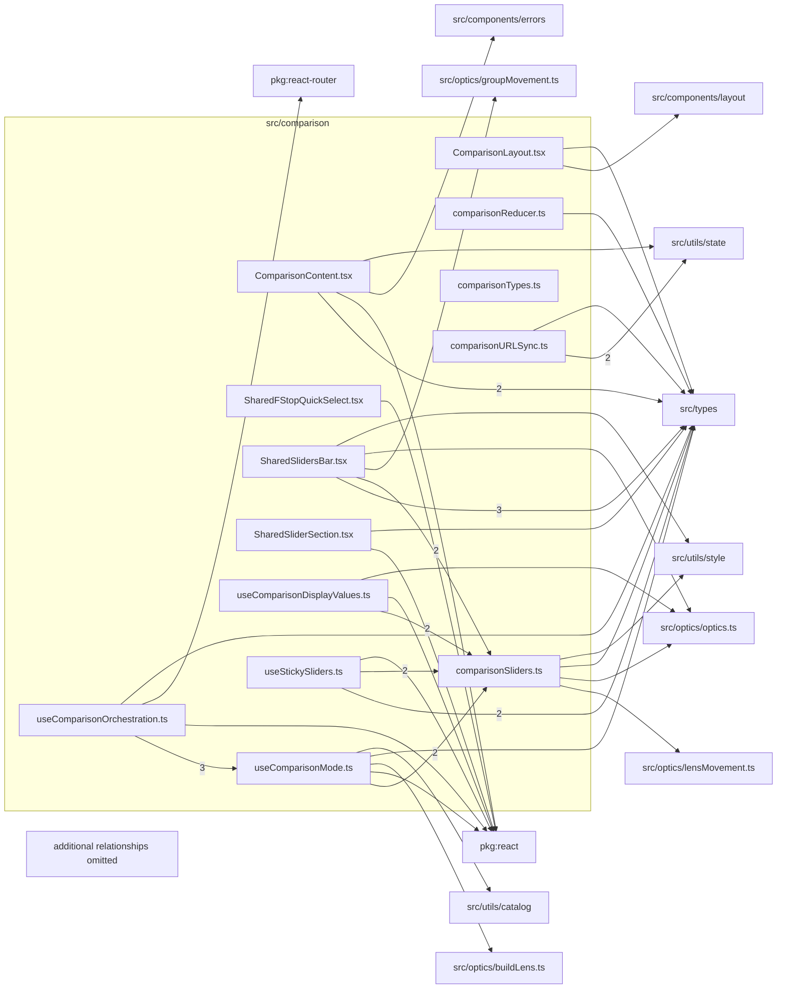

# src/comparison

This folder comparison-mode state, shared sliders, URL metadata, and two-lens layout composition.

Generated `readme.md` and `improvementsuggestions.md` files are intentionally omitted from the per-file inventory so this document stays focused on source relationships.

## Relationship Diagram

## Directory Overview

- Direct source files: 13
- Direct subfolders: 0
- Main outbound areas: same folder (26), src/types (14), package:react (7), src/optics/optics.ts (3), src/utils/state (3), src/utils/style (3), package:react-router, src/components/errors, +5 more
- External consumers: src/components/layout, src/pages/ComparePage.tsx, src/types, src/utils/catalog, src/utils/state

## Files

| File | Role | Imports from | Imported by | Exports |
| --- | --- | --- | --- | --- |
| `ComparisonContent.tsx` | React component module | same folder (6), src/types (2), package:react, src/components/errors, src/utils/state | src/components/layout | default, ComparisonContent |
| `ComparisonLayout.tsx` | React component module | same folder (2), src/components/layout, src/types | same folder | default, ComparisonLayout |
| `comparisonReducer.ts` | Comparison Reducer module with default export | src/types | same folder (3), src/utils/state | SET_SCALE_MODE, SET_SHARED_FOCUS_T, SET_SHARED_STOPDOWN_T, SET_SHARED_ZOOM_T, SET_SHARED_SHIFT_MM, SET_SHARED_TILT_DEG, ENTER_COMPARE, EXIT_COMPARE, +2 more |
| `comparisonSliders.ts` | Comparison Sliders helper module | src/optics/lensMovement.ts, src/optics/optics.ts, src/types, src/utils/style | same folder (7), src/components/layout | FocusPairResult, AperturePairResult, ZoomPairResult, MovementPairResult, computeFocusPair, computeAperturePair, formatSharedFocusDist, sharedFNumber, +3 more |
| `comparisonTypes.ts` | Comparison Types helper module | none | src/types | SharedSlidersSlice, ComparisonAction |
| `comparisonURLSync.ts` | Comparison URLSync helper module | src/utils/state (2), src/types | src/pages/ComparePage.tsx, src/utils/catalog, src/utils/state | buildComparePath, comparePageTitle, comparePageDescription, compareCanonicalURL |
| `SharedFStopQuickSelect.tsx` | React component module | package:react | same folder | default, SharedFStopQuickSelect |
| `SharedSlidersBar.tsx` | React component module | same folder (4), src/types (3), src/optics/groupMovement.ts, src/optics/optics.ts, src/utils/style | same folder | default, SharedSlidersBar |
| `SharedSliderSection.tsx` | React component module | package:react, src/types, src/utils/style | same folder | default, SharedSliderSection |
| `useComparisonDisplayValues.ts` | React hook module | same folder (3), package:react, src/optics/optics.ts | same folder | default, useComparisonDisplayValues |
| `useComparisonMode.ts` | React hook module | same folder (2), package:react, src/optics/buildLens.ts, src/types, src/utils/catalog | same folder (4), src/components/layout | ComparisonLensesOk, ComparisonLensesResult, isComparisonOk, default, useComparisonMode |
| `useComparisonOrchestration.ts` | React hook module | same folder (6), package:react, package:react-router, src/types | src/components/layout | isComparisonOk, ComparisonLensesResult, ComparisonOrchestration, default, useComparisonOrchestration |
| `useStickySliders.ts` | React hook module | same folder (3), src/types (2), package:react | same folder | default, useStickySliders |

