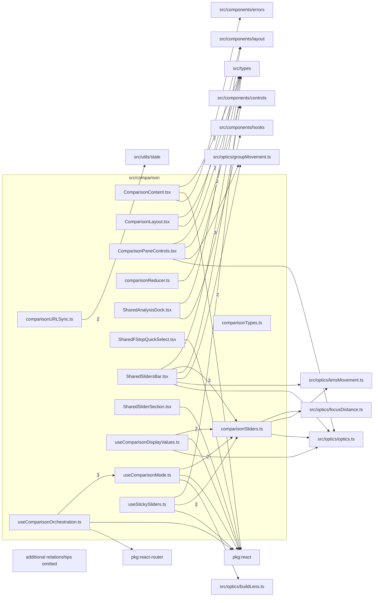

# src/comparison

This folder comparison-mode state, shared sliders, URL metadata, and two-lens layout composition.

Generated `readme.md` and `improvementsuggestions.md` files are intentionally omitted from the per-file inventory so this document stays focused on source relationships.

## Relationship Diagram

```mermaid
flowchart LR
  subgraph n_src_comparison["src/comparison"]
    n_src_comparison_src_comparison_ComparisonContent_tsx["ComparisonContent.tsx"]
    n_src_comparison_src_comparison_ComparisonLayout_tsx["ComparisonLayout.tsx"]
    n_src_comparison_src_comparison_ComparisonPaneControls_tsx["ComparisonPaneControls.tsx"]
    n_src_comparison_src_comparison_comparisonReducer_ts["comparisonReducer.ts"]
    n_src_comparison_src_comparison_comparisonSliders_ts["comparisonSliders.ts"]
    n_src_comparison_src_comparison_comparisonTypes_ts["comparisonTypes.ts"]
    n_src_comparison_src_comparison_comparisonURLSync_ts["comparisonURLSync.ts"]
    n_src_comparison_src_comparison_SharedAnalysisDock_tsx["SharedAnalysisDock.tsx"]
    n_src_comparison_src_comparison_SharedFStopQuickSelect_tsx["SharedFStopQuickSelect.tsx"]
    n_src_comparison_src_comparison_SharedSlidersBar_tsx["SharedSlidersBar.tsx"]
    n_src_comparison_src_comparison_SharedSliderSection_tsx["SharedSliderSection.tsx"]
    n_src_comparison_src_comparison_useComparisonDisplayValues_ts["useComparisonDisplayValues.ts"]
    n_src_comparison_src_comparison_useComparisonMode_ts["useComparisonMode.ts"]
    n_src_comparison_src_comparison_useComparisonOrchestration_ts["useComparisonOrchestration.ts"]
    n_src_comparison_src_comparison_useStickySliders_ts["useStickySliders.ts"]
  end
  n_external_src_types["src/types"]
  n_external_src_components_layout["src/components/layout"]
  n_external_src_utils_state["src/utils/state"]
  n_external_pkg_react["pkg:react"]
  n_external_pkg_react_router["pkg:react-router"]
  n_external_src_components_controls["src/components/controls"]
  n_external_src_components_errors["src/components/errors"]
  n_external_src_components_hooks["src/components/hooks"]
  n_external_src_optics_buildLens_ts["src/optics/buildLens.ts"]
  n_external_src_optics_focusDistance_ts["src/optics/focusDistance.ts"]
  n_external_src_optics_groupMovement_ts["src/optics/groupMovement.ts"]
  n_external_src_optics_lensMovement_ts["src/optics/lensMovement.ts"]
  n_external_src_optics_optics_ts["src/optics/optics.ts"]
  n_src_comparison_src_comparison_SharedSlidersBar_tsx --> |3| n_external_src_types
  n_src_comparison_src_comparison_useComparisonOrchestration_ts --> |3| n_src_comparison_src_comparison_useComparisonMode_ts
  n_src_comparison_src_comparison_SharedAnalysisDock_tsx --> |2| n_external_src_components_layout
  n_src_comparison_src_comparison_ComparisonContent_tsx --> |2| n_external_src_types
  n_src_comparison_src_comparison_ComparisonLayout_tsx --> |2| n_external_src_types
  n_src_comparison_src_comparison_ComparisonPaneControls_tsx --> |2| n_external_src_types
  n_src_comparison_src_comparison_useStickySliders_ts --> |2| n_external_src_types
  n_src_comparison_src_comparison_comparisonURLSync_ts --> |2| n_external_src_utils_state
  n_src_comparison_src_comparison_SharedSlidersBar_tsx --> |2| n_src_comparison_src_comparison_comparisonSliders_ts
  n_src_comparison_src_comparison_useComparisonDisplayValues_ts --> |2| n_src_comparison_src_comparison_comparisonSliders_ts
  n_src_comparison_src_comparison_useComparisonMode_ts --> |2| n_src_comparison_src_comparison_comparisonSliders_ts
  n_src_comparison_src_comparison_useStickySliders_ts --> |2| n_src_comparison_src_comparison_comparisonSliders_ts
  n_src_comparison_src_comparison_ComparisonContent_tsx --> n_external_pkg_react
  n_src_comparison_src_comparison_SharedFStopQuickSelect_tsx --> n_external_pkg_react
  n_src_comparison_src_comparison_SharedSliderSection_tsx --> n_external_pkg_react
  n_src_comparison_src_comparison_useComparisonDisplayValues_ts --> n_external_pkg_react
  n_src_comparison_src_comparison_useComparisonMode_ts --> n_external_pkg_react
  n_src_comparison_src_comparison_useComparisonOrchestration_ts --> n_external_pkg_react
  n_src_comparison_src_comparison_useStickySliders_ts --> n_external_pkg_react
  n_src_comparison_src_comparison_useComparisonOrchestration_ts --> n_external_pkg_react_router
  n_src_comparison_src_comparison_ComparisonPaneControls_tsx --> n_external_src_components_controls
  n_src_comparison_src_comparison_SharedSlidersBar_tsx --> n_external_src_components_controls
  n_src_comparison_src_comparison_ComparisonContent_tsx --> n_external_src_components_errors
  n_src_comparison_src_comparison_SharedAnalysisDock_tsx --> n_external_src_components_hooks
  n_src_comparison_src_comparison_ComparisonLayout_tsx --> n_external_src_components_layout
  n_src_comparison_src_comparison_useComparisonMode_ts --> n_external_src_optics_buildLens_ts
  n_src_comparison_src_comparison_comparisonSliders_ts --> n_external_src_optics_focusDistance_ts
  n_src_comparison_src_comparison_ComparisonPaneControls_tsx --> n_external_src_optics_groupMovement_ts
  n_src_comparison_src_comparison_SharedSlidersBar_tsx --> n_external_src_optics_groupMovement_ts
  n_src_comparison_src_comparison_comparisonSliders_ts --> n_external_src_optics_lensMovement_ts
  n_src_comparison_src_comparison_SharedSlidersBar_tsx --> n_external_src_optics_lensMovement_ts
  n_src_comparison_src_comparison_ComparisonPaneControls_tsx --> n_external_src_optics_optics_ts
  n_src_comparison_src_comparison_comparisonSliders_ts --> n_external_src_optics_optics_ts
  n_src_comparison_src_comparison_SharedSlidersBar_tsx --> n_external_src_optics_optics_ts
  n_src_comparison_src_comparison_useComparisonDisplayValues_ts --> n_external_src_optics_optics_ts
  n_src_comparison_src_comparison_comparisonReducer_ts --> n_external_src_types
  n_src_comparison_truncated["additional relationships omitted"]
```

## Directory Overview

- Direct source files: 15
- Direct subfolders: 0
- Main outbound areas: same folder (34), src/types (19), package:react (7), src/optics/optics.ts (4), src/utils/state (4), src/components/layout (3), src/utils/style (3), src/components/controls (2), +9 more
- External consumers: src/components/layout, src/pages/ComparePage.tsx, src/types, src/utils/catalog, src/utils/state

## Files

| File | Role | Imports from | Imported by | Exports |
| --- | --- | --- | --- | --- |
| `ComparisonContent.tsx` | React component module | same folder (8), src/types (2), package:react, src/components/errors, src/utils/state | src/components/layout | default, ComparisonContent |
| `ComparisonLayout.tsx` | React component module | same folder (4), src/types (2), src/components/layout | same folder | default, ComparisonLayout |
| `ComparisonPaneControls.tsx` | React component module | src/types (2), same folder, src/components/controls, src/optics/groupMovement.ts, src/optics/optics.ts | same folder | default, ComparisonPaneControls |
| `comparisonReducer.ts` | Comparison Reducer module with default export | same folder, src/types | same folder (3), src/utils/state | SELECT_PANE_SOURCE_STATE, SET_COMPARISON_FOCUS_ZOOM, SET_PANE_COORDINATES, SET_SCALE_MODE, SET_SHARED_FOCUS_T, SET_SHARED_STOPDOWN_T, SET_SHARED_ZOOM_T, SET_SHARED_SHIFT_MM, +5 more |
| `comparisonSliders.ts` | Comparison Sliders helper module | same folder, src/optics/focusDistance.ts, src/optics/lensMovement.ts, src/optics/optics.ts, src/types, +1 more | same folder (7), src/components/layout | FocusPairResult, AperturePairResult, ZoomPairResult, MovementPairResult, computeFocusPair, computeAperturePair, formatSharedFocusDist, sharedFNumber, +4 more |
| `comparisonTypes.ts` | Comparison Types helper module | src/types | same folder (6), src/components/layout, src/types | PaneCoordinates, ComparisonPositions, ComparisonFocusZoomState, SharedSlidersSlice, ComparisonAction |
| `comparisonURLSync.ts` | Comparison URLSync helper module | src/utils/state (2), src/types, src/utils/seo | src/pages/ComparePage.tsx, src/utils/catalog, src/utils/state | buildComparePath, comparePageTitle, comparePageDescription, compareCanonicalURL |
| `SharedAnalysisDock.tsx` | React component module | src/components/layout (2), src/components/hooks, src/types, src/utils/state | same folder | default, SharedAnalysisDock |
| `SharedFStopQuickSelect.tsx` | React component module | package:react | same folder | default, SharedFStopQuickSelect |
| `SharedSlidersBar.tsx` | React component module | same folder (4), src/types (3), src/components/controls, src/optics/groupMovement.ts, src/optics/lensMovement.ts, +2 more | same folder | default, SharedSlidersBar |
| `SharedSliderSection.tsx` | React component module | package:react, src/types, src/utils/style | same folder | default, SharedSliderSection |
| `useComparisonDisplayValues.ts` | React hook module | same folder (3), package:react, src/optics/optics.ts | same folder | default, useComparisonDisplayValues |
| `useComparisonMode.ts` | React hook module | same folder (3), package:react, src/optics/buildLens.ts, src/types, src/utils/catalog | same folder (4), src/components/layout | ComparisonLensesOk, ComparisonLensesResult, isComparisonOk, default, useComparisonMode |
| `useComparisonOrchestration.ts` | React hook module | same folder (6), package:react, package:react-router, src/types, src/utils/seo | src/components/layout | isComparisonOk, ComparisonLensesResult, ComparisonOrchestration, default, useComparisonOrchestration |
| `useStickySliders.ts` | React hook module | same folder (3), src/types (2), package:react | same folder | default, useStickySliders |
