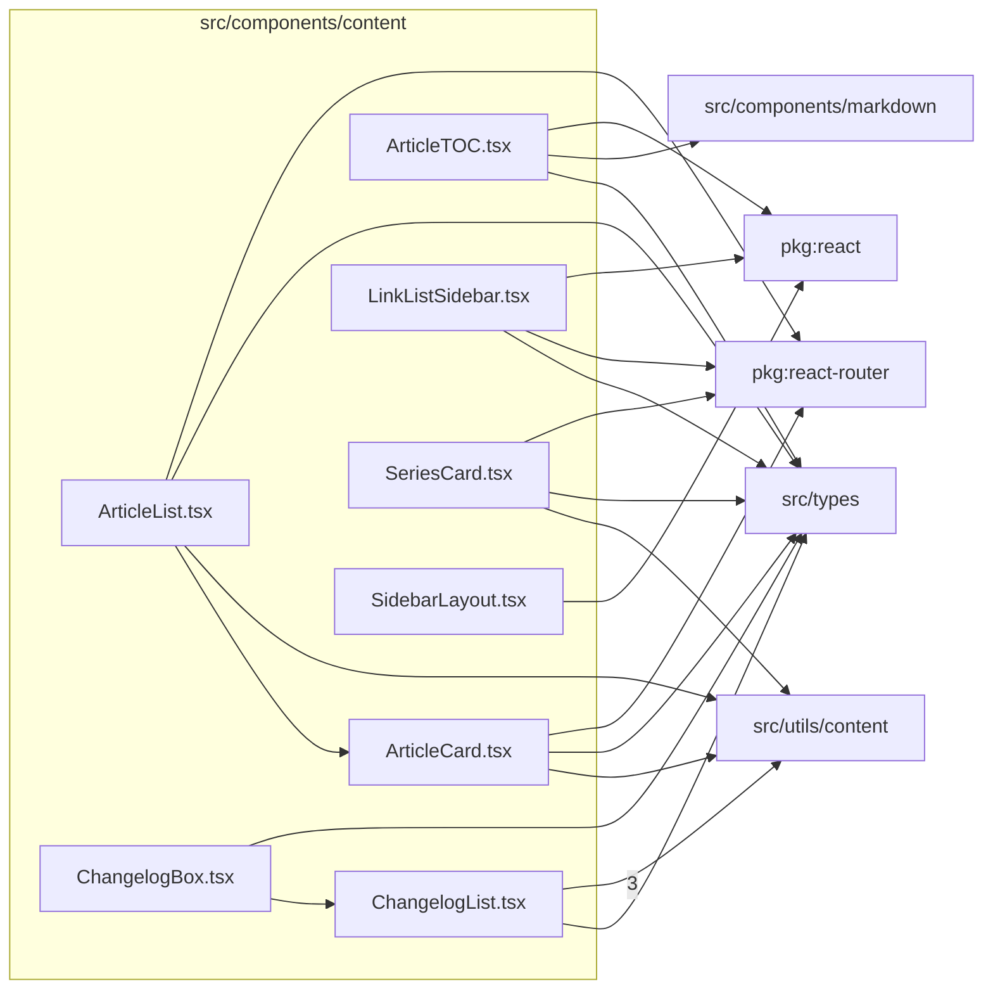

# src/components/content

This folder content-listing UI used by article, changelog, sidebar, and archive routes.

Generated `readme.md` and `improvementsuggestions.md` files are intentionally omitted from the per-file inventory so this document stays focused on source relationships.

## Relationship Diagram

## Directory Overview

- Direct source files: 8
- Direct subfolders: 0
- Main outbound areas: src/types (7), src/utils/content (6), package:react-router (4), package:react (3), same folder (2), src/components/markdown
- External consumers: src/pages/ArticlePage.tsx, src/pages/ArticlesPage.tsx, src/pages/HomePage.tsx, src/pages/LensIndexPage.tsx, src/pages/MakerPage.tsx, src/pages/MountPage.tsx, src/pages/UpdatesPage.tsx

## Files

| File | Role | Imports from | Imported by | Exports |
| --- | --- | --- | --- | --- |
| `ArticleCard.tsx` | React component module | package:react-router, src/types, src/utils/content | same folder, src/pages/ArticlesPage.tsx | default, ArticleCard |
| `ArticleList.tsx` | React component module | package:react-router, same folder, src/types, src/utils/content | src/pages/HomePage.tsx | default, ArticleList |
| `ArticleTOC.tsx` | React component module | package:react, src/components/markdown, src/types | src/pages/ArticlePage.tsx | TOCHeading, ArticleTOCProps, ARTICLE_SCROLL_MARGIN_TOP, TOC_OBSERVER_THRESHOLDS, TOC_OBSERVER_BOTTOM_ROOT_MARGIN, extractTOCHeadings, resolveActiveHeadingId, default, +1 more |
| `ChangelogBox.tsx` | React component module | same folder, src/types | none | default, ChangelogBox |
| `ChangelogList.tsx` | React component module | src/utils/content (3), src/types | same folder, src/pages/UpdatesPage.tsx | default, ChangelogList |
| `LinkListSidebar.tsx` | React component module | package:react, package:react-router, src/types | src/pages/LensIndexPage.tsx, src/pages/MakerPage.tsx, src/pages/MountPage.tsx | LinkListSidebarItem, default, LinkListSidebar |
| `SeriesCard.tsx` | React component module | package:react-router, src/types, src/utils/content | src/pages/ArticlesPage.tsx | default, SeriesCard |
| `SidebarLayout.tsx` | React component module | package:react | src/pages/LensIndexPage.tsx, src/pages/MakerPage.tsx, src/pages/MountPage.tsx | default, SidebarLayout |

