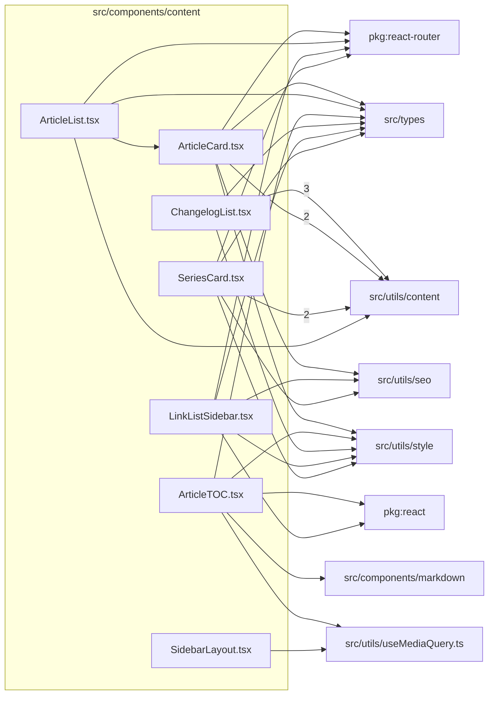

# src/components/content

This folder content-listing UI used by article, changelog, sidebar, and archive routes.

Generated `readme.md` and `improvementsuggestions.md` files are intentionally omitted from the per-file inventory so this document stays focused on source relationships.

## Relationship Diagram

```mermaid
flowchart LR
  subgraph n_src_components_content["src/components/content"]
    n_src_components_content_src_components_content_ArticleCard_tsx["ArticleCard.tsx"]
    n_src_components_content_src_components_content_ArticleList_tsx["ArticleList.tsx"]
    n_src_components_content_src_components_content_ArticleTOC_tsx["ArticleTOC.tsx"]
    n_src_components_content_src_components_content_ChangelogList_tsx["ChangelogList.tsx"]
    n_src_components_content_src_components_content_LinkListSidebar_tsx["LinkListSidebar.tsx"]
    n_src_components_content_src_components_content_SeriesCard_tsx["SeriesCard.tsx"]
    n_src_components_content_src_components_content_SidebarLayout_tsx["SidebarLayout.tsx"]
  end
  n_external_src_utils_content["src/utils/content"]
  n_external_pkg_react["pkg:react"]
  n_external_pkg_react_router["pkg:react-router"]
  n_external_src_components_markdown["src/components/markdown"]
  n_external_src_types["src/types"]
  n_external_src_utils_seo["src/utils/seo"]
  n_external_src_utils_style["src/utils/style"]
  n_external_src_utils_useMediaQuery_ts["src/utils/useMediaQuery.ts"]
  n_src_components_content_src_components_content_ChangelogList_tsx --> |3| n_external_src_utils_content
  n_src_components_content_src_components_content_ArticleCard_tsx --> |2| n_external_src_utils_content
  n_src_components_content_src_components_content_SeriesCard_tsx --> |2| n_external_src_utils_content
  n_src_components_content_src_components_content_ArticleTOC_tsx --> n_external_pkg_react
  n_src_components_content_src_components_content_LinkListSidebar_tsx --> n_external_pkg_react
  n_src_components_content_src_components_content_ArticleCard_tsx --> n_external_pkg_react_router
  n_src_components_content_src_components_content_ArticleList_tsx --> n_external_pkg_react_router
  n_src_components_content_src_components_content_LinkListSidebar_tsx --> n_external_pkg_react_router
  n_src_components_content_src_components_content_SeriesCard_tsx --> n_external_pkg_react_router
  n_src_components_content_src_components_content_ArticleTOC_tsx --> n_external_src_components_markdown
  n_src_components_content_src_components_content_ArticleCard_tsx --> n_external_src_types
  n_src_components_content_src_components_content_ArticleList_tsx --> n_external_src_types
  n_src_components_content_src_components_content_ArticleTOC_tsx --> n_external_src_types
  n_src_components_content_src_components_content_ChangelogList_tsx --> n_external_src_types
  n_src_components_content_src_components_content_LinkListSidebar_tsx --> n_external_src_types
  n_src_components_content_src_components_content_SeriesCard_tsx --> n_external_src_types
  n_src_components_content_src_components_content_ArticleList_tsx --> n_external_src_utils_content
  n_src_components_content_src_components_content_ArticleCard_tsx --> n_external_src_utils_seo
  n_src_components_content_src_components_content_LinkListSidebar_tsx --> n_external_src_utils_seo
  n_src_components_content_src_components_content_SeriesCard_tsx --> n_external_src_utils_seo
  n_src_components_content_src_components_content_ArticleCard_tsx --> n_external_src_utils_style
  n_src_components_content_src_components_content_ArticleTOC_tsx --> n_external_src_utils_style
  n_src_components_content_src_components_content_ChangelogList_tsx --> n_external_src_utils_style
  n_src_components_content_src_components_content_LinkListSidebar_tsx --> n_external_src_utils_style
  n_src_components_content_src_components_content_SeriesCard_tsx --> n_external_src_utils_style
  n_src_components_content_src_components_content_ArticleTOC_tsx --> n_external_src_utils_useMediaQuery_ts
  n_src_components_content_src_components_content_SidebarLayout_tsx --> n_external_src_utils_useMediaQuery_ts
  n_src_components_content_src_components_content_ArticleList_tsx --> n_src_components_content_src_components_content_ArticleCard_tsx
```

## Directory Overview

- Direct source files: 7
- Direct subfolders: 0
- Main outbound areas: src/utils/content (8), src/types (6), src/utils/style (5), package:react-router (4), src/utils/seo (3), package:react (2), src/utils/useMediaQuery.ts (2), same folder, +1 more
- External consumers: src/pages/ArticlePage.tsx, src/pages/ArticlesPage.tsx, src/pages/AuthorPage.tsx, src/pages/HomePage.tsx, src/pages/LensIndexPage.tsx, src/pages/MakerPage.tsx, src/pages/MountPage.tsx, src/pages/PatentsIndexPage.tsx, +1 more

## Files

| File | Role | Imports from | Imported by | Exports |
| --- | --- | --- | --- | --- |
| `ArticleCard.tsx` | React component module | src/utils/content (2), package:react-router, src/types, src/utils/seo, src/utils/style | same folder, src/pages/ArticlesPage.tsx | TAG_COLORS, default, ArticleCard |
| `ArticleList.tsx` | React component module | package:react-router, same folder, src/types, src/utils/content | src/pages/HomePage.tsx | default, ArticleList |
| `ArticleTOC.tsx` | React component module | package:react, src/components/markdown, src/types, src/utils/style, src/utils/useMediaQuery.ts | src/pages/ArticlePage.tsx | TOCHeading, ArticleTOCProps, ARTICLE_SCROLL_MARGIN_TOP, TOC_OBSERVER_THRESHOLDS, TOC_OBSERVER_BOTTOM_ROOT_MARGIN, extractTOCHeadings, resolveActiveHeadingId, default, +1 more |
| `ChangelogList.tsx` | React component module | src/utils/content (3), src/types, src/utils/style | src/pages/UpdatesPage.tsx | default, ChangelogList |
| `LinkListSidebar.tsx` | React component module | package:react, package:react-router, src/types, src/utils/seo, src/utils/style | src/pages/AuthorPage.tsx, src/pages/LensIndexPage.tsx, src/pages/MakerPage.tsx, src/pages/MountPage.tsx, src/pages/PatentsIndexPage.tsx | LinkListSidebarItem, default, LinkListSidebar |
| `SeriesCard.tsx` | React component module | src/utils/content (2), package:react-router, src/types, src/utils/seo, src/utils/style | src/pages/ArticlesPage.tsx | default, SeriesCard |
| `SidebarLayout.tsx` | React component module | src/utils/useMediaQuery.ts | src/pages/AuthorPage.tsx, src/pages/LensIndexPage.tsx, src/pages/MakerPage.tsx, src/pages/MountPage.tsx, src/pages/PatentsIndexPage.tsx | default, SidebarLayout |
