# src/components/controls

This folder shared viewer controls for sliders, toggles, diagram headers, selectors, and tooltips.

Generated `readme.md` and `improvementsuggestions.md` files are intentionally omitted from the per-file inventory so this document stays focused on source relationships.

## Relationship Diagram

```mermaid
flowchart LR
  subgraph n_src_components_controls["src/components/controls"]
    n_src_components_controls_src_components_controls_CardinalControls_tsx["CardinalControls.tsx"]
    n_src_components_controls_src_components_controls_ChromaticControls_tsx["ChromaticControls.tsx"]
    n_src_components_controls_src_components_controls_CollapseButton_tsx["CollapseButton.tsx"]
    n_src_components_controls_src_components_controls_DiagramControls_tsx["DiagramControls.tsx"]
    n_src_components_controls_src_components_controls_DiagramHeader_tsx["DiagramHeader.tsx"]
    n_src_components_controls_src_components_controls_HelpTooltipButton_tsx["HelpTooltipButton.tsx"]
    n_src_components_controls_src_components_controls_LensSelector_tsx["LensSelector.tsx"]
    n_src_components_controls_src_components_controls_RayToggles_tsx["RayToggles.tsx"]
    n_src_components_controls_src_components_controls_SliderControl_tsx["SliderControl.tsx"]
  end
  n_external_src_types["src/types"]
  n_external_pkg_react["pkg:react"]
  n_external_pkg_react_dom["pkg:react-dom"]
  n_external_src_components_hooks["src/components/hooks"]
  n_external_src_components_layout["src/components/layout"]
  n_external_src_optics_chromatic["src/optics/chromatic"]
  n_external_src_optics_groupMovement_ts["src/optics/groupMovement.ts"]
  n_external_src_optics_lensMovement_ts["src/optics/lensMovement.ts"]
  n_external_src_optics_optics_ts["src/optics/optics.ts"]
  n_external_src_optics_projection_ts["src/optics/projection.ts"]
  n_external_src_utils_featureFlags_ts["src/utils/featureFlags.ts"]
  n_external_src_utils_style["src/utils/style"]
  n_src_components_controls_src_components_controls_DiagramControls_tsx --> |3| n_external_src_types
  n_src_components_controls_src_components_controls_DiagramHeader_tsx --> |3| n_external_src_types
  n_src_components_controls_src_components_controls_ChromaticControls_tsx --> |2| n_external_src_types
  n_src_components_controls_src_components_controls_RayToggles_tsx --> |2| n_external_src_types
  n_src_components_controls_src_components_controls_CollapseButton_tsx --> n_external_pkg_react
  n_src_components_controls_src_components_controls_DiagramControls_tsx --> n_external_pkg_react
  n_src_components_controls_src_components_controls_DiagramHeader_tsx --> n_external_pkg_react
  n_src_components_controls_src_components_controls_HelpTooltipButton_tsx --> n_external_pkg_react
  n_src_components_controls_src_components_controls_LensSelector_tsx --> n_external_pkg_react
  n_src_components_controls_src_components_controls_RayToggles_tsx --> n_external_pkg_react
  n_src_components_controls_src_components_controls_SliderControl_tsx --> n_external_pkg_react
  n_src_components_controls_src_components_controls_HelpTooltipButton_tsx --> n_external_pkg_react_dom
  n_src_components_controls_src_components_controls_DiagramControls_tsx --> n_external_src_components_hooks
  n_src_components_controls_src_components_controls_LensSelector_tsx --> n_external_src_components_layout
  n_src_components_controls_src_components_controls_ChromaticControls_tsx --> n_external_src_optics_chromatic
  n_src_components_controls_src_components_controls_DiagramControls_tsx --> n_external_src_optics_groupMovement_ts
  n_src_components_controls_src_components_controls_DiagramControls_tsx --> n_external_src_optics_lensMovement_ts
  n_src_components_controls_src_components_controls_DiagramControls_tsx --> n_external_src_optics_optics_ts
  n_src_components_controls_src_components_controls_DiagramHeader_tsx --> n_external_src_optics_optics_ts
  n_src_components_controls_src_components_controls_DiagramControls_tsx --> n_external_src_optics_projection_ts
  n_src_components_controls_src_components_controls_DiagramHeader_tsx --> n_external_src_optics_projection_ts
  n_src_components_controls_src_components_controls_CardinalControls_tsx --> n_external_src_types
  n_src_components_controls_src_components_controls_CollapseButton_tsx --> n_external_src_types
  n_src_components_controls_src_components_controls_HelpTooltipButton_tsx --> n_external_src_types
  n_src_components_controls_src_components_controls_LensSelector_tsx --> n_external_src_types
  n_src_components_controls_src_components_controls_SliderControl_tsx --> n_external_src_types
  n_src_components_controls_src_components_controls_DiagramHeader_tsx --> n_external_src_utils_featureFlags_ts
  n_src_components_controls_src_components_controls_RayToggles_tsx --> n_external_src_utils_featureFlags_ts
  n_src_components_controls_src_components_controls_CardinalControls_tsx --> n_external_src_utils_style
  n_src_components_controls_src_components_controls_ChromaticControls_tsx --> n_external_src_utils_style
  n_src_components_controls_src_components_controls_CollapseButton_tsx --> n_external_src_utils_style
  n_src_components_controls_src_components_controls_DiagramControls_tsx --> n_external_src_utils_style
  n_src_components_controls_src_components_controls_DiagramHeader_tsx --> n_external_src_utils_style
  n_src_components_controls_src_components_controls_LensSelector_tsx --> n_external_src_utils_style
  n_src_components_controls_src_components_controls_RayToggles_tsx --> n_external_src_utils_style
  n_src_components_controls_src_components_controls_SliderControl_tsx --> n_external_src_utils_style
  n_src_components_controls_truncated["additional relationships omitted"]
```

## Directory Overview

- Direct source files: 9
- Direct subfolders: 0
- Main outbound areas: src/types (15), src/utils/style (8), package:react (7), same folder (6), src/optics/optics.ts (2), src/optics/projection.ts (2), src/utils/featureFlags.ts (2), package:react-dom, +5 more
- External consumers: src/components/display, src/components/layout

## Files

| File | Role | Imports from | Imported by | Exports |
| --- | --- | --- | --- | --- |
| `CardinalControls.tsx` | React component module | src/types, src/utils/style | src/components/layout (2), same folder | default, CardinalControls |
| `ChromaticControls.tsx` | React component module | src/types (2), src/optics/chromatic, src/utils/style | same folder | default, ChromaticControls |
| `CollapseButton.tsx` | React component module | package:react, src/types, src/utils/style | same folder (2), src/components/display (2) | default, CollapseButton |
| `DiagramControls.tsx` | React component module | src/types (3), package:react, same folder, src/components/hooks, src/optics/groupMovement.ts, +4 more | src/components/layout | default, DiagramControls |
| `DiagramHeader.tsx` | React component module | same folder (4), src/types (3), package:react, src/optics/optics.ts, src/optics/projection.ts, +2 more | src/components/layout | default |
| `HelpTooltipButton.tsx` | React component module | package:react, package:react-dom, src/types | src/components/display | default, HelpTooltipButton |
| `LensSelector.tsx` | React component module | package:react, src/components/layout, src/types, src/utils/style | src/components/layout | default, LensSelector |
| `RayToggles.tsx` | React component module | src/types (2), package:react, src/utils/featureFlags.ts, src/utils/style | same folder | default, RayToggles |
| `SliderControl.tsx` | React component module | package:react, same folder, src/types, src/utils/style | same folder | default, SliderControl |

