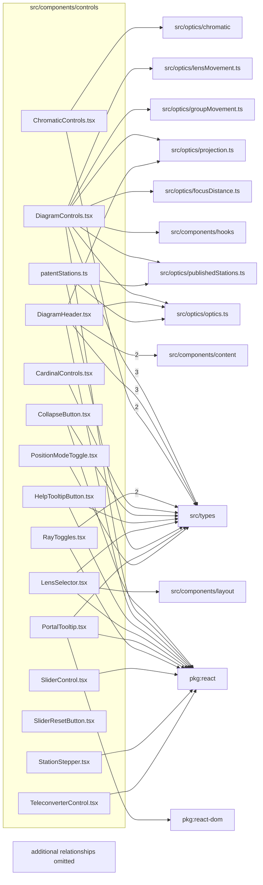

# src/components/controls

This folder shared viewer controls for sliders, toggles, diagram headers, selectors, and tooltips.

Generated `readme.md` and `improvementsuggestions.md` files are intentionally omitted from the per-file inventory so this document stays focused on source relationships.

## Relationship Diagram

```mermaid
flowchart LR
  subgraph n_src_components_controls["src/components/controls"]
    n_src_components_controls_src_components_controls_CardinalControls_tsx["CardinalControls.tsx"]
    n_src_components_controls_src_components_controls_ChromaticControls_tsx["ChromaticControls.tsx"]
    n_src_components_controls_src_components_controls_CollapseButton_tsx["CollapseButton.tsx"]
    n_src_components_controls_src_components_controls_DiagramControls_tsx["DiagramControls.tsx"]
    n_src_components_controls_src_components_controls_DiagramHeader_tsx["DiagramHeader.tsx"]
    n_src_components_controls_src_components_controls_HelpTooltipButton_tsx["HelpTooltipButton.tsx"]
    n_src_components_controls_src_components_controls_LensSelector_tsx["LensSelector.tsx"]
    n_src_components_controls_src_components_controls_patentStations_ts["patentStations.ts"]
    n_src_components_controls_src_components_controls_PortalTooltip_tsx["PortalTooltip.tsx"]
    n_src_components_controls_src_components_controls_PositionModeToggle_tsx["PositionModeToggle.tsx"]
    n_src_components_controls_src_components_controls_RayToggles_tsx["RayToggles.tsx"]
    n_src_components_controls_src_components_controls_SliderControl_tsx["SliderControl.tsx"]
    n_src_components_controls_src_components_controls_SliderResetButton_tsx["SliderResetButton.tsx"]
    n_src_components_controls_src_components_controls_StationStepper_tsx["StationStepper.tsx"]
    n_src_components_controls_src_components_controls_TeleconverterControl_tsx["TeleconverterControl.tsx"]
  end
  n_external_src_types["src/types"]
  n_external_src_components_content["src/components/content"]
  n_external_pkg_react["pkg:react"]
  n_external_pkg_react_dom["pkg:react-dom"]
  n_external_src_components_hooks["src/components/hooks"]
  n_external_src_components_layout["src/components/layout"]
  n_external_src_optics_chromatic["src/optics/chromatic"]
  n_external_src_optics_focusDistance_ts["src/optics/focusDistance.ts"]
  n_external_src_optics_groupMovement_ts["src/optics/groupMovement.ts"]
  n_external_src_optics_lensMovement_ts["src/optics/lensMovement.ts"]
  n_external_src_optics_optics_ts["src/optics/optics.ts"]
  n_external_src_optics_projection_ts["src/optics/projection.ts"]
  n_external_src_optics_publishedStations_ts["src/optics/publishedStations.ts"]
  n_src_components_controls_src_components_controls_DiagramControls_tsx --> |3| n_external_src_types
  n_src_components_controls_src_components_controls_DiagramHeader_tsx --> |3| n_external_src_types
  n_src_components_controls_src_components_controls_DiagramHeader_tsx --> |2| n_external_src_components_content
  n_src_components_controls_src_components_controls_ChromaticControls_tsx --> |2| n_external_src_types
  n_src_components_controls_src_components_controls_RayToggles_tsx --> |2| n_external_src_types
  n_src_components_controls_src_components_controls_CollapseButton_tsx --> n_external_pkg_react
  n_src_components_controls_src_components_controls_DiagramControls_tsx --> n_external_pkg_react
  n_src_components_controls_src_components_controls_DiagramHeader_tsx --> n_external_pkg_react
  n_src_components_controls_src_components_controls_HelpTooltipButton_tsx --> n_external_pkg_react
  n_src_components_controls_src_components_controls_LensSelector_tsx --> n_external_pkg_react
  n_src_components_controls_src_components_controls_PortalTooltip_tsx --> n_external_pkg_react
  n_src_components_controls_src_components_controls_RayToggles_tsx --> n_external_pkg_react
  n_src_components_controls_src_components_controls_SliderControl_tsx --> n_external_pkg_react
  n_src_components_controls_src_components_controls_StationStepper_tsx --> n_external_pkg_react
  n_src_components_controls_src_components_controls_TeleconverterControl_tsx --> n_external_pkg_react
  n_src_components_controls_src_components_controls_PortalTooltip_tsx --> n_external_pkg_react_dom
  n_src_components_controls_src_components_controls_DiagramControls_tsx --> n_external_src_components_hooks
  n_src_components_controls_src_components_controls_LensSelector_tsx --> n_external_src_components_layout
  n_src_components_controls_src_components_controls_ChromaticControls_tsx --> n_external_src_optics_chromatic
  n_src_components_controls_src_components_controls_DiagramControls_tsx --> n_external_src_optics_focusDistance_ts
  n_src_components_controls_src_components_controls_DiagramControls_tsx --> n_external_src_optics_groupMovement_ts
  n_src_components_controls_src_components_controls_DiagramControls_tsx --> n_external_src_optics_lensMovement_ts
  n_src_components_controls_src_components_controls_DiagramControls_tsx --> n_external_src_optics_optics_ts
  n_src_components_controls_src_components_controls_DiagramHeader_tsx --> n_external_src_optics_optics_ts
  n_src_components_controls_src_components_controls_patentStations_ts --> n_external_src_optics_optics_ts
  n_src_components_controls_src_components_controls_DiagramControls_tsx --> n_external_src_optics_projection_ts
  n_src_components_controls_src_components_controls_DiagramHeader_tsx --> n_external_src_optics_projection_ts
  n_src_components_controls_src_components_controls_DiagramControls_tsx --> n_external_src_optics_publishedStations_ts
  n_src_components_controls_src_components_controls_patentStations_ts --> n_external_src_optics_publishedStations_ts
  n_src_components_controls_src_components_controls_CardinalControls_tsx --> n_external_src_types
  n_src_components_controls_src_components_controls_CollapseButton_tsx --> n_external_src_types
  n_src_components_controls_src_components_controls_HelpTooltipButton_tsx --> n_external_src_types
  n_src_components_controls_src_components_controls_LensSelector_tsx --> n_external_src_types
  n_src_components_controls_src_components_controls_patentStations_ts --> n_external_src_types
  n_src_components_controls_src_components_controls_PortalTooltip_tsx --> n_external_src_types
  n_src_components_controls_src_components_controls_PositionModeToggle_tsx --> n_external_src_types
  n_src_components_controls_truncated["additional relationships omitted"]
```

## Directory Overview

- Direct source files: 15
- Direct subfolders: 0
- Main outbound areas: src/types (21), same folder (12), src/utils/style (11), package:react (10), src/optics/optics.ts (3), src/components/content (2), src/optics/projection.ts (2), src/optics/publishedStations.ts (2), +9 more
- External consumers: src/comparison, src/components/display, src/components/layout, src/pages/AuthorsIndexPage.tsx

## Files

| File | Role | Imports from | Imported by | Exports |
| --- | --- | --- | --- | --- |
| `CardinalControls.tsx` | React component module | src/types, src/utils/style | src/components/layout (2), same folder | default, CardinalControls |
| `ChromaticControls.tsx` | React component module | src/types (2), src/optics/chromatic, src/utils/style | same folder | default, ChromaticControls |
| `CollapseButton.tsx` | React component module | package:react, src/types, src/utils/style | same folder (2), src/components/display (2) | default, CollapseButton |
| `DiagramControls.tsx` | React component module | same folder (4), src/types (3), package:react, src/components/hooks, src/optics/focusDistance.ts, +6 more | src/components/layout | default, DiagramControls |
| `DiagramHeader.tsx` | React component module | same folder (4), src/types (3), src/components/content (2), package:react, src/optics/optics.ts, +4 more | src/components/layout | default |
| `HelpTooltipButton.tsx` | React component module | package:react, same folder, src/types | src/components/display (2) | default, HelpTooltipButton |
| `LensSelector.tsx` | React component module | package:react, src/components/layout, src/types, src/utils/style | same folder, src/components/layout, src/pages/AuthorsIndexPage.tsx | default, LensSelector |
| `patentStations.ts` | Patent Stations helper module | same folder, src/optics/optics.ts, src/optics/publishedStations.ts, src/types | same folder | zoomStationOptions, focusStationOptions, focusTAfterZoomStep, PatentStationNotes, patentStationNotes |
| `PortalTooltip.tsx` | React component module | package:react, package:react-dom, src/types | same folder, src/components/display, src/components/layout | default, PortalTooltip |
| `PositionModeToggle.tsx` | React component module | src/types, src/utils/style | src/components/layout | default, PositionModeToggle |
| `RayToggles.tsx` | React component module | src/types (2), package:react, src/utils/featureFlags.ts, src/utils/style | same folder | default, RayToggles |
| `SliderControl.tsx` | React component module | package:react, same folder, src/types, src/utils/style | same folder | default, SliderControl |
| `SliderResetButton.tsx` | React component module | src/types | same folder, src/comparison | default, SliderResetButton |
| `StationStepper.tsx` | React component module | package:react, src/types, src/utils/style | same folder (2) | StationOption, MAX_STATION_BUTTONS, default, StationStepper |
| `TeleconverterControl.tsx` | React component module | package:react, same folder, src/types, src/utils/catalog, src/utils/style | src/components/layout | default, TeleconverterControl |
