# src/components/diagram

This folder inline SVG diagram layers and overlays for optical geometry, rays, pupils, MTF, chromatic widgets, and labels.

Generated `readme.md` and `improvementsuggestions.md` files are intentionally omitted from the per-file inventory so this document stays focused on source relationships.

## Relationship Diagram

```mermaid
flowchart LR
  subgraph n_src_components_diagram["src/components/diagram"]
    n_src_components_diagram_src_components_diagram_ApertureStop_tsx["ApertureStop.tsx"]
    n_src_components_diagram_src_components_diagram_CardinalElementsOverlay_tsx["CardinalElementsOverlay.tsx"]
    n_src_components_diagram_src_components_diagram_ChromaticFanSpreadWidget_tsx["ChromaticFanSpreadWidget.tsx"]
    n_src_components_diagram_src_components_diagram_ChromaticOverlayContent_tsx["ChromaticOverlayContent.tsx"]
    n_src_components_diagram_src_components_diagram_ChromaticQualityBadge_tsx["ChromaticQualityBadge.tsx"]
    n_src_components_diagram_src_components_diagram_DiagramDefs_tsx["DiagramDefs.tsx"]
    n_src_components_diagram_src_components_diagram_DiagramElementLayer_tsx["DiagramElementLayer.tsx"]
    n_src_components_diagram_src_components_diagram_DiagramGridAxisLayer_tsx["DiagramGridAxisLayer.tsx"]
    n_src_components_diagram_src_components_diagram_DiagramOverlayLayer_tsx["DiagramOverlayLayer.tsx"]
    n_src_components_diagram_src_components_diagram_DiagramRayLayers_tsx["DiagramRayLayers.tsx"]
    n_src_components_diagram_src_components_diagram_DiagramSVG_tsx["DiagramSVG.tsx"]
    n_src_components_diagram_src_components_diagram_diagramSvgTypes_ts["diagramSvgTypes.ts"]
    n_src_components_diagram_src_components_diagram_ElementAnnotations_tsx["ElementAnnotations.tsx"]
    n_src_components_diagram_src_components_diagram_EntrancePupilDiagram_tsx["EntrancePupilDiagram.tsx"]
    n_src_components_diagram_src_components_diagram_ExitPupilDiagram_tsx["ExitPupilDiagram.tsx"]
    n_src_components_diagram_src_components_diagram_LocaDiagram_tsx["LocaDiagram.tsx"]
    n_src_components_diagram_src_components_diagram_LocaInsetWidget_tsx["LocaInsetWidget.tsx"]
    n_src_components_diagram_src_components_diagram_MTFDiagram_tsx["MTFDiagram.tsx"]
    n_src_components_diagram_src_components_diagram_PetzvalOverlayContent_tsx["PetzvalOverlayContent.tsx"]
    n_src_components_diagram_src_components_diagram_PetzvalSumBadge_tsx["PetzvalSumBadge.tsx"]
    n_src_components_diagram_src_components_diagram_PVDiagram_tsx["PVDiagram.tsx"]
    n_src_components_diagram_src_components_diagram_RayPolylines_tsx["RayPolylines.tsx"]
    n_src_components_diagram_src_components_diagram_TelecentricityDiagram_tsx["TelecentricityDiagram.tsx"]
    n_src_components_diagram_src_components_diagram_WorkingFNumberDiagram_tsx["WorkingFNumberDiagram.tsx"]
  end
  n_external_src_types["src/types"]
  n_external_pkg_react["pkg:react"]
  n_external_src_optics_cardinalElements_ts["src/optics/cardinalElements.ts"]
  n_external_src_optics_chromatic["src/optics/chromatic"]
  n_external_src_optics_chromaticRayFanScaling_ts["src/optics/chromaticRayFanScaling.ts"]
  n_external_src_optics_dispersion_ts["src/optics/dispersion.ts"]
  n_external_src_optics_lensMovement_ts["src/optics/lensMovement.ts"]
  n_external_src_optics_optics_ts["src/optics/optics.ts"]
  n_src_components_diagram_src_components_diagram_DiagramRayLayers_tsx --> |3| n_external_src_types
  n_src_components_diagram_src_components_diagram_DiagramSVG_tsx --> |3| n_external_src_types
  n_src_components_diagram_src_components_diagram_CardinalElementsOverlay_tsx --> |2| n_external_src_types
  n_src_components_diagram_src_components_diagram_ChromaticFanSpreadWidget_tsx --> |2| n_external_src_types
  n_src_components_diagram_src_components_diagram_ChromaticOverlayContent_tsx --> |2| n_external_src_types
  n_src_components_diagram_src_components_diagram_DiagramElementLayer_tsx --> |2| n_external_src_types
  n_src_components_diagram_src_components_diagram_DiagramGridAxisLayer_tsx --> |2| n_external_src_types
  n_src_components_diagram_src_components_diagram_DiagramOverlayLayer_tsx --> |2| n_external_src_types
  n_src_components_diagram_src_components_diagram_ElementAnnotations_tsx --> |2| n_external_src_types
  n_src_components_diagram_src_components_diagram_LocaInsetWidget_tsx --> |2| n_external_src_types
  n_src_components_diagram_src_components_diagram_PetzvalOverlayContent_tsx --> |2| n_external_src_types
  n_src_components_diagram_src_components_diagram_PetzvalSumBadge_tsx --> |2| n_external_src_types
  n_src_components_diagram_src_components_diagram_ChromaticOverlayContent_tsx --> n_external_pkg_react
  n_src_components_diagram_src_components_diagram_DiagramElementLayer_tsx --> n_external_pkg_react
  n_src_components_diagram_src_components_diagram_DiagramRayLayers_tsx --> n_external_pkg_react
  n_src_components_diagram_src_components_diagram_DiagramSVG_tsx --> n_external_pkg_react
  n_src_components_diagram_src_components_diagram_CardinalElementsOverlay_tsx --> n_external_src_optics_cardinalElements_ts
  n_src_components_diagram_src_components_diagram_DiagramOverlayLayer_tsx --> n_external_src_optics_cardinalElements_ts
  n_src_components_diagram_src_components_diagram_DiagramSVG_tsx --> n_external_src_optics_cardinalElements_ts
  n_src_components_diagram_src_components_diagram_ChromaticOverlayContent_tsx --> n_external_src_optics_chromatic
  n_src_components_diagram_src_components_diagram_ChromaticFanSpreadWidget_tsx --> n_external_src_optics_chromaticRayFanScaling_ts
  n_src_components_diagram_src_components_diagram_LocaInsetWidget_tsx --> n_external_src_optics_chromaticRayFanScaling_ts
  n_src_components_diagram_src_components_diagram_ChromaticFanSpreadWidget_tsx --> n_external_src_optics_dispersion_ts
  n_src_components_diagram_src_components_diagram_ChromaticOverlayContent_tsx --> n_external_src_optics_dispersion_ts
  n_src_components_diagram_src_components_diagram_ChromaticQualityBadge_tsx --> n_external_src_optics_dispersion_ts
  n_src_components_diagram_src_components_diagram_DiagramOverlayLayer_tsx --> n_external_src_optics_dispersion_ts
  n_src_components_diagram_src_components_diagram_DiagramSVG_tsx --> n_external_src_optics_dispersion_ts
  n_src_components_diagram_src_components_diagram_LocaInsetWidget_tsx --> n_external_src_optics_dispersion_ts
  n_src_components_diagram_src_components_diagram_DiagramSVG_tsx --> n_external_src_optics_lensMovement_ts
  n_src_components_diagram_src_components_diagram_DiagramOverlayLayer_tsx --> n_external_src_optics_optics_ts
  n_src_components_diagram_src_components_diagram_PetzvalOverlayContent_tsx --> n_external_src_optics_optics_ts
  n_src_components_diagram_src_components_diagram_PetzvalSumBadge_tsx --> n_external_src_optics_optics_ts
  n_src_components_diagram_src_components_diagram_ApertureStop_tsx --> n_external_src_types
  n_src_components_diagram_src_components_diagram_ChromaticQualityBadge_tsx --> n_external_src_types
  n_src_components_diagram_src_components_diagram_DiagramDefs_tsx --> n_external_src_types
  n_src_components_diagram_src_components_diagram_diagramSvgTypes_ts --> n_external_src_types
  n_src_components_diagram_truncated["additional relationships omitted"]
```

## Directory Overview

- Direct source files: 24
- Direct subfolders: 0
- Main outbound areas: src/types (30), same folder (17), src/optics/dispersion.ts (6), package:react (4), src/optics/cardinalElements.ts (3), src/optics/optics.ts (3), src/optics/chromaticRayFanScaling.ts (2), src/utils/featureFlags.ts (2), +2 more
- External consumers: src/benchmarks, src/components/layout, src/components/markdown

## Files

| File | Role | Imports from | Imported by | Exports |
| --- | --- | --- | --- | --- |
| `ApertureStop.tsx` | React component module | src/types | same folder | default, ApertureStop |
| `CardinalElementsOverlay.tsx` | React component module | src/types (2), src/optics/cardinalElements.ts | same folder | default, CardinalElementsOverlay |
| `ChromaticFanSpreadWidget.tsx` | React component module | src/types (2), same folder, src/optics/chromaticRayFanScaling.ts, src/optics/dispersion.ts | same folder | default, ChromaticFanSpreadWidget |
| `ChromaticOverlayContent.tsx` | React component module | same folder (2), src/types (2), package:react, src/optics/chromatic, src/optics/dispersion.ts | src/components/layout | default, ChromaticOverlayContent |
| `ChromaticQualityBadge.tsx` | React component module | src/optics/dispersion.ts, src/types | same folder (2) | CHROMATIC_QUALITY_BADGE_LABEL, chromaticQualityBadgeLabel, ChromaticQualityBadge |
| `DiagramDefs.tsx` | React component module | src/types, src/utils/featureFlags.ts | same folder | default, DiagramDefs |
| `DiagramElementLayer.tsx` | React component module | src/types (2), package:react, src/utils/featureFlags.ts | same folder | default |
| `DiagramGridAxisLayer.tsx` | React component module | src/types (2) | same folder | default, DiagramGridAxisLayer |
| `DiagramOverlayLayer.tsx` | React component module | same folder (5), src/types (2), src/optics/cardinalElements.ts, src/optics/dispersion.ts, src/optics/optics.ts | same folder | default, DiagramOverlayLayer |
| `DiagramRayLayers.tsx` | React component module | src/types (3), same folder (2), package:react | same folder | default |
| `DiagramSVG.tsx` | React component module | same folder (6), src/types (3), package:react, src/optics/cardinalElements.ts, src/optics/dispersion.ts, +1 more | src/benchmarks, src/components/layout | default |
| `diagramSvgTypes.ts` | Diagram Svg Types helper module | src/types | same folder (2) | RaySegment, ChromaticRaySegment |
| `ElementAnnotations.tsx` | React component module | src/types (2) | same folder | default, ElementAnnotations |
| `EntrancePupilDiagram.tsx` | React component module | none | src/components/markdown | default, EntrancePupilDiagram |
| `ExitPupilDiagram.tsx` | React component module | none | src/components/markdown | default, ExitPupilDiagram |
| `LocaDiagram.tsx` | React component module | none | src/components/markdown | default, LocaDiagram |
| `LocaInsetWidget.tsx` | React component module | src/types (2), same folder, src/optics/chromaticRayFanScaling.ts, src/optics/dispersion.ts | same folder (2) | default, LocaInsetWidget |
| `MTFDiagram.tsx` | React component module | none | src/components/markdown | default, MTFDiagram |
| `PetzvalOverlayContent.tsx` | React component module | src/types (2), src/optics/optics.ts | src/components/layout | default, PetzvalOverlayContent |
| `PetzvalSumBadge.tsx` | React component module | src/types (2), src/optics/optics.ts | same folder | default, PetzvalSumBadge |
| `PVDiagram.tsx` | React component module | none | src/components/markdown | default, PVDiagram |
| `RayPolylines.tsx` | React component module | none | same folder | default, RayPolylines |
| `TelecentricityDiagram.tsx` | React component module | none | src/components/markdown | default, TelecentricityDiagram |
| `WorkingFNumberDiagram.tsx` | React component module | none | src/components/markdown | default, WorkingFNumberDiagram |

