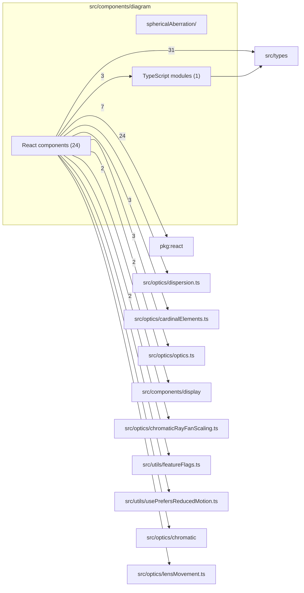

# src/components/diagram

This folder inline SVG diagram layers and overlays for optical geometry, rays, pupils, MTF, chromatic widgets, and labels.

Generated `readme.md` and `improvementsuggestions.md` files are intentionally omitted from the per-file inventory so this document stays focused on source relationships.

## Relationship Diagram

```mermaid
flowchart LR
  subgraph n_src_components_diagram["src/components/diagram"]
    n_src_components_diagram_src_components_diagram_sphericalAberration["sphericalAberration/"]
    n_src_components_diagram_React_components["React components (24)"]
    n_src_components_diagram_TypeScript_modules["TypeScript modules (1)"]
  end
  n_external_src_types["src/types"]
  n_external_pkg_react["pkg:react"]
  n_external_src_optics_dispersion_ts["src/optics/dispersion.ts"]
  n_external_src_optics_cardinalElements_ts["src/optics/cardinalElements.ts"]
  n_external_src_optics_optics_ts["src/optics/optics.ts"]
  n_external_src_components_display["src/components/display"]
  n_external_src_optics_chromaticRayFanScaling_ts["src/optics/chromaticRayFanScaling.ts"]
  n_external_src_utils_featureFlags_ts["src/utils/featureFlags.ts"]
  n_external_src_utils_usePrefersReducedMotion_ts["src/utils/usePrefersReducedMotion.ts"]
  n_external_src_optics_chromatic["src/optics/chromatic"]
  n_external_src_optics_lensMovement_ts["src/optics/lensMovement.ts"]
  n_src_components_diagram_React_components --> |31| n_external_src_types
  n_src_components_diagram_React_components --> |24| n_external_pkg_react
  n_src_components_diagram_React_components --> |7| n_external_src_optics_dispersion_ts
  n_src_components_diagram_React_components --> |3| n_external_src_optics_cardinalElements_ts
  n_src_components_diagram_React_components --> |3| n_external_src_optics_optics_ts
  n_src_components_diagram_React_components --> |3| n_src_components_diagram_TypeScript_modules
  n_src_components_diagram_React_components --> |2| n_external_src_components_display
  n_src_components_diagram_React_components --> |2| n_external_src_optics_chromaticRayFanScaling_ts
  n_src_components_diagram_React_components --> |2| n_external_src_utils_featureFlags_ts
  n_src_components_diagram_React_components --> |2| n_external_src_utils_usePrefersReducedMotion_ts
  n_src_components_diagram_React_components --> n_external_src_optics_chromatic
  n_src_components_diagram_React_components --> n_external_src_optics_lensMovement_ts
  n_src_components_diagram_TypeScript_modules --> n_external_src_types
```

## Directory Overview

- Direct source files: 25
- Direct subfolders: 1
- Main outbound areas: src/types (32), package:react (24), same folder (19), src/optics/dispersion.ts (7), src/optics/cardinalElements.ts (3), src/optics/optics.ts (3), src/components/display (2), src/optics/chromaticRayFanScaling.ts (2), +4 more
- External consumers: src/benchmarks, src/components/layout, src/components/markdown

## Subfolders

| Folder | Role |
| --- | --- |
| [sphericalAberration/](sphericalAberration/readme.md) | src/components/diagram/sphericalAberration source folder |

## Files

| File | Role | Imports from | Imported by | Exports |
| --- | --- | --- | --- | --- |
| `ApertureStop.tsx` | React component module | package:react, src/types | same folder | default |
| `CardinalElementsOverlay.tsx` | React component module | src/types (2), package:react, src/optics/cardinalElements.ts | same folder | default |
| `ChromaticFanSpreadWidget.tsx` | React component module | src/types (2), package:react, same folder, src/components/display, src/optics/chromaticRayFanScaling.ts, +1 more | same folder | default |
| `ChromaticOverlayContent.tsx` | React component module | package:react (2), same folder (2), src/types (2), src/components/display, src/optics/chromatic, +1 more | src/components/layout | default |
| `ChromaticQualityBadge.tsx` | React component module | src/optics/dispersion.ts, src/types | same folder (2) | CHROMATIC_QUALITY_BADGE_LABEL, chromaticQualityBadgeLabel, ChromaticQualityBadge |
| `DiagramDefs.tsx` | React component module | package:react, src/types, src/utils/featureFlags.ts | same folder | default |
| `DiagramElementLayer.tsx` | React component module | src/types (2), package:react, src/utils/featureFlags.ts | same folder | default |
| `DiagramGridAxisLayer.tsx` | React component module | src/types (2), package:react | same folder | default |
| `DiagramOverlayLayer.tsx` | React component module | same folder (6), src/types (2), package:react, src/optics/cardinalElements.ts, src/optics/dispersion.ts, +2 more | same folder | default |
| `DiagramRayLayers.tsx` | React component module | src/types (3), same folder (2), package:react | same folder | default |
| `DiagramSVG.tsx` | React component module | same folder (6), src/types (3), package:react, src/optics/cardinalElements.ts, src/optics/dispersion.ts, +2 more | src/benchmarks, src/components/layout | default |
| `diagramSvgTypes.ts` | Diagram Svg Types helper module | src/types | same folder (3) | RaySegment, ChromaticRaySegment |
| `ElementAnnotations.tsx` | React component module | src/types (2), package:react | same folder | default |
| `EntrancePupilDiagram.tsx` | React component module | package:react | src/components/markdown | default |
| `ExitPupilDiagram.tsx` | React component module | package:react | src/components/markdown | default |
| `ImagePlaneOverlay.tsx` | React component module | src/types (2), package:react | same folder | default |
| `LocaDiagram.tsx` | React component module | package:react | src/components/markdown | default |
| `LocaInsetWidget.tsx` | React component module | src/types (2), package:react, same folder, src/optics/chromaticRayFanScaling.ts, src/optics/dispersion.ts | same folder (2) | default |
| `MTFDiagram.tsx` | React component module | package:react | src/components/markdown | default |
| `PetzvalOverlayContent.tsx` | React component module | src/types (2), package:react, src/optics/optics.ts | src/components/layout | default |
| `PetzvalSumBadge.tsx` | React component module | src/types (2), package:react, src/optics/optics.ts | same folder | default |
| `PVDiagram.tsx` | React component module | package:react, src/optics/dispersion.ts | src/components/markdown | default |
| `RayPolylines.tsx` | React component module | package:react, same folder | same folder | default |
| `TelecentricityDiagram.tsx` | React component module | package:react | src/components/markdown | default |
| `WorkingFNumberDiagram.tsx` | React component module | package:react | src/components/markdown | default |
