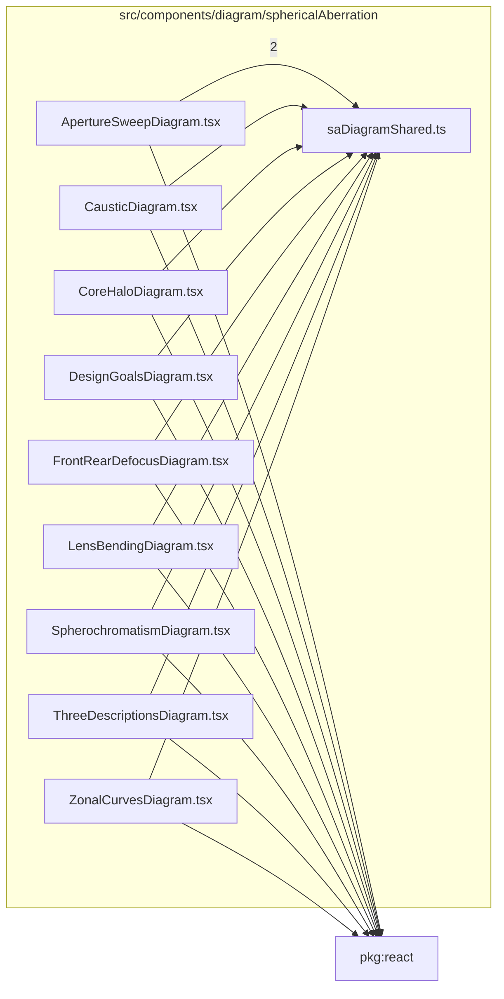

# src/components/diagram/sphericalAberration

This folder src/components/diagram/sphericalAberration source folder.

Generated `readme.md` and `improvementsuggestions.md` files are intentionally omitted from the per-file inventory so this document stays focused on source relationships.

## Relationship Diagram

## Directory Overview

- Direct source files: 10
- Direct subfolders: 0
- Main outbound areas: src/components/diagram (10), package:react (9)
- External consumers: src/components/markdown

## Files

| File | Role | Imports from | Imported by | Exports |
| --- | --- | --- | --- | --- |
| `ApertureSweepDiagram.tsx` | React component module | src/components/diagram (2), package:react | src/components/markdown | default |
| `CausticDiagram.tsx` | React component module | package:react, src/components/diagram | src/components/markdown | default |
| `CoreHaloDiagram.tsx` | React component module | package:react, src/components/diagram | src/components/markdown | default |
| `DesignGoalsDiagram.tsx` | React component module | package:react, src/components/diagram | src/components/markdown | default |
| `FrontRearDefocusDiagram.tsx` | React component module | package:react, src/components/diagram | src/components/markdown | default |
| `LensBendingDiagram.tsx` | React component module | package:react, src/components/diagram | src/components/markdown | default |
| `saDiagramShared.ts` | Sa Diagram Shared helper module | none | src/components/diagram (9) | SaColors, SA_DARK, SA_LIGHT, SA_FONT, saColors, saCurvePath |
| `SpherochromatismDiagram.tsx` | React component module | package:react, src/components/diagram | src/components/markdown | default |
| `ThreeDescriptionsDiagram.tsx` | React component module | package:react, src/components/diagram | src/components/markdown | default |
| `ZonalCurvesDiagram.tsx` | React component module | package:react, src/components/diagram | src/components/markdown | default |
