# src/components/display/analysis/aberrations

This folder aberration-tab section components and hooks for spherical aberration, field curvature, astigmatism, and coma.

Generated `readme.md` and `improvementsuggestions.md` files are intentionally omitted from the per-file inventory so this document stays focused on source relationships.

## Relationship Diagram

```mermaid
flowchart LR
  subgraph n_src_components_display_analysis_aberrations["src/components/display/analysis/aberrations"]
    n_src_components_display_analysis_aberrations_src_components_display_analysis_aberrations_AstigmatismSection_tsx["AstigmatismSection.tsx"]
    n_src_components_display_analysis_aberrations_src_components_display_analysis_aberrations_ComaPreviewSection_tsx["ComaPreviewSection.tsx"]
    n_src_components_display_analysis_aberrations_src_components_display_analysis_aberrations_FieldCurvatureSection_tsx["FieldCurvatureSection.tsx"]
    n_src_components_display_analysis_aberrations_src_components_display_analysis_aberrations_format_ts["format.ts"]
    n_src_components_display_analysis_aberrations_src_components_display_analysis_aberrations_MeridionalComaSection_tsx["MeridionalComaSection.tsx"]
    n_src_components_display_analysis_aberrations_src_components_display_analysis_aberrations_SADiagram_tsx["SADiagram.tsx"]
    n_src_components_display_analysis_aberrations_src_components_display_analysis_aberrations_SagittalComaSection_tsx["SagittalComaSection.tsx"]
    n_src_components_display_analysis_aberrations_src_components_display_analysis_aberrations_SectionHeader_tsx["SectionHeader.tsx"]
    n_src_components_display_analysis_aberrations_src_components_display_analysis_aberrations_SphericalAberrationSection_tsx["SphericalAberrationSection.tsx"]
    n_src_components_display_analysis_aberrations_src_components_display_analysis_aberrations_useComaData_ts["useComaData.ts"]
    n_src_components_display_analysis_aberrations_src_components_display_analysis_aberrations_useFieldCurvatureData_ts["useFieldCurvatureData.ts"]
    n_src_components_display_analysis_aberrations_src_components_display_analysis_aberrations_useSphericalAberrationData_ts["useSphericalAberrationData.ts"]
  end
  n_external_src_components_display["src/components/display"]
  n_external_src_components_controls["src/components/controls"]
  n_external_src_optics_compat_ts["src/optics/compat.ts"]
  n_external_pkg_react["pkg:react"]
  n_external_src_optics_aberrationAnalysis_ts["src/optics/aberrationAnalysis.ts"]
  n_external_src_optics_optics_ts["src/optics/optics.ts"]
  n_external_src_optics_types_ts["src/optics/types.ts"]
  n_external_src_types["src/types"]
  n_src_components_display_analysis_aberrations_src_components_display_analysis_aberrations_FieldCurvatureSection_tsx --> |3| n_external_src_components_display
  n_src_components_display_analysis_aberrations_src_components_display_analysis_aberrations_SectionHeader_tsx --> |2| n_external_src_components_controls
  n_src_components_display_analysis_aberrations_src_components_display_analysis_aberrations_ComaPreviewSection_tsx --> |2| n_external_src_components_display
  n_src_components_display_analysis_aberrations_src_components_display_analysis_aberrations_useComaData_ts --> |2| n_external_src_optics_compat_ts
  n_src_components_display_analysis_aberrations_src_components_display_analysis_aberrations_useFieldCurvatureData_ts --> |2| n_external_src_optics_compat_ts
  n_src_components_display_analysis_aberrations_src_components_display_analysis_aberrations_useSphericalAberrationData_ts --> |2| n_external_src_optics_compat_ts
  n_src_components_display_analysis_aberrations_src_components_display_analysis_aberrations_useComaData_ts --> n_external_pkg_react
  n_src_components_display_analysis_aberrations_src_components_display_analysis_aberrations_useFieldCurvatureData_ts --> n_external_pkg_react
  n_src_components_display_analysis_aberrations_src_components_display_analysis_aberrations_useSphericalAberrationData_ts --> n_external_pkg_react
  n_src_components_display_analysis_aberrations_src_components_display_analysis_aberrations_AstigmatismSection_tsx --> n_external_src_components_display
  n_src_components_display_analysis_aberrations_src_components_display_analysis_aberrations_MeridionalComaSection_tsx --> n_external_src_components_display
  n_src_components_display_analysis_aberrations_src_components_display_analysis_aberrations_SagittalComaSection_tsx --> n_external_src_components_display
  n_src_components_display_analysis_aberrations_src_components_display_analysis_aberrations_AstigmatismSection_tsx --> n_external_src_optics_aberrationAnalysis_ts
  n_src_components_display_analysis_aberrations_src_components_display_analysis_aberrations_ComaPreviewSection_tsx --> n_external_src_optics_aberrationAnalysis_ts
  n_src_components_display_analysis_aberrations_src_components_display_analysis_aberrations_FieldCurvatureSection_tsx --> n_external_src_optics_aberrationAnalysis_ts
  n_src_components_display_analysis_aberrations_src_components_display_analysis_aberrations_MeridionalComaSection_tsx --> n_external_src_optics_aberrationAnalysis_ts
  n_src_components_display_analysis_aberrations_src_components_display_analysis_aberrations_SADiagram_tsx --> n_external_src_optics_aberrationAnalysis_ts
  n_src_components_display_analysis_aberrations_src_components_display_analysis_aberrations_SagittalComaSection_tsx --> n_external_src_optics_aberrationAnalysis_ts
  n_src_components_display_analysis_aberrations_src_components_display_analysis_aberrations_SphericalAberrationSection_tsx --> n_external_src_optics_aberrationAnalysis_ts
  n_src_components_display_analysis_aberrations_src_components_display_analysis_aberrations_useComaData_ts --> n_external_src_optics_aberrationAnalysis_ts
  n_src_components_display_analysis_aberrations_src_components_display_analysis_aberrations_useFieldCurvatureData_ts --> n_external_src_optics_aberrationAnalysis_ts
  n_src_components_display_analysis_aberrations_src_components_display_analysis_aberrations_useSphericalAberrationData_ts --> n_external_src_optics_aberrationAnalysis_ts
  n_src_components_display_analysis_aberrations_src_components_display_analysis_aberrations_useComaData_ts --> n_external_src_optics_optics_ts
  n_src_components_display_analysis_aberrations_src_components_display_analysis_aberrations_useFieldCurvatureData_ts --> n_external_src_optics_optics_ts
  n_src_components_display_analysis_aberrations_src_components_display_analysis_aberrations_useComaData_ts --> n_external_src_optics_types_ts
  n_src_components_display_analysis_aberrations_src_components_display_analysis_aberrations_useFieldCurvatureData_ts --> n_external_src_optics_types_ts
  n_src_components_display_analysis_aberrations_src_components_display_analysis_aberrations_useSphericalAberrationData_ts --> n_external_src_optics_types_ts
  n_src_components_display_analysis_aberrations_src_components_display_analysis_aberrations_AstigmatismSection_tsx --> n_external_src_types
  n_src_components_display_analysis_aberrations_src_components_display_analysis_aberrations_ComaPreviewSection_tsx --> n_external_src_types
  n_src_components_display_analysis_aberrations_src_components_display_analysis_aberrations_FieldCurvatureSection_tsx --> n_external_src_types
  n_src_components_display_analysis_aberrations_src_components_display_analysis_aberrations_MeridionalComaSection_tsx --> n_external_src_types
  n_src_components_display_analysis_aberrations_src_components_display_analysis_aberrations_SADiagram_tsx --> n_external_src_types
  n_src_components_display_analysis_aberrations_src_components_display_analysis_aberrations_SagittalComaSection_tsx --> n_external_src_types
  n_src_components_display_analysis_aberrations_src_components_display_analysis_aberrations_SectionHeader_tsx --> n_external_src_types
  n_src_components_display_analysis_aberrations_src_components_display_analysis_aberrations_SphericalAberrationSection_tsx --> n_external_src_types
  n_src_components_display_analysis_aberrations_src_components_display_analysis_aberrations_useComaData_ts --> n_external_src_types
  n_src_components_display_analysis_aberrations_truncated["additional relationships omitted"]
```

## Directory Overview

- Direct source files: 12
- Direct subfolders: 0
- Main outbound areas: src/components/display (19), src/types (11), src/optics/aberrationAnalysis.ts (10), src/optics/compat.ts (6), package:react (3), src/optics/types.ts (3), src/components/controls (2), src/optics/optics.ts (2), +2 more
- External consumers: src/benchmarks, src/components/display

## Files

| File | Role | Imports from | Imported by | Exports |
| --- | --- | --- | --- | --- |
| `AstigmatismSection.tsx` | React component module | src/components/display (3), src/optics/aberrationAnalysis.ts, src/types | src/benchmarks, src/components/display | default, AstigmatismSection |
| `ComaPreviewSection.tsx` | React component module | src/components/display (3), src/optics/aberrationAnalysis.ts, src/types | src/benchmarks, src/components/display | default, ComaPreviewSection |
| `FieldCurvatureSection.tsx` | React component module | src/components/display (5), src/optics/aberrationAnalysis.ts, src/types | src/benchmarks, src/components/display | default, FieldCurvatureSection |
| `format.ts` | Format helper module | none | src/components/display (4) | formatSaUm, formatSignedSaUm, formatSignedUm, formatComaSpanUm, formatSignedMm |
| `MeridionalComaSection.tsx` | React component module | src/components/display (2), src/optics/aberrationAnalysis.ts, src/types | src/benchmarks, src/components/display | default, MeridionalComaSection |
| `SADiagram.tsx` | React component module | src/components/display, src/optics/aberrationAnalysis.ts, src/types | src/components/display | default, SADiagram |
| `SagittalComaSection.tsx` | React component module | src/components/display (2), src/optics/aberrationAnalysis.ts, src/types | src/benchmarks, src/components/display | default, SagittalComaSection |
| `SectionHeader.tsx` | React component module | src/components/controls (2), src/types | src/components/display (6) | default, SectionHeader |
| `SphericalAberrationSection.tsx` | React component module | src/components/display (3), src/optics/aberrationAnalysis.ts, src/types, src/utils/featureFlags.ts | src/benchmarks, src/components/display | default, SphericalAberrationSection |
| `useComaData.ts` | React hook module | src/optics/compat.ts (2), package:react, src/optics/aberrationAnalysis.ts, src/optics/optics.ts, src/optics/types.ts, +2 more | src/components/display | default, useComaData |
| `useFieldCurvatureData.ts` | React hook module | src/optics/compat.ts (2), package:react, src/optics/aberrationAnalysis.ts, src/optics/optics.ts, src/optics/types.ts, +1 more | src/components/display | default, useFieldCurvatureData |
| `useSphericalAberrationData.ts` | React hook module | src/optics/compat.ts (2), package:react, src/optics/aberrationAnalysis.ts, src/optics/types.ts, src/types, +1 more | src/components/display | default, useSphericalAberrationData |
