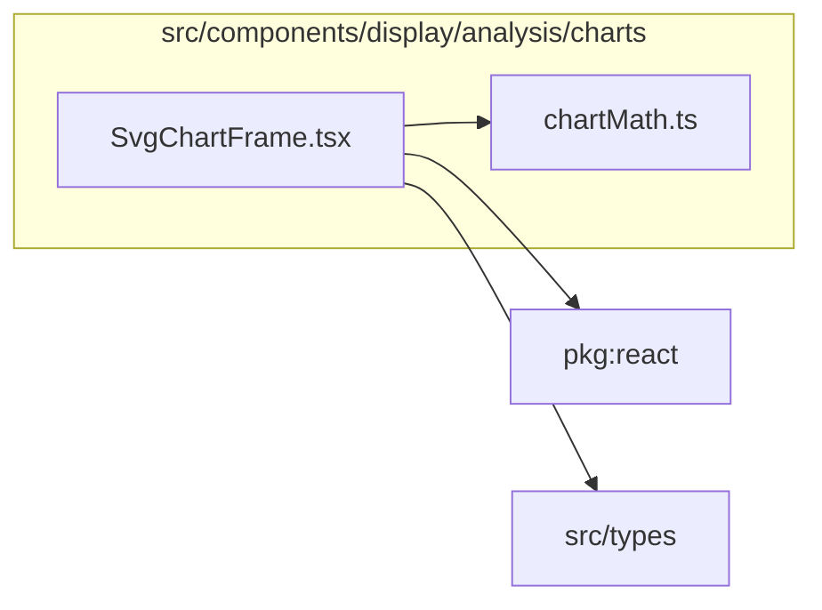

# src/components/display/analysis/charts

This folder shared SVG chart frame and math helpers for analysis plots.

Generated `readme.md` and `improvementsuggestions.md` files are intentionally omitted from the per-file inventory so this document stays focused on source relationships.

## Relationship Diagram

## Directory Overview

- Direct source files: 2
- Direct subfolders: 0
- Main outbound areas: package:react, src/components/display, src/types
- External consumers: src/components/display

## Files

| File | Role | Imports from | Imported by | Exports |
| --- | --- | --- | --- | --- |
| `chartMath.ts` | Chart Math helper module | none | src/components/display (13) | ChartMargin, PlotArea, DEFAULT_ANALYSIS_CHART_MARGIN, createPlotArea, linearScale, symmetricDomain, niceTicks, angleTicks, +16 more |
| `SvgChartFrame.tsx` | React component module | package:react, src/components/display, src/types | src/components/display (6) | SvgChartFrame, ChartLegend |

