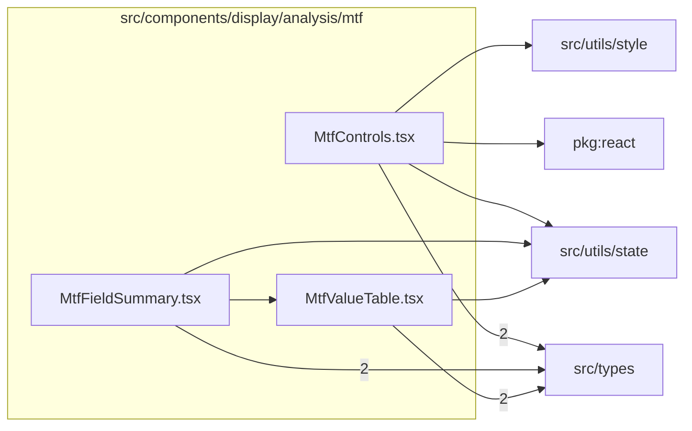

# src/components/display/analysis/mtf

This folder src/components/display/analysis/mtf source folder.

Generated `readme.md` and `improvementsuggestions.md` files are intentionally omitted from the per-file inventory so this document stays focused on source relationships.

## Relationship Diagram

## Directory Overview

- Direct source files: 3
- Direct subfolders: 0
- Main outbound areas: src/types (6), src/utils/state (3), package:react, src/components/display, src/utils/style
- External consumers: src/components/display

## Files

| File | Role | Imports from | Imported by | Exports |
| --- | --- | --- | --- | --- |
| `MtfControls.tsx` | React component module | src/types (2), package:react, src/utils/state, src/utils/style | src/components/display | default, MtfControls |
| `MtfFieldSummary.tsx` | React component module | src/types (2), src/components/display, src/utils/state | src/components/display | default, MtfFieldSummary |
| `MtfValueTable.tsx` | React component module | src/types (2), src/utils/state | src/components/display | default, MtfValueTable |
