# src/components/display/analysis/perspective

This folder src/components/display/analysis/perspective source folder.

Generated `readme.md` and `improvementsuggestions.md` files are intentionally omitted from the per-file inventory so this document stays focused on source relationships.

## Relationship Diagram

```mermaid
flowchart LR
  subgraph n_src_components_display_analysis_perspective["src/components/display/analysis/perspective"]
    n_src_components_display_analysis_perspective_src_components_display_analysis_perspective_perspectiveAnalysisUi_tsx["perspectiveAnalysisUi.tsx"]
    n_src_components_display_analysis_perspective_src_components_display_analysis_perspective_PerspectiveBokehAnalysis_tsx["PerspectiveBokehAnalysis.tsx"]
    n_src_components_display_analysis_perspective_src_components_display_analysis_perspective_PerspectiveChromaticAnalysis_tsx["PerspectiveChromaticAnalysis.tsx"]
    n_src_components_display_analysis_perspective_src_components_display_analysis_perspective_PerspectiveChromaticCurves_tsx["PerspectiveChromaticCurves.tsx"]
    n_src_components_display_analysis_perspective_src_components_display_analysis_perspective_PerspectiveChromaticRayFans_tsx["PerspectiveChromaticRayFans.tsx"]
    n_src_components_display_analysis_perspective_src_components_display_analysis_perspective_PerspectiveComaAnalysis_tsx["PerspectiveComaAnalysis.tsx"]
    n_src_components_display_analysis_perspective_src_components_display_analysis_perspective_PerspectiveDistortionView_tsx["PerspectiveDistortionView.tsx"]
    n_src_components_display_analysis_perspective_src_components_display_analysis_perspective_PerspectiveFieldCurves_tsx["PerspectiveFieldCurves.tsx"]
    n_src_components_display_analysis_perspective_src_components_display_analysis_perspective_PerspectivePupilView_tsx["PerspectivePupilView.tsx"]
    n_src_components_display_analysis_perspective_src_components_display_analysis_perspective_PerspectiveSignedChart_tsx["PerspectiveSignedChart.tsx"]
    n_src_components_display_analysis_perspective_src_components_display_analysis_perspective_PerspectiveVignettingView_tsx["PerspectiveVignettingView.tsx"]
  end
  n_external_src_optics_perspective["src/optics/perspective"]
  n_external_src_types["src/types"]
  n_external_pkg_react["pkg:react"]
  n_external_src_components_display["src/components/display"]
  n_external_src_optics_math["src/optics/math"]
  n_external_src_utils_catalog["src/utils/catalog"]
  n_src_components_display_analysis_perspective_src_components_display_analysis_perspective_PerspectiveDistortionView_tsx --> |2| n_external_src_optics_perspective
  n_src_components_display_analysis_perspective_src_components_display_analysis_perspective_PerspectiveChromaticCurves_tsx --> |2| n_external_src_types
  n_src_components_display_analysis_perspective_src_components_display_analysis_perspective_PerspectiveChromaticRayFans_tsx --> |2| n_external_src_types
  n_src_components_display_analysis_perspective_src_components_display_analysis_perspective_perspectiveAnalysisUi_tsx --> n_external_pkg_react
  n_src_components_display_analysis_perspective_src_components_display_analysis_perspective_PerspectiveDistortionView_tsx --> n_external_pkg_react
  n_src_components_display_analysis_perspective_src_components_display_analysis_perspective_PerspectiveBokehAnalysis_tsx --> n_external_src_components_display
  n_src_components_display_analysis_perspective_src_components_display_analysis_perspective_PerspectiveChromaticAnalysis_tsx --> n_external_src_components_display
  n_src_components_display_analysis_perspective_src_components_display_analysis_perspective_PerspectiveComaAnalysis_tsx --> n_external_src_components_display
  n_src_components_display_analysis_perspective_src_components_display_analysis_perspective_PerspectiveDistortionView_tsx --> n_external_src_components_display
  n_src_components_display_analysis_perspective_src_components_display_analysis_perspective_PerspectiveFieldCurves_tsx --> n_external_src_components_display
  n_src_components_display_analysis_perspective_src_components_display_analysis_perspective_PerspectivePupilView_tsx --> n_external_src_components_display
  n_src_components_display_analysis_perspective_src_components_display_analysis_perspective_PerspectiveVignettingView_tsx --> n_external_src_components_display
  n_src_components_display_analysis_perspective_src_components_display_analysis_perspective_PerspectiveDistortionView_tsx --> n_external_src_optics_math
  n_src_components_display_analysis_perspective_src_components_display_analysis_perspective_perspectiveAnalysisUi_tsx --> n_external_src_optics_perspective
  n_src_components_display_analysis_perspective_src_components_display_analysis_perspective_PerspectiveBokehAnalysis_tsx --> n_external_src_optics_perspective
  n_src_components_display_analysis_perspective_src_components_display_analysis_perspective_PerspectiveChromaticAnalysis_tsx --> n_external_src_optics_perspective
  n_src_components_display_analysis_perspective_src_components_display_analysis_perspective_PerspectiveChromaticCurves_tsx --> n_external_src_optics_perspective
  n_src_components_display_analysis_perspective_src_components_display_analysis_perspective_PerspectiveChromaticRayFans_tsx --> n_external_src_optics_perspective
  n_src_components_display_analysis_perspective_src_components_display_analysis_perspective_PerspectiveComaAnalysis_tsx --> n_external_src_optics_perspective
  n_src_components_display_analysis_perspective_src_components_display_analysis_perspective_PerspectiveFieldCurves_tsx --> n_external_src_optics_perspective
  n_src_components_display_analysis_perspective_src_components_display_analysis_perspective_PerspectivePupilView_tsx --> n_external_src_optics_perspective
  n_src_components_display_analysis_perspective_src_components_display_analysis_perspective_PerspectiveVignettingView_tsx --> n_external_src_optics_perspective
  n_src_components_display_analysis_perspective_src_components_display_analysis_perspective_perspectiveAnalysisUi_tsx --> n_external_src_types
  n_src_components_display_analysis_perspective_src_components_display_analysis_perspective_PerspectiveBokehAnalysis_tsx --> n_external_src_types
  n_src_components_display_analysis_perspective_src_components_display_analysis_perspective_PerspectiveChromaticAnalysis_tsx --> n_external_src_types
  n_src_components_display_analysis_perspective_src_components_display_analysis_perspective_PerspectiveComaAnalysis_tsx --> n_external_src_types
  n_src_components_display_analysis_perspective_src_components_display_analysis_perspective_PerspectiveDistortionView_tsx --> n_external_src_types
  n_src_components_display_analysis_perspective_src_components_display_analysis_perspective_PerspectiveFieldCurves_tsx --> n_external_src_types
  n_src_components_display_analysis_perspective_src_components_display_analysis_perspective_PerspectivePupilView_tsx --> n_external_src_types
  n_src_components_display_analysis_perspective_src_components_display_analysis_perspective_PerspectiveSignedChart_tsx --> n_external_src_types
  n_src_components_display_analysis_perspective_src_components_display_analysis_perspective_PerspectiveVignettingView_tsx --> n_external_src_types
  n_src_components_display_analysis_perspective_src_components_display_analysis_perspective_PerspectiveDistortionView_tsx --> n_external_src_utils_catalog
  n_src_components_display_analysis_perspective_src_components_display_analysis_perspective_PerspectiveBokehAnalysis_tsx --> n_src_components_display_analysis_perspective_src_components_display_analysis_perspective_perspectiveAnalysisUi_tsx
  n_src_components_display_analysis_perspective_src_components_display_analysis_perspective_PerspectiveChromaticAnalysis_tsx --> n_src_components_display_analysis_perspective_src_components_display_analysis_perspective_perspectiveAnalysisUi_tsx
  n_src_components_display_analysis_perspective_src_components_display_analysis_perspective_PerspectiveChromaticCurves_tsx --> n_src_components_display_analysis_perspective_src_components_display_analysis_perspective_perspectiveAnalysisUi_tsx
  n_src_components_display_analysis_perspective_src_components_display_analysis_perspective_PerspectiveChromaticRayFans_tsx --> n_src_components_display_analysis_perspective_src_components_display_analysis_perspective_perspectiveAnalysisUi_tsx
  n_src_components_display_analysis_perspective_truncated["additional relationships omitted"]
```

## Directory Overview

- Direct source files: 11
- Direct subfolders: 0
- Main outbound areas: src/components/display (19), src/types (13), src/optics/perspective (11), package:react (2), src/optics/math, src/utils/catalog
- External consumers: src/components/display

## Files

| File | Role | Imports from | Imported by | Exports |
| --- | --- | --- | --- | --- |
| `perspectiveAnalysisUi.tsx` | React component module | package:react, src/optics/perspective, src/types | src/components/display (6) | PerspectiveSection, perspectiveFieldLabel, perspectiveStatusLabel, formatSignedMm, formatUnsignedMm, formatSignedUm, formatUnsignedUm, formatTransmission, +1 more |
| `PerspectiveBokehAnalysis.tsx` | React component module | src/components/display (2), src/optics/perspective, src/types | src/components/display | default, PerspectiveBokehAnalysis |
| `PerspectiveChromaticAnalysis.tsx` | React component module | src/components/display (4), src/optics/perspective, src/types | src/components/display | default, PerspectiveChromaticAnalysis |
| `PerspectiveChromaticCurves.tsx` | React component module | src/types (2), src/components/display, src/optics/perspective | src/components/display (2) | default, PerspectiveChromaticCurves, channelColor |
| `PerspectiveChromaticRayFans.tsx` | React component module | src/components/display (2), src/types (2), src/optics/perspective | src/components/display | default, PerspectiveChromaticRayFans |
| `PerspectiveComaAnalysis.tsx` | React component module | src/components/display (2), src/optics/perspective, src/types | src/components/display | default, PerspectiveComaAnalysis |
| `PerspectiveDistortionView.tsx` | React component module | src/components/display (2), src/optics/perspective (2), package:react, src/optics/math, src/types, +1 more | src/components/display | default, PerspectiveDistortionView |
| `PerspectiveFieldCurves.tsx` | React component module | src/components/display (2), src/optics/perspective, src/types | src/components/display | default, PerspectiveFieldCurves |
| `PerspectivePupilView.tsx` | React component module | src/components/display (2), src/optics/perspective, src/types | src/components/display | default, PerspectivePupilView |
| `PerspectiveSignedChart.tsx` | React component module | src/types | src/components/display (3) | PerspectiveSignedChartPoint, PerspectiveSignedChartSeries, default, PerspectiveSignedChart |
| `PerspectiveVignettingView.tsx` | React component module | src/components/display (2), src/optics/perspective, src/types | src/components/display | default, PerspectiveVignettingView |
