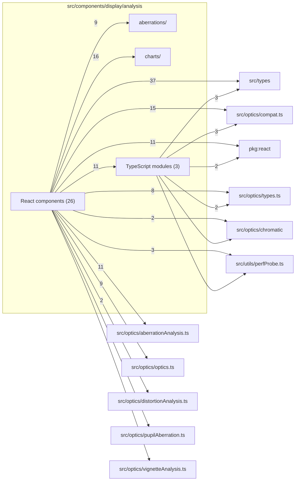

# src/components/display/analysis

This folder analysis drawer tabs, plots, chart utilities, and prepared-state hooks.

Generated `readme.md` and `improvementsuggestions.md` files are intentionally omitted from the per-file inventory so this document stays focused on source relationships.

## Relationship Diagram

## Directory Overview

- Direct source files: 29
- Direct subfolders: 2
- Main outbound areas: src/components/display (56), src/types (40), src/optics/compat.ts (18), package:react (13), src/optics/aberrationAnalysis.ts (11), src/optics/types.ts (10), src/optics/optics.ts (9), src/utils/perfProbe.ts (4), +4 more
- External consumers: src/benchmarks, src/components/display, src/components/layout

## Subfolders

| Folder | Role |
| --- | --- |
| [aberrations/](aberrations/readme.md) | aberration-tab section components and hooks for spherical aberration, field curvature, astigmatism, and coma |
| [charts/](charts/readme.md) | shared SVG chart frame and math helpers for analysis plots |

## Files

| File | Role | Imports from | Imported by | Exports |
| --- | --- | --- | --- | --- |
| `AberrationsPanel.tsx` | React component module | src/components/display (5), src/types (2), package:react, src/optics/compat.ts, src/optics/optics.ts, +1 more | src/benchmarks, src/components/layout | default, AberrationsPanel |
| `analysisUi.tsx` | React component module | package:react, src/types | src/components/display (16) | AnalysisMetricRow, AnalysisEmptyState, AberrationValueDisplay |
| `AstigmatismPlot.tsx` | React component module | src/components/display, src/optics/aberrationAnalysis.ts, src/types | src/components/display | default, AstigmatismPlot |
| `BokehPreviewContent.tsx` | React component module | src/components/display, src/optics/aberrationAnalysis.ts, src/types | src/components/display | default, BokehPreviewContent |
| `BokehPreviewGrid.tsx` | React component module | src/optics/aberrationAnalysis.ts (2), package:react, src/types | src/components/display | default, BokehPreviewGrid |
| `BokehTab.tsx` | React component module | src/components/display (3), src/types (2), src/optics/compat.ts, src/optics/types.ts | src/components/layout | default, BokehTab |
| `chromaticChartUtils.ts` | Chromatic Chart Utils helper module | src/types (2), src/optics/chromatic | src/components/display (5), src/components/diagram (2) | chromaticChannelColor, chromaticChannelLegendLabel, formatSignedUm, formatUmMagnitude, formatSpreadUmFromMm |
| `ChromaticFieldCurvaturePlot.tsx` | React component module | src/components/display (2), src/types (2), src/optics/aberrationAnalysis.ts, src/optics/chromatic | src/components/display (2) | default, ChromaticFieldCurvaturePlot |
| `ChromaticTab.tsx` | React component module | src/components/display (6), src/optics/compat.ts (2), src/types (2), package:react, src/optics/chromatic, +3 more | src/components/layout | default, ChromaticTab |
| `ComaPreviewGrid.tsx` | React component module | package:react, src/optics/aberrationAnalysis.ts, src/types | src/components/display | default, ComaPreviewGrid |
| `ComaTab.tsx` | React component module | src/components/display (4), src/types (2), package:react, src/optics/compat.ts, src/optics/optics.ts, +1 more | src/benchmarks, src/components/layout | default, ComaTab |
| `DistortionChart.tsx` | React component module | src/components/display (3), src/optics/distortionAnalysis.ts, src/types | src/components/display | default, DistortionChart |
| `DistortionFieldGrid.tsx` | React component module | src/optics/distortionAnalysis.ts, src/types | src/components/display | default, DistortionFieldGrid |
| `DistortionTab.tsx` | React component module | src/components/display (4), src/optics/compat.ts (2), src/optics/optics.ts (2), src/types (2), package:react, +2 more | src/components/layout | default, DistortionTab |
| `FieldCurvatureMeanPlot.tsx` | React component module | src/components/display, src/optics/aberrationAnalysis.ts, src/types | none | default, FieldCurvatureMeanPlot |
| `FieldCurvaturePlot.tsx` | React component module | src/components/display, src/optics/aberrationAnalysis.ts, src/types | src/components/display (2) | default, FieldCurvaturePlot |
| `FocusBreathingTab.tsx` | React component module | src/types (2), package:react, src/optics/optics.ts | src/components/layout | default, FocusBreathingTab |
| `LateralColorChart.tsx` | React component module | src/components/display (4), src/types (2), src/optics/compat.ts | src/components/display | default, LateralColorChart |
| `LongitudinalChromaticFocusChart.tsx` | React component module | src/components/display (4), src/optics/compat.ts, src/types | src/components/display | default, LongitudinalChromaticFocusChart |
| `MeridionalComaPlot.tsx` | React component module | src/components/display, src/optics/aberrationAnalysis.ts, src/types | src/components/display (2) | default, MeridionalComaPlot |
| `OpticalSummaryTab.tsx` | React component module | src/components/display (2), src/optics/compat.ts (2), src/types (2), package:react, src/optics/optics.ts, +1 more | src/components/layout | default, OpticalSummaryTab |
| `PupilAberrationChart.tsx` | React component module | src/components/display (3), src/optics/pupilAberration.ts, src/types | src/components/display | default, PupilAberrationChart |
| `PupilAberrationTab.tsx` | React component module | src/components/display (3), src/optics/compat.ts (2), src/types (2), package:react, src/optics/optics.ts, +1 more | src/components/layout | default, PupilAberrationTab |
| `SagittalComaPlot.tsx` | React component module | src/components/display, src/optics/aberrationAnalysis.ts, src/types | src/components/display | default, SagittalComaPlot |
| `StandardFieldCurvaturePlot.tsx` | React component module | src/components/display, src/optics/aberrationAnalysis.ts, src/types | src/components/display | default, StandardFieldCurvaturePlot |
| `useBokehPreviewData.ts` | React hook module | src/optics/compat.ts (2), package:react, src/optics/types.ts, src/utils/perfProbe.ts | src/components/display | default, useBokehPreviewData |
| `usePreparedAnalysisState.ts` | React hook module | package:react, src/optics/compat.ts, src/optics/types.ts, src/types | src/components/display (6), src/components/layout | default, usePreparedAnalysisState |
| `VignettingChart.tsx` | React component module | src/components/display (3), src/optics/vignetteAnalysis.ts, src/types | src/components/display | default, VignettingChart |
| `VignettingTab.tsx` | React component module | src/components/display (3), src/optics/compat.ts (2), src/types (2), package:react, src/optics/optics.ts, +2 more | src/components/layout | default, VignettingTab |
