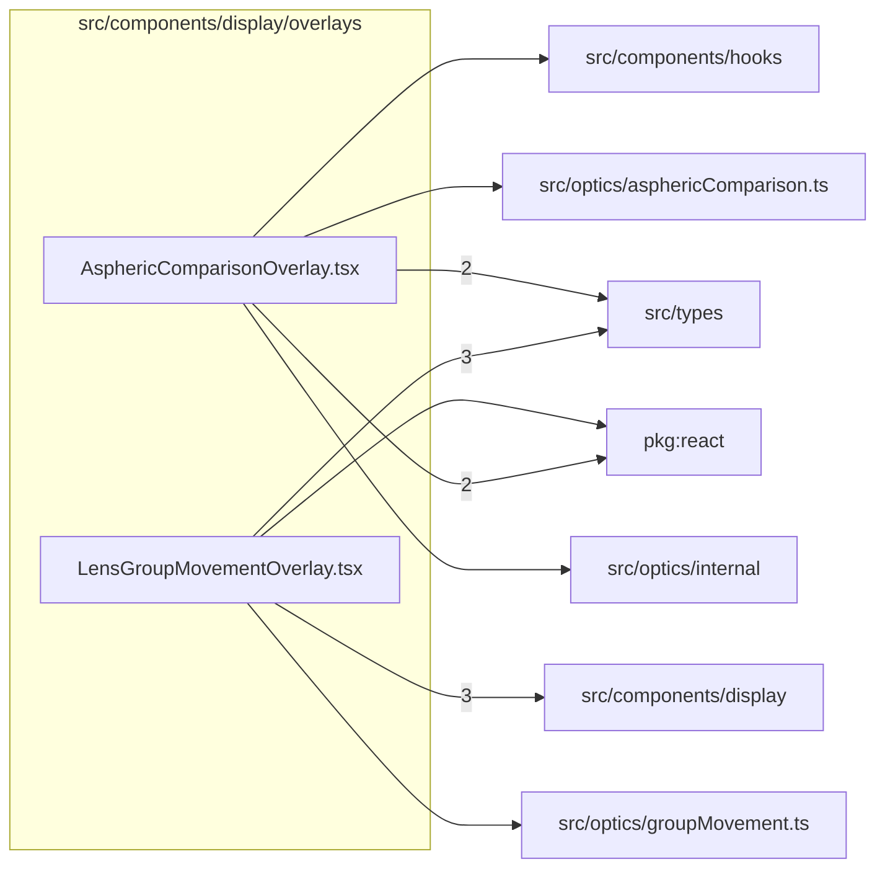

# src/components/display/overlays

This folder modal overlay content for aspheric comparison and lens group movement.

Generated `readme.md` and `improvementsuggestions.md` files are intentionally omitted from the per-file inventory so this document stays focused on source relationships.

## Relationship Diagram

## Directory Overview

- Direct source files: 2
- Direct subfolders: 0
- Main outbound areas: src/types (5), package:react (3), src/components/display (3), src/components/hooks, src/optics/asphericComparison.ts, src/optics/groupMovement.ts, src/optics/internal
- External consumers: src/components/layout

## Files

| File | Role | Imports from | Imported by | Exports |
| --- | --- | --- | --- | --- |
| `AsphericComparisonOverlay.tsx` | React component module | package:react (2), src/types (2), src/components/hooks, src/optics/asphericComparison.ts, src/optics/internal | src/components/layout | default, AsphericComparisonOverlay |
| `LensGroupMovementOverlay.tsx` | React component module | src/components/display (3), src/types (3), package:react, src/optics/groupMovement.ts | src/components/layout | default, LensGroupMovementOverlay |

