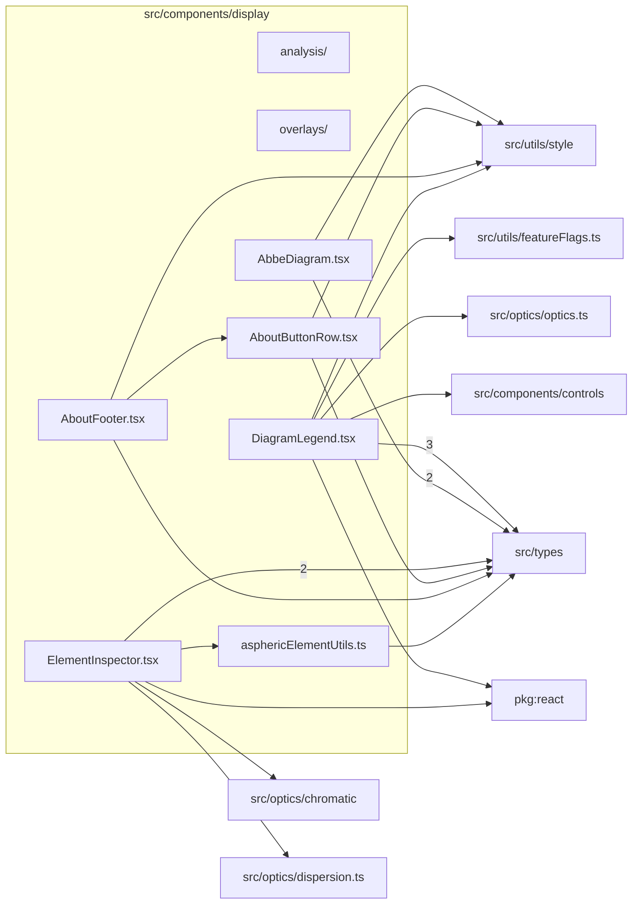

# src/components/display

This folder display-domain UI for inspectors, legends, analysis panels, charts, and overlay helpers.

Generated `readme.md` and `improvementsuggestions.md` files are intentionally omitted from the per-file inventory so this document stays focused on source relationships.

## Relationship Diagram

## Directory Overview

- Direct source files: 6
- Direct subfolders: 2
- Main outbound areas: src/types (10), src/utils/style (4), package:react (2), same folder (2), src/components/controls, src/optics/chromatic, src/optics/dispersion.ts, src/optics/optics.ts, +1 more
- External consumers: src/components/layout

## Subfolders

| Folder | Role |
| --- | --- |
| [analysis/](analysis/readme.md) | analysis drawer tabs, plots, chart utilities, and prepared-state hooks |
| [overlays/](overlays/readme.md) | modal overlay content for aspheric comparison and lens group movement |

## Files

| File | Role | Imports from | Imported by | Exports |
| --- | --- | --- | --- | --- |
| `AbbeDiagram.tsx` | React component module | src/types (2), src/utils/style | src/components/layout | default, AbbeDiagram |
| `AboutButtonRow.tsx` | React component module | src/types, src/utils/style | same folder, src/components/layout | default, AboutButtonRow |
| `AboutFooter.tsx` | React component module | same folder, src/types, src/utils/style | src/components/layout | default, AboutFooter |
| `asphericElementUtils.ts` | Aspheric Element Utils helper module | src/types | same folder, src/components/layout | ElementAsphereEntry, getAsphericEntriesForElement, elementHasAsphericSurface |
| `DiagramLegend.tsx` | React component module | src/types (3), package:react, src/components/controls, src/optics/optics.ts, src/utils/featureFlags.ts, +1 more | src/components/layout | default, DiagramLegend |
| `ElementInspector.tsx` | React component module | src/types (2), package:react, same folder, src/optics/chromatic, src/optics/dispersion.ts | src/components/layout | default, ElementInspector |

