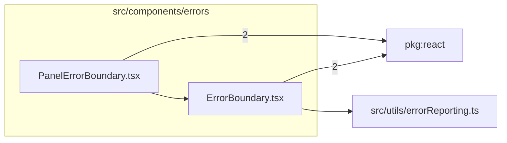

# src/components/errors

This folder page and panel error boundaries plus shared error display UI.

Generated `readme.md` and `improvementsuggestions.md` files are intentionally omitted from the per-file inventory so this document stays focused on source relationships.

## Relationship Diagram

## Directory Overview

- Direct source files: 2
- Direct subfolders: 0
- Main outbound areas: package:react (4), same folder, src/utils/errorReporting.ts
- External consumers: src/comparison, src/components/layout, src/entry-server.tsx, src/main.tsx

## Files

| File | Role | Imports from | Imported by | Exports |
| --- | --- | --- | --- | --- |
| `ErrorBoundary.tsx` | React component module | package:react (2), src/utils/errorReporting.ts | same folder, src/comparison, src/components/layout, src/entry-server.tsx, src/main.tsx | ErrorDisplay, default, ErrorBoundary |
| `PanelErrorBoundary.tsx` | React component module | package:react (2), same folder | src/components/layout | default, PanelErrorBoundary |

