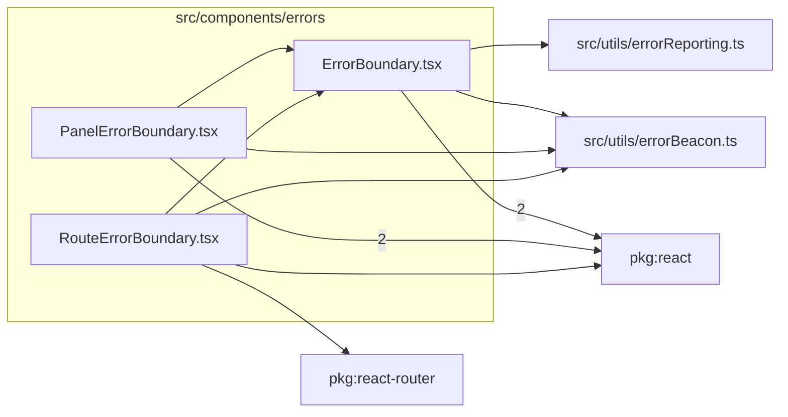

# src/components/errors

This folder page and panel error boundaries plus shared error display UI.

Generated `readme.md` and `improvementsuggestions.md` files are intentionally omitted from the per-file inventory so this document stays focused on source relationships.

## Relationship Diagram

```mermaid
flowchart LR
  subgraph n_src_components_errors["src/components/errors"]
    n_src_components_errors_src_components_errors_ErrorBoundary_tsx["ErrorBoundary.tsx"]
    n_src_components_errors_src_components_errors_PanelErrorBoundary_tsx["PanelErrorBoundary.tsx"]
    n_src_components_errors_src_components_errors_RouteErrorBoundary_tsx["RouteErrorBoundary.tsx"]
  end
  n_external_pkg_react["pkg:react"]
  n_external_pkg_react_router["pkg:react-router"]
  n_external_src_utils_errorBeacon_ts["src/utils/errorBeacon.ts"]
  n_external_src_utils_errorReporting_ts["src/utils/errorReporting.ts"]
  n_src_components_errors_src_components_errors_ErrorBoundary_tsx --> |2| n_external_pkg_react
  n_src_components_errors_src_components_errors_PanelErrorBoundary_tsx --> |2| n_external_pkg_react
  n_src_components_errors_src_components_errors_RouteErrorBoundary_tsx --> n_external_pkg_react
  n_src_components_errors_src_components_errors_RouteErrorBoundary_tsx --> n_external_pkg_react_router
  n_src_components_errors_src_components_errors_ErrorBoundary_tsx --> n_external_src_utils_errorBeacon_ts
  n_src_components_errors_src_components_errors_PanelErrorBoundary_tsx --> n_external_src_utils_errorBeacon_ts
  n_src_components_errors_src_components_errors_RouteErrorBoundary_tsx --> n_external_src_utils_errorBeacon_ts
  n_src_components_errors_src_components_errors_ErrorBoundary_tsx --> n_external_src_utils_errorReporting_ts
  n_src_components_errors_src_components_errors_PanelErrorBoundary_tsx --> n_src_components_errors_src_components_errors_ErrorBoundary_tsx
  n_src_components_errors_src_components_errors_RouteErrorBoundary_tsx --> n_src_components_errors_src_components_errors_ErrorBoundary_tsx
```

## Directory Overview

- Direct source files: 3
- Direct subfolders: 0
- Main outbound areas: package:react (5), src/utils/errorBeacon.ts (3), same folder (2), package:react-router, src/utils/errorReporting.ts
- External consumers: src/comparison, src/components/layout, src/entry-server.tsx, src/main.tsx, src/router.tsx

## Files

| File | Role | Imports from | Imported by | Exports |
| --- | --- | --- | --- | --- |
| `ErrorBoundary.tsx` | React component module | package:react (2), src/utils/errorBeacon.ts, src/utils/errorReporting.ts | same folder (2), src/comparison, src/components/layout, src/entry-server.tsx, src/main.tsx | ErrorDisplay, FullPageErrorDisplay, default, ErrorBoundary |
| `PanelErrorBoundary.tsx` | React component module | package:react (2), same folder, src/utils/errorBeacon.ts | src/components/layout | default, PanelErrorBoundary |
| `RouteErrorBoundary.tsx` | React component module | package:react, package:react-router, same folder, src/utils/errorBeacon.ts | src/router.tsx | normalizeRouteError, default, RouteErrorBoundary |
