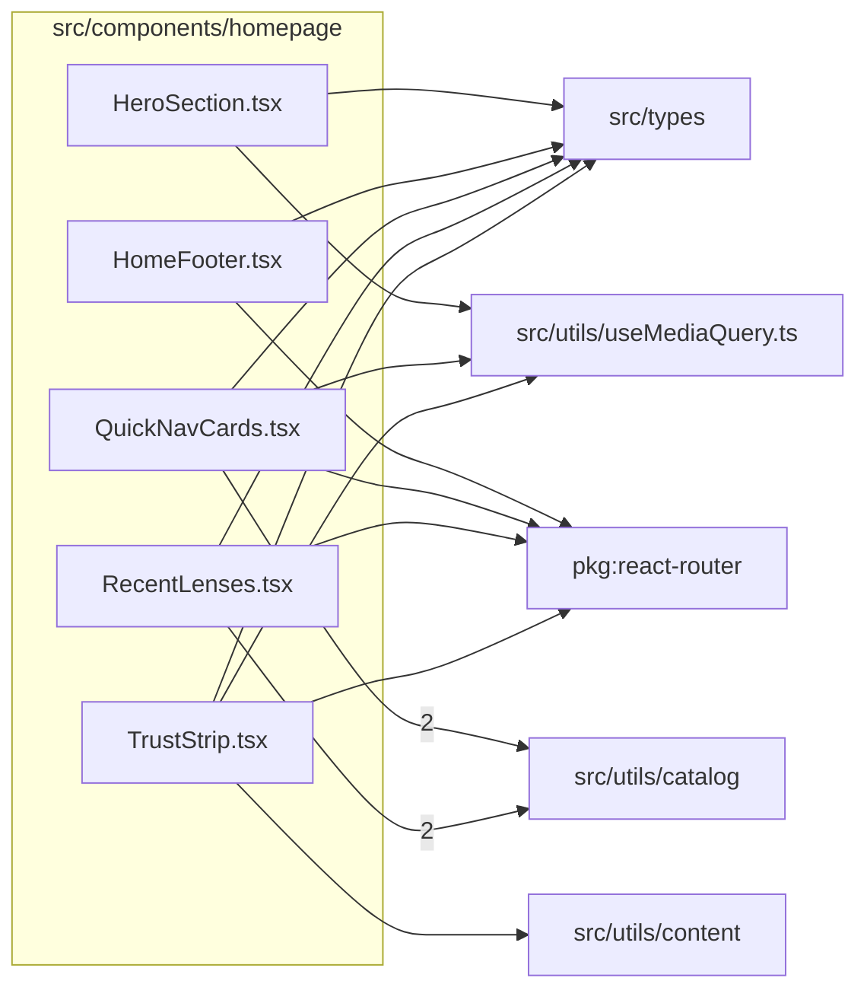

# src/components/homepage

This folder home page section components for the public landing surface.

Generated `readme.md` and `improvementsuggestions.md` files are intentionally omitted from the per-file inventory so this document stays focused on source relationships.

## Relationship Diagram

## Directory Overview

- Direct source files: 5
- Direct subfolders: 0
- Main outbound areas: src/types (5), package:react-router (4), src/utils/catalog (4), src/utils/useMediaQuery.ts (3), src/utils/content
- External consumers: src/pages/HomePage.tsx

## Files

| File | Role | Imports from | Imported by | Exports |
| --- | --- | --- | --- | --- |
| `HeroSection.tsx` | React component module | src/types, src/utils/useMediaQuery.ts | src/pages/HomePage.tsx | default, HeroSection |
| `HomeFooter.tsx` | React component module | package:react-router, src/types | src/pages/HomePage.tsx | default, HomeFooter |
| `QuickNavCards.tsx` | React component module | src/utils/catalog (2), package:react-router, src/types, src/utils/useMediaQuery.ts | src/pages/HomePage.tsx | default, QuickNavCards |
| `RecentLenses.tsx` | React component module | src/utils/catalog (2), package:react-router, src/types | src/pages/HomePage.tsx | default, RecentLenses |
| `TrustStrip.tsx` | React component module | package:react-router, src/types, src/utils/content, src/utils/useMediaQuery.ts | src/pages/HomePage.tsx | default, TrustStrip |

