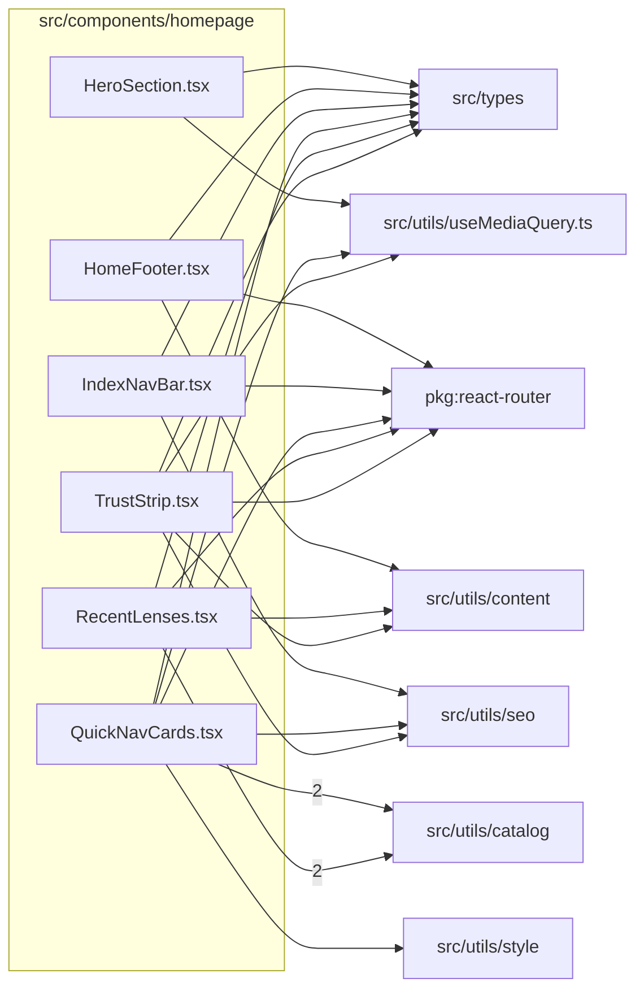

# src/components/homepage

This folder home page section components for the public landing surface.

Generated `readme.md` and `improvementsuggestions.md` files are intentionally omitted from the per-file inventory so this document stays focused on source relationships.

## Relationship Diagram

```mermaid
flowchart LR
  subgraph n_src_components_homepage["src/components/homepage"]
    n_src_components_homepage_src_components_homepage_HeroSection_tsx["HeroSection.tsx"]
    n_src_components_homepage_src_components_homepage_HomeFooter_tsx["HomeFooter.tsx"]
    n_src_components_homepage_src_components_homepage_IndexNavBar_tsx["IndexNavBar.tsx"]
    n_src_components_homepage_src_components_homepage_QuickNavCards_tsx["QuickNavCards.tsx"]
    n_src_components_homepage_src_components_homepage_RecentLenses_tsx["RecentLenses.tsx"]
    n_src_components_homepage_src_components_homepage_TrustStrip_tsx["TrustStrip.tsx"]
  end
  n_external_src_utils_catalog["src/utils/catalog"]
  n_external_pkg_react_router["pkg:react-router"]
  n_external_src_types["src/types"]
  n_external_src_utils_content["src/utils/content"]
  n_external_src_utils_seo["src/utils/seo"]
  n_external_src_utils_style["src/utils/style"]
  n_external_src_utils_useMediaQuery_ts["src/utils/useMediaQuery.ts"]
  n_src_components_homepage_src_components_homepage_QuickNavCards_tsx --> |2| n_external_src_utils_catalog
  n_src_components_homepage_src_components_homepage_RecentLenses_tsx --> |2| n_external_src_utils_catalog
  n_src_components_homepage_src_components_homepage_HomeFooter_tsx --> n_external_pkg_react_router
  n_src_components_homepage_src_components_homepage_IndexNavBar_tsx --> n_external_pkg_react_router
  n_src_components_homepage_src_components_homepage_QuickNavCards_tsx --> n_external_pkg_react_router
  n_src_components_homepage_src_components_homepage_RecentLenses_tsx --> n_external_pkg_react_router
  n_src_components_homepage_src_components_homepage_TrustStrip_tsx --> n_external_pkg_react_router
  n_src_components_homepage_src_components_homepage_HeroSection_tsx --> n_external_src_types
  n_src_components_homepage_src_components_homepage_HomeFooter_tsx --> n_external_src_types
  n_src_components_homepage_src_components_homepage_IndexNavBar_tsx --> n_external_src_types
  n_src_components_homepage_src_components_homepage_QuickNavCards_tsx --> n_external_src_types
  n_src_components_homepage_src_components_homepage_RecentLenses_tsx --> n_external_src_types
  n_src_components_homepage_src_components_homepage_TrustStrip_tsx --> n_external_src_types
  n_src_components_homepage_src_components_homepage_HomeFooter_tsx --> n_external_src_utils_content
  n_src_components_homepage_src_components_homepage_RecentLenses_tsx --> n_external_src_utils_content
  n_src_components_homepage_src_components_homepage_TrustStrip_tsx --> n_external_src_utils_content
  n_src_components_homepage_src_components_homepage_IndexNavBar_tsx --> n_external_src_utils_seo
  n_src_components_homepage_src_components_homepage_QuickNavCards_tsx --> n_external_src_utils_seo
  n_src_components_homepage_src_components_homepage_TrustStrip_tsx --> n_external_src_utils_seo
  n_src_components_homepage_src_components_homepage_QuickNavCards_tsx --> n_external_src_utils_style
  n_src_components_homepage_src_components_homepage_HeroSection_tsx --> n_external_src_utils_useMediaQuery_ts
  n_src_components_homepage_src_components_homepage_QuickNavCards_tsx --> n_external_src_utils_useMediaQuery_ts
  n_src_components_homepage_src_components_homepage_TrustStrip_tsx --> n_external_src_utils_useMediaQuery_ts
```

## Directory Overview

- Direct source files: 6
- Direct subfolders: 0
- Main outbound areas: src/types (6), package:react-router (5), src/utils/catalog (4), src/utils/content (3), src/utils/seo (3), src/utils/useMediaQuery.ts (3), src/utils/style
- External consumers: src/pages/HomePage.tsx

## Files

| File | Role | Imports from | Imported by | Exports |
| --- | --- | --- | --- | --- |
| `HeroSection.tsx` | React component module | src/types, src/utils/useMediaQuery.ts | src/pages/HomePage.tsx | default, HeroSection |
| `HomeFooter.tsx` | React component module | package:react-router, src/types, src/utils/content | src/pages/HomePage.tsx | default, HomeFooter |
| `IndexNavBar.tsx` | React component module | package:react-router, src/types, src/utils/seo | src/pages/HomePage.tsx | default, IndexNavBar |
| `QuickNavCards.tsx` | React component module | src/utils/catalog (2), package:react-router, src/types, src/utils/seo, src/utils/style, +1 more | src/pages/HomePage.tsx | default, QuickNavCards |
| `RecentLenses.tsx` | React component module | src/utils/catalog (2), package:react-router, src/types, src/utils/content | src/pages/HomePage.tsx | default, RecentLenses |
| `TrustStrip.tsx` | React component module | package:react-router, src/types, src/utils/content, src/utils/seo, src/utils/useMediaQuery.ts | src/pages/HomePage.tsx | default, TrustStrip |
