# src/components/hooks

This folder viewer computation and interaction hooks for layout, ray tracing, overlays, zoom, and responsive state.

Generated `readme.md` and `improvementsuggestions.md` files are intentionally omitted from the per-file inventory so this document stays focused on source relationships.

## Relationship Diagram

```mermaid
flowchart LR
  subgraph n_src_components_hooks["src/components/hooks"]
    n_src_components_hooks_src_components_hooks_offAxisRayUtils_ts["offAxisRayUtils.ts"]
    n_src_components_hooks_src_components_hooks_raySegmentUtils_ts["raySegmentUtils.ts"]
    n_src_components_hooks_src_components_hooks_useChromaticRays_ts["useChromaticRays.ts"]
    n_src_components_hooks_src_components_hooks_useDispatchAdapters_ts["useDispatchAdapters.ts"]
    n_src_components_hooks_src_components_hooks_useFlashOverlay_ts["useFlashOverlay.ts"]
    n_src_components_hooks_src_components_hooks_useHeaderHeight_ts["useHeaderHeight.ts"]
    n_src_components_hooks_src_components_hooks_useInteractionSignal_ts["useInteractionSignal.ts"]
    n_src_components_hooks_src_components_hooks_useLensComputation_ts["useLensComputation.ts"]
    n_src_components_hooks_src_components_hooks_useOffAxisRays_ts["useOffAxisRays.ts"]
    n_src_components_hooks_src_components_hooks_useOnAxisRays_ts["useOnAxisRays.ts"]
    n_src_components_hooks_src_components_hooks_useOverlays_ts["useOverlays.ts"]
    n_src_components_hooks_src_components_hooks_useOverlayState_ts["useOverlayState.ts"]
    n_src_components_hooks_src_components_hooks_useRayTracing_ts["useRayTracing.ts"]
    n_src_components_hooks_src_components_hooks_useSideLayoutDetection_ts["useSideLayoutDetection.ts"]
    n_src_components_hooks_src_components_hooks_useViewBoxZoom_ts["useViewBoxZoom.ts"]
  end
  n_external_pkg_react["pkg:react"]
  n_external_src_optics_lensMovement_ts["src/optics/lensMovement.ts"]
  n_external_src_optics_optics_ts["src/optics/optics.ts"]
  n_external_src_types["src/types"]
  n_external_src_utils_state["src/utils/state"]
  n_external_src_optics_aberration["src/optics/aberration"]
  n_external_src_optics_buildLens_ts["src/optics/buildLens.ts"]
  n_external_src_optics_cardinalElements_ts["src/optics/cardinalElements.ts"]
  n_external_src_optics_diagramGeometry_ts["src/optics/diagramGeometry.ts"]
  n_src_components_hooks_src_components_hooks_useHeaderHeight_ts --> |2| n_external_pkg_react
  n_src_components_hooks_src_components_hooks_useSideLayoutDetection_ts --> |2| n_external_pkg_react
  n_src_components_hooks_src_components_hooks_useLensComputation_ts --> |2| n_external_src_optics_lensMovement_ts
  n_src_components_hooks_src_components_hooks_useLensComputation_ts --> |2| n_external_src_optics_optics_ts
  n_src_components_hooks_src_components_hooks_offAxisRayUtils_ts --> |2| n_external_src_types
  n_src_components_hooks_src_components_hooks_useChromaticRays_ts --> |2| n_external_src_types
  n_src_components_hooks_src_components_hooks_useDispatchAdapters_ts --> |2| n_external_src_types
  n_src_components_hooks_src_components_hooks_useOffAxisRays_ts --> |2| n_external_src_types
  n_src_components_hooks_src_components_hooks_useOnAxisRays_ts --> |2| n_external_src_types
  n_src_components_hooks_src_components_hooks_useRayTracing_ts --> |2| n_external_src_types
  n_src_components_hooks_src_components_hooks_useDispatchAdapters_ts --> |2| n_external_src_utils_state
  n_src_components_hooks_src_components_hooks_useRayTracing_ts --> |2| n_src_components_hooks_src_components_hooks_useChromaticRays_ts
  n_src_components_hooks_src_components_hooks_useRayTracing_ts --> |2| n_src_components_hooks_src_components_hooks_useOnAxisRays_ts
  n_src_components_hooks_src_components_hooks_useChromaticRays_ts --> n_external_pkg_react
  n_src_components_hooks_src_components_hooks_useDispatchAdapters_ts --> n_external_pkg_react
  n_src_components_hooks_src_components_hooks_useFlashOverlay_ts --> n_external_pkg_react
  n_src_components_hooks_src_components_hooks_useInteractionSignal_ts --> n_external_pkg_react
  n_src_components_hooks_src_components_hooks_useLensComputation_ts --> n_external_pkg_react
  n_src_components_hooks_src_components_hooks_useOffAxisRays_ts --> n_external_pkg_react
  n_src_components_hooks_src_components_hooks_useOnAxisRays_ts --> n_external_pkg_react
  n_src_components_hooks_src_components_hooks_useOverlays_ts --> n_external_pkg_react
  n_src_components_hooks_src_components_hooks_useOverlayState_ts --> n_external_pkg_react
  n_src_components_hooks_src_components_hooks_useRayTracing_ts --> n_external_pkg_react
  n_src_components_hooks_src_components_hooks_useViewBoxZoom_ts --> n_external_pkg_react
  n_src_components_hooks_src_components_hooks_offAxisRayUtils_ts --> n_external_src_optics_aberration
  n_src_components_hooks_src_components_hooks_useLensComputation_ts --> n_external_src_optics_buildLens_ts
  n_src_components_hooks_src_components_hooks_useLensComputation_ts --> n_external_src_optics_cardinalElements_ts
  n_src_components_hooks_src_components_hooks_useLensComputation_ts --> n_external_src_optics_diagramGeometry_ts
  n_src_components_hooks_src_components_hooks_useChromaticRays_ts --> n_external_src_optics_lensMovement_ts
  n_src_components_hooks_src_components_hooks_useOffAxisRays_ts --> n_external_src_optics_lensMovement_ts
  n_src_components_hooks_src_components_hooks_useOnAxisRays_ts --> n_external_src_optics_lensMovement_ts
  n_src_components_hooks_src_components_hooks_useRayTracing_ts --> n_external_src_optics_lensMovement_ts
  n_src_components_hooks_src_components_hooks_offAxisRayUtils_ts --> n_external_src_optics_optics_ts
  n_src_components_hooks_src_components_hooks_useChromaticRays_ts --> n_external_src_optics_optics_ts
  n_src_components_hooks_src_components_hooks_useOffAxisRays_ts --> n_external_src_optics_optics_ts
  n_src_components_hooks_src_components_hooks_useOnAxisRays_ts --> n_external_src_optics_optics_ts
  n_src_components_hooks_truncated["additional relationships omitted"]
```

## Directory Overview

- Direct source files: 15
- Direct subfolders: 0
- Main outbound areas: package:react (15), src/types (15), same folder (13), src/optics/optics.ts (7), src/optics/lensMovement.ts (6), src/optics/raySampling.ts (3), src/utils/state (3), src/optics/aberration, +6 more
- External consumers: src/benchmarks, src/components/controls, src/components/display, src/components/layout

## Files

| File | Role | Imports from | Imported by | Exports |
| --- | --- | --- | --- | --- |
| `offAxisRayUtils.ts` | Off Axis Ray Utils helper module | src/types (2), src/optics/aberration, src/optics/optics.ts, src/optics/projection.ts, src/utils/featureFlags.ts | same folder (2), src/benchmarks | OffAxisTraceGeometry, computeOffAxisTraceGeometry |
| `raySegmentUtils.ts` | Ray Segment Utils helper module | same folder, src/types | same folder (3), src/benchmarks | compileRaySegment, filterChannels |
| `useChromaticRays.ts` | React hook module | same folder (3), src/types (2), package:react, src/optics/lensMovement.ts, src/optics/optics.ts, +1 more | same folder, src/benchmarks, src/components/layout | ChromaticRaySegment, default, useChromaticRays |
| `useDispatchAdapters.ts` | React hook module | src/types (2), src/utils/state (2), package:react | src/components/layout | DispatchAdapters, default, useDispatchAdapters |
| `useFlashOverlay.ts` | React hook module | package:react | src/components/layout | default, useFlashOverlay |
| `useHeaderHeight.ts` | React hook module | package:react (2) | src/components/layout | default, useHeaderHeight |
| `useInteractionSignal.ts` | React hook module | package:react | src/components/controls | InteractionSignal, default, useInteractionSignal |
| `useLensComputation.ts` | React hook module | src/optics/lensMovement.ts (2), src/optics/optics.ts (2), package:react, src/optics/buildLens.ts, src/optics/cardinalElements.ts, +3 more | src/components/layout | default, useLensComputation |
| `useOffAxisRays.ts` | React hook module | same folder (3), src/types (2), package:react, src/optics/lensMovement.ts, src/optics/optics.ts, +1 more | same folder | default, useOffAxisRays |
| `useOnAxisRays.ts` | React hook module | src/types (2), package:react, same folder, src/optics/lensMovement.ts, src/optics/optics.ts, +1 more | same folder (4), src/benchmarks, src/components/layout | RaySegment, default, useOnAxisRays |
| `useOverlays.ts` | React hook module | package:react, src/types, src/utils/state | src/components/layout | default, useOverlays |
| `useOverlayState.ts` | React hook module | package:react | src/components/layout | OverlayState, default, useOverlayState |
| `useRayTracing.ts` | React hook module | same folder (5), src/types (2), package:react, src/optics/lensMovement.ts, src/optics/optics.ts | src/components/layout | default, useRayTracing |
| `useSideLayoutDetection.ts` | React hook module | package:react (2) | src/components/layout | default, useSideLayoutDetection |
| `useViewBoxZoom.ts` | React hook module | package:react | src/components/display, src/components/layout | ViewBoxState, ViewBoxZoomResult, default, useViewBoxZoom |

