# src/components/layout/lensDiagram

This folder lens diagram panel state, viewport, loading/error states, and analysis drawer wiring.

Generated `readme.md` and `improvementsuggestions.md` files are intentionally omitted from the per-file inventory so this document stays focused on source relationships.

## Relationship Diagram

```mermaid
flowchart LR
  subgraph n_src_components_layout_lensDiagram["src/components/layout/lensDiagram"]
    n_src_components_layout_lensDiagram_src_components_layout_lensDiagram_AnalysisDrawerContent_tsx["AnalysisDrawerContent.tsx"]
    n_src_components_layout_lensDiagram_src_components_layout_lensDiagram_analysisTabRenderers_tsx["analysisTabRenderers.tsx"]
    n_src_components_layout_lensDiagram_src_components_layout_lensDiagram_analysisTabs_ts["analysisTabs.ts"]
    n_src_components_layout_lensDiagram_src_components_layout_lensDiagram_DiagramViewport_tsx["DiagramViewport.tsx"]
    n_src_components_layout_lensDiagram_src_components_layout_lensDiagram_LensDiagramErrorState_tsx["LensDiagramErrorState.tsx"]
    n_src_components_layout_lensDiagram_src_components_layout_lensDiagram_LensDiagramLoadedState_tsx["LensDiagramLoadedState.tsx"]
    n_src_components_layout_lensDiagram_src_components_layout_lensDiagram_panelModel_ts["panelModel.ts"]
  end
  n_external_src_components_display["src/components/display"]
  n_external_src_types["src/types"]
  n_external_src_components_diagram["src/components/diagram"]
  n_external_pkg_react["pkg:react"]
  n_external_src_components_hooks["src/components/hooks"]
  n_external_src_components_layout["src/components/layout"]
  n_external_src_optics_optics_ts["src/optics/optics.ts"]
  n_external_src_components_errors["src/components/errors"]
  n_external_src_optics_analysis["src/optics/analysis"]
  n_external_src_optics_cardinalElements_ts["src/optics/cardinalElements.ts"]
  n_external_src_optics_compat_ts["src/optics/compat.ts"]
  n_external_src_optics_dispersion_ts["src/optics/dispersion.ts"]
  n_external_src_optics_lensMovement_ts["src/optics/lensMovement.ts"]
  n_external_src_optics_projection_ts["src/optics/projection.ts"]
  n_external_src_optics_types_ts["src/optics/types.ts"]
  n_src_components_layout_lensDiagram_src_components_layout_lensDiagram_analysisTabRenderers_tsx --> |9| n_external_src_components_display
  n_src_components_layout_lensDiagram_src_components_layout_lensDiagram_panelModel_ts --> |4| n_external_src_types
  n_src_components_layout_lensDiagram_src_components_layout_lensDiagram_DiagramViewport_tsx --> |3| n_external_src_components_diagram
  n_src_components_layout_lensDiagram_src_components_layout_lensDiagram_AnalysisDrawerContent_tsx --> |3| n_external_src_types
  n_src_components_layout_lensDiagram_src_components_layout_lensDiagram_analysisTabRenderers_tsx --> |3| n_external_src_types
  n_src_components_layout_lensDiagram_src_components_layout_lensDiagram_DiagramViewport_tsx --> |2| n_external_pkg_react
  n_src_components_layout_lensDiagram_src_components_layout_lensDiagram_LensDiagramLoadedState_tsx --> |2| n_external_src_components_display
  n_src_components_layout_lensDiagram_src_components_layout_lensDiagram_panelModel_ts --> |2| n_external_src_components_hooks
  n_src_components_layout_lensDiagram_src_components_layout_lensDiagram_DiagramViewport_tsx --> |2| n_external_src_components_layout
  n_src_components_layout_lensDiagram_src_components_layout_lensDiagram_LensDiagramLoadedState_tsx --> |2| n_external_src_components_layout
  n_src_components_layout_lensDiagram_src_components_layout_lensDiagram_AnalysisDrawerContent_tsx --> |2| n_external_src_optics_optics_ts
  n_src_components_layout_lensDiagram_src_components_layout_lensDiagram_DiagramViewport_tsx --> |2| n_external_src_types
  n_src_components_layout_lensDiagram_src_components_layout_lensDiagram_AnalysisDrawerContent_tsx --> n_external_pkg_react
  n_src_components_layout_lensDiagram_src_components_layout_lensDiagram_analysisTabRenderers_tsx --> n_external_pkg_react
  n_src_components_layout_lensDiagram_src_components_layout_lensDiagram_panelModel_ts --> n_external_pkg_react
  n_src_components_layout_lensDiagram_src_components_layout_lensDiagram_AnalysisDrawerContent_tsx --> n_external_src_components_display
  n_src_components_layout_lensDiagram_src_components_layout_lensDiagram_DiagramViewport_tsx --> n_external_src_components_display
  n_src_components_layout_lensDiagram_src_components_layout_lensDiagram_LensDiagramErrorState_tsx --> n_external_src_components_errors
  n_src_components_layout_lensDiagram_src_components_layout_lensDiagram_analysisTabs_ts --> n_external_src_components_layout
  n_src_components_layout_lensDiagram_src_components_layout_lensDiagram_AnalysisDrawerContent_tsx --> n_external_src_optics_analysis
  n_src_components_layout_lensDiagram_src_components_layout_lensDiagram_panelModel_ts --> n_external_src_optics_cardinalElements_ts
  n_src_components_layout_lensDiagram_src_components_layout_lensDiagram_AnalysisDrawerContent_tsx --> n_external_src_optics_compat_ts
  n_src_components_layout_lensDiagram_src_components_layout_lensDiagram_analysisTabRenderers_tsx --> n_external_src_optics_compat_ts
  n_src_components_layout_lensDiagram_src_components_layout_lensDiagram_DiagramViewport_tsx --> n_external_src_optics_dispersion_ts
  n_src_components_layout_lensDiagram_src_components_layout_lensDiagram_panelModel_ts --> n_external_src_optics_lensMovement_ts
  n_src_components_layout_lensDiagram_src_components_layout_lensDiagram_analysisTabRenderers_tsx --> n_external_src_optics_optics_ts
  n_src_components_layout_lensDiagram_src_components_layout_lensDiagram_AnalysisDrawerContent_tsx --> n_external_src_optics_projection_ts
  n_src_components_layout_lensDiagram_src_components_layout_lensDiagram_analysisTabRenderers_tsx --> n_external_src_optics_types_ts
  n_src_components_layout_lensDiagram_src_components_layout_lensDiagram_AnalysisDrawerContent_tsx --> n_src_components_layout_lensDiagram_src_components_layout_lensDiagram_analysisTabRenderers_tsx
  n_src_components_layout_lensDiagram_src_components_layout_lensDiagram_DiagramViewport_tsx --> n_src_components_layout_lensDiagram_src_components_layout_lensDiagram_analysisTabs_ts
  n_src_components_layout_lensDiagram_src_components_layout_lensDiagram_LensDiagramLoadedState_tsx --> n_src_components_layout_lensDiagram_src_components_layout_lensDiagram_DiagramViewport_tsx
  n_src_components_layout_lensDiagram_src_components_layout_lensDiagram_LensDiagramLoadedState_tsx --> n_src_components_layout_lensDiagram_src_components_layout_lensDiagram_panelModel_ts
```

## Directory Overview

- Direct source files: 7
- Direct subfolders: 0
- Main outbound areas: src/components/display (13), src/types (12), src/components/layout (9), package:react (5), src/components/diagram (3), src/optics/optics.ts (3), src/components/hooks (2), src/optics/compat.ts (2), +7 more
- External consumers: src/components/layout

## Files

| File | Role | Imports from | Imported by | Exports |
| --- | --- | --- | --- | --- |
| `AnalysisDrawerContent.tsx` | React component module | src/types (3), src/optics/optics.ts (2), package:react, src/components/display, src/components/layout, +3 more | src/components/layout | default, AnalysisDrawerContent |
| `analysisTabRenderers.tsx` | React component module | src/components/display (9), src/types (3), package:react, src/optics/compat.ts, src/optics/optics.ts, +1 more | src/components/layout | AnalysisDrawerInputs, AnalysisTabRendererContext, ANALYSIS_TAB_RENDERERS |
| `analysisTabs.ts` | Analysis Tabs helper module | src/components/layout | src/components/layout | ANALYSIS_TABS |
| `DiagramViewport.tsx` | React component module | src/components/diagram (3), src/components/layout (3), package:react (2), src/types (2), src/components/display, +1 more | src/components/layout | default, DiagramViewport |
| `LensDiagramErrorState.tsx` | React component module | src/components/errors | src/components/layout | default, LensDiagramErrorState |
| `LensDiagramLoadedState.tsx` | React component module | src/components/layout (4), src/components/display (2) | src/components/layout | default, LensDiagramLoadedState |
| `panelModel.ts` | Panel Model helper module | src/types (4), src/components/hooks (2), package:react, src/optics/cardinalElements.ts, src/optics/lensMovement.ts | src/components/layout | VarReadout, PanelComputedModel, PanelRayDataModel, PanelDisplayFlagsModel, PanelOverlaysModel, PanelAdaptersModel, PanelZoomHookModel, PanelInteractionsModel, +1 more |

