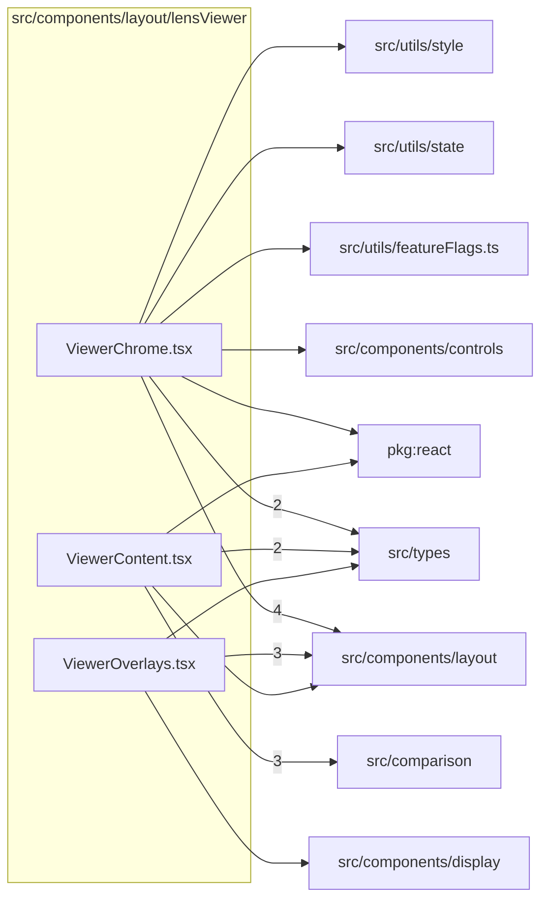

# src/components/layout/lensViewer

This folder LensViewer chrome, content routing, and overlay composition.

Generated `readme.md` and `improvementsuggestions.md` files are intentionally omitted from the per-file inventory so this document stays focused on source relationships.

## Relationship Diagram

## Directory Overview

- Direct source files: 3
- Direct subfolders: 0
- Main outbound areas: src/components/layout (8), src/types (5), src/comparison (3), package:react (2), src/components/controls, src/components/display, src/utils/featureFlags.ts, src/utils/state, +1 more
- External consumers: src/components/layout

## Files

| File | Role | Imports from | Imported by | Exports |
| --- | --- | --- | --- | --- |
| `ViewerChrome.tsx` | React component module | src/components/layout (4), src/types (2), package:react, src/components/controls, src/utils/featureFlags.ts, +2 more | src/components/layout | default, ViewerChrome |
| `ViewerContent.tsx` | React component module | src/comparison (3), src/types (2), package:react, src/components/layout | src/components/layout | default, ViewerContent |
| `ViewerOverlays.tsx` | React component module | src/components/layout (3), src/components/display, src/types | src/components/layout | default, ViewerOverlays |

