# src/components/layout

This folder viewer-level layout, page chrome, panels, drawers, top navigation, and overlay shells.

Generated `readme.md` and `improvementsuggestions.md` files are intentionally omitted from the per-file inventory so this document stays focused on source relationships.

## Relationship Diagram

```mermaid
flowchart LR
  subgraph n_src_components_layout["src/components/layout"]
    n_src_components_layout_src_components_layout_lensDiagram["lensDiagram/"]
    n_src_components_layout_src_components_layout_lensViewer["lensViewer/"]
    n_src_components_layout_src_components_layout_AnalysisDrawer_tsx["AnalysisDrawer.tsx"]
    n_src_components_layout_src_components_layout_BreadcrumbBar_tsx["BreadcrumbBar.tsx"]
    n_src_components_layout_src_components_layout_ControlsBar_tsx["ControlsBar.tsx"]
    n_src_components_layout_src_components_layout_DescriptionPanel_tsx["DescriptionPanel.tsx"]
    n_src_components_layout_src_components_layout_DiagramControlPanel_tsx["DiagramControlPanel.tsx"]
    n_src_components_layout_src_components_layout_DropdownPanel_tsx["DropdownPanel.tsx"]
    n_src_components_layout_src_components_layout_LensDiagramPanel_tsx["LensDiagramPanel.tsx"]
    n_src_components_layout_src_components_layout_LensViewer_tsx["LensViewer.tsx"]
    n_src_components_layout_src_components_layout_OverlayModal_tsx["OverlayModal.tsx"]
    n_src_components_layout_src_components_layout_PageNavBar_tsx["PageNavBar.tsx"]
    n_src_components_layout_src_components_layout_PanelOverlay_tsx["PanelOverlay.tsx"]
    n_src_components_layout_src_components_layout_PrimerToggleButton_tsx["PrimerToggleButton.tsx"]
    n_src_components_layout_src_components_layout_SingleLensContent_tsx["SingleLensContent.tsx"]
    n_src_components_layout_src_components_layout_StaticPageShell_tsx["StaticPageShell.tsx"]
    n_src_components_layout_src_components_layout_TopBar_tsx["TopBar.tsx"]
    n_src_components_layout_src_components_layout_ViewToggleBar_tsx["ViewToggleBar.tsx"]
  end
  n_external_src_components_hooks["src/components/hooks"]
  n_external_src_utils_state["src/utils/state"]
  n_external_src_types["src/types"]
  n_external_src_utils_catalog["src/utils/catalog"]
  n_external_pkg_react["pkg:react"]
  n_external_src_components_display["src/components/display"]
  n_external_src_pages_lensIndex["src/pages/lensIndex"]
  n_external_src_utils_theme["src/utils/theme"]
  n_external_pkg_react_dom["pkg:react-dom"]
  n_external_pkg_react_router["pkg:react-router"]
  n_external_src_comparison["src/comparison"]
  n_external_src_components_controls["src/components/controls"]
  n_src_components_layout_src_components_layout_LensDiagramPanel_tsx --> |8| n_external_src_components_hooks
  n_src_components_layout_src_components_layout_LensViewer_tsx --> |5| n_external_src_utils_state
  n_src_components_layout_src_components_layout_DiagramControlPanel_tsx --> |4| n_external_src_types
  n_src_components_layout_src_components_layout_BreadcrumbBar_tsx --> |3| n_external_src_utils_catalog
  n_src_components_layout_src_components_layout_LensDiagramPanel_tsx --> |3| n_src_components_layout_src_components_layout_lensDiagram
  n_src_components_layout_src_components_layout_LensViewer_tsx --> |3| n_src_components_layout_src_components_layout_lensViewer
  n_src_components_layout_src_components_layout_DropdownPanel_tsx --> |2| n_external_pkg_react
  n_src_components_layout_src_components_layout_DiagramControlPanel_tsx --> |2| n_external_src_components_display
  n_src_components_layout_src_components_layout_BreadcrumbBar_tsx --> |2| n_external_src_pages_lensIndex
  n_src_components_layout_src_components_layout_AnalysisDrawer_tsx --> |2| n_external_src_types
  n_src_components_layout_src_components_layout_ControlsBar_tsx --> |2| n_external_src_types
  n_src_components_layout_src_components_layout_LensDiagramPanel_tsx --> |2| n_external_src_types
  n_src_components_layout_src_components_layout_SingleLensContent_tsx --> |2| n_external_src_types
  n_src_components_layout_src_components_layout_BreadcrumbBar_tsx --> |2| n_external_src_utils_state
  n_src_components_layout_src_components_layout_LensDiagramPanel_tsx --> |2| n_external_src_utils_state
  n_src_components_layout_src_components_layout_BreadcrumbBar_tsx --> |2| n_external_src_utils_theme
  n_src_components_layout_src_components_layout_PageNavBar_tsx --> |2| n_external_src_utils_theme
  n_src_components_layout_src_components_layout_BreadcrumbBar_tsx --> |2| n_src_components_layout_src_components_layout_DropdownPanel_tsx
  n_src_components_layout_src_components_layout_AnalysisDrawer_tsx --> n_external_pkg_react
  n_src_components_layout_src_components_layout_BreadcrumbBar_tsx --> n_external_pkg_react
  n_src_components_layout_src_components_layout_ControlsBar_tsx --> n_external_pkg_react
  n_src_components_layout_src_components_layout_DescriptionPanel_tsx --> n_external_pkg_react
  n_src_components_layout_src_components_layout_LensDiagramPanel_tsx --> n_external_pkg_react
  n_src_components_layout_src_components_layout_LensViewer_tsx --> n_external_pkg_react
  n_src_components_layout_src_components_layout_OverlayModal_tsx --> n_external_pkg_react
  n_src_components_layout_src_components_layout_PageNavBar_tsx --> n_external_pkg_react
  n_src_components_layout_src_components_layout_PanelOverlay_tsx --> n_external_pkg_react
  n_src_components_layout_src_components_layout_StaticPageShell_tsx --> n_external_pkg_react
  n_src_components_layout_src_components_layout_DropdownPanel_tsx --> n_external_pkg_react_dom
  n_src_components_layout_src_components_layout_BreadcrumbBar_tsx --> n_external_pkg_react_router
  n_src_components_layout_src_components_layout_LensViewer_tsx --> n_external_pkg_react_router
  n_src_components_layout_src_components_layout_StaticPageShell_tsx --> n_external_pkg_react_router
  n_src_components_layout_src_components_layout_LensViewer_tsx --> n_external_src_comparison
  n_src_components_layout_src_components_layout_ControlsBar_tsx --> n_external_src_components_controls
  n_src_components_layout_src_components_layout_DiagramControlPanel_tsx --> n_external_src_components_controls
  n_src_components_layout_src_components_layout_LensDiagramPanel_tsx --> n_external_src_components_controls
  n_src_components_layout_truncated["additional relationships omitted"]
```

## Directory Overview

- Direct source files: 16
- Direct subfolders: 2
- Main outbound areas: src/types (22), package:react (12), same folder (11), src/utils/state (10), src/components/hooks (9), src/utils/style (8), src/utils/theme (7), src/components/controls (4), +19 more
- External consumers: src/comparison, src/components/controls, src/components/layout, src/pages/ArticlePage.tsx, src/pages/ArticlesPage.tsx, src/pages/ComparePage.tsx, src/pages/FormatPage.tsx, src/pages/FormatsIndexPage.tsx, +9 more

## Subfolders

| Folder | Role |
| --- | --- |
| [lensDiagram/](lensDiagram/readme.md) | lens diagram panel state, viewport, loading/error states, and analysis drawer wiring |
| [lensViewer/](lensViewer/readme.md) | LensViewer chrome, content routing, and overlay composition |

## Files

| File | Role | Imports from | Imported by | Exports |
| --- | --- | --- | --- | --- |
| `AnalysisDrawer.tsx` | React component module | src/types (2), package:react | same folder (2) | AnalysisTab, default, AnalysisDrawer |
| `BreadcrumbBar.tsx` | React component module | src/utils/catalog (3), same folder (2), src/pages/lensIndex (2), src/utils/state (2), src/utils/theme (2), +4 more | same folder | default, BreadcrumbBar |
| `ControlsBar.tsx` | React component module | src/types (2), package:react, src/components/controls, src/utils/featureFlags.ts, src/utils/state, +1 more | same folder | default, ControlsBar |
| `DescriptionPanel.tsx` | React component module | package:react, src/components/markdown, src/types | same folder (2) | default, DescriptionPanel |
| `DiagramControlPanel.tsx` | React component module | src/types (4), src/components/display (2), src/components/controls | same folder | default, DiagramControlPanel |
| `DropdownPanel.tsx` | React component module | package:react (2), package:react-dom, src/types | same folder, src/components/controls | DropdownPanelPos, default |
| `LensDiagramPanel.tsx` | React component module | src/components/hooks (8), same folder (3), src/types (2), src/utils/state (2), package:react, +8 more | same folder, src/comparison | default, LensDiagramPanel |
| `LensViewer.tsx` | React component module | src/utils/state (5), same folder (3), package:react, package:react-router, src/comparison, +11 more | src/pages/ComparePage.tsx, src/pages/LensPage.tsx | default, LensVisualization |
| `OverlayModal.tsx` | React component module | package:react, src/types, src/utils/style | same folder (2) | default, OverlayModal |
| `PageNavBar.tsx` | React component module | src/utils/theme (2), package:react, src/types, src/utils/style, src/utils/useMediaQuery.ts | same folder, src/pages/ArticlePage.tsx, src/pages/ArticlesPage.tsx, src/pages/FormatPage.tsx, src/pages/FormatsIndexPage.tsx, +7 more | default, PageNavBar |
| `PanelOverlay.tsx` | React component module | package:react, src/types, src/utils/style | same folder | default, PanelOverlay |
| `PrimerToggleButton.tsx` | React component module | src/types | same folder | default, PrimerToggleButton |
| `SingleLensContent.tsx` | React component module | same folder (2), src/types (2) | same folder | default, SingleLensContent |
| `StaticPageShell.tsx` | React component module | package:react, package:react-router, same folder, src/types, src/utils/style, +1 more | src/pages/UpdatesPage.tsx | default, StaticPageShell |
| `TopBar.tsx` | React component module | src/components/controls, src/components/display, src/types, src/utils/style | same folder | default, TopBar |
| `ViewToggleBar.tsx` | React component module | src/types, src/utils/style | same folder | default, ViewToggleBar |

