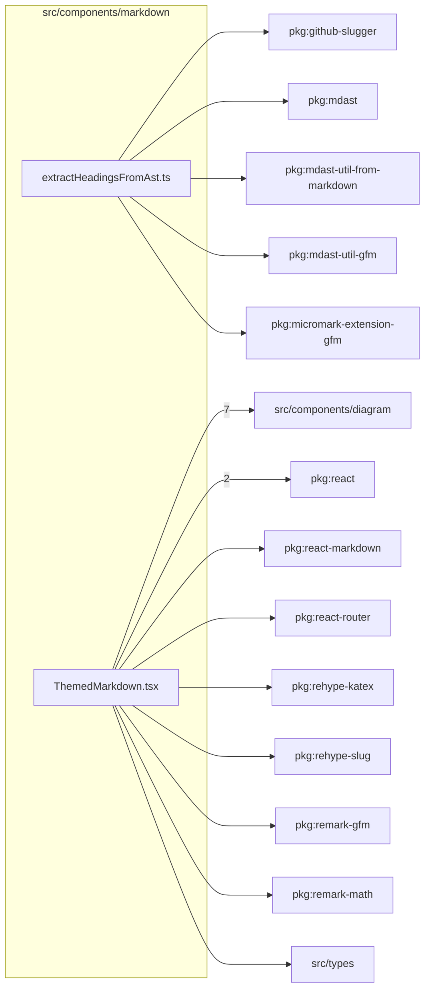

# src/components/markdown

This folder shared markdown rendering and heading extraction for articles and lens notes.

Generated `readme.md` and `improvementsuggestions.md` files are intentionally omitted from the per-file inventory so this document stays focused on source relationships.

## Relationship Diagram

## Directory Overview

- Direct source files: 2
- Direct subfolders: 0
- Main outbound areas: src/components/diagram (7), package:react (2), package:github-slugger, package:mdast, package:mdast-util-from-markdown, package:mdast-util-gfm, package:micromark-extension-gfm, package:react-markdown, +6 more
- External consumers: src/components/content, src/components/layout, src/pages/ArticlePage.tsx

## Files

| File | Role | Imports from | Imported by | Exports |
| --- | --- | --- | --- | --- |
| `extractHeadingsFromAst.ts` | Extract Headings From Ast helper module | package:github-slugger, package:mdast, package:mdast-util-from-markdown, package:mdast-util-gfm, package:micromark-extension-gfm | src/components/content | ASTHeading, extractHeadingsFromAst |
| `ThemedMarkdown.tsx` | React component module | src/components/diagram (7), package:react (2), package:react-markdown, package:react-router, package:rehype-katex, +4 more | src/components/layout, src/pages/ArticlePage.tsx | default, ThemedMarkdown |

