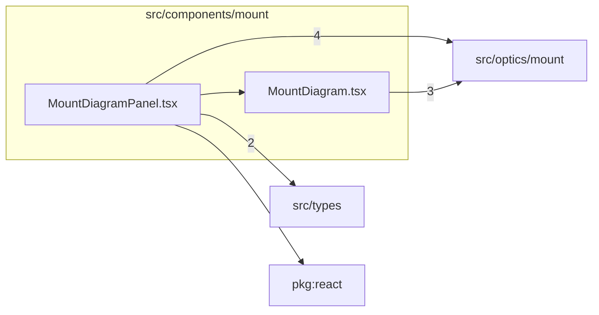

# src/components/mount

This folder React mount-diagram rendering panels backed by the pure mount optics renderer.

Generated `readme.md` and `improvementsuggestions.md` files are intentionally omitted from the per-file inventory so this document stays focused on source relationships.

## Relationship Diagram

## Directory Overview

- Direct source files: 2
- Direct subfolders: 0
- Main outbound areas: src/optics/mount (7), src/types (2), package:react, same folder
- External consumers: src/pages/MountPage.tsx

## Files

| File | Role | Imports from | Imported by | Exports |
| --- | --- | --- | --- | --- |
| `MountDiagram.tsx` | React component module | src/optics/mount (3) | same folder | default, MountDiagram |
| `MountDiagramPanel.tsx` | React component module | src/optics/mount (4), src/types (2), package:react, same folder | src/pages/MountPage.tsx | default, MountDiagramPanel |

