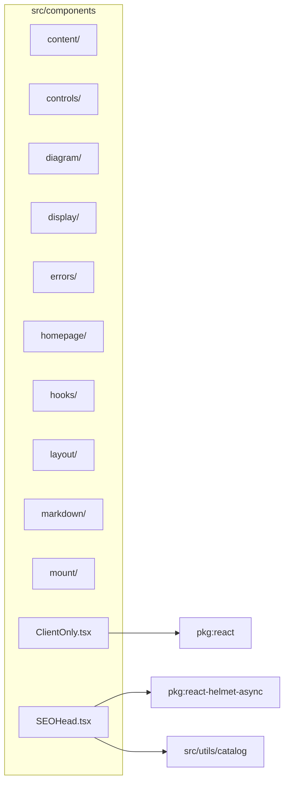

# src/components

This folder React UI component root for page chrome, controls, SVG diagrams, analysis display, markdown, hooks, mount diagrams, and error boundaries.

Generated `readme.md` and `improvementsuggestions.md` files are intentionally omitted from the per-file inventory so this document stays focused on source relationships.

## Relationship Diagram

## Directory Overview

- Direct source files: 2
- Direct subfolders: 10
- Main outbound areas: package:react, package:react-helmet-async, src/utils/catalog
- External consumers: src/pages/ArticlePage.tsx, src/pages/ArticlesPage.tsx, src/pages/ComparePage.tsx, src/pages/FormatPage.tsx, src/pages/FormatsIndexPage.tsx, src/pages/HomePage.tsx, src/pages/LensIndexPage.tsx, src/pages/LensPage.tsx, +6 more

## Subfolders

| Folder | Role |
| --- | --- |
| [content/](content/readme.md) | content-listing UI used by article, changelog, sidebar, and archive routes |
| [controls/](controls/readme.md) | shared viewer controls for sliders, toggles, diagram headers, selectors, and tooltips |
| [diagram/](diagram/readme.md) | inline SVG diagram layers and overlays for optical geometry, rays, pupils, MTF, chromatic widgets, and labels |
| [display/](display/readme.md) | display-domain UI for inspectors, legends, analysis panels, charts, and overlay helpers |
| [errors/](errors/readme.md) | page and panel error boundaries plus shared error display UI |
| [homepage/](homepage/readme.md) | home page section components for the public landing surface |
| [hooks/](hooks/readme.md) | viewer computation and interaction hooks for layout, ray tracing, overlays, zoom, and responsive state |
| [layout/](layout/readme.md) | viewer-level layout, page chrome, panels, drawers, top navigation, and overlay shells |
| [markdown/](markdown/readme.md) | shared markdown rendering and heading extraction for articles and lens notes |
| [mount/](mount/readme.md) | React mount-diagram rendering panels backed by the pure mount optics renderer |

## Files

| File | Role | Imports from | Imported by | Exports |
| --- | --- | --- | --- | --- |
| `ClientOnly.tsx` | React component module | package:react | src/pages/ComparePage.tsx, src/pages/LensPage.tsx | default, ClientOnly |
| `SEOHead.tsx` | React component module | package:react-helmet-async, src/utils/catalog | src/pages/ArticlePage.tsx, src/pages/ArticlesPage.tsx, src/pages/ComparePage.tsx, src/pages/FormatPage.tsx, src/pages/FormatsIndexPage.tsx, +9 more | JsonLdSchema, default, SEOHead |

