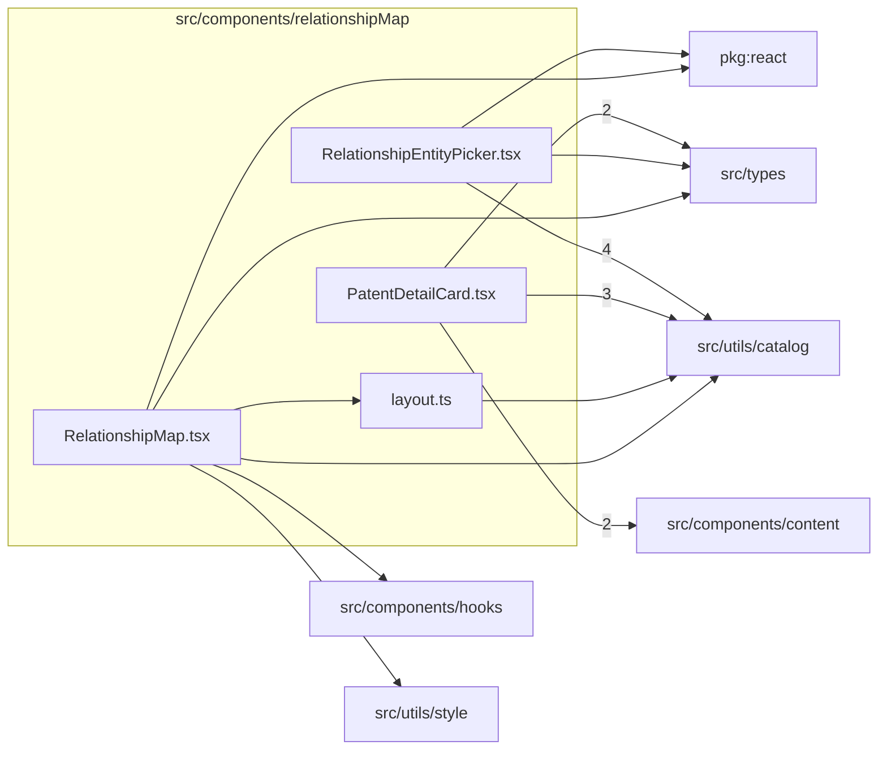

# src/components/relationshipMap

This folder src/components/relationshipMap source folder.

Generated `readme.md` and `improvementsuggestions.md` files are intentionally omitted from the per-file inventory so this document stays focused on source relationships.

## Relationship Diagram

## Directory Overview

- Direct source files: 4
- Direct subfolders: 0
- Main outbound areas: src/utils/catalog (9), src/types (4), package:react (2), src/components/content (2), same folder, src/components/hooks, src/utils/style
- External consumers: src/pages/RelationshipMapPage.tsx

## Files

| File | Role | Imports from | Imported by | Exports |
| --- | --- | --- | --- | --- |
| `layout.ts` | Layout helper module | src/utils/catalog | same folder | LayoutNode, LayoutEdge, RelationshipLayout, truncateLabel, layoutRelationshipGraph |
| `PatentDetailCard.tsx` | React component module | src/utils/catalog (3), src/components/content (2), src/types (2) | src/pages/RelationshipMapPage.tsx | default, PatentDetailCard |
| `RelationshipEntityPicker.tsx` | React component module | src/utils/catalog (4), package:react, src/types | src/pages/RelationshipMapPage.tsx | default, RelationshipEntityPicker |
| `RelationshipMap.tsx` | React component module | package:react, same folder, src/components/hooks, src/types, src/utils/catalog, +1 more | src/pages/RelationshipMapPage.tsx | default, RelationshipMap |
