# src/components/relationshipMap

This folder src/components/relationshipMap source folder.

Generated `readme.md` and `improvementsuggestions.md` files are intentionally omitted from the per-file inventory so this document stays focused on source relationships.

## Relationship Diagram

```mermaid
flowchart LR
  subgraph n_src_components_relationshipMap["src/components/relationshipMap"]
    n_src_components_relationshipMap_src_components_relationshipMap_constellationAffinity_ts["constellationAffinity.ts"]
    n_src_components_relationshipMap_src_components_relationshipMap_layout_ts["layout.ts"]
    n_src_components_relationshipMap_src_components_relationshipMap_PatentDetailCard_tsx["PatentDetailCard.tsx"]
    n_src_components_relationshipMap_src_components_relationshipMap_RelationshipEntityPicker_tsx["RelationshipEntityPicker.tsx"]
    n_src_components_relationshipMap_src_components_relationshipMap_RelationshipMap_tsx["RelationshipMap.tsx"]
    n_src_components_relationshipMap_src_components_relationshipMap_roleChip_ts["roleChip.ts"]
    n_src_components_relationshipMap_src_components_relationshipMap_UniversalEntityDetailCard_tsx["UniversalEntityDetailCard.tsx"]
    n_src_components_relationshipMap_src_components_relationshipMap_universalLayout_ts["universalLayout.ts"]
    n_src_components_relationshipMap_src_components_relationshipMap_UniversalMapSearch_tsx["UniversalMapSearch.tsx"]
    n_src_components_relationshipMap_src_components_relationshipMap_UniversalRelationshipMap_tsx["UniversalRelationshipMap.tsx"]
  end
  n_external_src_utils_catalog["src/utils/catalog"]
  n_external_src_components_content["src/components/content"]
  n_external_src_types["src/types"]
  n_external_pkg_react["pkg:react"]
  n_external_pkg_react_router["pkg:react-router"]
  n_external_src_components_hooks["src/components/hooks"]
  n_external_src_components_layout["src/components/layout"]
  n_external_src_utils_style["src/utils/style"]
  n_external_src_utils_text_ts["src/utils/text.ts"]
  n_src_components_relationshipMap_src_components_relationshipMap_RelationshipEntityPicker_tsx --> |4| n_external_src_utils_catalog
  n_src_components_relationshipMap_src_components_relationshipMap_PatentDetailCard_tsx --> |3| n_external_src_components_content
  n_src_components_relationshipMap_src_components_relationshipMap_PatentDetailCard_tsx --> |3| n_external_src_utils_catalog
  n_src_components_relationshipMap_src_components_relationshipMap_PatentDetailCard_tsx --> |2| n_external_src_types
  n_src_components_relationshipMap_src_components_relationshipMap_roleChip_ts --> |2| n_external_src_types
  n_src_components_relationshipMap_src_components_relationshipMap_constellationAffinity_ts --> |2| n_external_src_utils_catalog
  n_src_components_relationshipMap_src_components_relationshipMap_UniversalEntityDetailCard_tsx --> |2| n_external_src_utils_catalog
  n_src_components_relationshipMap_src_components_relationshipMap_universalLayout_ts --> |2| n_external_src_utils_catalog
  n_src_components_relationshipMap_src_components_relationshipMap_UniversalMapSearch_tsx --> |2| n_external_src_utils_catalog
  n_src_components_relationshipMap_src_components_relationshipMap_PatentDetailCard_tsx --> n_external_pkg_react
  n_src_components_relationshipMap_src_components_relationshipMap_RelationshipEntityPicker_tsx --> n_external_pkg_react
  n_src_components_relationshipMap_src_components_relationshipMap_RelationshipMap_tsx --> n_external_pkg_react
  n_src_components_relationshipMap_src_components_relationshipMap_roleChip_ts --> n_external_pkg_react
  n_src_components_relationshipMap_src_components_relationshipMap_UniversalEntityDetailCard_tsx --> n_external_pkg_react
  n_src_components_relationshipMap_src_components_relationshipMap_UniversalMapSearch_tsx --> n_external_pkg_react
  n_src_components_relationshipMap_src_components_relationshipMap_UniversalRelationshipMap_tsx --> n_external_pkg_react
  n_src_components_relationshipMap_src_components_relationshipMap_UniversalEntityDetailCard_tsx --> n_external_pkg_react_router
  n_src_components_relationshipMap_src_components_relationshipMap_RelationshipEntityPicker_tsx --> n_external_src_components_hooks
  n_src_components_relationshipMap_src_components_relationshipMap_RelationshipMap_tsx --> n_external_src_components_hooks
  n_src_components_relationshipMap_src_components_relationshipMap_UniversalRelationshipMap_tsx --> n_external_src_components_hooks
  n_src_components_relationshipMap_src_components_relationshipMap_UniversalMapSearch_tsx --> n_external_src_components_layout
  n_src_components_relationshipMap_src_components_relationshipMap_RelationshipEntityPicker_tsx --> n_external_src_types
  n_src_components_relationshipMap_src_components_relationshipMap_RelationshipMap_tsx --> n_external_src_types
  n_src_components_relationshipMap_src_components_relationshipMap_UniversalEntityDetailCard_tsx --> n_external_src_types
  n_src_components_relationshipMap_src_components_relationshipMap_UniversalMapSearch_tsx --> n_external_src_types
  n_src_components_relationshipMap_src_components_relationshipMap_UniversalRelationshipMap_tsx --> n_external_src_types
  n_src_components_relationshipMap_src_components_relationshipMap_layout_ts --> n_external_src_utils_catalog
  n_src_components_relationshipMap_src_components_relationshipMap_RelationshipMap_tsx --> n_external_src_utils_catalog
  n_src_components_relationshipMap_src_components_relationshipMap_UniversalRelationshipMap_tsx --> n_external_src_utils_catalog
  n_src_components_relationshipMap_src_components_relationshipMap_PatentDetailCard_tsx --> n_external_src_utils_style
  n_src_components_relationshipMap_src_components_relationshipMap_RelationshipEntityPicker_tsx --> n_external_src_utils_style
  n_src_components_relationshipMap_src_components_relationshipMap_RelationshipMap_tsx --> n_external_src_utils_style
  n_src_components_relationshipMap_src_components_relationshipMap_UniversalEntityDetailCard_tsx --> n_external_src_utils_style
  n_src_components_relationshipMap_src_components_relationshipMap_UniversalMapSearch_tsx --> n_external_src_utils_style
  n_src_components_relationshipMap_src_components_relationshipMap_UniversalRelationshipMap_tsx --> n_external_src_utils_style
  n_src_components_relationshipMap_src_components_relationshipMap_RelationshipEntityPicker_tsx --> n_external_src_utils_text_ts
  n_src_components_relationshipMap_truncated["additional relationships omitted"]
```

## Directory Overview

- Direct source files: 10
- Direct subfolders: 0
- Main outbound areas: src/utils/catalog (18), src/types (9), package:react (7), src/utils/style (6), same folder (5), src/utils/text.ts (4), src/components/content (3), src/components/hooks (3), +2 more
- External consumers: src/pages/RelationshipMapPage.tsx, src/pages/UniversalRelationshipMapPage.tsx

## Files

| File | Role | Imports from | Imported by | Exports |
| --- | --- | --- | --- | --- |
| `constellationAffinity.ts` | Constellation Affinity helper module | src/utils/catalog (2) | same folder | ConstellationClusterCandidate, ConstellationAffinity, ConstellationAffinityMap, buildConstellationAffinities, constellationAffinityBetween, compareConstellationClusterPriority, orderConstellationOrbit |
| `layout.ts` | Layout helper module | src/utils/catalog | same folder (2) | LayoutNode, LayoutEdge, RelationshipLayout, truncateLabel, layoutRelationshipGraph |
| `PatentDetailCard.tsx` | React component module | src/components/content (3), src/utils/catalog (3), src/types (2), package:react, src/utils/style | src/pages/RelationshipMapPage.tsx, src/pages/UniversalRelationshipMapPage.tsx | default, PatentDetailCard |
| `RelationshipEntityPicker.tsx` | React component module | src/utils/catalog (4), package:react, same folder, src/components/hooks, src/types, +2 more | src/pages/RelationshipMapPage.tsx | default, RelationshipEntityPicker |
| `RelationshipMap.tsx` | React component module | package:react, same folder, src/components/hooks, src/types, src/utils/catalog, +2 more | src/pages/RelationshipMapPage.tsx | default, RelationshipMap |
| `roleChip.ts` | Role Chip module with default export | src/types (2), package:react | same folder, src/pages/RelationshipMapPage.tsx | default, roleChip |
| `UniversalEntityDetailCard.tsx` | React component module | src/utils/catalog (2), package:react, package:react-router, src/types, src/utils/style, +1 more | src/pages/UniversalRelationshipMapPage.tsx | default, UniversalEntityDetailCard |
| `universalLayout.ts` | Universal Layout helper module | same folder (2), src/utils/catalog (2) | same folder | UniversalLayoutNode, UniversalLayoutEdge, UniversalLayoutCluster, UniversalLayoutComponent, UniversalRelationshipLayout, universalNodeRadius, layoutUniversalRelationshipGraph |
| `UniversalMapSearch.tsx` | React component module | src/utils/catalog (2), package:react, src/components/layout, src/types, src/utils/style | src/pages/UniversalRelationshipMapPage.tsx | default, UniversalMapSearch |
| `UniversalRelationshipMap.tsx` | React component module | package:react, same folder, src/components/hooks, src/types, src/utils/catalog, +2 more | src/pages/UniversalRelationshipMapPage.tsx | default, UniversalRelationshipMap |
