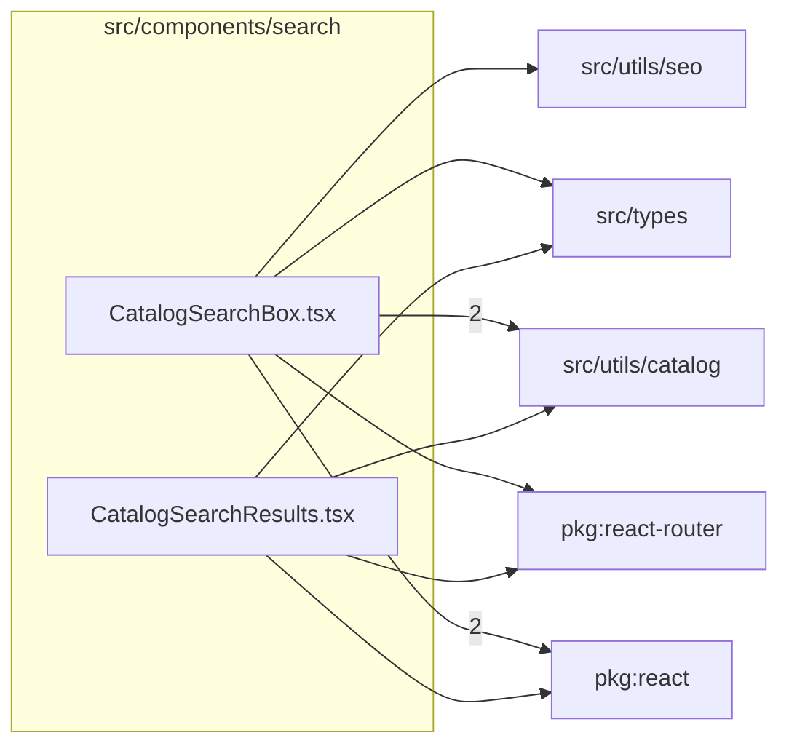

# src/components/search

This folder src/components/search source folder.

Generated `readme.md` and `improvementsuggestions.md` files are intentionally omitted from the per-file inventory so this document stays focused on source relationships.

## Relationship Diagram

## Directory Overview

- Direct source files: 2
- Direct subfolders: 0
- Main outbound areas: package:react (3), src/utils/catalog (3), package:react-router (2), src/types (2), src/utils/seo
- External consumers: src/pages/HomePage.tsx, src/pages/SearchPage.tsx

## Files

| File | Role | Imports from | Imported by | Exports |
| --- | --- | --- | --- | --- |
| `CatalogSearchBox.tsx` | React component module | package:react (2), src/utils/catalog (2), package:react-router, src/types, src/utils/seo | src/pages/HomePage.tsx, src/pages/SearchPage.tsx | default, CatalogSearchBox |
| `CatalogSearchResults.tsx` | React component module | package:react, package:react-router, src/types, src/utils/catalog | src/pages/SearchPage.tsx | default, CatalogSearchResults |

