# src/content/focusing-architecture

This folder article series content about focusing architecture patterns.

Generated `readme.md` and `improvementsuggestions.md` files are intentionally omitted from the per-file inventory so this document stays focused on source relationships.

## Relationship Diagram

```mermaid
flowchart LR
  subgraph n_src_content_focusing_architecture["src/content/focusing-architecture"]
    n_src_content_focusing_architecture_src_content_focusing_architecture_FocusingArchitecturesIndex_md["FocusingArchitecturesIndex.md"]
    n_src_content_focusing_architecture_src_content_focusing_architecture_FocusingDualSide_md["FocusingDualSide.md"]
    n_src_content_focusing_architecture_src_content_focusing_architecture_FocusingFrontOfStop_md["FocusingFrontOfStop.md"]
    n_src_content_focusing_architecture_src_content_focusing_architecture_FocusingMonolithic_md["FocusingMonolithic.md"]
    n_src_content_focusing_architecture_src_content_focusing_architecture_FocusingRearGroupRetrofocus_md["FocusingRearGroupRetrofocus.md"]
    n_src_content_focusing_architecture_src_content_focusing_architecture_FocusingRearOfStop_md["FocusingRearOfStop.md"]
    n_src_content_focusing_architecture_src_content_focusing_architecture_FocusingUnitFloating_md["FocusingUnitFloating.md"]
    n_src_content_focusing_architecture_src_content_focusing_architecture_FocusingUnitFocusing_md["FocusingUnitFocusing.md"]
    n_src_content_focusing_architecture_src_content_focusing_architecture_InternalFocusingMonograph_md["InternalFocusingMonograph.md"]
  end
```

## Directory Overview

- Direct source files: 9
- Direct subfolders: 0
- Main outbound areas: none
- External consumers: none

## Files

| File | Role | Imports from | Imported by | Exports |
| --- | --- | --- | --- | --- |
| `FocusingArchitecturesIndex.md` | Markdown content: Focusing Architectures in Photographic Lenses | none | none | content |
| `FocusingDualSide.md` | Markdown content: Dual-Side Focusing | none | none | content |
| `FocusingFrontOfStop.md` | Markdown content: Front-of-Stop Focusing | none | none | content |
| `FocusingMonolithic.md` | Markdown content: Monolithic Group Focusing | none | none | content |
| `FocusingRearGroupRetrofocus.md` | Markdown content: Rear-Group Retrofocus Focusing | none | none | content |
| `FocusingRearOfStop.md` | Markdown content: Rear-of-Stop Focusing | none | none | content |
| `FocusingUnitFloating.md` | Markdown content: Unit Focusing with Floating Elements | none | none | content |
| `FocusingUnitFocusing.md` | Markdown content: Unit Focusing | none | none | content |
| `InternalFocusingMonograph.md` | Markdown content: Internal Focusing Architectures — Aberration Theory and Design Tradeoffs | none | none | content |

