# src/content/manufacturer-lens-stories

This folder src/content/manufacturer-lens-stories source folder.

Generated `readme.md` and `improvementsuggestions.md` files are intentionally omitted from the per-file inventory so this document stays focused on source relationships.

## Relationship Diagram

```mermaid
flowchart LR
  subgraph n_src_content_manufacturer_lens_stories["src/content/manufacturer-lens-stories"]
    n_src_content_manufacturer_lens_stories_src_content_manufacturer_lens_stories_CanonRFLensDevelopmentStoriesIndex_md["CanonRFLensDevelopmentStoriesIndex.md"]
    n_src_content_manufacturer_lens_stories_src_content_manufacturer_lens_stories_FujifilmOneLensOneStoryIndex_md["FujifilmOneLensOneStoryIndex.md"]
    n_src_content_manufacturer_lens_stories_src_content_manufacturer_lens_stories_LeicaCentennialLensStoriesIndex_md["LeicaCentennialLensStoriesIndex.md"]
    n_src_content_manufacturer_lens_stories_src_content_manufacturer_lens_stories_ManufacturerLensStoriesIndex_md["ManufacturerLensStoriesIndex.md"]
    n_src_content_manufacturer_lens_stories_src_content_manufacturer_lens_stories_NikonThousandAndOneNightsIndex_md["NikonThousandAndOneNightsIndex.md"]
    n_src_content_manufacturer_lens_stories_src_content_manufacturer_lens_stories_PanasonicLumixDevelopmentStoriesIndex_md["PanasonicLumixDevelopmentStoriesIndex.md"]
    n_src_content_manufacturer_lens_stories_src_content_manufacturer_lens_stories_PentaxLensDevelopmentStoriesIndex_md["PentaxLensDevelopmentStoriesIndex.md"]
    n_src_content_manufacturer_lens_stories_src_content_manufacturer_lens_stories_SigmaOhsonesAnecdotesIndex_md["SigmaOhsonesAnecdotesIndex.md"]
    n_src_content_manufacturer_lens_stories_src_content_manufacturer_lens_stories_TamronLensDevelopmentHistoriesIndex_md["TamronLensDevelopmentHistoriesIndex.md"]
  end
```

## Directory Overview

- Direct source files: 9
- Direct subfolders: 0
- Main outbound areas: none
- External consumers: none

## Files

| File | Role | Imports from | Imported by | Exports |
| --- | --- | --- | --- | --- |
| `CanonRFLensDevelopmentStoriesIndex.md` | Markdown content: Canon: RF Lens Developer Stories | none | none | content |
| `FujifilmOneLensOneStoryIndex.md` | Markdown content: Fujifilm: One Lens, One Story | none | none | content |
| `LeicaCentennialLensStoriesIndex.md` | Markdown content: Leica: Centennial Lens Stories | none | none | content |
| `ManufacturerLensStoriesIndex.md` | Markdown content: Lens Stories from the Manufacturers | none | none | content |
| `NikonThousandAndOneNightsIndex.md` | Markdown content: Nikon: NIKKOR — The Thousand and One Nights | none | none | content |
| `PanasonicLumixDevelopmentStoriesIndex.md` | Markdown content: Panasonic: LUMIX Lens Development Stories | none | none | content |
| `PentaxLensDevelopmentStoriesIndex.md` | Markdown content: Pentax: Lens Development Stories | none | none | content |
| `SigmaOhsonesAnecdotesIndex.md` | Markdown content: SIGMA: Ohsone's Anecdotes | none | none | content |
| `TamronLensDevelopmentHistoriesIndex.md` | Markdown content: Tamron: Lens Development Histories | none | none | content |

