# src/content/pupils

This folder article series content about aperture stops, pupils, telecentricity, and illumination.

Generated `readme.md` and `improvementsuggestions.md` files are intentionally omitted from the per-file inventory so this document stays focused on source relationships.

## Relationship Diagram

```mermaid
flowchart LR
  subgraph n_src_content_pupils["src/content/pupils"]
    n_src_content_pupils_src_content_pupils_ApertureStopMonograph_md["ApertureStopMonograph.md"]
    n_src_content_pupils_src_content_pupils_CornerIllumination_md["CornerIllumination.md"]
    n_src_content_pupils_src_content_pupils_EntrancePupil_md["EntrancePupil.md"]
    n_src_content_pupils_src_content_pupils_ExitPupil_md["ExitPupil.md"]
    n_src_content_pupils_src_content_pupils_MirrorlessDesign_md["MirrorlessDesign.md"]
    n_src_content_pupils_src_content_pupils_ProjectionCenter_md["ProjectionCenter.md"]
    n_src_content_pupils_src_content_pupils_PupilGeometryIndex_md["PupilGeometryIndex.md"]
    n_src_content_pupils_src_content_pupils_Telecentricity_md["Telecentricity.md"]
    n_src_content_pupils_src_content_pupils_WorkingFNumber_md["WorkingFNumber.md"]
  end
```

## Directory Overview

- Direct source files: 9
- Direct subfolders: 0
- Main outbound areas: none
- External consumers: none

## Files

| File | Role | Imports from | Imported by | Exports |
| --- | --- | --- | --- | --- |
| `ApertureStopMonograph.md` | Markdown content: The Aperture Stop in Practice: Entrance Pupil, Exit Pupil, and Telecentricity | none | none | content |
| `CornerIllumination.md` | Markdown content: Why Corners Go Dark — The Three Causes of Light Falloff in Photographic Lenses | none | none | content |
| `EntrancePupil.md` | Markdown content: What Is the Entrance Pupil? The Aperture Your Lens Shows the World | none | none | content |
| `ExitPupil.md` | Markdown content: The Exit Pupil and Your Digital Sensor — Chief-Ray Angle, Microlens Arrays, and Color Cast | none | none | content |
| `MirrorlessDesign.md` | Markdown content: Mirrorless vs. SLR Lens Design — How Mount Geometry Shapes Image Quality | none | none | content |
| `ProjectionCenter.md` | Markdown content: The Entrance Pupil as Projection Center — Perspective, Panoramas, and the "Nodal Point" Myth | none | none | content |
| `PupilGeometryIndex.md` | Markdown content: Pupil Geometry in Photographic Lenses | none | none | content |
| `Telecentricity.md` | Markdown content: Telecentricity Explained — What It Actually Means and What It Costs | none | none | content |
| `WorkingFNumber.md` | Markdown content: Working f-Number — Why Macro Photographers Lose Light | none | none | content |

