# src/content

This folder auto-discovered markdown articles and static site content.

Generated `readme.md` and `improvementsuggestions.md` files are intentionally omitted from the per-file inventory so this document stays focused on source relationships.

## Relationship Diagram

```mermaid
flowchart LR
  subgraph n_src_content["src/content"]
    n_src_content_src_content_focusing_architecture["focusing-architecture/"]
    n_src_content_src_content_pupils["pupils/"]
    n_src_content_src_content_AberrationsPrimerIntermediate_md["AberrationsPrimerIntermediate.md"]
    n_src_content_src_content_AberrationsPrimerSimple_md["AberrationsPrimerSimple.md"]
    n_src_content_src_content_AboutMe_md["AboutMe.md"]
    n_src_content_src_content_AboutSite_md["AboutSite.md"]
    n_src_content_src_content_CardinalElementsPrimer_md["CardinalElementsPrimer.md"]
    n_src_content_src_content_from_achromat_to_apo_v4_1_md["from_achromat_to_apo_v4.1.md"]
    n_src_content_src_content_heliar_monograph_md["heliar_monograph.md"]
    n_src_content_src_content_LensDimensionsPrimer_md["LensDimensionsPrimer.md"]
    n_src_content_src_content_OpticsPrimerIntermediate_md["OpticsPrimerIntermediate.md"]
    n_src_content_src_content_OpticsPrimerSimple_md["OpticsPrimerSimple.md"]
    n_src_content_src_content_StartHere_md["StartHere.md"]
  end
```

## Directory Overview

- Direct source files: 11
- Direct subfolders: 2
- Main outbound areas: none
- External consumers: none

## Subfolders

| Folder | Role |
| --- | --- |
| [focusing-architecture/](focusing-architecture/readme.md) | article series content about focusing architecture patterns |
| [pupils/](pupils/readme.md) | article series content about aperture stops, pupils, telecentricity, and illumination |

## Files

| File | Role | Imports from | Imported by | Exports |
| --- | --- | --- | --- | --- |
| `AberrationsPrimerIntermediate.md` | Markdown content: Aberrations In Depth | none | none | content |
| `AberrationsPrimerSimple.md` | Markdown content: Understanding Aberrations | none | none | content |
| `AboutMe.md` | Markdown content: About the Author | none | none | content |
| `AboutSite.md` | Markdown content: About Surface & Stop | none | none | content |
| `CardinalElementsPrimer.md` | Markdown content: Cardinal Points of a Lens | none | none | content |
| `from_achromat_to_apo_v4.1.md` | Markdown content: From Achromat to APO: Chromatic Correction, Optical Glass, and the Evolution of Color-Corrected Lenses | none | none | content |
| `heliar_monograph.md` | Markdown content: Helios in Glass: A Developmental History of Voigtländer's Heliar Lens Designs, 1900–2025 | none | none | content |
| `LensDimensionsPrimer.md` | Markdown content: Lens Dimensions and Distances | none | none | content |
| `OpticsPrimerIntermediate.md` | Markdown content: Optics In More Detail | none | none | content |
| `OpticsPrimerSimple.md` | Markdown content: How Camera Lenses Work | none | none | content |
| `StartHere.md` | Markdown content: Getting Started | none | none | content |

