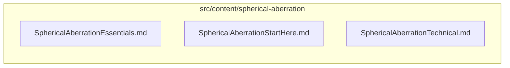

# src/content/spherical-aberration

This folder src/content/spherical-aberration source folder.

Generated `readme.md` and `improvementsuggestions.md` files are intentionally omitted from the per-file inventory so this document stays focused on source relationships.

## Relationship Diagram

## Directory Overview

- Direct source files: 3
- Direct subfolders: 0
- Main outbound areas: none
- External consumers: none

## Files

| File | Role | Imports from | Imported by | Exports |
| --- | --- | --- | --- | --- |
| `SphericalAberrationEssentials.md` | Markdown content: Spherical Aberration for Photographers | none | none | content |
| `SphericalAberrationStartHere.md` | Markdown content: Spherical Aberration: Start Here | none | none | content |
| `SphericalAberrationTechnical.md` | Markdown content: Spherical Aberration: From Optical Error to Creative Design Tool | none | none | content |
