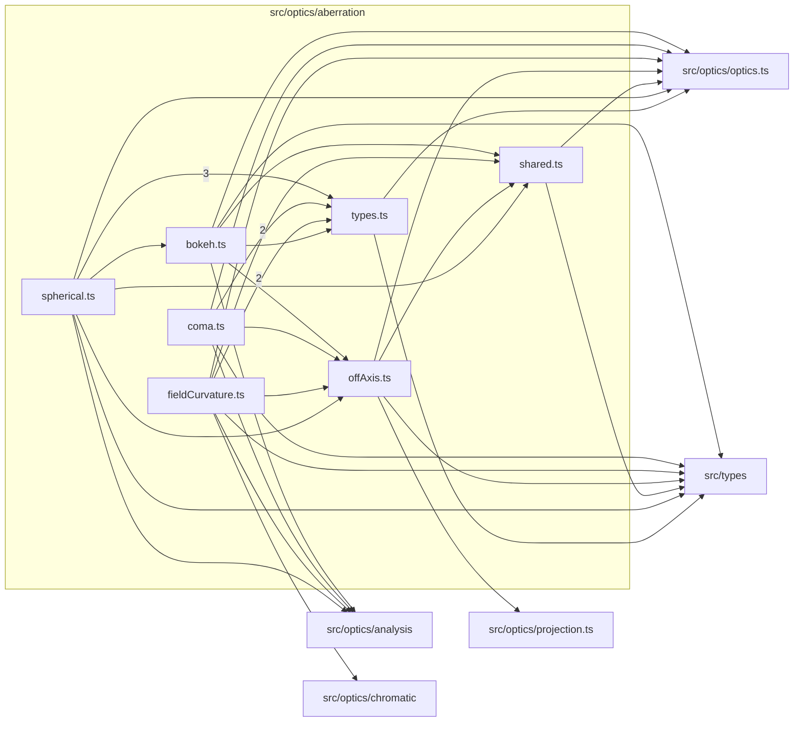

# src/optics/aberration

This folder engine-native aberration analysis primitives and shared aberration types.

Generated `readme.md` and `improvementsuggestions.md` files are intentionally omitted from the per-file inventory so this document stays focused on source relationships.

## Relationship Diagram

## Directory Overview

- Direct source files: 7
- Direct subfolders: 0
- Main outbound areas: same folder (17), src/optics/optics.ts (7), src/types (7), src/optics/analysis (4), src/optics/chromatic, src/optics/projection.ts
- External consumers: src/components/hooks, src/optics/aberrationAnalysis.ts, src/optics/analysis, src/optics/chromatic

## Files

| File | Role | Imports from | Imported by | Exports |
| --- | --- | --- | --- | --- |
| `bokeh.ts` | Bokeh helper module | same folder (3), src/optics/analysis, src/optics/optics.ts, src/types | same folder, src/optics/aberrationAnalysis.ts, src/optics/analysis | computeImagePlaneZAtFocus, computeBestFocusZ, buildBokehRadialProfile, classifyBokehBrightnessCharacter, computeBokehFieldFootprint, buildBokehDensityGrid, describeBokehDefocusSide, computeBokehPreview, +1 more |
| `coma.ts` | Coma helper module | same folder (3), src/optics/analysis, src/optics/optics.ts, src/types | src/optics/aberrationAnalysis.ts | computeMeridionalComa, computeComaPreview, computeSagittalComa, computeComaPointCloudPreview, computeComaAnalysis |
| `fieldCurvature.ts` | Field Curvature helper module | same folder (4), src/optics/analysis, src/optics/chromatic, src/optics/optics.ts, src/types | src/optics/aberrationAnalysis.ts | FieldCurvatureBundleResult, computeFieldCurvatureBundle, computeFieldCurvature |
| `offAxis.ts` | Off Axis helper module | same folder, src/optics/optics.ts, src/optics/projection.ts, src/types | same folder (4), src/components/hooks, src/optics/aberrationAnalysis.ts, src/optics/analysis, src/optics/chromatic | OffAxisFanOrientation, OffAxisDirection, OffAxisFieldGeometry, OffAxisVectorFieldGeometry, ProjectionAwareOffAxisFieldGeometry, OffAxisChiefRaySample, OffAxisTracedSample, OffAxisBundle, +11 more |
| `shared.ts` | Shared helper module | src/optics/optics.ts, src/types | same folder (4) | MARGINAL_FRACS, PROFILE_FRACS, SymmetricRealSample, TransverseFocusHit, RealRayHit, axialIntercept, imagePlaneIntercept, meridionalImagePlaneCoordinate, +9 more |
| `spherical.ts` | Spherical helper module | same folder (6), src/optics/analysis, src/optics/optics.ts, src/types | src/optics/aberrationAnalysis.ts | computeSphericalAberration, computeSAProfile, computeSphericalAberrationBlurCharacter |
| `types.ts` | Shared TypeScript types | src/optics/optics.ts, src/types | same folder (4), src/optics/aberrationAnalysis.ts, src/optics/analysis | SAProfilePoint, SphericalAberrationBlurCharacterSample, SphericalAberrationBlurCharacterResult, SphericalAberrationResult, MeridionalComaSample, MeridionalComaResult, SagittalComaSample, SagittalComaResult, +34 more |

