# src/optics/analysis

This folder prepared-state analysis adapters and grouped analysis facades.

Generated `readme.md` and `improvementsuggestions.md` files are intentionally omitted from the per-file inventory so this document stays focused on source relationships.

## Relationship Diagram

```mermaid
flowchart LR
  subgraph n_src_optics_analysis["src/optics/analysis"]
    n_src_optics_analysis_src_optics_analysis_aberrations_ts["aberrations.ts"]
    n_src_optics_analysis_src_optics_analysis_analysisContext_ts["analysisContext.ts"]
    n_src_optics_analysis_src_optics_analysis_analysisJobs_ts["analysisJobs.ts"]
    n_src_optics_analysis_src_optics_analysis_analysisQuality_ts["analysisQuality.ts"]
    n_src_optics_analysis_src_optics_analysis_asphericComparison_ts["asphericComparison.ts"]
    n_src_optics_analysis_src_optics_analysis_bokeh_ts["bokeh.ts"]
    n_src_optics_analysis_src_optics_analysis_chromatic_ts["chromatic.ts"]
    n_src_optics_analysis_src_optics_analysis_chromaticRayFanScaling_ts["chromaticRayFanScaling.ts"]
    n_src_optics_analysis_src_optics_analysis_distortion_ts["distortion.ts"]
    n_src_optics_analysis_src_optics_analysis_fieldCurvature_ts["fieldCurvature.ts"]
    n_src_optics_analysis_src_optics_analysis_groupMovement_ts["groupMovement.ts"]
    n_src_optics_analysis_src_optics_analysis_preparedStateAdapters_ts["preparedStateAdapters.ts"]
    n_src_optics_analysis_src_optics_analysis_pupilAberration_ts["pupilAberration.ts"]
    n_src_optics_analysis_src_optics_analysis_summary_ts["summary.ts"]
    n_src_optics_analysis_src_optics_analysis_vignetting_ts["vignetting.ts"]
  end
  n_external_src_optics_chromatic["src/optics/chromatic"]
  n_external_src_optics_aberration["src/optics/aberration"]
  n_external_src_types["src/types"]
  n_external_src_optics_aberrationAnalysis_ts["src/optics/aberrationAnalysis.ts"]
  n_external_src_optics_constants_ts["src/optics/constants.ts"]
  n_external_src_optics_distortionAnalysis_ts["src/optics/distortionAnalysis.ts"]
  n_external_src_optics_field["src/optics/field"]
  n_external_src_optics_first_order["src/optics/first-order"]
  n_external_src_optics_groupMovement_ts["src/optics/groupMovement.ts"]
  n_external_src_optics_layout_ts["src/optics/layout.ts"]
  n_external_src_optics_math["src/optics/math"]
  n_external_src_optics_optics_ts["src/optics/optics.ts"]
  n_external_src_optics_pupilAberration_ts["src/optics/pupilAberration.ts"]
  n_external_src_optics_rayTrace_ts["src/optics/rayTrace.ts"]
  n_external_src_optics_trace["src/optics/trace"]
  n_external_src_optics_types_ts["src/optics/types.ts"]
  n_src_optics_analysis_src_optics_analysis_chromatic_ts --> |4| n_external_src_optics_chromatic
  n_src_optics_analysis_src_optics_analysis_chromatic_ts --> |2| n_external_src_optics_aberration
  n_src_optics_analysis_src_optics_analysis_groupMovement_ts --> |2| n_external_src_types
  n_src_optics_analysis_src_optics_analysis_bokeh_ts --> n_external_src_optics_aberration
  n_src_optics_analysis_src_optics_analysis_aberrations_ts --> n_external_src_optics_aberrationAnalysis_ts
  n_src_optics_analysis_src_optics_analysis_analysisContext_ts --> n_external_src_optics_chromatic
  n_src_optics_analysis_src_optics_analysis_analysisJobs_ts --> n_external_src_optics_chromatic
  n_src_optics_analysis_src_optics_analysis_asphericComparison_ts --> n_external_src_optics_constants_ts
  n_src_optics_analysis_src_optics_analysis_distortion_ts --> n_external_src_optics_distortionAnalysis_ts
  n_src_optics_analysis_src_optics_analysis_chromatic_ts --> n_external_src_optics_field
  n_src_optics_analysis_src_optics_analysis_summary_ts --> n_external_src_optics_first_order
  n_src_optics_analysis_src_optics_analysis_groupMovement_ts --> n_external_src_optics_groupMovement_ts
  n_src_optics_analysis_src_optics_analysis_chromatic_ts --> n_external_src_optics_layout_ts
  n_src_optics_analysis_src_optics_analysis_summary_ts --> n_external_src_optics_layout_ts
  n_src_optics_analysis_src_optics_analysis_asphericComparison_ts --> n_external_src_optics_math
  n_src_optics_analysis_src_optics_analysis_aberrations_ts --> n_external_src_optics_optics_ts
  n_src_optics_analysis_src_optics_analysis_analysisContext_ts --> n_external_src_optics_optics_ts
  n_src_optics_analysis_src_optics_analysis_analysisJobs_ts --> n_external_src_optics_optics_ts
  n_src_optics_analysis_src_optics_analysis_chromatic_ts --> n_external_src_optics_optics_ts
  n_src_optics_analysis_src_optics_analysis_distortion_ts --> n_external_src_optics_optics_ts
  n_src_optics_analysis_src_optics_analysis_pupilAberration_ts --> n_external_src_optics_optics_ts
  n_src_optics_analysis_src_optics_analysis_summary_ts --> n_external_src_optics_optics_ts
  n_src_optics_analysis_src_optics_analysis_vignetting_ts --> n_external_src_optics_optics_ts
  n_src_optics_analysis_src_optics_analysis_pupilAberration_ts --> n_external_src_optics_pupilAberration_ts
  n_src_optics_analysis_src_optics_analysis_chromatic_ts --> n_external_src_optics_rayTrace_ts
  n_src_optics_analysis_src_optics_analysis_chromatic_ts --> n_external_src_optics_trace
  n_src_optics_analysis_src_optics_analysis_aberrations_ts --> n_external_src_optics_types_ts
  n_src_optics_analysis_src_optics_analysis_analysisContext_ts --> n_external_src_optics_types_ts
  n_src_optics_analysis_src_optics_analysis_analysisJobs_ts --> n_external_src_optics_types_ts
  n_src_optics_analysis_src_optics_analysis_bokeh_ts --> n_external_src_optics_types_ts
  n_src_optics_analysis_src_optics_analysis_chromatic_ts --> n_external_src_optics_types_ts
  n_src_optics_analysis_src_optics_analysis_distortion_ts --> n_external_src_optics_types_ts
  n_src_optics_analysis_src_optics_analysis_groupMovement_ts --> n_external_src_optics_types_ts
  n_src_optics_analysis_src_optics_analysis_preparedStateAdapters_ts --> n_external_src_optics_types_ts
  n_src_optics_analysis_src_optics_analysis_pupilAberration_ts --> n_external_src_optics_types_ts
  n_src_optics_analysis_src_optics_analysis_summary_ts --> n_external_src_optics_types_ts
  n_src_optics_analysis_truncated["additional relationships omitted"]
```

## Directory Overview

- Direct source files: 15
- Direct subfolders: 0
- Main outbound areas: same folder (19), src/optics/types.ts (11), src/types (10), src/optics/optics.ts (8), src/optics/chromatic (6), src/optics/aberration (3), src/optics/layout.ts (2), src/optics/aberrationAnalysis.ts, +10 more
- External consumers: src/benchmarks, src/components/layout, src/optics/aberration, src/optics/analysisJobs.ts, src/optics/compat.ts, src/optics/distortionAnalysis.ts, src/optics/vignetteAnalysis.ts

## Files

| File | Role | Imports from | Imported by | Exports |
| --- | --- | --- | --- | --- |
| `aberrations.ts` | Aberrations helper module | same folder (2), src/optics/aberrationAnalysis.ts, src/optics/optics.ts, src/optics/types.ts, src/types | same folder (2), src/optics/compat.ts | computeSphericalAberrationForState2, computeSAProfileForState2, computeSphericalAberrationBlurCharacterForState2, computeFieldCurvatureForState2, computeFieldCurvatureBundleForState2, computeComaAnalysisForState2, computeSAProfile2, computeSphericalAberration2, +8 more |
| `analysisContext.ts` | Analysis Context helper module | same folder (2), src/optics/chromatic, src/optics/optics.ts, src/optics/types.ts | src/optics/compat.ts | AnalysisComputationContextParams, AnalysisComputationContext, createAnalysisComputationContext |
| `analysisJobs.ts` | Analysis Jobs helper module | same folder (8), src/optics/chromatic, src/optics/optics.ts, src/optics/types.ts, src/types | same folder, src/optics/analysisJobs.ts, src/optics/compat.ts | analysisJobs2, analysisJobsForState2 |
| `analysisQuality.ts` | Analysis Quality helper module | none | same folder (6), src/optics/aberration (4), src/benchmarks, src/components/layout, src/optics/distortionAnalysis.ts, +1 more | AnalysisQuality, AnalysisSamplingOptions, INTERACTIVE_ANALYSIS_SAMPLING, analysisSamplingForQuality |
| `asphericComparison.ts` | Aspheric Comparison helper module | src/optics/constants.ts, src/optics/math, src/types | src/optics/compat.ts | DepartureSample2, computeAsphericDeparture2, computeDepartureProfile2, computeBestFitSphereR2, peakAbsDeparture2, rmsDeparture2, nearestSurfaceForClick2 |
| `bokeh.ts` | Bokeh helper module | same folder, src/optics/aberration, src/optics/types.ts | same folder, src/optics/compat.ts | computeBestFocusZForState2, computeBokehPreviewPairForState2, computeBestFocusZ2, computeBokehPreview2, computeBokehPreviewPair2, buildBokehDensityGrid2, buildBokehRadialProfile2, classifyBokehBrightnessCharacter2, +1 more |
| `chromatic.ts` | Chromatic helper module | src/optics/chromatic (4), src/optics/aberration (2), same folder, src/optics/field, src/optics/layout.ts, +5 more | same folder, src/optics/compat.ts | ChromaticAnalysisOptions, ChromaticAnalysisResult, LateralColorChannelSample, LateralColorCurveResult, LateralColorFieldSample, LongitudinalChromaticFocusResult, LongitudinalChromaticFocusSample, ChromaticRayFanAnalysisOptions2, +11 more |
| `chromaticRayFanScaling.ts` | Chromatic Ray Fan Scaling helper module | src/types | src/optics/compat.ts | REFERENCE_LOCA_MM_2, ChromaticBarResult2, computeLocaBarOffsets2 |
| `distortion.ts` | Distortion helper module | same folder (2), src/optics/distortionAnalysis.ts, src/optics/optics.ts, src/optics/types.ts, src/types | same folder, src/optics/compat.ts | computeDistortionCurveForState2, computeDistortionFieldGridForState2, computeDistortionCurve2, computeDistortionFieldGrid2 |
| `fieldCurvature.ts` | Field Curvature helper module | same folder | none | computeFieldCurvature2, computeFieldCurvatureBundleForState2, computeFieldCurvatureForState2 |
| `groupMovement.ts` | Group Movement helper module | src/types (2), src/optics/groupMovement.ts, src/optics/types.ts | src/optics/compat.ts | computeGroupMovementProfileForState2, computeGroupMovementProfile2, firstAvailableGroupMovementMode2, getGroupMovementAvailability2, inferLensMovementGroups2, isGroupMovementModeAvailable2 |
| `preparedStateAdapters.ts` | Prepared State Adapters helper module | src/optics/types.ts | same folder (4) | zPosForPreparedAnalysis2 |
| `pupilAberration.ts` | Pupil Aberration helper module | src/optics/optics.ts, src/optics/pupilAberration.ts, src/optics/types.ts, src/types | same folder, src/optics/compat.ts | PUPIL_ABERRATION_SAMPLE_COUNT_2, computeBothPupilAberrationProfilesForState2, computePupilAberrationProfile2, computeExitPupilAberrationProfile2, computeBothPupilAberrationProfiles2 |
| `summary.ts` | Summary helper module | src/optics/first-order, src/optics/layout.ts, src/optics/optics.ts, src/optics/types.ts | same folder, src/optics/compat.ts | OpticalSummaryMetrics2, computeOpticalSummaryForState2 |
| `vignetting.ts` | Vignetting helper module | same folder (2), src/optics/optics.ts, src/optics/types.ts, src/optics/vignetteAnalysis.ts, src/types | same folder, src/optics/compat.ts | computeVignettingCurveForState2, computeVignettingCurve2 |

