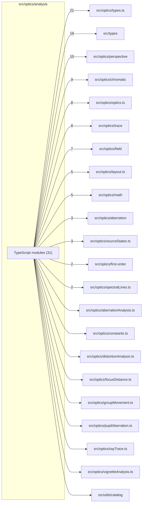

# src/optics/analysis

This folder prepared-state analysis adapters and grouped analysis facades.

Generated `readme.md` and `improvementsuggestions.md` files are intentionally omitted from the per-file inventory so this document stays focused on source relationships.

## Relationship Diagram

```mermaid
flowchart LR
  subgraph n_src_optics_analysis["src/optics/analysis"]
    n_src_optics_analysis_TypeScript_modules["TypeScript modules (31)"]
  end
  n_external_src_optics_types_ts["src/optics/types.ts"]
  n_external_src_types["src/types"]
  n_external_src_optics_perspective["src/optics/perspective"]
  n_external_src_optics_chromatic["src/optics/chromatic"]
  n_external_src_optics_optics_ts["src/optics/optics.ts"]
  n_external_src_optics_trace["src/optics/trace"]
  n_external_src_optics_field["src/optics/field"]
  n_external_src_optics_layout_ts["src/optics/layout.ts"]
  n_external_src_optics_math["src/optics/math"]
  n_external_src_optics_aberration["src/optics/aberration"]
  n_external_src_optics_sourceStates_ts["src/optics/sourceStates.ts"]
  n_external_src_optics_first_order["src/optics/first-order"]
  n_external_src_optics_spectralLines_ts["src/optics/spectralLines.ts"]
  n_external_src_optics_aberrationAnalysis_ts["src/optics/aberrationAnalysis.ts"]
  n_external_src_optics_constants_ts["src/optics/constants.ts"]
  n_external_src_optics_distortionAnalysis_ts["src/optics/distortionAnalysis.ts"]
  n_external_src_optics_focusDistance_ts["src/optics/focusDistance.ts"]
  n_external_src_optics_groupMovement_ts["src/optics/groupMovement.ts"]
  n_external_src_optics_pupilAberration_ts["src/optics/pupilAberration.ts"]
  n_external_src_optics_rayTrace_ts["src/optics/rayTrace.ts"]
  n_external_src_optics_vignetteAnalysis_ts["src/optics/vignetteAnalysis.ts"]
  n_external_src_utils_catalog["src/utils/catalog"]
  n_src_optics_analysis_TypeScript_modules --> |21| n_external_src_optics_types_ts
  n_src_optics_analysis_TypeScript_modules --> |18| n_external_src_types
  n_src_optics_analysis_TypeScript_modules --> |10| n_external_src_optics_perspective
  n_src_optics_analysis_TypeScript_modules --> |9| n_external_src_optics_chromatic
  n_src_optics_analysis_TypeScript_modules --> |8| n_external_src_optics_optics_ts
  n_src_optics_analysis_TypeScript_modules --> |8| n_external_src_optics_trace
  n_src_optics_analysis_TypeScript_modules --> |7| n_external_src_optics_field
  n_src_optics_analysis_TypeScript_modules --> |5| n_external_src_optics_layout_ts
  n_src_optics_analysis_TypeScript_modules --> |5| n_external_src_optics_math
  n_src_optics_analysis_TypeScript_modules --> |3| n_external_src_optics_aberration
  n_src_optics_analysis_TypeScript_modules --> |3| n_external_src_optics_sourceStates_ts
  n_src_optics_analysis_TypeScript_modules --> |2| n_external_src_optics_first_order
  n_src_optics_analysis_TypeScript_modules --> |2| n_external_src_optics_spectralLines_ts
  n_src_optics_analysis_TypeScript_modules --> n_external_src_optics_aberrationAnalysis_ts
  n_src_optics_analysis_TypeScript_modules --> n_external_src_optics_constants_ts
  n_src_optics_analysis_TypeScript_modules --> n_external_src_optics_distortionAnalysis_ts
  n_src_optics_analysis_TypeScript_modules --> n_external_src_optics_focusDistance_ts
  n_src_optics_analysis_TypeScript_modules --> n_external_src_optics_groupMovement_ts
  n_src_optics_analysis_TypeScript_modules --> n_external_src_optics_pupilAberration_ts
  n_src_optics_analysis_TypeScript_modules --> n_external_src_optics_rayTrace_ts
  n_src_optics_analysis_TypeScript_modules --> n_external_src_optics_vignetteAnalysis_ts
  n_src_optics_analysis_TypeScript_modules --> n_external_src_utils_catalog
```

## Directory Overview

- Direct source files: 31
- Direct subfolders: 0
- Main outbound areas: same folder (52), src/optics/types.ts (21), src/types (18), src/optics/perspective (10), src/optics/chromatic (9), src/optics/optics.ts (8), src/optics/trace (8), src/optics/field (7), +15 more
- External consumers: src/benchmarks, src/components/layout, src/optics/aberration, src/optics/analysisJobs.ts, src/optics/compat.ts, src/optics/distortionAnalysis.ts, src/optics/mtf.ts, src/optics/vignetteAnalysis.ts

## Files

| File | Role | Imports from | Imported by | Exports |
| --- | --- | --- | --- | --- |
| `aberrations.ts` | Aberrations helper module | same folder (2), src/optics/aberrationAnalysis.ts, src/optics/optics.ts, src/optics/types.ts, src/types | same folder (2), src/optics/compat.ts | computeSphericalAberrationForState2, computeSAProfileForState2, computeSphericalAberrationBlurCharacterForState2, computeFieldCurvatureForState2, computeFieldCurvatureBundleForState2, computeComaAnalysisForState2, computeSAProfile2, computeSphericalAberration2, +8 more |
| `analysisContext.ts` | Analysis Context helper module | same folder (5), src/optics/chromatic (2), src/optics/optics.ts, src/optics/perspective, src/optics/types.ts | src/optics/compat.ts | AnalysisComputationContextParams, AnalysisComputationContext, createAnalysisComputationContext |
| `analysisJobs.ts` | Analysis Jobs helper module | same folder (8), src/optics/chromatic, src/optics/optics.ts, src/optics/types.ts, src/types | same folder, src/optics/analysisJobs.ts, src/optics/compat.ts | analysisJobs2, analysisJobsForState2 |
| `analysisMovementSupport.ts` | Analysis Movement Support helper module | src/optics/perspective | same folder, src/optics/compat.ts | AnalysisSectionId, AnalysisSectionMode, AnalysisSectionAvailability, AnalysisSectionUnavailableError, analysisSectionAvailability, assertAnalysisSectionAvailable, assertCenteredAnalysisSectionAvailable |
| `analysisQuality.ts` | Analysis Quality helper module | none | same folder (7), src/optics/aberration (4), src/benchmarks, src/components/layout, src/optics/distortionAnalysis.ts, +1 more | AnalysisQuality, AnalysisSamplingOptions, INTERACTIVE_ANALYSIS_SAMPLING, analysisSamplingForQuality |
| `asphericComparison.ts` | Aspheric Comparison helper module | src/optics/constants.ts, src/optics/math, src/types | src/optics/compat.ts | DepartureSample2, computeAsphericDeparture2, computeDepartureProfile2, computeBestFitSphereR2, peakAbsDeparture2, rmsDeparture2, nearestSurfaceForClick2 |
| `bokeh.ts` | Bokeh helper module | same folder, src/optics/aberration, src/optics/types.ts | same folder, src/optics/compat.ts | computeBestFocusZForState2, computeBokehPreviewPairForState2, computeBestFocusZ2, computeBokehPreview2, computeBokehPreviewPair2, buildBokehDensityGrid2, buildBokehRadialProfile2, classifyBokehBrightnessCharacter2, +1 more |
| `chromatic.ts` | Chromatic helper module | src/optics/chromatic (4), src/optics/aberration (2), same folder, src/optics/field, src/optics/layout.ts, +5 more | same folder, src/optics/compat.ts | ChromaticAnalysisOptions, ChromaticAnalysisResult, LateralColorChannelSample, LateralColorCurveResult, LateralColorFieldSample, LongitudinalChromaticFocusResult, LongitudinalChromaticFocusSample, ChromaticRayFanAnalysisOptions2, +11 more |
| `chromaticRayFanScaling.ts` | Chromatic Ray Fan Scaling helper module | src/types | src/optics/compat.ts | REFERENCE_LOCA_MM_2, ChromaticBarResult2, computeLocaBarOffsets2 |
| `distortion.ts` | Distortion helper module | same folder (2), src/optics/distortionAnalysis.ts, src/optics/optics.ts, src/optics/types.ts, src/types | same folder, src/optics/compat.ts | computeDistortionCurveForState2, computeDistortionFieldGridForState2, computeDistortionCurve2, computeDistortionFieldGrid2 |
| `fieldCurvature.ts` | Field Curvature helper module | same folder | none | computeFieldCurvature2, computeFieldCurvatureBundleForState2, computeFieldCurvatureForState2 |
| `groupMovement.ts` | Group Movement helper module | src/types (2), src/optics/groupMovement.ts, src/optics/types.ts | src/optics/compat.ts | computeGroupMovementProfileForState2, computeGroupMovementProfile2, firstAvailableGroupMovementMode2, getGroupMovementAvailability2, inferLensMovementGroups2, isGroupMovementModeAvailable2 |
| `mtf.ts` | Mtf helper module | same folder (9), src/optics/sourceStates.ts, src/optics/types.ts, src/types | src/optics/mtf.ts | MtfJobCache, emptyMtfField, MtfUnresolvedFlux, assessUnresolvedFlux, MtfGridOutcome, refineMtfField, resolveMtfGeometry, computeMtfSteps, +1 more |
| `mtfConjugates.ts` | Mtf Conjugates helper module | src/optics/field, src/optics/sourceStates.ts, src/optics/types.ts, src/types | same folder (2) | mtfFiniteObjectPoint, mtfFiniteConjugate |
| `mtfConstants.ts` | Mtf Constants helper module | src/types | same folder (4) | MTF_GRID_LADDER, MTF_GRID_CAPS, MTF_DEFAULT_GRID_CAP, MTF_CONVERGENCE_TOLERANCE, MTF_CONVERGENCE_BAND_LPMM, MTF_MAX_FIELDS, MTF_MAX_FREQUENCIES, MTF_MAX_FREQUENCY_LPMM, +11 more |
| `mtfDiffraction.ts` | Mtf Diffraction helper module | same folder (4), src/optics/layout.ts, src/optics/math, src/optics/types.ts | same folder (2) | ComplexPupil, DiffractionOtf, PupilReconstruction, PupilAutocorrelation, pupilAutocorrelation, sampleAutocorrelation, pupilOtf, reconstructMtfPupil |
| `mtfDiffractionLimit.ts` | Mtf Diffraction Limit helper module | same folder (2) | same folder | MtfDiffractionLimit, diffractionLimitFromBundle, ellipticalLimit |
| `mtfFields.ts` | Mtf Fields helper module | same folder (2), src/optics/field (2), src/optics/layout.ts, src/optics/math, src/optics/trace, +3 more | same folder | MtfFieldTarget, MtfChiefHeight, mtfModeledHalfField, declaredFormatRadiusMm, resolveMtfFieldGeometry, resolveMtfFieldTargets, mtfChiefHeight, mtfFieldProcessingOrder |
| `mtfFocus.ts` | Mtf Focus helper module | same folder (3), src/optics/first-order, src/optics/layout.ts, src/optics/spectralLines.ts, src/optics/types.ts, +1 more | same folder | MtfFocusBundle, MtfBestFocus, MtfImagePlaneOffset, mtfImagePlaneOffset, findAxialBestFocus, landingPoints |
| `mtfFootprint.ts` | Mtf Footprint helper module | same folder | same folder (2) | MtfFootprint, MtfLaunchClassifier, findMtfFootprint, expandMtfFootprint |
| `mtfMath.ts` | Mtf Math helper module | none | same folder (4) | MtfSpot, ComplexOtf, geometricOtf, otfMagnitude, translateOtf, multiplyOtf, combineOtfs |
| `mtfRayClassification.ts` | Mtf Ray Classification helper module | src/optics/trace (2), src/optics/types.ts | same folder (2) | MtfRayClass, mtfTraceClassification, provesApertureMiss |
| `mtfSupport.ts` | Mtf Support helper module | same folder (3), src/optics/sourceStates.ts, src/optics/spectralLines.ts, src/optics/types.ts, src/types | same folder, src/optics/mtf.ts | MTF_FIELDS, MTF_FREQUENCIES, MTF_CDF_LINES, MTF_PHOTOPIC_LINES, MtfSpectrumChoice, MtfSpectralData, assessMtfSpectralData, resolveMtfSpectrum, +1 more |
| `mtfTracing.ts` | Mtf Tracing helper module | same folder (4), src/optics/trace (3), src/optics/field (2), src/optics/chromatic, src/optics/types.ts, +1 more | same folder (6) | mtfLaunchRay, mtfTraceClassification, MtfPupilRay, MtfOpenBorders, MtfBundle, MtfFieldLaunch, mtfImagePoint, mtfIndexResolver, +8 more |
| `mtfWavefront.ts` | Mtf Wavefront helper module | same folder, src/optics/types.ts | same folder | WavefrontSample, launchPhaseMm, sampleReferenceWavefront |
| `perspectiveAnalysisJobs.ts` | Perspective Analysis Jobs helper module | src/optics/perspective (8), same folder, src/optics/chromatic | same folder | PerspectiveAnalysisJobParams, PerspectiveAnalysisSamplingPlan, PerspectiveAnalysisJobs, perspectiveAnalysisSamplingPlan, createPerspectiveAnalysisJobs |
| `preparedStateAdapters.ts` | Prepared State Adapters helper module | src/optics/types.ts | same folder (5) | zPosForPreparedAnalysis2 |
| `pupilAberration.ts` | Pupil Aberration helper module | src/optics/optics.ts, src/optics/pupilAberration.ts, src/optics/types.ts, src/types | same folder, src/optics/compat.ts | PUPIL_ABERRATION_SAMPLE_COUNT_2, computeBothPupilAberrationProfilesForState2, computePupilAberrationProfile2, computeExitPupilAberrationProfile2, computeBothPupilAberrationProfiles2 |
| `sourceStateAudit.ts` | Source State Audit helper module | src/optics/math (2), src/optics/field, src/optics/trace, src/optics/types.ts, src/types | none | SourceDerivationEvidence, SourceDerivationSample, SourceDerivationReport, deriveSourceDistance |
| `summary.ts` | Summary helper module | src/optics/first-order, src/optics/focusDistance.ts, src/optics/layout.ts, src/optics/optics.ts, src/optics/types.ts | same folder, src/optics/compat.ts | OpticalSummaryMetrics2, computeOpticalSummaryForState2 |
| `vignetting.ts` | Vignetting helper module | same folder (2), src/optics/optics.ts, src/optics/types.ts, src/optics/vignetteAnalysis.ts, src/types | same folder, src/optics/compat.ts | computeVignettingCurveForState2, computeVignettingCurve2 |
