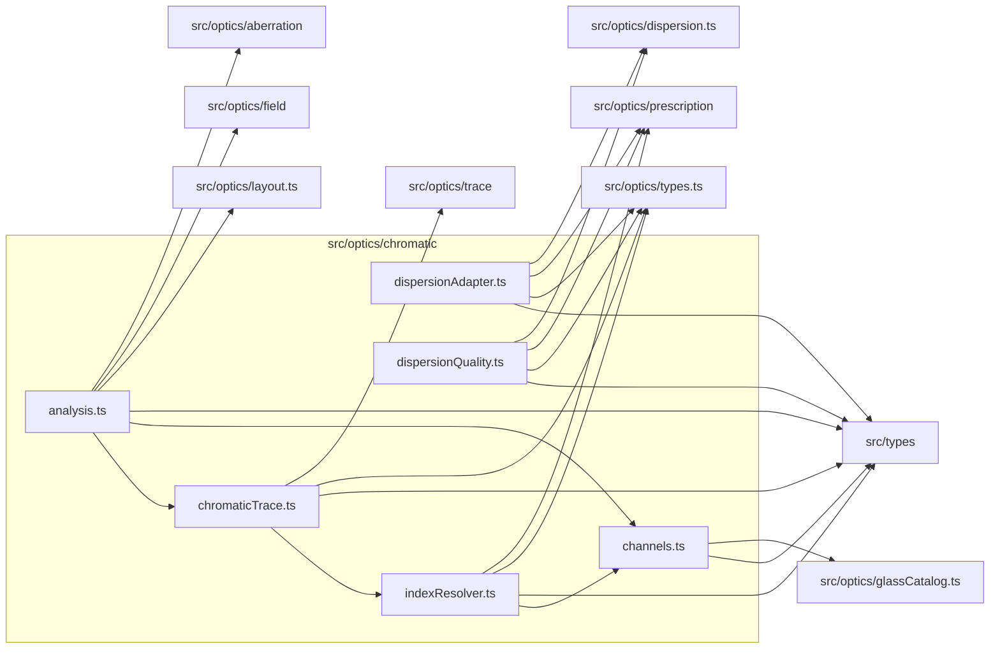

# src/optics/chromatic

This folder chromatic channel, trace, dispersion, and quality helpers.

Generated `readme.md` and `improvementsuggestions.md` files are intentionally omitted from the per-file inventory so this document stays focused on source relationships.

## Relationship Diagram

## Directory Overview

- Direct source files: 6
- Direct subfolders: 0
- Main outbound areas: src/types (6), same folder (4), src/optics/types.ts (4), src/optics/prescription (3), src/optics/trace (3), src/optics/dispersion.ts (2), src/optics/aberration, src/optics/field, +2 more
- External consumers: src/components/controls, src/components/diagram, src/components/display, src/optics/aberration, src/optics/analysis, src/optics/compat.ts

## Files

| File | Role | Imports from | Imported by | Exports |
| --- | --- | --- | --- | --- |
| `analysis.ts` | Analysis helper module | same folder (2), src/optics/aberration, src/optics/field, src/optics/layout.ts, src/types | src/optics/analysis | DEFAULT_CHROMATIC_ANALYSIS_CHANNELS, DEFAULT_LONGITUDINAL_CHROMATIC_FRACTIONS, DEFAULT_LATERAL_COLOR_FIELD_FRACTIONS, ChromaticAnalysisOptions, LongitudinalChromaticFocusSample, LongitudinalChromaticFocusResult, LateralColorChannelSample, LateralColorFieldSample, +5 more |
| `channels.ts` | Channels helper module | src/optics/glassCatalog.ts, src/types | src/components/display (4), src/optics/analysis (3), same folder (2), src/components/controls, src/components/diagram, +1 more | ChromaticChannelMetadata, CHROMATIC_CHANNEL_ORDER, CHROMATIC_CHANNEL_METADATA, chromaticChannelWavelengthLabel, chromaticChannelIndexLabel |
| `chromaticTrace.ts` | Chromatic Trace helper module | src/optics/trace (3), same folder, src/optics/types.ts, src/types | same folder, src/optics/analysis, src/optics/compat.ts | traceEngineRayChromatic2, computeChromaticRayFanSpread2, traceRayChromatic2, traceRayVectorChromatic2, traceSkewRayChromatic2, traceSkewRayVectorChromatic2, VectorRayTraceInput2, ChromaticChannel, +3 more |
| `dispersionAdapter.ts` | Dispersion Adapter helper module | src/optics/dispersion.ts, src/optics/prescription, src/optics/types.ts, src/types | src/optics/compat.ts | compileSurfaceDispersions, makeSurfaceDispersion2, dispersionTableFromRuntime2 |
| `dispersionQuality.ts` | Dispersion Quality helper module | src/optics/dispersion.ts, src/optics/prescription, src/optics/types.ts, src/types | src/optics/compat.ts | summarizeDispersionQualityForLens2, summarizeDispersionQualityForState2, summarizeDispersionQuality2 |
| `indexResolver.ts` | Index Resolver helper module | same folder, src/optics/prescription, src/optics/types.ts, src/types | same folder, src/optics/compat.ts | CHROMATIC_CHANNELS_2, CHANNEL_WAVELENGTH_NM_2, SurfaceIndexResolver2, wavelengthNd2, indexAtPreparedSurface2, indexAtRuntimeSurface2, channelIndexResolverForState2 |

