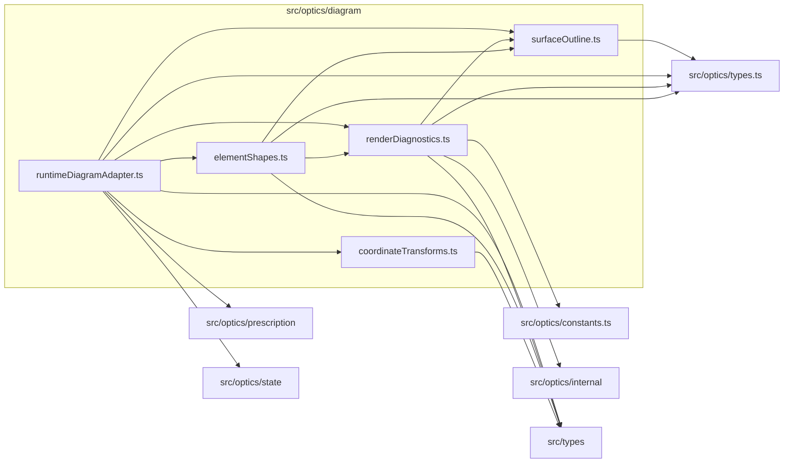

# src/optics/diagram

This folder pure SVG-ready diagram geometry helpers used by React diagram layers.

Generated `readme.md` and `improvementsuggestions.md` files are intentionally omitted from the per-file inventory so this document stays focused on source relationships.

## Relationship Diagram

## Directory Overview

- Direct source files: 5
- Direct subfolders: 0
- Main outbound areas: same folder (7), src/optics/types.ts (4), src/types (4), src/optics/constants.ts, src/optics/internal, src/optics/prescription, src/optics/state
- External consumers: src/optics/compat.ts

## Files

| File | Role | Imports from | Imported by | Exports |
| --- | --- | --- | --- | --- |
| `coordinateTransforms.ts` | Coordinate Transforms helper module | src/types | same folder | createCoordinateTransforms2 |
| `elementShapes.ts` | Element Shapes helper module | same folder (2), src/optics/types.ts, src/types | same folder, src/optics/compat.ts | computeElementShapesForState2 |
| `renderDiagnostics.ts` | Render Diagnostics helper module | same folder, src/optics/constants.ts, src/optics/internal, src/optics/types.ts, src/types | same folder (2), src/optics/compat.ts | computeElementRenderDiagnosticsForState2 |
| `runtimeDiagramAdapter.ts` | Runtime Diagram Adapter helper module | same folder (4), src/optics/prescription, src/optics/state, src/optics/types.ts, src/types | src/optics/compat.ts | createCoordinateTransforms2, computeElementRenderDiagnostics2, computeElementShapes2, stateForRuntimeDiagram2 |
| `surfaceOutline.ts` | Surface Outline helper module | src/optics/types.ts | same folder (3), src/optics/compat.ts | SVG_PATH_SUBDIVISIONS_2, DiagramPointTransform2, surfaceSag2, renderedSurfaceZ2, surfacePathD2 |

