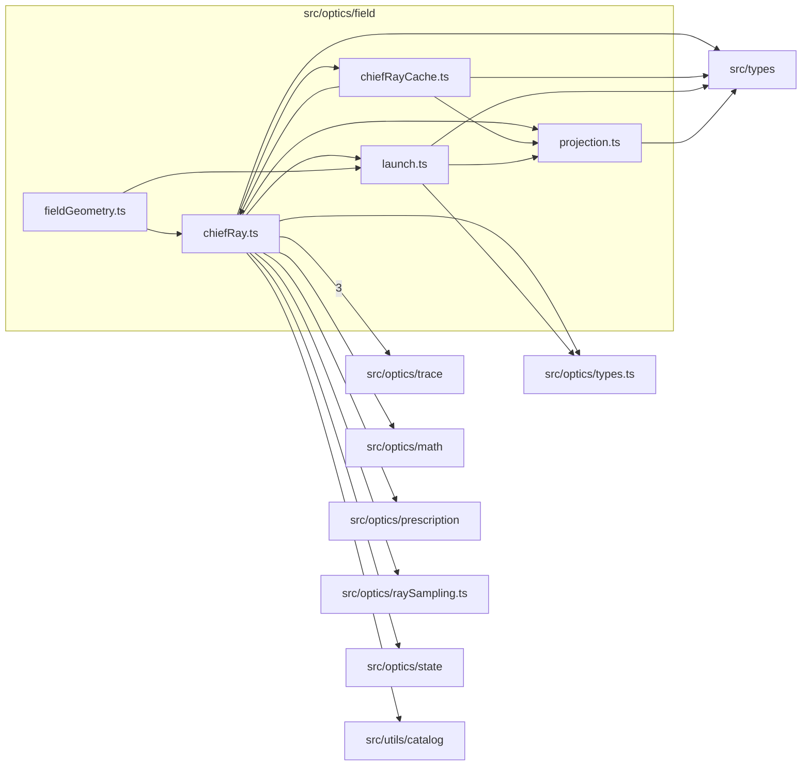

# src/optics/field

This folder engine-native field geometry, chief-ray solving, projection, and launch helpers.

Generated `readme.md` and `improvementsuggestions.md` files are intentionally omitted from the per-file inventory so this document stays focused on source relationships.

## Relationship Diagram

## Directory Overview

- Direct source files: 5
- Direct subfolders: 0
- Main outbound areas: same folder (8), src/types (4), src/optics/trace (3), src/optics/types.ts (2), src/optics/math, src/optics/prescription, src/optics/raySampling.ts, src/optics/state, +1 more
- External consumers: src/optics/aberration, src/optics/analysis, src/optics/chromatic, src/optics/compat.ts, src/optics/runtimeLens.ts

## Files

| File | Role | Imports from | Imported by | Exports |
| --- | --- | --- | --- | --- |
| `chiefRay.ts` | Chief Ray helper module | same folder (3), src/optics/trace (3), src/optics/math, src/optics/prescription, src/optics/raySampling.ts, +4 more | same folder (2) | EntrancePupilState2, ChiefRaySolveResult2, FieldGeometryState2, OffsetVectorFieldRay2, VectorFieldRayLaunch2, computeFieldGeometryAtState2, computeAnalysisFieldGeometryAtState2, traceChiefRayAtAngle2, +10 more |
| `chiefRayCache.ts` | Chief Ray Cache helper module | same folder (2), src/types | same folder, src/optics/compat.ts | ChiefRayStatus2, ChiefRayDiagnostics2, chiefRayCacheKey2, getCachedChiefRaySolve2, setCachedChiefRaySolve2, recordChiefRayStatus2, getChiefRayDiagnostics2, resetChiefRayDiagnostics2 |
| `fieldGeometry.ts` | Field Geometry helper module | same folder (2) | src/optics/aberration (5), src/optics/analysis, src/optics/chromatic, src/optics/compat.ts | chiefRayImageHeight2, chiefRayImageHeightAccurate2, computeAnalysisFieldGeometryAtState2, computeFieldGeometryAtState2, conjugateK2, entrancePupilAtState2, solveChiefRay2, solveChiefRayBoundingSphere2, +13 more |
| `launch.ts` | Launch helper module | same folder, src/optics/types.ts, src/types | same folder (2) | FieldGeometryState2, VectorFieldRayLaunch2, OffsetVectorFieldRay2, computeBoundingSphereLaunchRadiusMm2, computeBoundingSphereVectorFieldLaunch2, offsetVectorFieldRay2 |
| `projection.ts` | Projection helper module | src/types | same folder (3), src/optics/aberration, src/optics/compat.ts, src/optics/runtimeLens.ts | ProjectionReferenceKind, ProjectionReference2, ProjectionFieldSlopes2, ProjectionLaunchSlope2, ProjectionAngularLaunch2, BoundingSphereLaunch2, MAX_FIELD_LAUNCH_DEG, ABSOLUTE_HALF_FIELD_CEILING, +17 more |

