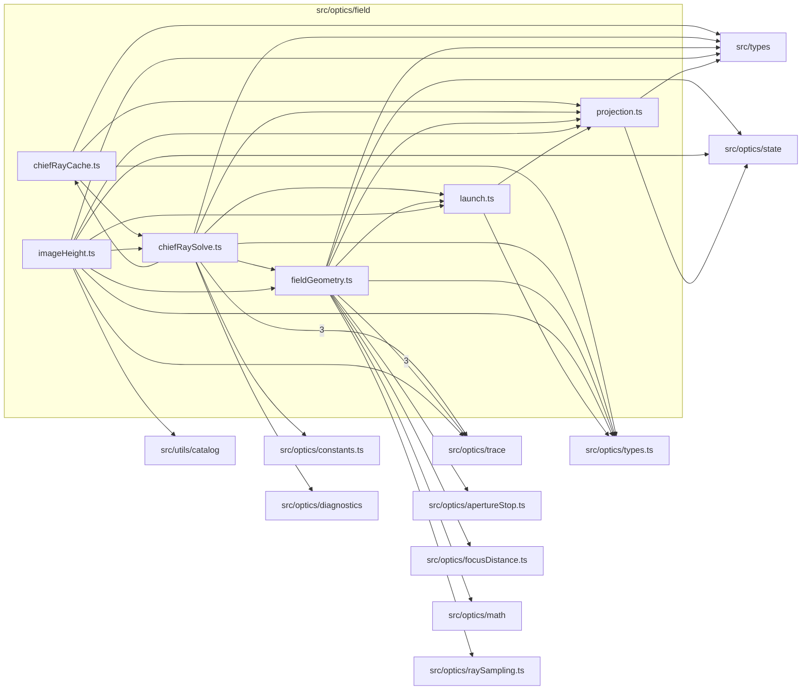

# src/optics/field

This folder engine-native field geometry, chief-ray solving, projection, and launch helpers.

Generated `readme.md` and `improvementsuggestions.md` files are intentionally omitted from the per-file inventory so this document stays focused on source relationships.

## Relationship Diagram

```mermaid
flowchart LR
  subgraph n_src_optics_field["src/optics/field"]
    n_src_optics_field_src_optics_field_chiefRayCache_ts["chiefRayCache.ts"]
    n_src_optics_field_src_optics_field_chiefRaySolve_ts["chiefRaySolve.ts"]
    n_src_optics_field_src_optics_field_fieldGeometry_ts["fieldGeometry.ts"]
    n_src_optics_field_src_optics_field_imageHeight_ts["imageHeight.ts"]
    n_src_optics_field_src_optics_field_launch_ts["launch.ts"]
    n_src_optics_field_src_optics_field_projection_ts["projection.ts"]
  end
  n_external_src_optics_trace["src/optics/trace"]
  n_external_src_optics_apertureStop_ts["src/optics/apertureStop.ts"]
  n_external_src_optics_constants_ts["src/optics/constants.ts"]
  n_external_src_optics_diagnostics["src/optics/diagnostics"]
  n_external_src_optics_focusDistance_ts["src/optics/focusDistance.ts"]
  n_external_src_optics_math["src/optics/math"]
  n_external_src_optics_raySampling_ts["src/optics/raySampling.ts"]
  n_external_src_optics_state["src/optics/state"]
  n_external_src_optics_types_ts["src/optics/types.ts"]
  n_external_src_types["src/types"]
  n_external_src_utils_catalog["src/utils/catalog"]
  n_src_optics_field_src_optics_field_chiefRaySolve_ts --> |3| n_external_src_optics_trace
  n_src_optics_field_src_optics_field_fieldGeometry_ts --> |3| n_external_src_optics_trace
  n_src_optics_field_src_optics_field_fieldGeometry_ts --> n_external_src_optics_apertureStop_ts
  n_src_optics_field_src_optics_field_chiefRaySolve_ts --> n_external_src_optics_constants_ts
  n_src_optics_field_src_optics_field_chiefRaySolve_ts --> n_external_src_optics_diagnostics
  n_src_optics_field_src_optics_field_fieldGeometry_ts --> n_external_src_optics_focusDistance_ts
  n_src_optics_field_src_optics_field_fieldGeometry_ts --> n_external_src_optics_math
  n_src_optics_field_src_optics_field_fieldGeometry_ts --> n_external_src_optics_raySampling_ts
  n_src_optics_field_src_optics_field_fieldGeometry_ts --> n_external_src_optics_state
  n_src_optics_field_src_optics_field_imageHeight_ts --> n_external_src_optics_state
  n_src_optics_field_src_optics_field_projection_ts --> n_external_src_optics_state
  n_src_optics_field_src_optics_field_imageHeight_ts --> n_external_src_optics_trace
  n_src_optics_field_src_optics_field_chiefRayCache_ts --> n_external_src_optics_types_ts
  n_src_optics_field_src_optics_field_chiefRaySolve_ts --> n_external_src_optics_types_ts
  n_src_optics_field_src_optics_field_fieldGeometry_ts --> n_external_src_optics_types_ts
  n_src_optics_field_src_optics_field_imageHeight_ts --> n_external_src_optics_types_ts
  n_src_optics_field_src_optics_field_launch_ts --> n_external_src_optics_types_ts
  n_src_optics_field_src_optics_field_chiefRayCache_ts --> n_external_src_types
  n_src_optics_field_src_optics_field_chiefRaySolve_ts --> n_external_src_types
  n_src_optics_field_src_optics_field_fieldGeometry_ts --> n_external_src_types
  n_src_optics_field_src_optics_field_imageHeight_ts --> n_external_src_types
  n_src_optics_field_src_optics_field_projection_ts --> n_external_src_types
  n_src_optics_field_src_optics_field_imageHeight_ts --> n_external_src_utils_catalog
  n_src_optics_field_src_optics_field_chiefRaySolve_ts --> n_src_optics_field_src_optics_field_chiefRayCache_ts
  n_src_optics_field_src_optics_field_chiefRayCache_ts --> n_src_optics_field_src_optics_field_chiefRaySolve_ts
  n_src_optics_field_src_optics_field_imageHeight_ts --> n_src_optics_field_src_optics_field_chiefRaySolve_ts
  n_src_optics_field_src_optics_field_chiefRaySolve_ts --> n_src_optics_field_src_optics_field_fieldGeometry_ts
  n_src_optics_field_src_optics_field_imageHeight_ts --> n_src_optics_field_src_optics_field_fieldGeometry_ts
  n_src_optics_field_src_optics_field_chiefRaySolve_ts --> n_src_optics_field_src_optics_field_launch_ts
  n_src_optics_field_src_optics_field_fieldGeometry_ts --> n_src_optics_field_src_optics_field_launch_ts
  n_src_optics_field_src_optics_field_imageHeight_ts --> n_src_optics_field_src_optics_field_launch_ts
  n_src_optics_field_src_optics_field_chiefRayCache_ts --> n_src_optics_field_src_optics_field_projection_ts
  n_src_optics_field_src_optics_field_chiefRaySolve_ts --> n_src_optics_field_src_optics_field_projection_ts
  n_src_optics_field_src_optics_field_fieldGeometry_ts --> n_src_optics_field_src_optics_field_projection_ts
  n_src_optics_field_src_optics_field_imageHeight_ts --> n_src_optics_field_src_optics_field_projection_ts
  n_src_optics_field_src_optics_field_launch_ts --> n_src_optics_field_src_optics_field_projection_ts
```

## Directory Overview

- Direct source files: 6
- Direct subfolders: 0
- Main outbound areas: same folder (13), src/optics/trace (7), src/optics/types.ts (5), src/types (5), src/optics/state (3), src/optics/apertureStop.ts, src/optics/constants.ts, src/optics/diagnostics, +4 more
- External consumers: src/optics/analysis, src/optics/compat.ts, src/optics/diagnostics, src/optics/first-order, src/optics/perspective, src/optics/prescription, src/optics/projection.ts, src/optics/state

## Files

| File | Role | Imports from | Imported by | Exports |
| --- | --- | --- | --- | --- |
| `chiefRayCache.ts` | Chief Ray Cache helper module | same folder (2), src/optics/types.ts, src/types | same folder | chiefRayCacheKey, getCachedChiefRaySolve, setCachedChiefRaySolve |
| `chiefRaySolve.ts` | Chief Ray Solve helper module | same folder (4), src/optics/trace (3), src/optics/constants.ts, src/optics/diagnostics, src/optics/types.ts, +1 more | same folder (2), src/optics/diagnostics, src/optics/state | ChiefRaySolveResult2, solveChiefRay, solveChiefRayBoundingSphere, computeChiefRaySolve, solveChiefRayFromSeed, solvesChiefRay, ChiefRayRequest |
| `fieldGeometry.ts` | Field Geometry helper module | src/optics/trace (3), same folder (2), src/optics/apertureStop.ts, src/optics/focusDistance.ts, src/optics/math, +4 more | same folder (2), src/optics/state | EntrancePupilState2, computeFieldGeometry, traceParaxialRay, entrancePupil, conjugateK, paraxialObjectVergence, prepareStateSurfacesReal |
| `imageHeight.ts` | Image Height helper module | same folder (4), src/optics/state, src/optics/trace, src/optics/types.ts, src/types, +1 more | src/optics/state | ImageHeightInversionResult, computeAnalysisFieldGeometry, traceChiefRayAtAngle, chiefRayImageHeight, chiefRayImageHeightAccurate, solveFieldAngleForImageHeightAccurate, solveFieldAnglesForImageHeightsAccurate, invertChiefRayImageHeights, +1 more |
| `launch.ts` | Launch helper module | same folder, src/optics/types.ts | same folder (3), src/optics/state | FieldGeometryState2, VectorFieldRayLaunch2, OffsetVectorFieldRay2, computeBoundingSphereLaunchRadiusMm, computeBoundingSphereVectorFieldLaunch, offsetVectorFieldRay2 |
| `projection.ts` | Projection helper module | src/optics/state, src/types | same folder (5), src/optics/analysis (4), src/optics/perspective (2), src/optics/compat.ts, src/optics/first-order, +2 more | ProjectionReferenceKind, ProjectionReference2, ProjectionFieldSlopes2, ProjectionLaunchSlope2, ProjectionAngularLaunch2, BoundingSphereLaunch2, MAX_FIELD_LAUNCH_DEG, ABSOLUTE_HALF_FIELD_CEILING, +17 more |
