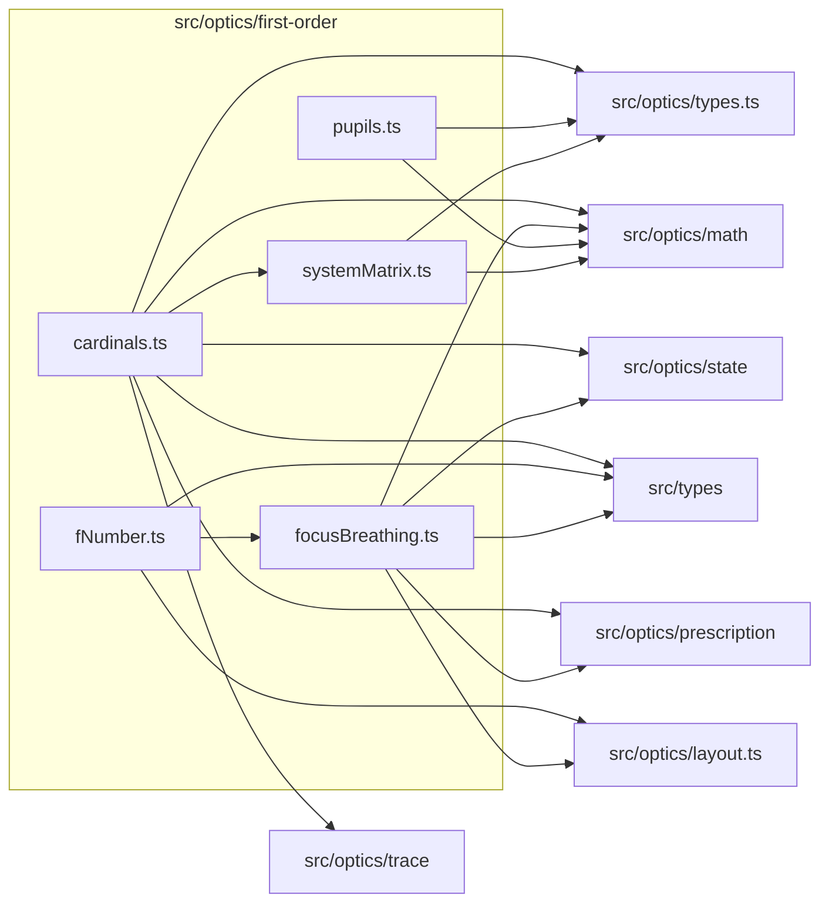

# src/optics/first-order

This folder first-order optical calculations for cardinals, pupils, f-number, focus breathing, and system matrices.

Generated `readme.md` and `improvementsuggestions.md` files are intentionally omitted from the per-file inventory so this document stays focused on source relationships.

## Relationship Diagram

## Directory Overview

- Direct source files: 5
- Direct subfolders: 0
- Main outbound areas: src/optics/math (4), src/optics/types.ts (3), src/types (3), same folder (2), src/optics/layout.ts (2), src/optics/prescription (2), src/optics/state (2), src/optics/trace
- External consumers: src/optics/analysis, src/optics/compat.ts

## Files

| File | Role | Imports from | Imported by | Exports |
| --- | --- | --- | --- | --- |
| `cardinals.ts` | Cardinals helper module | same folder, src/optics/math, src/optics/prescription, src/optics/state, src/optics/trace, +2 more | src/optics/analysis, src/optics/compat.ts | CardinalPoint2, CardinalDistance2, CardinalElements2, computeCardinalElements2, buildCardinalElementsFromMatrix2, computeCardinalElementsAtState2 |
| `fNumber.ts` | F Number helper module | same folder, src/optics/layout.ts, src/types | src/optics/compat.ts | effectiveFNumber2 |
| `focusBreathing.ts` | Focus Breathing helper module | src/optics/layout.ts, src/optics/math, src/optics/prescription, src/optics/state, src/types | same folder, src/optics/compat.ts | eflAtFocus2 |
| `pupils.ts` | Pupils helper module | src/optics/math, src/optics/types.ts | none | FirstOrderPupilState, entrancePupilFromStop2, paraxialPupilGeometry2 |
| `systemMatrix.ts` | System Matrix helper module | src/optics/math, src/optics/types.ts | same folder | FirstOrderSystemMatrix, computeSystemMatrix2 |

